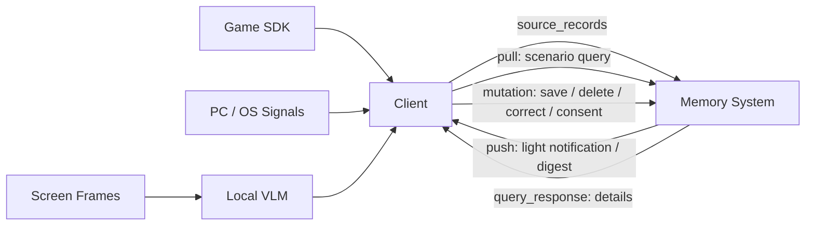

# Data Flow Requirement Specification: Memory System ↔ Client

## 0.概述

- 客户端负责采集、标准化、上报、消费和回写；
- ​记忆系统负责接收、存储、加工、查询、推送、删除与解释。

本文件的核心：

1. 哪些数据会从客户端进入记忆系统。
2. 哪些数据会从记忆系统返回客户端。
3. 哪些客户端本地判断不能完整回写，只能回写其事实源或业务确认后的子结果。
4. 每类数据在什么业务场景、什么触发时机、用什么方式传输。

---

## 1. 背景与目标

### 1.1 问题定义

| 维度 | 客户端需要什么 | 记忆系统需要提供什么 |
|---|---|---|
| 过去发生过什么 | 对话、游戏事件、用户保存、高光、纠错 | 可追溯的事实源、摘要、画像、证据链 |
| 用户现在在做什么 | 游戏实时事件、PC 状态、本地 VLM 语义、当前会话状态 | 可查询的历史上下文与近期记忆材料 |
| 用户希望桌宠怎么陪 | 偏好、授权、打扰边界、反馈 | 长期稳定的 preference / profile / consent 状态 |
| 哪些内容可被记住 | 用户确认、业务确认、隐私边界 | 写入规则、删除 / 纠错 / 失效机制 |

### 1.2 本文档目标

| 目标 | 说明 |
| --- | --- |
| 定义**跨系统数据** | 只写`客户端 ↔ 记忆系统`之间移动的数据 |
| 定义**触发时机** | 明确`实时事件`、`生命周期快照`、`周期心跳`、`批量补传`、`用户触发`、`后台加工推送` |
| 定义**传输方式** | 统一 envelope，但不把所有数据打成一个大包 |
| 定义**证据链** | 加工结果必须尽量追溯到 `source_record_ids[]` |
| 定义 **VLM 边界** | 客户端本地处理 VLM；原图不进记忆系统；语义结果按场景选择性回写 |

---

## 2. 核心分工与数据原则

### 2.1 系统分工

| 系统 | 负责 | 不负责 |
| --- | --- | --- |
| 客户端 | 1. 接收 Game SDK 数据并将其统一标准化 | 1. 不长期保存完整记忆； |
|  | 2. 采集 PC 低敏状态； | 2. 不把临时判断伪装成事实； |
|  | 3. 本地 VLM 处理； | 3. 不把高敏原始数据上传 |
|  | 4. 综合“记忆系统返回 + 游戏实时数据 + PC 状态 + 本地 VLM”判断当前状态 |  |
|  | 5. 向记忆系统上报事实源； |  |
|  | 6. 接收 memory push 的轻摘要，或主动 pull 详细记忆，用于对话、复盘、日记、高光、画像页等 |  |
|  | 7. 回写用户反馈 / 保存 / 删除 / 纠错后的数据； |  |
| 记忆系统 | 1. 通过客户端获取游戏数据以及PC端数据（事实源） | 1. 不直接采集游戏 SDK； |
|  | 2. 把事实源整理成可消费的记忆结果，比如原子事实、情节摘要、用户画像、高光候选、低频记忆摘要 | 2. 不直接读用户屏幕； |
|  | 3.客户端可以主动查询详情 | 3. 不接收 VLM 原图作为长期数据 |
|  | 4. 记忆系统后台整理出新结果时，只推轻通知，比如“生成了一个高光候选”，客户端需要时再拉详情 | 4. 不决定桌宠当下是否开口 |
|  | 5. 用户删记忆、改记忆、关闭授权后，记忆系统负责让这些变更真正生效，避免旧记忆继续被使用 |  |
| 游戏 SDK | 向客户端提供游戏生命周期、状态快照、实时事件和游戏自定义字段 | 不直接绕过客户端写入记忆系统 |

### 2.2 Source Record 与 Derived Memory

| 概念 | 定义 | 例子 |
|---|---|---|
| `source_record` | 客户端上报给记忆系统的标准化原始事实记录 | `game_event`、`idip_snapshot`、`chat_message`、`user_action`、`pc_signal`、`vlm_observation` |
| `derived_memory` | 记忆系统基于 source records 加工出的可消费记忆 | `atomic_facts`、`episode`、`profile`、`highlight_candidate`、`memory_digest` |
| `current_context` | 客户端基于 memory 返回 + 游戏数据 + PC 状态 + 本地 VLM 生成的运行时判断 | `activity_topic`、`mood_estimate`、`interrupt_suitability` |

### 2.3 证据链规则

| 规则 | 要求 |
|---|---|
| 加工结果必须可追溯 | `derived_memory` 尽量带 `source_record_ids[]` |
| `current_context` 不完整回写 | 它是客户端运行时判断，不是长期事实 |
| 回写事实源而不是回写判断 | 记忆系统应优先接收标准化事实，而不是“客户端觉得用户紧张”这种二次判断 |
| VLM 原图不作为 source record | 只有 VLM 语义结果可在业务场景允许时成为 `source_record` |
| 用户确认优先 | 用户保存、确认、纠错、删除等动作可以把临时候选升级为明确记忆操作 |

### 2.4 总体数据流

---

## 3. 传输契约

### 3.1 统一上报 Envelope

统一 envelope 只统一外壳，不要求所有数据一起上传。每类数据按自己的触发时机单独发送，也允许离线后批量补传。

| data_field | 解释 | 格式 | 示例值 | 数据移动方向 | 传送方式 | 消费侧获取的时机 / 场景 | 消费侧回写的时机 / 场景 | 优先级 |
|---|---|---|---|---|---|---|---|---|
| `envelope_version` | 上报协议版本 | string | `"1.0"` | Client → Memory | 所有上报都携带 | 不直接消费 | 协议升级时变更 | P0 |
| `record_id` | 事实源唯一 ID | string | `"src_game_event_001"` | Client → Memory | 单条 / 批量均携带 | Memory 返回 `source_record_ids[]` 时客户端可反查 | 客户端生成并保证本地去重 | P0 |
| `record_type` | 事实源类型 | enum | `game_event` | Client → Memory | 按事件类型独立发送 | 客户端查询记忆详情时识别来源 | 客户端上报时填写 | P0 |
| `game_id` | 游戏标识 | string | `"game_abc"` | Client → Memory / Memory → Client | 所有游戏相关数据必带 | 客户端按当前游戏过滤记忆 | 游戏切换、启动、关闭、查询时都带 | P0 |
| `game_user_id_pseudonym` | 游戏用户账号脱敏标识 | string | `"u_hash_123"` | Client → Memory / Memory → Client | 所有用户相关数据必带 | 客户端拉取该用户在该游戏下的记忆 | 首次绑定账号、上报任意数据时带 | P0 |
| `occurred_at` | 事件实际发生时间 | ISO 8601 | `"2026-05-18T21:10:00Z"` | Client → Memory | 所有事实源必带 | 排序、摘要、证据链 | 事件发生时写入 | P0 |
| `sent_at` | 客户端发送时间 | ISO 8601 | `"2026-05-18T21:10:01Z"` | Client → Memory | 所有上报必带 | 排查延迟 / 离线补传 | 发送时写入 | P0 |
| `consent_snapshot_id` | 当时授权状态快照 ID | string | `"consent_20260518_001"` | Client → Memory | 所有可能入记忆的数据必带 | Memory 判断是否可存 / 可加工 / 可回传 | 授权状态变化后更新 | P0 |
| `payload_schema_version` | payload schema 版本 | string | `"game_event.v1"` | Client → Memory | payload 随附 | 兼容不同游戏和字段版本 | 游戏接入或字段变更时更新 | P0 |
| `payload` | 具体事实内容 | object | `{event_type:"boss_defeated"}` | Client → Memory | 随 `record_type` 独立定义 | Memory 加工和后续返回依据 | 按对应场景上报 | P0 |

### 3.2 上报方式与触发

| 上报方式 | 适合数据 | 触发时机 | 传输特点 | 优先级 |
|---|---|---|---|---|
| 实时事件上报 | `game_event`、`user_action`、删除 / 纠错 | 事件发生立即发送 | 小包；低延迟；需去重 | P0 |
| 生命周期快照 | `game_launch`、`game_close`、`session_start`、`session_end`、完整 `idip_snapshot` | 游戏启动 / 关闭 / 一局开始结束 | 中小包；完整快照 | P0 |
| 周期心跳 | 完整 `idip_snapshot`、必要 PC 低敏状态 | 游戏运行中按配置间隔发送 | 允许完整快照；由 Memory 做对比 | P0 / P1 |
| 批量补传 | 离线事件、低频日志、延迟上传的 source records | 网络恢复 / 客户端空闲 | 多条 envelope 批量发送 | P1 |
| 用户触发上报 | 保存高光、确认画像、纠错、删除、授权变更 | 用户动作发生时 | 高优先级；必须有 ack | P0 |

### 3.3 Memory Push Envelope

Memory Push 只推“有变化通知 + 轻摘要”，不推大对象。客户端真正使用时再 pull 详情。

| data_field | 解释 | 格式 | 示例值 | 数据移动方向 | 传送方式 | 消费侧获取的时机 / 场景 | 消费侧回写的时机 / 场景 | 优先级 |
|---|---|---|---|---|---|---|---|---|
| `push_id` | 推送 ID | string | `"push_001"` | Memory → Client | push | 客户端去重 / 展示轻提示 | 客户端 ack push 状态 | P0 |
| `push_type` | 推送类型 | enum | `memory_changed` | Memory → Client | push | 判断是否需要 pull 详情 | 不直接回写 | P0 |
| `summary` | 轻摘要 | string | `"本局游戏已生成 1 条高光候选"` | Memory → Client | push | 低打扰提示、状态更新 | 不直接回写 | P0 |
| `resource_refs[]` | 可拉取详情的资源引用 | string[] | `["highlight_candidate_001"]` | Memory → Client | push | 客户端按场景 pull 详情 | 用户保存 / 忽略后回写动作 | P0 |
| `suggested_action` | 建议客户端动作 | enum | `pull_detail` | Memory → Client | push | 决定是否查询详情 | 不直接回写 | P1 |
| `created_at` | 推送创建时间 | ISO 8601 | `"2026-05-18T21:30:00Z"` | Memory → Client | push | 排序和过期 | 不直接回写 | P0 |

### 3.4 Client Pull Query

客户端进入具体业务场景时主动查询，不依赖 Memory 把所有数据都推过来。

| data_field | 解释 | 格式 | 示例值 | 数据移动方向 | 传送方式 | 消费侧获取的时机 / 场景 | 消费侧回写的时机 / 场景 | 优先级 |
|---|---|---|---|---|---|---|---|---|
| `query_id` | 查询 ID | string | `"qry_001"` | Client → Memory | pull request | 对话前、开局、结算、画像页、日记页、复盘页 | 不直接回写 | P0 |
| `query_type` | 查询类型 | enum | `session_memory` | Client → Memory | pull request | 决定返回结构 | 不直接回写 | P0 |
| `game_id` | 游戏标识 | string | `"game_abc"` | Client → Memory | pull request | 限定当前游戏数据 | 游戏切换时更新 | P0 |
| `game_user_id_pseudonym` | 用户账号脱敏 ID | string | `"u_hash_123"` | Client → Memory | pull request | 限定当前用户数据 | 账号切换时更新 | P0 |
| `scene` | 客户端业务场景 | enum | `post_game_review` | Client → Memory | pull request | Memory 按场景裁剪结果 | 不直接回写 | P0 |
| `time_window` | 查询时间窗 | object | `{from:"...",to:"..."}` | Client → Memory | pull request | 复盘 / 日记 / 高光页使用 | 不直接回写 | P1 |
| `resource_refs[]` | 从 push 里拿到的引用 | string[] | `["highlight_candidate_001"]` | Client → Memory | pull request | 拉取具体详情 | 用户保存 / 删除后回写 | P0 |

### 3.5 Mutation / Ack

所有用户保存、删除、纠错、授权变更必须有明确 ack，避免客户端和记忆系统状态不一致。

| data_field | 解释 | 格式 | 示例值 | 数据移动方向 | 传送方式 | 消费侧获取的时机 / 场景 | 消费侧回写的时机 / 场景 | 优先级 |
|---|---|---|---|---|---|---|---|---|
| `mutation_id` | 变更请求 ID | string | `"mut_001"` | Client → Memory | mutation request | 用户操作后客户端跟踪状态 | 用户保存 / 删除 / 纠错 / 授权变更 | P0 |
| `mutation_type` | 变更类型 | enum | `delete_memory` | Client → Memory | mutation request | 决定 Memory 执行路径 | 用户动作发生时 | P0 |
| `target_resource_id` | 被操作对象 | string | `"profile_fact_001"` | Client → Memory | mutation request | 删除 / 纠错 / 保存具体对象 | 用户动作发生时 | P0 |
| `user_intent` | 用户意图说明 | string | `"这条不准，以后别这样记"` | Client → Memory | mutation request | 解释与后续避免重复生成 | 用户明确表达时 | P0 |
| `ack_status` | 执行结果 | enum | `applied` | Memory → Client | mutation response | 客户端刷新 UI / 状态 | Memory 完成后返回 | P0 |
| `updated_resource_refs[]` | 受影响资源 | string[] | `["profile_fact_001"]` | Memory → Client | mutation response | 客户端按需重新 pull | 不直接回写 | P1 |

---

## 4. 数据需求详解

### 4.1 身份、游戏与授权上下文

| data_field | 解释 | 格式 | 示例值 | 数据移动方向 | 传送方式 | 消费侧获取的时机 / 场景 | 消费侧回写的时机 / 场景 | 优先级 |
|---|---|---|---|---|---|---|---|---|
| `game_id` | 游戏 ID，用于隔离不同游戏的数据 | string | `"game_abc"` | Client ↔ Memory | envelope / query / response | 客户端查询当前游戏记忆时必带 | 游戏启动、切换、关闭、任意数据上报时带 | P0 |
| `game_user_id_pseudonym` | 游戏账号脱敏 ID | string | `"u_hash_123"` | Client ↔ Memory | envelope / query / response | 客户端拉取该用户记忆时必带 | 账号绑定、登录、任意用户数据上报时带 | P0 |
| `consent_snapshot_id` | 授权状态快照 ID | string | `"consent_001"` | Client → Memory / Memory → Client | envelope / consent push | 客户端展示授权状态、解释某条记忆为何存在 | 授权开启 / 撤回 / 全局暂停时回写 | P0 |
| `privacy_mode_enabled` | 是否临时隐私模式 | boolean | `true` | Client ↔ Memory | mutation / push | 客户端进入隐私模式后停止非必要上报 | 用户开启 / 关闭隐私模式 | P0 |

### 4.2 游戏生命周期与完整 IDIP 快照

游戏链路固定为 `Game SDK → Client → Memory`。客户端是唯一标准化入口。

| data_field | 解释 | 格式 | 示例值 | 数据移动方向 | 传送方式 | 消费侧获取的时机 / 场景 | 消费侧回写的时机 / 场景 | 优先级 |
|---|---|---|---|---|---|---|---|---|
| `game_lifecycle_event` | 游戏生命周期事件 | enum | `game_launch` / `game_close` | Client → Memory | 实时事件上报 | 客户端启动后可 pull 近期 profile / session memory | 游戏启动、关闭时上报 | P0 |
| `session_id` | 一次游戏启动或一局游戏的会话 ID | string | `"gs_20260518_001"` | Client ↔ Memory | envelope / response | 客户端复盘、日记、结算页按 session 查询 | session start / end 时上报 | P0 |
| `session_start_at` | session 开始时间 | ISO 8601 | `"2026-05-18T20:00:00Z"` | Client → Memory | 生命周期快照 | Memory 生成 session summary 的起点 | `session_start` 时上报 | P0 |
| `session_end_at` | session 结束时间 | ISO 8601 | `"2026-05-18T20:45:00Z"` | Client → Memory | 生命周期快照 | 客户端结算页 pull session memory | `session_end` / `game_close` 时上报 | P0 |
| `idip_snapshot` | 游戏状态完整快照 | object | `{level:56,rank:"diamond_3"}` | Client → Memory | 生命周期快照 / 周期心跳 | Memory 对比历史生成变化；客户端可 pull 加工结果 | 启动、关闭、session 结束、周期心跳时上报完整快照 | P0 |
| `idip_field_metadata` | IDIP 字段语义说明 | object | `{level:{type:"int",semantic:"character level"}}` | Client → Memory / Memory → Client | 游戏接入配置 / query response | 客户端展示或解释字段含义 | 游戏接入、schema 变化时上报 | P0 |

### 4.3 游戏实时事件

游戏实时事件分为两类：通用事件和特定游戏主动推送事件。

| data_field | 解释 | 格式 | 示例值 | 数据移动方向 | 传送方式 | 消费侧获取的时机 / 场景 | 消费侧回写的时机 / 场景 | 优先级 |
|---|---|---|---|---|---|---|---|---|
| `event_id` | 游戏事件 ID | string | `"ge_001"` | Client → Memory | 实时事件上报 | Memory 返回证据链时客户端可反查 | 游戏事件发生时生成 | P0 |
| `event_type` | 事件类型 | enum / string | `death` / `settlement` / `boss_defeated` | Client → Memory | 实时事件上报 | 客户端实时反应、本地 current_context、复盘 query | Game SDK 推送后客户端立即上报 | P0 |
| `event_mode` | 事件模式 | enum | `lifecycle` / `state_snapshot` / `game_push_event` / `client_observed_event` | Client → Memory | 实时事件上报 | Memory 区分事件来源和可靠性 | 上报任何游戏事件时填写 | P0 |
| `common_fields` | 通用字段 | object | `{result:"win",stage_id:"boss_2"}` | Client → Memory | 实时事件上报 | 多游戏通用消费 | 通用事件发生时上报 | P0 |
| `game_custom_fields` | 游戏自定义字段 | object | `{boss_phase:"phase_3"}` | Client → Memory | 实时事件上报 | 特定游戏复盘、日记、高光 | 特定游戏主动推送时上报 | P1 |
| `in_game_time` | 游戏内时间 | string | `"day_3_evening"` | Client → Memory | 实时事件 / 心跳 | 复盘、日记、剧情同步 | 游戏提供游戏内时间时上报 | P1 |

通用事件最小集合：

| event_type | 触发 | 说明 |
|---|---|---|
| `game_launch` | 游戏启动 | 记录本次游戏入口 |
| `game_close` | 游戏关闭 | 记录本次游戏出口，并触发 session 收口 |
| `session_start` | 一局 / 一段游戏开始 | 支持复盘和时长统计 |
| `session_end` | 一局 / 一段游戏结束 | 触发 session summary / highlight candidate |
| `settlement` | 结算出现 | 支持祝贺、安慰、复盘 |
| `objective_progress` | 目标进度变化 | 支持进度理解 |
| `fail` | 失败 | 支持安慰、卡点判断 |
| `success` | 成功 | 支持庆祝、高光 |

当游戏过程中没有主动事件推送时，客户端仍需上报 `game_launch`、完整 `idip_snapshot` 心跳、`game_close` 和关闭时完整 `idip_snapshot`，由记忆系统基于快照差异做整理。

### 4.4 聊天、用户动作与反馈

| data_field | 解释 | 格式 | 示例值 | 数据移动方向 | 传送方式 | 消费侧获取的时机 / 场景 | 消费侧回写的时机 / 场景 | 优先级 |
|---|---|---|---|---|---|---|---|---|
| `chat_message` | 用户与桌宠首方对话消息 | object | `{role:"user",text:"记住这把"}` | Client → Memory | 实时事件上报 / 批量补传 | Memory 生成 atomic facts / episode / profile 后 push 轻通知 | 用户发送消息或会话结束时上报 | P0 |
| `chat_session_id` | 对话会话 ID | string | `"chat_001"` | Client ↔ Memory | envelope / query | 客户端按会话查询对话摘要 | 会话开始 / 结束时上报 | P0 |
| `user_action` | 用户显式动作 | enum / object | `save_highlight` | Client → Memory | 实时 mutation | Memory 更新记忆状态后 ack | 保存、删除、点赞、点踩、确认、忽略时上报 | P0 |
| `memory_correction` | 用户纠错 | object | `{target:"profile_fact_1",correction:"不是这样"}` | Client → Memory | mutation | Memory ack 后客户端刷新相关页面 | 用户编辑、口头否定、点击“不准”时上报 | P0 |
| `do_not_remember_rule` | 以后不要这样记 | string | `"不要根据一次失败总结我菜"` | Client → Memory | mutation | 后续 Memory 加工时作为约束 | 用户明确表达时上报 | P0 |

### 4.5 PC 低敏标准化事实

PC 数据用于辅助客户端本地 `current_context`，也可以选择性上报给记忆系统作为低敏事实源。这里的“原始一点”指标准化事实，不指隐私裸数据。

| data_field | 解释 | 格式 | 示例值 | 数据移动方向 | 传送方式 | 消费侧获取的时机 / 场景 | 消费侧回写的时机 / 场景 | 优先级 |
|---|---|---|---|---|---|---|---|---|
| `active_app` | 当前前台 app 标准化信息 | object | `{name:"Game",bundle_id:"com.game"}` | Client → Memory / Client local | 变化上报 / 心跳 | 客户端生成 current_context；Memory 可做低敏证据 | app 切换、游戏启动、复盘需要证据时上报 | P1 |
| `is_fullscreen` | 是否全屏 | boolean | `true` | Client → Memory / Client local | 变化上报 / 心跳 | 客户端判断是否打扰 | 状态变化时上报 | P1 |
| `idle_signal` | 闲置状态分级 | enum | `active` / `idle_5min` | Client → Memory / Client local | 周期心跳 / 变化上报 | 客户端判断是否该说话 | 状态变化时上报 | P1 |
| `window_title_redacted` | 脱敏窗口标题 | string | `"游戏结算页"` | Client → Memory / Client local | 变化上报 | 仅作低敏上下文解释 | 进入允许 app / 需要作为证据时上报 | P1 |

不允许上报完整窗口标题历史、第三方 app 正文、聊天内容、邮件正文、文档全文、终端全文、密码框内容。

### 4.6 本地 VLM 语义观察

VLM 由客户端本地处理。原始帧 / 截图不进入记忆系统；只有语义观察结果在满足业务场景时选择性回写。

| data_field | 解释 | 格式 | 示例值 | 数据移动方向 | 传送方式 | 消费侧获取的时机 / 场景 | 消费侧回写的时机 / 场景 | 优先级 |
|---|---|---|---|---|---|---|---|---|
| `vlm_mode` | VLM 感知模式 | enum | `strong_awareness` / `weak_awareness` | Client → Memory | semantic observation 上报时携带 | 客户端本地判断授权边界 | 仅语义结果回写时携带 | P1 |
| `vlm_observation_id` | VLM 语义观察 ID | string | `"vlm_obs_001"` | Client → Memory | 选择性上报 | Memory 作为高光 / 复盘证据引用 | 用户保存、高光候选、复盘、日记需要证据时上报 | P1 |
| `semantic_tags[]` | 画面语义标签 | string[] | `["boss_fight","low_hp"]` | Client → Memory | 选择性上报 | 客户端本地 current_context；Memory 生成高光或复盘 | 强感知可回写；弱感知默认不回写，除非业务确认 | P1 |
| `user_visible_summary` | 用户可见摘要 | string | `"BOSS 战残血阶段"` | Client → Memory | 选择性上报 | 高光解释、复盘、Memory Center 来源说明 | 用户保存 / 业务确认后回写 | P1 |
| `source_record_ids[]` | 关联事实源 | string[] | `["ge_001","idip_009"]` | Client → Memory | semantic observation 必带 | Memory 避免孤立理解 VLM 结果 | 回写 VLM 语义观察时必须带 | P1 |
| `raw_frame_stored` | 是否存储原图 | boolean | `false` | Client → Memory | semantic observation 必带 | Memory 验证隐私边界 | 恒为 false | P0 |
| `ui_indicator_shown` | 是否展示“正在看屏幕”提示 | boolean | `true` | Client → Memory | semantic observation 必带 | Memory Center 审计 | 强感知必须 true；弱感知按授权说明记录 | P1 |

VLM 模式规则：

| 模式 | 触发 | 处理 | 是否回写记忆系统 |
|---|---|---|---|
| 强感知 `strong_awareness` | 用户明确开启“让桌宠看屏幕 / 共享屏幕” | 客户端本地处理画面，展示明显状态指示 | 可回写语义摘要 / 高光证据；不回写原图 |
| 弱感知 `weak_awareness` | 授权中说明的特定时刻，如长时间无反馈、疑似卡住 | 客户端本地处理，用于 `current_context` | 默认不回写；只有用户保存、高光、复盘、日记等业务确认场景才回写语义结果 |

### 4.7 记忆系统加工结果返回客户端

Memory 后台可以持续整理，但只在加工结果变化时 push 轻通知；客户端进入业务场景时 pull 详情。

| data_field | 解释 | 格式 | 示例值 | 数据移动方向 | 传送方式 | 消费侧获取的时机 / 场景 | 消费侧回写的时机 / 场景 | 优先级 |
|---|---|---|---|---|---|---|---|---|
| `memory_digest` | 低频记忆摘要 | object | `{summary:"最近常练 boss"}` | Memory → Client | low-frequency push / pull | 客户端启动、空闲、画像页 | 用户删除 / 纠错摘要来源时回写 mutation | P1 |
| `atomic_facts[]` | 原子事实 | array | `[{fact:"用户喜欢稳健打法"}]` | Memory → Client | pull detail | 对话前、画像页、日记 / 复盘生成前 | 用户否定、删除、纠错时回写 | P0 |
| `episode` | 情节摘要 | object | `{title:"通关 BOSS"}` | Memory → Client | push refs + pull detail | 结算页、日记页、复盘页 | 用户保存、删除、编辑标题时回写 | P0 |
| `profile_update` | 画像更新 | object | `{field:"playstyle",value:"steady"}` | Memory → Client | push light + pull detail | 对话前、画像页、开局时 | 用户确认 / 纠错 / 删除时回写 | P0 |
| `highlight_candidate` | 高光候选 | object | `{title:"残血击败 Boss"}` | Memory → Client | push refs + pull detail | 结算页、高光页、日记生成前 | 用户保存 / 忽略 / 编辑 / 删除时回写 | P1 |
| `consent_state_update` | 授权状态变化 | object | `{vlm_visual:false}` | Memory → Client | push | 设置页、能力调用前 | 用户变更授权时回写 | P0 |

### 4.8 `current_context` 的边界

`current_context` 由客户端本地生成，输入包括：

1. Memory 查询返回的 profile / episode / recent facts。
2. 游戏实时事件和完整 IDIP 快照。
3. PC 低敏状态。
4. 本地 VLM 语义结果。
5. 当前会话聊天和用户动作。

完整 `current_context` 不回写记忆系统。

| 客户端本地对象 | 是否完整回写 | 可回写内容 | 例子 |
|---|---|---|---|
| `current_context.activity_topic` | 否 | 支撑它的 source records | `game_event.boss_phase_2`、`idip_snapshot.hp_bucket=low` |
| `current_context.mood_estimate` | 否 | 用户明确反馈或事件级事实 | 用户说“这把太刺激了”可作为 chat source record |
| `current_context.interrupt_suitability` | 否 | 用户偏好 / 打扰边界变更 | 用户点击“以后打 BOSS 别说话” |
| `current_context.attention_target` | 否 | 低敏 PC 标准化事实 | `active_app=game`、`is_fullscreen=true` |

业务确认后的子结果可以回写：

| 场景 | 回写类型 | 示例 |
|---|---|---|
| 用户保存高光 | `user_action.save_highlight` | 保存 `highlight_candidate_001` |
| 用户说“记住这把” | `chat_message` + `user_confirmed_memory_intent` | 记住“第三次挑战后通关” |
| 日记 / 复盘需要证据 | `business_memory_event` | 关联 `game_event` + `idip_snapshot` + `vlm_observation` |
| 用户纠错画像 | `memory_correction` | “我不是喜欢冒险打法” |
| 用户修改偏好 | `preference_update` | “打剧情时不要剧透” |

### 4.9 删除、纠错、授权控制

| data_field | 解释 | 格式 | 示例值 | 数据移动方向 | 传送方式 | 消费侧获取的时机 / 场景 | 消费侧回写的时机 / 场景 | 优先级 |
|---|---|---|---|---|---|---|---|---|
| `delete_memory_request` | 删除记忆请求 | object | `{target:"episode_001"}` | Client → Memory | mutation | 用户删除后客户端等待 ack | 用户点击删除 / 清空时回写 | P0 |
| `correction_request` | 纠错请求 | object | `{old:"冒险",new:"稳健"}` | Client → Memory | mutation | 画像页、聊天反馈、Memory Center | 用户改正错误记忆时回写 | P0 |
| `disable_source_request` | 禁用数据源请求 | object | `{source:"vlm_visual"}` | Client → Memory | mutation | 设置页、隐私模式 | 用户关闭某类采集时回写 | P0 |
| `resummarize_request` | 重新总结请求 | object | `{target:"profile"}` | Client → Memory | mutation | 画像页 / 设置页 | 用户点击“重新总结我”时回写 | P1 |
| `mutation_ack` | 执行结果 | object | `{status:"applied"}` | Memory → Client | mutation response | 客户端刷新 UI / 本地状态 | Memory 执行后返回 | P0 |

---

## 5. 场景化数据流

### 5.1 游戏启动

| 步骤 | 客户端动作 | 记忆系统动作 | 返回 / 推送 | 是否回写 |
|---|---|---|---|---|
| 1 | 接收 Game SDK `game_launch` | 存 source record | 无或 ack | 是 |
| 2 | 上报完整 `idip_snapshot` | 存快照，作为本次 session 初始状态 | 无或 ack | 是 |
| 3 | 客户端 pull `startup_context` | 返回当前游戏下近期 profile / consent / open reminders | query response | 否 |
| 4 | 客户端生成本地 `current_context` | 不参与 | 无 | 不回写完整对象 |

### 5.2 游戏过程中有主动事件

| 步骤 | 客户端动作 | 记忆系统动作 | 返回 / 推送 | 是否回写 |
|---|---|---|---|---|
| 1 | 接收 Game SDK `death` / `success` / `settlement` 等事件 | 存 source record，按需加工 | 通常不高频 push | 是 |
| 2 | 客户端本地立即用于当前反应 | 不参与实时决策 | 无 | 不回写 `current_context` |
| 3 | 加工结果发生变化 | 生成 episode / highlight candidate / profile update | push 轻通知 | 否 |
| 4 | 客户端进入结算页或复盘页 | 按 resource ref pull 详情 | 返回详情 | 用户保存 / 忽略时回写 |

### 5.3 游戏过程中没有主动事件

| 步骤 | 客户端动作 | 记忆系统动作 | 返回 / 推送 | 是否回写 |
|---|---|---|---|---|
| 1 | 启动时上报完整 `idip_snapshot` | 存初始状态 | ack | 是 |
| 2 | 运行中按配置上报完整 `idip_snapshot` 心跳 | 存快照并做差异整理 | 加工变化时 push | 是 |
| 3 | 关闭时上报完整 `idip_snapshot` + `game_close` | 生成 session summary / delta / milestone | push 轻通知 | 是 |
| 4 | 客户端 pull session detail | 返回整理后的变化 | query response | 用户保存 / 纠错时回写 |

### 5.4 强感知 VLM

| 步骤 | 客户端动作 | 记忆系统动作 | 返回 / 推送 | 是否回写 |
|---|---|---|---|---|
| 1 | 用户明确开启“桌宠看屏幕” | 记录授权状态 | consent ack / push | 是，授权变更 |
| 2 | 客户端本地 VLM 处理短期帧 | 不接收原图 | 无 | 原图不回写 |
| 3 | 客户端生成 `semantic_tags` / `user_visible_summary` | 仅在业务需要时接收语义结果 | ack | 可选择性回写 |
| 4 | 高光 / 复盘 / 日记需要证据 | 存 `vlm_observation`，必须带 `source_record_ids[]` | 后续 push / pull | 是 |

### 5.5 弱感知 VLM

| 步骤 | 客户端动作 | 记忆系统动作 | 返回 / 推送 | 是否回写 |
|---|---|---|---|---|
| 1 | 在授权范围内触发本地弱感知 | 不参与 | 无 | 否 |
| 2 | 客户端用于本地 `current_context` | 不接收完整对象 | 无 | 否 |
| 3 | 未发生业务确认 | 不存 | 无 | 否 |
| 4 | 用户保存 / 高光 / 复盘 / 日记触发 | 存语义观察结果，带 source refs | ack / 后续 push | 是 |

### 5.6 记忆后台加工与客户端消费

| 步骤 | 客户端动作 | 记忆系统动作 | 返回 / 推送 | 是否回写 |
|---|---|---|---|---|
| 1 | 客户端持续上报 source records | 接收并后台整理 | 无或 ack | 是 |
| 2 | Memory 生成新 episode / profile / highlight | 存 derived memory | push 轻摘要 + refs | 否 |
| 3 | 客户端进入业务场景 | pull 详情 | query response | 否 |
| 4 | 用户确认 / 删除 / 纠错 | 执行 mutation | mutation ack | 是 |

---

## 6. 优先级建议

| 优先级 | 数据 / 能力 | 原因 |
|---|---|---|
| P0 | 统一 envelope | 没有统一外壳，后续数据源会散 |
| P0 | `game_id + game_user_id_pseudonym` | 多游戏、多用户隔离的最低要求 |
| P0 | 游戏生命周期事件 | `game_launch` / `game_close` 是所有游戏最小闭环 |
| P0 | 完整 `idip_snapshot` 上报 | 即使游戏没有事件，也能靠快照对比形成记忆 |
| P0 | 游戏实时事件 `game_event` | “游戏搭子”实时感的基础 |
| P0 | 聊天与用户动作 | 用户主动表达、确认、纠错是最高质量记忆来源 |
| P0 | Memory pull query | 客户端按业务场景获取详情的主路径 |
| P0 | Memory push 轻通知 | 加工结果变化时通知客户端，但不推大对象 |
| P0 | 删除 / 纠错 / 授权 mutation | 记忆系统信任底座 |
| P1 | 本地 VLM 语义观察回写 | 高光、复盘、日记的增强证据 |
| P1 | PC 低敏标准化事实 | 支持打扰判断、场景理解和证据解释 |
| P1 | episode / profile / highlight candidate 详情消费 | 支撑画像页、日记、复盘、高光 |
| P2 | MCP / OS API / 浏览器扩展 / Playwright | 外部 app 数据复杂度高，需单独授权和后续规划 |

---

## 7. 隐私与排除项

| 数据 | 是否进入记忆系统 | 说明 |
|---|---|---|
| 游戏 SDK 结构化事件 | 是 | 标准化后作为事实源 |
| 完整 idip snapshot | 是 | 启动 / 关闭 / 心跳均可完整上报 |
| 用户首方聊天 | 授权后是 | 用户可删除 / 纠错 |
| 用户显式操作 | 是 | 保存、删除、确认、纠错、授权变更 |
| PC 低敏状态 | 可选是 | 标准化事实，不写完整时间线 |
| VLM 语义结果 | 选择性是 | 必须带 source refs；原图不进 |
| 完整 current_context | 否 | 客户端运行时判断，不是长期事实 |
| 原始截图 / 屏幕帧 | 否 | 客户端本地处理后丢弃 |
| 原始音频 | 否 | 不进入本文件的 memory 流通数据 |
| 键盘字符流 | 否 | 不允许 |
| 第三方 app 全文 UI | 否 | 不允许默认进入 |
| 浏览器页面正文 / 邮件 / 文档正文 | 否 | 不在本文件默认范围 |

---

## 8. 待确认问题

| # | 问题 | 建议 |
|---|---|---|
| 1 | `idip_snapshot` 心跳默认间隔是多少？ | 先按游戏类型配置，PM 文档只要求允许完整心跳 |
| 2 | 离线补传保留多久？ | Engineering 定；PM 建议不超过短期 buffer 策略 |
| 3 | `game_custom_fields` 由谁审核字段边界？ | PM + Engineering + 游戏接入方共同维护 schema review |
| 4 | Memory query SLA 如何定义？ | 先以实时查询 P99 ≤200ms、批量详情 ≤2s 作为讨论起点 |
| 5 | 日记正文是否保存到 Memory？ | 默认不保存生成正文；用户保存成日记成品时再作为用户确认内容写入 |

---

## 9. 验收标准

| 标准 | 验收方式 |
|---|---|
| 只包含跨系统数据 | 检查所有字段是否有 Client ↔ Memory 方向 |
| envelope 统一但不大包 | 每类数据都有独立触发时机和传输方式 |
| 游戏最小闭环成立 | 无实时事件时仍能通过 launch / idip / close 形成记忆 |
| VLM 边界清晰 | 原图不进 Memory；语义结果选择性回写且带 source refs |
| current_context 边界清晰 | 不完整回写，只回写事实源或业务确认子结果 |
| Memory push / pull 清晰 | push 轻摘要，pull 详情 |
| 用户控制闭环完整 | 删除、纠错、授权变更都有 mutation + ack |
