# 数据流通需求说明书：记忆系统 ↔ 客户端

---

## 目录

- [§0 文档定位](http://localhost:7799/projects/desktop-pet/01-pm/branches/memory-dataset/DATA_FLOW_REQUIREMENT_SPECIFICATION.md#0-%E6%96%87%E6%A1%A3%E5%AE%9A%E4%BD%8D)
- [§1 系统分工与数据原则](http://localhost:7799/projects/desktop-pet/01-pm/branches/memory-dataset/DATA_FLOW_REQUIREMENT_SPECIFICATION.md#1-%E7%B3%BB%E7%BB%9F%E5%88%86%E5%B7%A5%E4%B8%8E%E6%95%B0%E6%8D%AE%E5%8E%9F%E5%88%99)
- [§2 统一传输契约](#2-%E7%BB%9F%E4%B8%80%E4%BC%A0%E8%BE%93%E5%A5%91%E7%BA%A6)
- [§3 Client → Memory 上报](#3-client--memory-%E4%B8%8A%E6%8A%A5)
- [§4 Memory → Client 返回](#4-memory--client-%E8%BF%94%E5%9B%9E)
- [§5 Mutation / Ack 双向闭环](#5-mutation--ack-%E5%8F%8C%E5%90%91%E9%97%AD%E7%8E%AF)
- [§6 业务场景接力图](#6-%E4%B8%9A%E5%8A%A1%E5%9C%BA%E6%99%AF%E6%8E%A5%E5%8A%9B%E5%9B%BE)
- [§7 优先级建议](#7-%E4%BC%98%E5%85%88%E7%BA%A7%E5%BB%BA%E8%AE%AE)
- [§8 隐私与排除项](#8-%E9%9A%90%E7%A7%81%E4%B8%8E%E6%8E%92%E9%99%A4%E9%A1%B9)
- [§9 待确认问题](#9-%E5%BE%85%E7%A1%AE%E8%AE%A4%E9%97%AE%E9%A2%98)
- [§10 验收标准](#10-%E9%AA%8C%E6%94%B6%E6%A0%87%E5%87%86)

---

## 0. 文档定位

### 0.1 本文档解决什么

| 维度 | 本文档回答 |
| --- | --- |
| **数据范围** | 哪些数据会在客户端和记忆系统之间流动；纯本地或不入记忆的数据不写。 |
| **数据方向** | 每条数据是 Client→Memory、Memory→Client，还是双向 mutation。 |
| **触发时机** | 每条数据在什么业务场景、什么时刻被传输（实时事件 / 生命周期 / 心跳 / 用户触发 / 后台 push / 批量补传）。 |
| **传输方式** | 用哪种契约管道（上报 envelope / pull query / 轻量 push / mutation）。 |
| **闭环验证** | 一条事实源如何被加工、被消费、被反馈、被失效，形成可追溯的证据链与状态机。 |

### 0.2 排除项

| 数据 / 对象 | 原因 |
| --- | --- |
| `current_context`（客户端临时决策包） | 100% 客户端本地合成，不回写完整对象；它的"输入材料"分别在 §3 / §4 已覆盖。 |
| VLM 原始帧 / 屏幕截图 | 客户端本地处理后即丢弃，永不进入跨系统传输。 |
| 原始系统音频 / 麦克风音频 / 通话内容 | 不属本分支；音频只送派生信号入记忆，原始流不跨系统。 |
| 键盘字符流 / 输入法明文 / 第三方 app 正文 | 永禁；只允许桶化统计或语义事件。 |
| 客户端本地未上报的 chat draft、未提交的设置 | 未发送前不属跨系统数据。 |
| Game SDK 私有协议细节 | 由"Game SDK → 客户端"段承担，本文档只关心"客户端 → 记忆系统"那一跳。 |

---

## 1. 系统分工与数据原则

### 1.1 角色与责任

| 角色 | 数据舱角色 | 主要职责 | **不**做 |
| --- | --- | --- | --- |
| **记忆系统**（Memory System） | 数据舱 | <ul><li>接收客户端上报的事实源；</li><li>持久化用户控制状态；</li><li>后台加工生成 `derived_memory`；</li><li>响应客户端 pull；</li><li>变化时 push 轻通知；</li><li>执行 mutation 并返回 ack；</li><li>维护证据链与失效状态机。</li></ul> | <ul><li>不直接采集游戏 SDK / 屏幕 / 音频 / MCP；</li><li>不决定桌宠当下是否说话；</li><li>不绕过授权写入。</li></ul> |
| **客户端**（Pet Client） | 数据采集与消费端 | <ul><li>采集并标准化游戏 SDK / PC 环境 / 用户输入 / VLM 语义；</li><li>按业务场景上报事实源；</li><li>按场景 pull 加工记忆；</li><li>本地合成 `current_context`；</li><li>接收用户保存 / 删除 / 纠错 / 授权变更并回写为 mutation。</li></ul> | <ul><li>不长期保存完整记忆；</li><li>不把临时判断伪装成长期事实；</li><li>不上传原图 / 原始音频 / 键盘字符流。</li></ul> |
| **Game SDK** | 数据生产者 | 向客户端推送游戏生命周期、状态快照、实时事件、自定义字段。 | 不直接绕过客户端写入记忆系统。 |
| **授权 MCP app** | 数据生产者 | 在用户授权后向**客户端**提供白名单字段（任务标题 / 元数据 / app 自生成摘要）。 | 不直接连记忆系统（详见 §3.1.4）；不暴露正文 / 附件。 |

### 1.2 客户端的数据来源全貌（明确边界）

客户端实际有 5 类数据来源，但**只有 2 类涉及跨系统流通**：

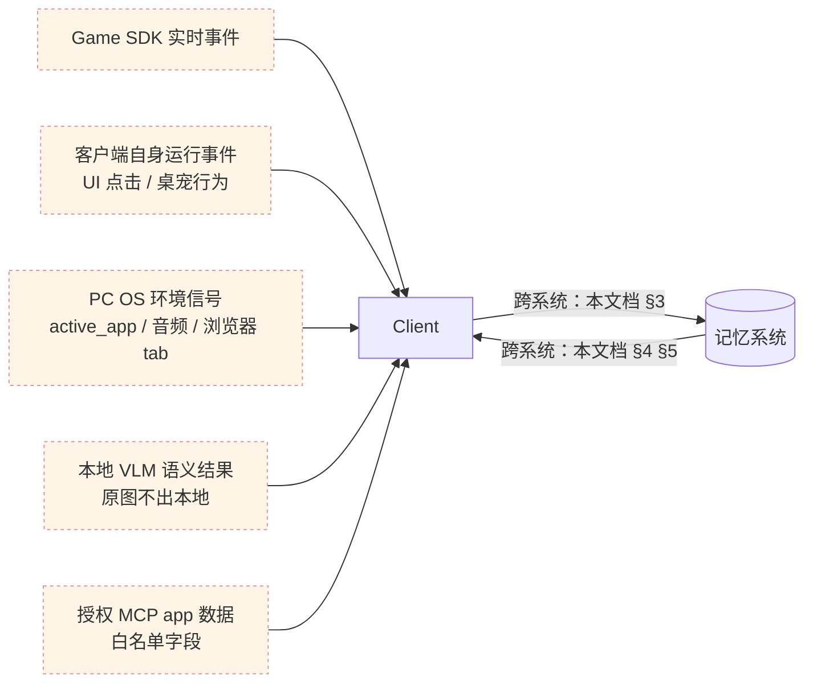

- 5 类来源 → 客户端的过程是"采集"，由客户端本地负责，**不在本文档范围**。
- 客户端 ↔ 记忆系统的过程是本文档要严格契约化的部分。
- 客户端最终交付给桌宠的"当下决策包"`current_context` 由：①记忆系统返回的画像 / 摘要 / 偏好（来自 §4） + ②客户端 5 类本地来源 合成 —— 合成结果**不回写**，只把支撑它的 raw `source_record` 按需上报。

### 1.3 数据对象三分类

所有跨系统数据按"是什么"分三类。每条数据在表格里都标注分类，便于判断"谁能写谁、能否被加工覆盖"。

| 分类 | 含义 | 谁写入 | 能否被自动覆盖 | 例子 |
| --- | --- | --- | --- | --- |
| **`source_record`**（事实源记录） | 客户端采集到的 raw 事实，原样上报给记忆系统。 | Client → Memory | 不会被自动覆盖；只能被失效（`is_active=false`）。 | `chat_message` / `game_event` / `pc_signal` / `vlm_observation` / `mcp_observation` |
| **`derived_memory`**（加工记忆） | 记忆系统基于多条 `source_record` 后台加工出的可消费记忆。 | Memory → Client | 会被记忆系统重新加工而刷新；用户 `correct_memory` 可锁定。 | `atomic_facts` / `episode` / `profile.*` / `highlight_event` / `assessment` / `memory_digest` / `idip_delta` |
| **`user_control_state`**（用户控制状态） | 用户显式设置的授权 / 偏好 / 删除策略 / 称呼等；记忆系统持久化，客户端读取并严格执行。 | Client → Memory（mutation） | 永不被自动覆盖；只有用户 mutation 才能改。 | `privacy_grants.*` / `display_name` / `disturbance_boundaries` / `do_not_remember_rules[]` / `deletion_policy` |

> **规则**：一条字段只能属于一类。如果一个业务概念既需要"客户端推导"又需要"记忆系统加工"，**拆成两个字段**（详见 §1.4 D3）。

### 1.4 数据流原则

| # | 原则 | 含义 |
| --- | --- | --- |
| 1 | **先事实，再加工** | <ul><li>`source_record` 必须先写入，`derived_memory` 才能被派生；</li><li>客户端不能直接上报"加工结论"。</li></ul> |
| 2 | **加工结果可解释** | 每条 `derived_memory` 必须带 `source_record_ids[]` 或 `evidence_ids[]`，让客户端可以反查证据。 |
| 3 | **用户控制最高优先级** | <ul><li>`user_control_state` 不会被任何加工覆盖；</li><li>用户 mutation 永远优先于 AI 推断。</li></ul> |
| 4 | **双向字段必拆名** | 同一业务概念若客户端和记忆系统都要写，拆成两个字段（如 `emotion_signal_observed` / `emotion_signal_derived`，`playstyle_tags_user_set` / `playstyle_tags_inferred`），避免方向歧义。 |
| 5 | **授权快照贯穿全链** | <ul><li>每条 `source_record` 必带当时的 `consent_snapshot_id`；</li><li>用户撤回授权时，记忆系统沿这条链反向溅透清理（详见 §5.4）。</li></ul> |
| 6 | **本地合成不回写完整对象** | 客户端的 `current_context` 是临时决策包，只回写支撑它的 raw `source_record` 或用户明确确认的 mutation，永不回写整个 context。 |

### 1.5 总体数据流


---

## 2. 统一传输契约

### 2.1 四种管道

> 跨系统流通统一用 4 种管道，每条数据只走其中一种主管道：

| 管道 | 方向 | 适合数据 | 同步特征 |
| --- | --- | --- | --- |
| **上报 Envelope** | Client → Memory | `source_record`（含 mutation 也复用同一外壳） | <ul><li>一条 envelope 一个 `record_id`；</li><li>可单发、可批量补传。</li></ul> |
| **Pull Query / Response** | Client → Memory → Client | 客户端主动取加工记忆或控制状态 | <ul><li>客户端按业务场景发起，Memory 返回详情；</li></ul> |
| **轻量 Push** | Memory → Client | 加工结果变化通知 | <ul><li>只带 `resource_refs[]` 和短摘要；</li><li>不推大对象；</li><li>客户端按需 pull。</li></ul> |
| **Mutation / Ack** | Client → Memory（mutation） + Memory → Client（ack） | 用户操作改变记忆系统状态 | 必有 `ack_status`，失败可重试或提示。 |

### 2.2 上报 Envelope 通用字段

> 所有 source_record 和 mutation 都用同一外壳，但不要求所有数据合成一个大包。客户端按业务时机分别上报。

| 字段 | 含义 | 格式 | 必填 | 优先级 | 说明 |
| --- | --- | --- | --- | --- | --- |
| `envelope_version` | 协议版本 | string | 是 | P0 | 协议升级用 |
| `record_id` | 事实源唯一 ID | string | 是 | P0 | 客户端生成；本地去重 |
| `record_type` | 事实源类型 | enum | 是 | P0 | 见 §3.1 各子节 |
| `game_id` | 游戏标识 | string | 是 | P0 | 不同游戏数据隔离 |
| `game_user_id_pseudonym` | 用户脱敏 ID | string | 是 | P0 | 不存真实账号 |
| `occurred_at` | 事件实际发生时间 | ISO 8601 | 是 | P0 | 排序、时间线、衰减 |
| `sent_at` | 客户端发送时间 | ISO 8601 | 是 | P0 | 排查延迟、离线补传 |
| `consent_snapshot_id` | 当时授权快照 ID | string | 是 | P0 | 反向溅透清理用（§5.4） |
| `payload_schema_version` | payload schema 版本 | string | 是 | P0 | 兼容字段升级 |
| `payload` | 业务内容 | object | 是 | P0 | 按 `record_type` 各自定义 |

**通用 envelope 示例**：

```json
{
  "envelope_version": "1.0",
  "record_id": "rec_<type>_<uuid>",
  "record_type": "<game_event | chat_message | pc_signal | vlm_observation | mcp_observation | user_action | consent_update | ...>",
  "game_id": "game_abc",
  "game_user_id_pseudonym": "u_hash_123",
  "occurred_at": "2026-05-18T21:10:00Z",
  "sent_at": "2026-05-18T21:10:01Z",
  "consent_snapshot_id": "consent_20260518_001",
  "payload_schema_version": "<type>.v1",
  "payload": { "...": "见各 record_type 定义" }
}
```

### 2.3 六类触发时机

| 触发时机 | 适合的 record_type | 是否允许批量 | 默认 SLA | 说明 |
| --- | --- | --- | --- | --- |
| **实时事件上报** | `chat_message` / `game_event` / `user_action`（普通） / `pet_runtime_event` | 否（单发） | 事件发生后 ≤ 2s | 离线时可缓存入"批量补传" |
| **生命周期快照** | `game_launch` / `game_close` / `session_start` / `session_end` | 按 session 可批量 | 边界事件发生时立即 | 启动 / 关闭 / 一局开始结束 |
| **周期心跳** | `idip_snapshot`（heartbeat 模式）/ `pc_signal` 关键字段 | 可合并连续心跳 | 见 §2.4 推荐间隔 | 服务端做 diff（详见 §3.1.2.2） |
| **状态变化触发** | `pc_signal`（active_app 切换）/ `consent_update` | 否 | 状态变化即发 | 不是定时上报 |
| **用户主动触发** | 所有 mutation，例如：`user_action.save_highlight` / `user_action.delete_memory` / `user_action.correct_memory` / `user_action.confirm_profile` / `user_action.request_resummarize` / `user_action.submit_feedback` / `consent_update` | 否 | 用户操作后 ≤ 1s | 必须有 ack |
| **批量补传** | 离线期间积压的所有上述类型 | 是 | 网络恢复后 ≤ 30s 内启动 | 每条仍带独立 `record_id` / `occurred_at` / `consent_snapshot_id` |

### 2.4 参数参考值

| 参数 | 参考值 | 备注 |
| --- | --- | --- |
| `idip_heartbeat_interval_sec` | **60** | 快节奏游戏可降至 30，慢节奏可升至 120 |
| `pc_signal_heartbeat_sec` | **30** | active_app / idle_signal / is_fullscreen_game 三字段最低频率 |
| `idle_signal_thresholds_sec` | **`[60, 300, 1800] <br>`**（active / idle_1min / idle_5min / idle_30min+） | 跨级时触发状态变化上报 |
| `push_dedup_window_sec` | **30** | 同 `resource_ref` 在 30 秒内只 push 一次 |
| `offline_buffer_max_hours` | **24** | 超出丢弃并记录 `offline_dropped_count` |
| `offline_buffer_max_records` | **5000** | 防止低端机内存爆炸 |
| `mutation_ack_timeout_sec` | **5** | 超时客户端提示"处理中"并轮询 |
| `pull_query_p99_ms` | **200** | 实时 query（startup_context / conversation_context） |
| `pull_query_batch_p99_ms` | **2000** | 详情类（highlight_detail / episode_detail / assessment_result） |
| `vlm_weak_sensing_cooldown_sec` | **300** | 弱感知两次截图间最小间隔 |
| `mcp_pull_interval_sec` | **300** | 客户端主动从 MCP app 拉取的最小间隔（每 app 独立） |
| `consent_revoke_cleanup_max_hours` | **24** | 撤回授权后受影响 `derived_memory` 失效完成时限 |

---

## 3. Client → Memory 上报

### 3.0 章节地图

| 子节 | 内容 | 优先级 |
| --- | --- | --- |
| §3.1 | 事实源记录（`source_record`），按 5 大类细分 | P0 |
| §3.2 | 用户控制 mutation（保存 / 删除 / 纠错 / 授权 / 重新总结 / 反馈） | P0 |
| §3.3 | 批量补传规则 | P1 |

### 3.1 事实源记录 source_record

#### 3.1.1 聊天与桌宠运行事件

| `record_type` | 含义 | 触发时机 | 关键 payload 字段 | 优先级 |
| --- | --- | --- | --- | --- |
| `chat_message` | 用户与桌宠的对话内容 | 用户发送 / 桌宠输出每条消息后立即触发 | `conversation_id` / `speaker`（user/pet）/ `message_type`（text/voice_transcribed）/ `content` / `client_scene` | P0 |
| `pet_runtime_event` | 桌宠运行事件（消息送达、忽略、桌宠主动表达） | 桌宠产生主动行为时 | `event_type` / `client_scene` / `related_record_ids[]` / `message_template_id` / `user_interruption_level` | P0 |

> **来源边界**：`chat_message.content` 一律视为"干净文本"，不带 input_modality（键盘 / STT 都不区分）。voice-interaction 分支输出的 STT 文本进入这里时也一样。

**示例**：

```json
{
  "record_type": "chat_message",
  "payload_schema_version": "chat_message.v1",
  "payload": {
    "conversation_id": "conv_001",
    "speaker": "user",
    "message_type": "text",
    "content": "刚才那把翻盘了！",
    "client_scene": "post_game_chat"
  }
}
```

#### 3.1.2 游戏数据

> **核心契约**：所有游戏数据 envelope 必带 6 个键 —— `game_id` / `game_user_id_pseudonym` / `occurred_at` / `event_type` / `common_fields` / `custom_fields`。前两个在 envelope 通用字段里已带，后四个在 payload 里。

##### 3.1.2.1 通用事件清单

| `event_type` | `event_mode` | 触发时机 | 必含 `common_fields` | 优先级 |
| --- | --- | --- | --- | --- |
| `game_launch` | `lifecycle` | 游戏进程拉起 / 桌宠绑定游戏 | `client_version` / `game_version` / `launch_id` / `initial_idip_snapshot` | P0 |
| `game_close` | `lifecycle` | 游戏退出 / 用户终止 | `launch_id` / `session_ids[]` / `close_reason` / `final_idip_snapshot` | P0 |
| `session_start` | `lifecycle` | 一局 / 一段游戏开始 | `session_id` / `session_type` / `map_id`?/ `team_size`? / `idip_snapshot` | P0 |
| `session_end` | `lifecycle` | 一局 / 一段游戏结束 | `session_id` / `session_type` / `session_result`（win/lose/draw/quit）/ `duration_sec` / `idip_snapshot` | P0 |
| `settlement` | `lifecycle` | 结算页打开 | `session_id` / `score`? / `rewards`? | P0 |
| `objective_progress` | `realtime_push` | 目标进度变化 | `session_id` / `objective_id` / `progress_value` | P0 |
| `success` | `realtime_push` | 通用成功事件（通关 / 杀敌 / 任务完成等业务集合） | `session_id` / `success_category` | P0 |
| `fail` | `realtime_push` | 通用失败事件（死亡 / 卡关 / 任务失败等） | `session_id` / `fail_category` | P0 |

##### 3.1.2.2 IDIP 心跳与服务端 diff（无 SDK 实时事件的游戏获取数据方案）

不是所有游戏都有 SDK 实时事件流。**统一方案**：客户端按 §2.4 推荐 60s 间隔上报完整 `idip_snapshot`，记忆系统服务端做相邻快照 diff，生成 `idip_delta` 推回客户端。客户端不做本地 diff，避免双端状态不一致。

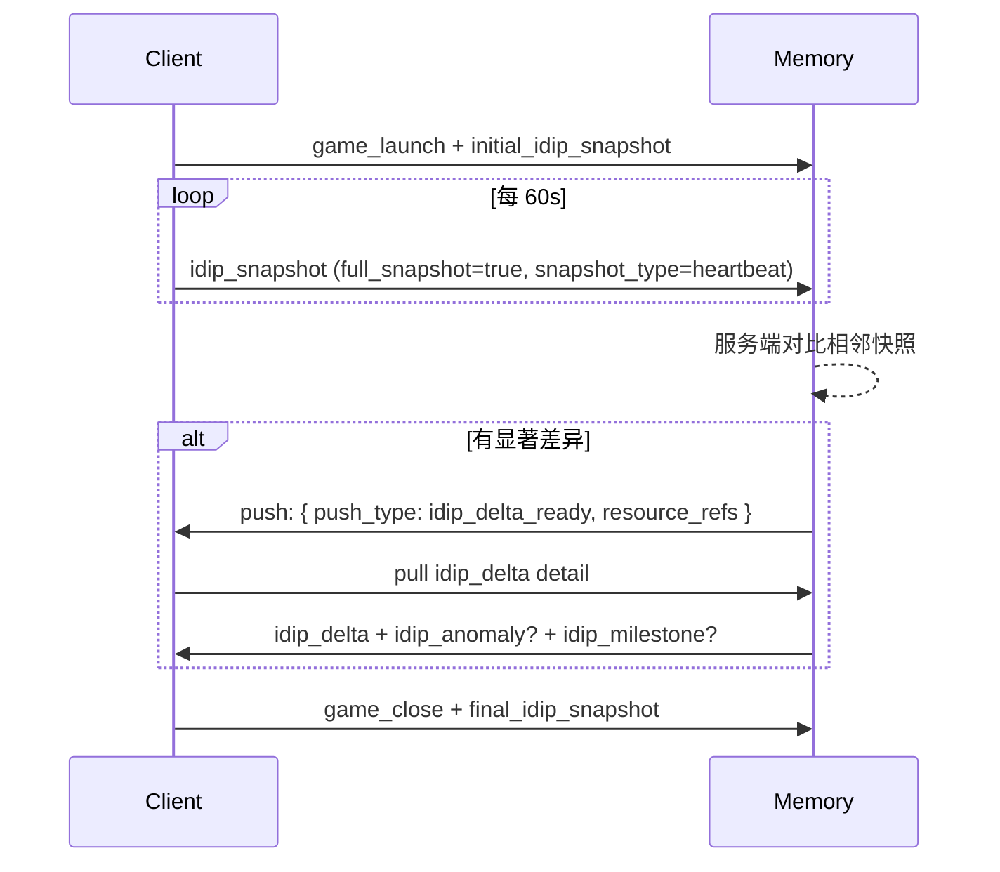

**心跳 envelope**：

```json
{
  "record_type": "idip_snapshot",
  "payload_schema_version": "idip_snapshot.v1",
  "payload": {
    "snapshot_type": "heartbeat",
    "full_snapshot": true,
    "heartbeat_interval_sec": 60,
    "session_id": "sess_001",
    "fields": {
      "level": 36, "rank": "gold",
      "current_mode": "ranked_match",
      "current_chapter": "chapter_02",
      "gold": 1280
    }
  }
}
```

##### 3.1.2.3 游戏自定义事件

游戏有 SDK 的，可在通用事件之外追加自定义 `event_type`（`event_mode=realtime_push`），通过 `custom_fields` 携带特定字段。`custom_fields`禁止承载真实账号、付费记录、实名信息。

**示例**：

```json
{
  "record_type": "game_event",
  "payload_schema_version": "game_event.v1",
  "payload": {
    "event_mode": "realtime_push",
    "event_type": "boss_defeated",
    "session_id": "sess_001",
    "match_id": "match_789",
    "common_fields": {
      "level_id": "chapter_02",
      "difficulty": "hard",
      "client_locale": "zh-CN"
    },
    "custom_fields": {
      "boss_id": "boss_dragon",
      "duration_sec": 420,
      "party_size": 4,
      "remaining_hp_percent": 12
    }
  }
}
```

##### 3.1.2.4 `event_mode` 取值

| `event_mode` | 含义 | 来源 |
| --- | --- | --- |
| `lifecycle` | 生命周期事件 | Game SDK / 客户端推断进程边界 |
| `realtime_push` | 游戏 SDK 实时推送 | Game SDK |
| `snapshot` | 客户端心跳上报的 idip 快照 | 客户端定时器 |
| `derived_by_memory` | 服务端 diff 生成（仅用于 `idip_delta` / `idip_milestone` 等 derived_memory，不出现在 source_record） | Memory |

#### 3.1.3 PC 环境信号

##### 3.1.3.1 active_app 与 idle 信号

| 字段 | 数据对象 | 触发时机 | 上报方式 | 优先级 |
| --- | --- | --- | --- | --- |
| `active_app.name` | source_record | 前台 app 切换 | `pc_signal` 状态变化上报 + 30s 心跳 | P0 |
| `active_app.bundle_id` | source_record | 同上 | 同上 | P0 |
| `active_app.is_fullscreen` | source_record | 全屏状态变化 | 状态变化上报 | P0 |
| `idle_signal` | source_record | 用户闲置状态跨级（active / idle_1min / idle_5min / idle_30min+） | 跨级时上报 | P0 |
| `is_fullscreen_game` | source_record | 游戏窗口全屏状态变化 | 状态变化上报 | P0 |
| `app_switch_burst` | source_record | 60s 内切 app ≥5 次 | 二阶统计上报 | P1 |
| `recent_apps_top3` | source_record | digest 周期（10 min） | 周期聚合上报 | P1 |

##### 3.1.3.2 输入与 UI 派生

| 字段 | 数据对象 | 触发时机 | 上报方式 | 优先级 |
| --- | --- | --- | --- | --- |
| `window_title_redacted` | source_record | 窗口标题变化且通过脱敏规则 | `pc_signal` 状态变化 | P0 |
| `input_intensity_level` | source_record | 桶化等级变化（low/mid/high） | 状态变化上报 | P0 |
| `ime_state` | source_record | 输入法状态切换（zh/en/off） | 状态变化上报 | P1 |
| `typing_rhythm_signal` | source_record | digest 周期 | 周期聚合 | P1 |
| `text_edit_action_burst` | source_record | 60s 内编辑动作 ≥10 次 | 二阶统计上报 | P1 |
| `undo_redo_rate_per_min` | source_record | digest 周期 | 周期聚合 | P1 |
| `mouse_region_heatmap_top3` | source_record | digest 周期 | 周期聚合 | P1 |
| `scroll_intensity_signal` | source_record | 状态变化 | 状态变化上报 | P1 |
| `ui_semantic_tags[]` | source_record | 授权窗口出现 UI 元素（如 error_dialog） | `semantic_observation` 触发上报 | P1 |
| `focused_element_role` | source_record | 焦点控件类型变化 | 状态变化上报 | P1 |
| `semantic_events[]` | source_record | OS 级语义事件（save / undo / paste / app_switch 等白名单事件） | 事件触发上报 | P1 |

> **永禁**：原始按键字符、窗口全文、文件路径、URL、第三方 app 正文。

##### 3.1.3.3 音频派生与 Now Playing

| 字段 | 数据对象 | 触发时机 | 上报方式 | 优先级 |
| --- | --- | --- | --- | --- |
| `audio_mood_tag` | source_record | 系统音频派生（节拍 / 能量 / 调式） <br>—— 仅在`privacy_grants.system_audio_music_context.granted=true` | digest 周期 / 状态变化（mood 跨档） | P1 |
| `audio_bpm_signal` | source_record | 音频派生 | digest 周期 | P1 |
| now_playing.app | source_record | macOS MediaRemote / Windows SMTC API 上报 | 状态变化（曲目切换） | P1 |
| `now_playing.track_title` | source_record | 同上 | 同上 | P1 |
| `now_playing.artist` | source_record | 同上 | 同上 | P1 |
| `now_playing.platform_category` | source_record | 来源平台归类（music / podcast / video） | 状态变化 | P1 |

##### 3.1.3.4 浏览器 tab 与 OS Scripting Bridge

| 字段 | 数据对象 | 触发时机 | 上报方式 | 优先级 |
| --- | --- | --- | --- | --- |
| `active_tab_signal.category` | source_record | <ul><li>浏览器扩展上报 tab 切换；</li><li>仅 6 类 （video/social/dev/news/shopping/other）</li><li>不读 URL 与正文</li></ul> | 状态变化 | P1 |
| `recent_tab_categories_top3` | source_record | digest 周期 | 周期聚合 | P1 |
| `osa_bridge.app_id` | source_record | 用户授权范围内的桌面 app（Spotify/Music/VLC/IINA/Notes/Bear/Office 等） | 状态变化 | P1 |
| `osa_bridge.app_metadata_summary` | source_record | OSA / COM 拉取的元数据摘要（不含正文） | 状态变化 / digest | P1 |
| `osa_bridge.ui_indicator_shown_per_app` | source_record | 是否对用户显示采集状态 | 状态变化 | P1 |

##### 3.1.3.5 PC 信号统一示例

```json
{
  "record_type": "pc_signal",
  "payload_schema_version": "pc_signal.v1",
  "payload": {
    "signal_kind": "active_app_change",
    "active_app": {
      "name": "Steam",
      "bundle_id": "com.valvesoftware.steam",
      "is_fullscreen": false
    },
    "idle_signal": "active",
    "ime_state": "zh",
    "window_title_redacted": "Steam - Library"
  }
}
```

#### 3.1.4 MCP 通道（经客户端中转）

> **架构决策**：MCP app → 客户端 → 记忆系统。客户端是唯一网络出口，负责：①MCP 协议握手；②白名单字段过滤；③脱敏；④统一按 envelope 上报。MCP 永禁直连记忆系统。

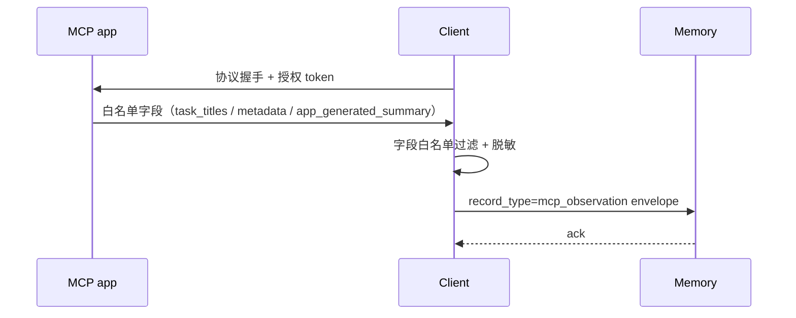

| `record_type` | 关键 payload 字段 | 触发时机 | 优先级 |
| --- | --- | --- | --- |
| `mcp_observation` | `mcp_app_id` / `metadata_summary` / `task_titles[]` / `app_generated_summary` / `summary_source_type` | 客户端按 `mcp_pull_interval_sec` 拉取 + app 主动通知（如支持） | P1 |

**MVP 接入清单**：`dida` / `feishu` / `steam`（P0 ）；`office` / `dingtalk`（P1）。

**永禁字段**：第三方聊天正文 / 邮件正文 / 文档正文 / 会议正文 / 附件内容 / 未授权 app 数据。

#### 3.1.5 VLM 语义观察

> **核心约束**：原图永不进入跨系统；客户端本地 VLM 处理后**只**回写语义结果。强 / 弱感知字段集不同。

##### 3.1.5.1 强感知（用户明确开启屏幕共享）

| 字段 | 是否回写 | 优先级 |
| --- | --- | --- |
| `consent_mode = "strong_sensing"` | 是 | P1 |
| `trigger_scene` | 是（如 `explicit_screen_share`） | P1 |
| `raw_frame_uploaded = false` / `raw_frame_stored = false` | 是（恒值，审计用） | P0 |
| `local_frame_ref` | 是（仅指向客户端本地短期 buffer，记忆系统不能反查） | P1 |
| `source_record_ids[]` | 是（关联游戏事件 / pc_signal） | P1 |
| `semantic_tags[]` | 是（业务必需时） | P1 |
| `user_visible_summary` | 是（业务必需时） | P1 |
| `confidence` | 是 | P1 |
| `ui_indicator_shown = true` | 是（强感知必须有可见状态） | P0 |

##### 3.1.5.2 弱感知（桌宠在用户长时无反馈等"特定时刻"截图）

> **回写策略**：只回写"脱敏摘要 + 业务原因"，**不回写** `semantic_tags`、**不回写** `user_visible_summary`、**不回写** 任何能反推画面内容的字段。 
> ​目的：留下"为什么此时启用了弱感知"和"判断结果"的审计痕迹，但不让弱感知反复积累细节画像。

| 字段 | 是否回写 | 说明 | 优先级 |
| --- | --- | --- | --- |
| `consent_mode = "weak_sensing"` | 是 | 必填 | P1 |
| `trigger_scene` | 是 | 如 `long_no_feedback` / `interrupt_suitability_check` | P1 |
| `business_reason` | **是** | 弱感知核心字段：用一句话说明此次判断目的（如"判断是否适合打扰"） | P1 |
| `interrupt_decision` | 是 | 客户端最终决策（如 `delay_3min` / `interrupt_now` / `stay_silent`） | P1 |
| `outcome` | 是 | 决策结果（如 `interrupted_succeeded` / `interrupted_user_dismissed` / `stayed_silent`） | P1 |
| `source_record_ids[]` | 是 | 触发本次弱感知的相邻 pc_signal / chat_message | P1 |
| `raw_frame_stored = false` | 是 | 恒值 | P0 |
| `ui_indicator_shown` | 是 | 按用户授权说明记录 | P1 |

##### 3.1.5.3 示例

**强感知**：

```json
{
  "record_type": "vlm_observation",
  "payload_schema_version": "vlm_observation.strong.v1",
  "payload": {
    "consent_mode": "strong_sensing",
    "trigger_scene": "explicit_screen_share",
    "raw_frame_uploaded": false,
    "raw_frame_stored": false,
    "local_frame_ref": "local_frame_001",
    "source_record_ids": ["rec_session_end_001"],
    "semantic_tags": ["game_result_screen", "victory", "high_score"],
    "user_visible_summary": "用户处于游戏结算界面，本局胜利且分数较高。",
    "confidence": 0.86,
    "ui_indicator_shown": true
  }
}
```

**弱感知**：

```json
{
  "record_type": "vlm_observation",
  "payload_schema_version": "vlm_observation.weak.v1",
  "payload": {
    "consent_mode": "weak_sensing",
    "trigger_scene": "long_no_feedback",
    "business_reason": "判断用户是否在专注状态、当前是否适合主动打扰",
    "interrupt_decision": "stay_silent",
    "outcome": "stayed_silent",
    "source_record_ids": ["rec_pc_signal_001"],
    "raw_frame_stored": false,
    "ui_indicator_shown": true
  }
}
```

### 3.2 用户控制 mutation

> 所有 mutation 必有 ack（详见 §5）。失败时客户端不进入本地"成功态"，UI 给用户明确反馈。

| `mutation_type` | 触发场景 | 影响对象 | 优先级 |
| --- | --- | --- | --- |
| `save_highlight` | 用户保存高光候选 | `highlight_event` | P1 |
| `update_highlight` | 编辑高光标题 / 摘要 / 标签 / 隐私级别 / 置顶 | `highlight_event` | P1 |
| `delete_memory` | 删除 episode / profile 字段 / highlight / assessment | 任意可删除资源 | P0 |
| `correct_memory` | 用户纠错画像 / 情节 / 高光 / 测定解释 | `profile.*` / `episode` / `highlight_event` / `assessment` | P0 |
| `update_profile_field` | 用户直接编辑昵称 / 称呼 / 目标 / 偏好 / 玩法标签 | `profile_identity.*` / `pet_relationship.*` / `game_profile.*` 等 | P0 |
| `update_preferences` | 修改日记风格 / 内容类型 / 打扰边界 | `user_preferences.*` / `companion_profile.*` | P1 |
| `update_consent` | 开启 / 撤回任一类授权 | `privacy_grants.*` | P0 |
| `request_resummarize` | 点击 / 说"重新总结我" | `profile.summary` / `memory_digest` | P0 |
| `add_do_not_remember_rule` | 用户说"以后别这样记" | `memory_controls.do_not_remember_rules[]` | P0 |
| `submit_feedback` | 点赞 / 点踩 / 忽略 / 表示像 / 不像 / 这不准 | `user_feedback[]` | P1 |
| `request_character_similarity_assessment` | 用户主动发起测定 | `assessment` | P1 |
| `set_assessment_use_for_companion` | 是否允许测定影响陪伴策略 | `assessment.use_for_companion` | P1 |
| `reset_profile` | 用户清空画像 | `profile.*` / `deletion_policy.profile_reset_at` | P0 |

**典型 mutation envelope（以 `correct_memory` 为例）**：

```json
{
  "record_type": "user_action",
  "payload_schema_version": "user_action.mutation.v1",
  "payload": {
    "action_category": "memory_mutation",
    "action_type": "correct_memory",
    "mutation": true,
    "mutation_id": "mut_correct_001",
    "target_resource_id": "profile_fact_001",
    "original_value": "用户喜欢困难模式",
    "corrected_value": "用户不喜欢困难模式，只是偶尔挑战",
    "user_intent": "用户明确纠正画像事实"
  }
}
```

### 3.3 批量补传

| 场景 | 触发 | 规则 |
| --- | --- | --- |
| 网络恢复 | 客户端检测到联通后 30s 内启动 | 每条仍带独立 `record_id` / `occurred_at` / `consent_snapshot_id`（不是补传时刻）；按 `occurred_at` 时序上报 |
| 客户端空闲 | 后台周期任务 | 同上 |
| 退出前 flush | `before_quit` hook | 同上 |
| 超时丢弃 | 离线超 `offline_buffer_max_hours=24` 或超 `offline_buffer_max_records=5000` | 客户端记录 `offline_dropped_count` 并在下次启动时上报一条 `pet_runtime_event.offline_drop_summary`（不补传内容） |

**批量 envelope**：

```json
{
  "batch_id": "batch_offline_001",
  "batch_type": "source_record_backfill",
  "game_id": "game_abc",
  "game_user_id_pseudonym": "u_hash_123",
  "sent_at": "2026-05-18T22:10:00Z",
  "retry_count": 1,
  "items": [
    { "envelope_version": "1.0", "record_id": "rec_offline_game_event_001", "...": "..." }
  ]
}
```

**Memory 批量 ack**：

```json
{
  "batch_ack_id": "batch_ack_offline_001",
  "batch_id": "batch_offline_001",
  "status": "partial_success",
  "accepted_record_ids": ["rec_offline_game_event_001"],
  "rejected_records": [
    { "record_id": "rec_offline_user_action_001", "reason": "duplicate_record_id" }
  ]
}
```

---

## 4. Memory → Client 返回

### 4.0 章节地图

| 子节 | 内容 |
| --- | --- |
| §4.1 | 加工记忆 pull response（按 `query_type` 列） |
| §4.2 | 用户控制状态 pull response（preferences / consent / deletion_policy） |
| §4.3 | 轻量 push 通知 |

### 4.1 加工记忆 pull response（derived_memory）

#### 4.1.1 Pull Query 请求字段

| 字段 | 含义 | 必填 | 优先级 |
| --- | --- | --- | --- |
| `query_id` | 查询 ID | 是 | P0 |
| `query_type` | 查询类型，见 §4.1.2 | 是 | P0 |
| `game_id` / `game_user_id_pseudonym` | 数据隔离 | 是 | P0 |
| `scene` | 客户端业务场景（用于 Memory 裁剪结果） | 是 | P0 |
| `time_window` | 查询时间窗 `{from, to}` | 否 | P1 |
| `resource_refs[]` | 从 push 拿到的资源引用 | 取决于 `query_type` | P0 |

#### 4.1.2 `query_type` 与返回结构

| `query_type` | 客户端场景 | 返回内容（derived_memory） |
| --- | --- | --- |
| `startup_context` | 游戏 / 客户端启动 | 当前游戏下近期 `memory_digest` + 关键 `profile.summary` + 未处理提醒清单 + `consent_snapshot` |
| `conversation_context` | 桌宠准备回应前 | 当前 `profile` 关键字段 + 近期 `atomic_facts[]` + `episode` refs + `disturbance_boundaries` |
| `session_memory` | 一局结束 / 结算页 | 本 session 的 `episode` + `idip_delta` + `highlight_event` refs + 事件摘要 |
| `profile_detail` | 画像页 / 对话前 | `profile.*` 全量 + `profile_meta`（含 evidence_ids） |
| `episode_detail` | 跨日召回 / 日记 / 复盘 | `episode` 详情 + evidence_ids |
| `highlight_detail` | 高光页 / 日记 / 分享 | `highlight_event` 详情 + evidence_ids |
| `preferences_state` | 设置页 / 能力调用前 | `user_preferences` + `privacy_grants` + `deletion_policy` |
| `mcp_context` | 外部 app 轻量提醒 | 已授权 MCP app 的 `metadata_summary` + `task_titles[]` + `app_generated_summary` |
| `assessment_result` | 角色相似度结果页 | `game_character_similarity_assessment` 详情 |
| `resource_detail` | 收到 push 后按 `resource_refs[]` 拉详情 | 与 refs 对应的具体资源 |

#### 4.1.3 加工记忆主要资源族（Memory → Client 字段映射）

> **本表只列资源族的核心字段。字段语义、隐私边界、用户控制状态详见 DRS §3。**

| 资源族 | 主要字段 | 来源 query_type | 优先级 |
| --- | --- | --- | --- |
| `atomic_facts[]` | `fact` / `quote_eligible` / `meta(confidence, source_category, generation_method, evidence_ids)` | conversation_context / profile_detail / episode_detail | P0 |
| `episode` | `title` / `content` / `time_range` / `participants` / `highlight_score` / `evidence_ids[]` | session_memory / episode_detail | P0 |
| `profile.summary` | `value` / `evidence_summary` / `last_confirmed_at` | startup_context / profile_detail | P0 |
| `profile_identity.*` | `display_name` / `preferred_call_name` —— **derived 版本**：由 chat 推断的称呼候选，标 `generation_method=inferred` | profile_detail | P0 |
| `pet_relationship.*` | `relationship_mode` —— **derived 版本**：根据互动推断；用户在 mutation 中设 `user_set` 后不可被覆盖 | profile_detail | P0 |
| `game_profile.*` | `favorite_roles_inferred[]` / `favorite_modes_inferred[]` / `game_goals_inferred[]` | profile_detail | P0 |
| `playstyle_profile.*` | `playstyle_tags_inferred[]` / `risk_preference_inferred` / `learning_stage_inferred` | profile_detail | P0 |
| `companion_profile.*` | `emotion_support_preference_inferred` / `preferred_conversation_topics_inferred[]` | profile_detail | P0 |
| `progress_profile.*` | `current_goal_inferred` / `stuck_points_inferred[]` / `recent_achievements_inferred[]` / `long_term_milestones[]` | session_memory / profile_detail | P1 |
| `idip_delta` | `changed_fields` / `from_snapshot_id` / `to_snapshot_id` | session_memory | P1 |
| `idip_anomaly` | `type`（卡关 / 异常掉段 / ...） / `evidence_ids[]` | session_memory | P1 |
| `idip_milestone[]` | `name` / `achieved_at` / `evidence_ids[]` | session_memory / profile_detail | P1 |
| `highlight_event` | `highlight_id` / `title` / `time` / `scene` / `event_summary` / `category` / `tags[]` / `source` / `privacy_level` / `pinned` / `evidence_ids[]` / `is_active` / `inactive_reason` / `inactive_at` | highlight_detail | P1 |
| `memory_digest` | `digest_id` / `period` / `summary` / `top_events` / `top_emotions` | startup_context / profile_detail | P1 |
| `emotion_signal_derived` | 记忆系统基于 chat + game_event 聚合的情绪结论（**不同于客户端推导的 `emotion_signal_observed`**） | session_memory | P0 |
| `game_character_similarity_assessment` | `assessment_id` / `matched_character_*` / `matched_traits[]` / `unmatched_traits[]` / `not_evaluable_traits[]` / `data_window` / `consent_snapshot` / `assessment_at` / `is_active` / `inactive_reason` | assessment_result | P1 |
| `profile_meta`（每条 derived 必带） | `confidence` / `source_category[]` / `generation_method` / `evidence_ids[]` / `evidence_summary` / `first_seen_at` / `last_confirmed_at` / `decay_score` / `is_active` / `inactive_reason` / `inactive_at` | 随每条 derived | P0 |

> **关键命名约定（实施 §1.4 D3）**：所有"既可能由客户端推导也可能由记忆系统加工"的概念字段都拆名。客户端上报版本以 `_observed` 结尾，记忆系统返回版本以 `_derived` 或 `_inferred` 结尾；用户显式设置版本以 `_user_set` 结尾。

#### 4.1.4 Pull Response 示例（`session_memory`）

```json
{
  "query_id": "qry_001",
  "query_type": "session_memory",
  "result": {
    "session_id": "sess_001",
    "episode": {
      "title": "首杀 chapter_02 BOSS",
      "content": "用户操控法师...",
      "time_range": { "start": "...", "end": "..." },
      "highlight_score": 0.82,
      "evidence_ids": ["rec_game_event_001", "rec_session_end_001"]
    },
    "idip_delta": {
      "changed_fields": { "level": "+1", "gold": "+310" },
      "from_snapshot_id": "idip_020",
      "to_snapshot_id": "idip_030"
    },
    "highlight_candidates": [
      { "highlight_id": "hl_001", "title": "首杀 BOSS", "evidence_ids": [...] }
    ],
    "emotion_signal_derived": "excitement"
  }
}
```

### 4.2 用户控制状态 pull response（user_control_state）

记忆系统对 `user_control_state` 是**只持久化、不加工**。客户端通过 `preferences_state` query 一次性拿到全套。

| 字段族 | 主要字段 | 优先级 |
| --- | --- | --- |
| `profile_identity_user_set` | `display_name` / `preferred_call_name` | P0 |
| `pet_relationship_user_set` | `relationship_mode` | P0 |
| `companion_profile_user_set` | `emotion_support_preference` / `disturbance_boundaries` / `preferred_conversation_topics[]` / `avoided_conversation_topics[]` | P0 |
| `progress_profile_user_set` | `current_goal` / `stuck_points_user_marked[]` | P0 |
| `game_profile_user_set` | `favorite_roles[]` / `favorite_modes[]` / `game_goals[]` | P0 |
| `content_type` | `enabled[]` / `priority[]` / `user_feedback[]` | P1 |
| `diary_style` | `frequency` / `length` / `focus` / `quote_user_original` | P1 |
| `privacy_grants` | `chat_content` / `game_event_memory` / `behavior_data` / `vlm_visual` / `ui_text_reading` / `system_audio_music_context` / `mcp_sources[]` / `profile_inference` / `character_similarity_assessment` / `diary_quote` | P0 |
| `deletion_policy` | `delete_on_revoke` / `profile_reset_at` | P0 |
| `memory_controls` | `resummarize_requested_at` / `do_not_remember_rules[]` | P0 |

### 4.3 轻量 push 通知

> **核心约束**：push 只带 `summary` 和 `resource_refs[]`，**不**推大对象。客户端按需 pull 详情。Push 的作用是"提醒"，不是替代 query response。

#### 4.3.1 Push envelope

| 字段 | 含义 | 优先级 |
| --- | --- | --- |
| `push_id` | 推送 ID | P0 |
| `push_type` | 推送类型，见 §4.3.2 | P0 |
| `summary` | 一句话摘要（UI 可直接显示） | P0 |
| `resource_refs[]` | 可拉详情的资源引用 | P0 |
| `suggested_action` | 建议客户端动作（如 `pull_detail` / `show_light_tip` / `refresh_settings`） | P1 |
| `created_at` | 推送创建时间 | P0 |

#### 4.3.2 `push_type` 清单

| `push_type` | 触发 | 客户端典型反应 | 优先级 |
| --- | --- | --- | --- |
| `memory_digest_ready` | 低频摘要生成或刷新 | 低打扰提示 + 必要时 pull `memory_digest` | P1 |
| `episode_ready` | 新情节摘要可用 | 在对话 / 日记 / 复盘场景 pull `episode_detail` | P0 |
| `profile_updated` | `profile` / `profile_meta` 有变化 | 画像页刷新 / 对话前 pull `profile_detail` | P0 |
| `highlight_ready` | 新高光候选 / 高光详情可用 | 结算页 / 高光页 pull `highlight_detail` | P1 |
| `idip_delta_ready` | 服务端 diff 生成新 delta | session 中 / 结算页 pull `session_memory` | P1 |
| `preferences_changed` | `user_preferences` / `privacy_grants` 被多端修改 | 设置页刷新 + 更新本地能力开关 | P0 |
| `mcp_summary_ready` | MCP app 有新的白名单摘要 | 按场景 pull `mcp_context` | P1 |
| `assessment_ready` | 角色相似度测定完成或状态变化 | 结果页 pull `assessment_result` | P1 |
| `resource_invalidated` | 记忆被删除 / 纠错 / 过期 / 替换 / 授权撤回 | 刷新受影响页面和本地缓存 | P0 |

#### 4.3.3 Push 去重规则

- 同 `resource_ref` 在 `push_dedup_window_sec=30` 秒内只推送一次。
- `resource_invalidated` 不去重（强一致优先）。
- 离线期间堆积的 push 在客户端上线后按 `created_at` 时序 replay，过期（>1h）的 `memory_digest_ready` 与 `mcp_summary_ready` 可丢弃。

**Push 示例**：

```json
{
  "push_id": "push_001",
  "push_type": "highlight_ready",
  "summary": "本局生成 1 条高光候选",
  "resource_refs": ["highlight_candidate_001"],
  "suggested_action": "pull_detail",
  "created_at": "2026-05-18T21:30:00Z"
}
```

---

## 5. Mutation / Ack 双向闭环

### 5.1 Mutation 契约

mutation 复用 §2.2 通用 envelope，但 `payload.mutation = true`，且必含 `mutation_id`、`target_resource_id`（或同义字段）、`user_intent`（可读说明）。详见 §3.2 类型清单。

### 5.2 Ack 状态机

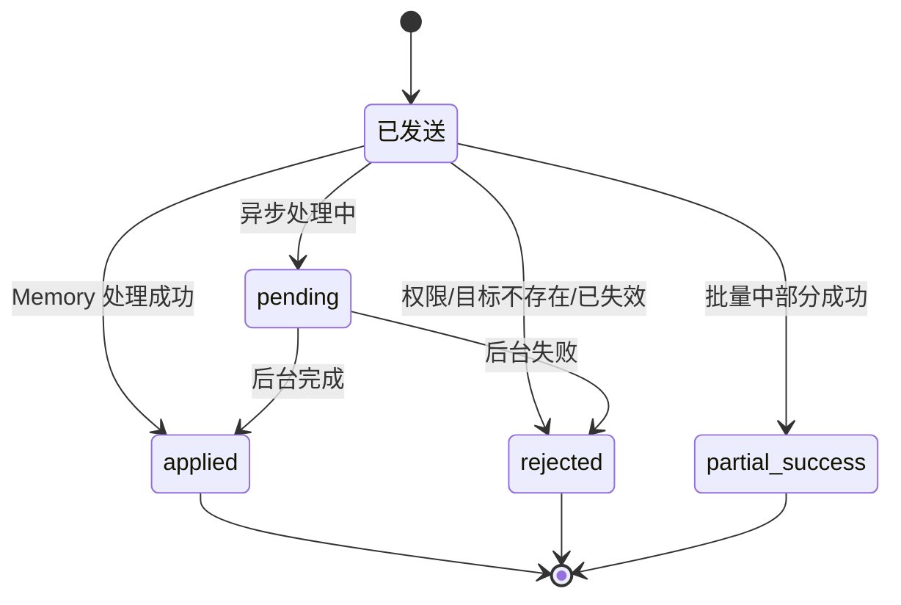

| `ack_status` | 含义 | 客户端处理 |
| --- | --- | --- |
| `applied` | 已完成变更 | 刷新 UI；按 `updated_resource_refs[]` 重新 pull |
| `rejected` | 拒绝（无权限 / 目标不存在 / 资源已失效） | 展示失败原因；不进入本地成功态 |
| `pending` | 已接收，异步处理 | 展示"处理中"；等待后续 push 或轮询 |
| `partial_success` | 批量中只有部分成功 | 刷新成功部分；失败项提示或重试 |

**Ack envelope**：

```json
{
  "ack_id": "ack_mut_correct_001",
  "request_record_id": "rec_user_action_correct_001",
  "mutation_id": "mut_correct_001",
  "status": "applied",
  "processed_at": "2026-05-18T21:44:03Z",
  "updated_resource_refs": ["profile_fact_001"],
  "client_action": "refresh_affected_resources"
}
```

### 5.3 证据链字段流转

证据链不是单独的数据包，而是贯穿 source_record → derived_memory → mutation → ack 的引用关系。

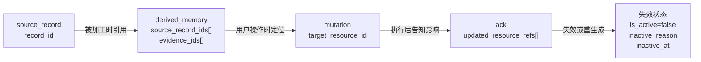

| 阶段 | 字段 | 含义 | 谁写入 |
| --- | --- | --- | --- |
| 上报 | `record_id` | 每条 raw 事实源的唯一 ID | Client |
| 上报 | `record_type` | 事实源类型 | Client |
| 上报 | `consent_snapshot_id` | 事实发生时的授权快照 | Client |
| 加工 | `source_record_ids[]` / `evidence_ids[]` | 这条加工结果引用了哪些事实源 | Memory |
| 加工 | `evidence_summary` | 给用户看的证据短解释 | Memory |
| Mutation | `target_resource_id` | 用户要操作的对象 | Client |
| Ack | `updated_resource_refs[]` | 本次 mutation 影响了哪些结果 | Memory |
| 失效 | `is_active` / `inactive_reason` / `inactive_at` | 加工结果是否还能用、为什么失效、何时失效 | Memory |

### 5.4 授权撤回反向溅透清理（v2 新增）

> **问题**：用户撤回某类授权后，记忆系统如何找出所有"依赖被撤回授权"的 derived_memory 并清理？

#### 5.4.1 触发与流程

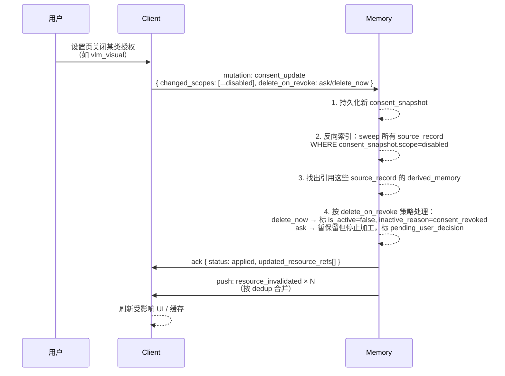

#### 5.4.2 必备机制

| 机制 | 说明 | 责任 |
| --- | --- | --- |
| **`consent_snapshot_id` 反向索引** | 每条 source_record 都有 `consent_snapshot_id`；记忆系统维护 `consent_snapshot → source_record_ids[]` 反向索引 | Memory |
| **`derived_memory.source_record_ids[]` 强制非空** | 每条 derived_memory 必须挂证据 ID；没有证据链的 derived_memory 拒绝写入 | Memory |
| **`delete_on_revoke` 用户偏好** | `delete_now` / `ask` / `keep_silent` 三档；记录在 `deletion_policy` 中 | Client → Memory |
| **失效完成时限** | `consent_revoke_cleanup_max_hours=24`，超时记录 `consent_revoke_overdue` 告警 | Memory |
| **审计日志** | 每次撤回清理生成审计记录，记录 `revoked_scope` / `affected_count` / `completed_at`，可在 Memory Center 查看 | Memory |

#### 5.4.3 边界情况

| 情况 | 处理 |
| --- | --- |
| derived_memory 同时引用了多类授权的 source_record，其中一类被撤回 | 默认整条标失效；若 derived_memory 可仅基于剩余授权重新加工，触发"重新加工"任务 |
| 用户重新开启同类授权 | 不自动恢复已失效 derived_memory；用户可在 Memory Center 手动"恢复"或"重新生成" |
| user_action mutation（如 save_highlight）已用户确认 | 即使依赖的 vlm_observation 因撤回失效，也保留 `is_active=true`（用户确认权重高于源失效）；但 evidence_summary 中标注"原画面证据已不可用" |

---

## 6. 业务场景接力图

> 每个场景统一三道泳道：`Game SDK` / `Client` / `Memory`，MCP 场景多一道 `MCP app`。所有接力图都对应前面 §3 / §4 / §5 的具体字段。

### 6.1 游戏启动

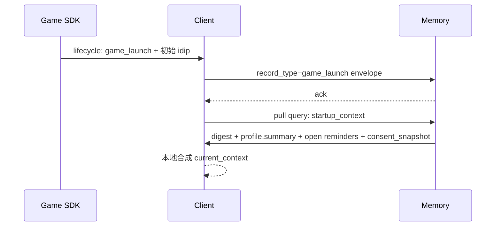

| 步骤 | 客户端 | 记忆系统 | 数据 / 回执 | 回写 |
| --- | --- | --- | --- | --- |
| 1 | 接收 SDK `game_launch` | 存 source_record | envelope ack | 是（事实源） |
| 2 | 上报 `idip_snapshot.initial` | 存初始状态 | ack | 是 |
| 3 | pull `startup_context` | 返回 digest + profile + consent | query response | 否 |
| 4 | 本地合成 `current_context` | 不参与 | — | 否（不回写完整对象） |

### 6.2 对局中

#### 6.2.1 有 SDK 实时事件（A 类游戏）

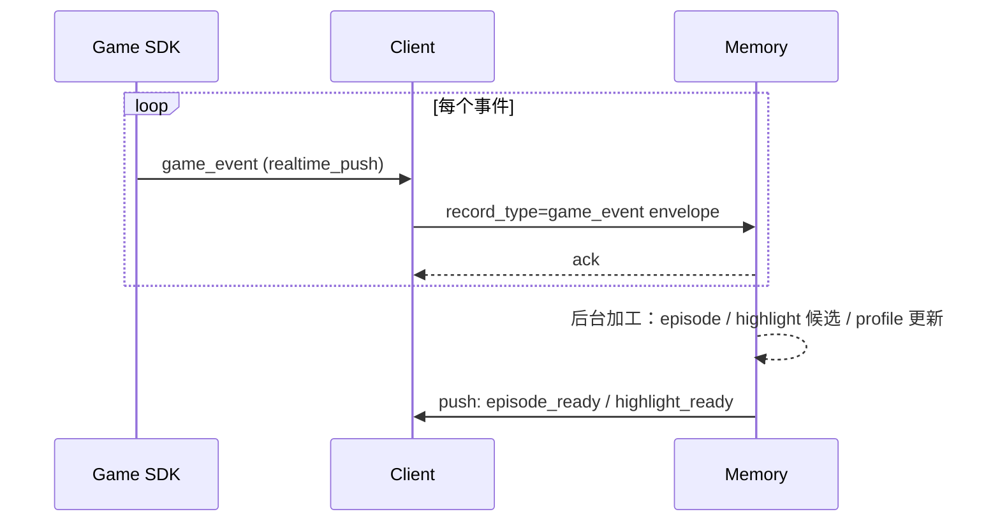

#### 6.2.2 无 SDK 实时事件（B 类游戏，靠 idip 心跳 diff）

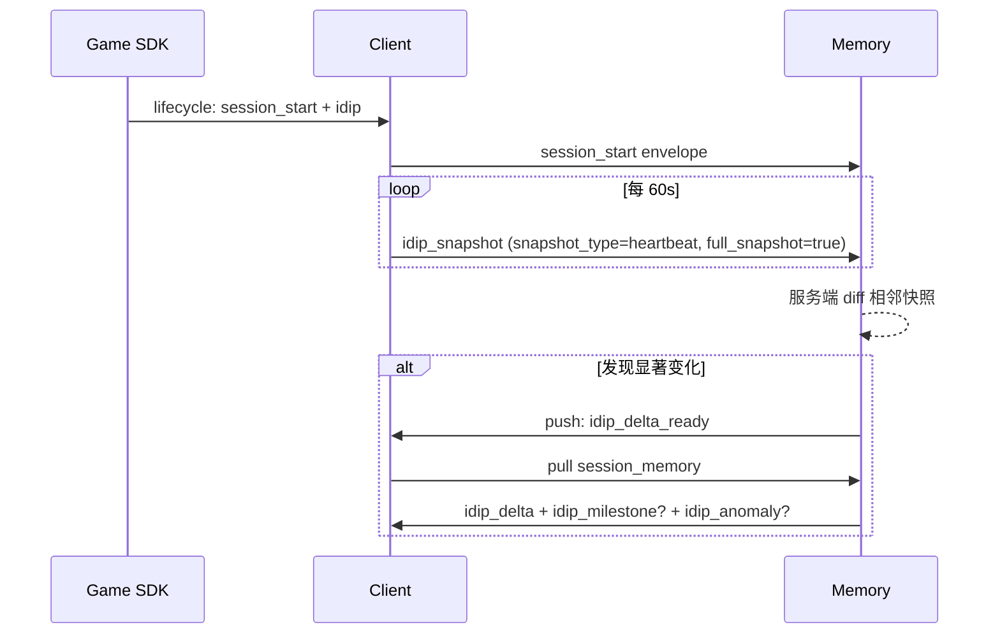

| 步骤 | 客户端 | 记忆系统 | 回写 |
| --- | --- | --- | --- |
| 1 | session_start + idip 上报 | 存初始 | 是 |
| 2 | 60s 心跳 idip_snapshot | 累积快照 | 是 |
| 3 | — | 服务端对比相邻快照，差异显著时生成 derived_memory | 否 |
| 4 | 收到 push 后 pull session_memory | 返回 delta / milestone / anomaly | 否 |

### 6.3 结算与复盘

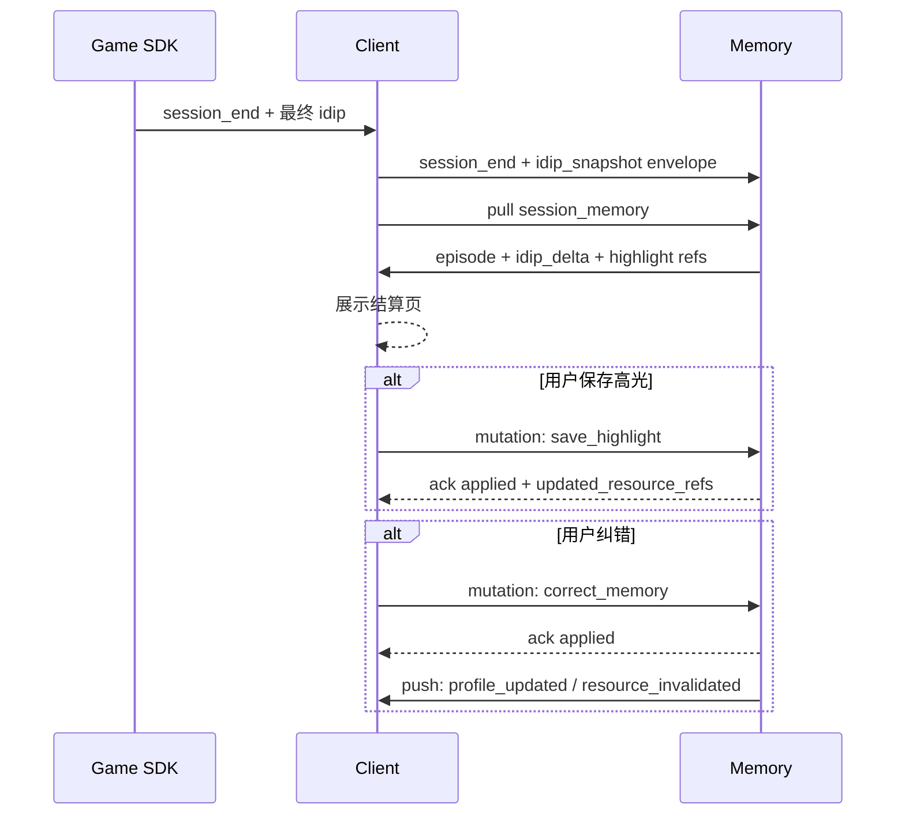

### 6.4 日记 / 高光生成与保存

| 步骤 | 客户端 | 记忆系统 | 数据 / 回执 |
| --- | --- | --- | --- |
| 1 | 用户进入日记页 | — | — |
| 2 | pull `episode_detail` + `highlight_detail` | 返回候选 | query response |
| 3 | 客户端本地大模型生成日记草稿（不入 Memory） | — | — |
| 4 | 用户编辑并保存 | — | — |
| 5 | mutation: `save_highlight` 或 `update_profile_field` | 持久化 + 加工 | ack applied |
| 6 | 若引用原话：检查 `atomic_facts.quote_eligible=true` 且 `privacy_grants.diary_quote.granted=true` | 仅当两个条件都成立才允许引用 | — |

### 6.5 用户主动纠错 / 删除 / 重新总结

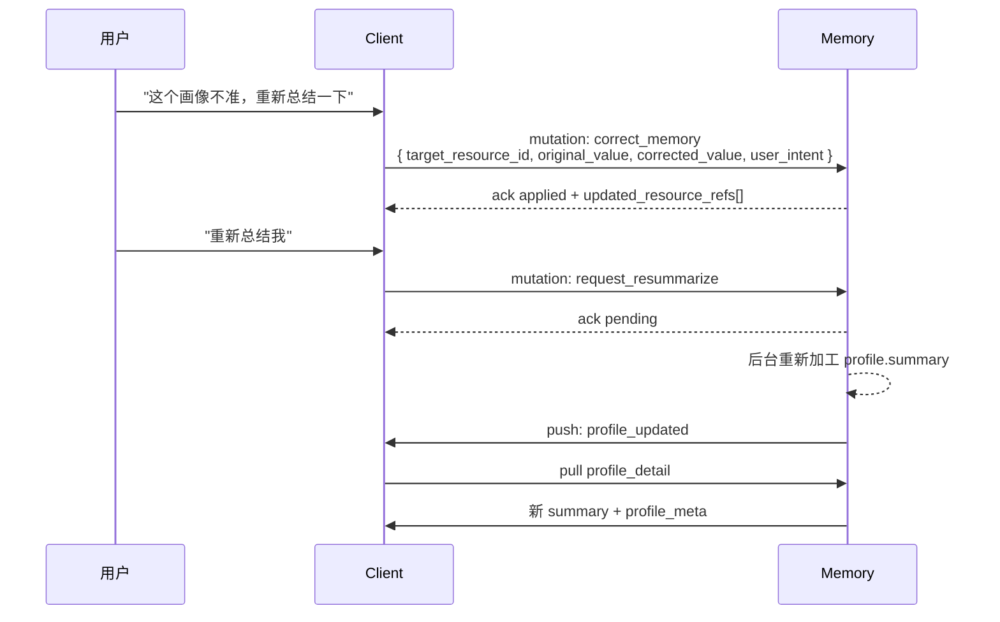

### 6.6 授权变更（含撤回反向清理）

详见 §5.4 流程图。补充表格：

| 步骤 | 客户端 | 记忆系统 | 是否对用户可见 |
| --- | --- | --- | --- |
| 1 | 用户在设置页关闭某类授权（如 VLM） | — | 是 |
| 2 | 弹窗询问 `delete_on_revoke` 偏好（若用户未设默认值） | — | 是 |
| 3 | mutation: `update_consent` + `delete_on_revoke` | — | — |
| 4 | — | 持久化新 consent_snapshot | — |
| 5 | — | 沿反向索引找出受影响 source_record + derived_memory | 后台 |
| 6 | — | 按策略标 `is_active=false, inactive_reason=consent_revoked` 或 `pending_user_decision` | 后台 |
| 7 | 收到 ack + push: `resource_invalidated` × N | — | 否（合并后只一次提示） |
| 8 | 刷新设置页 + 受影响页面 | — | 是 |
| 9 | （可选）Memory Center 审计页显示清理记录 | 提供 audit log | 是 |

### 6.7 VLM 强 / 弱感知

#### 6.7.1 强感知

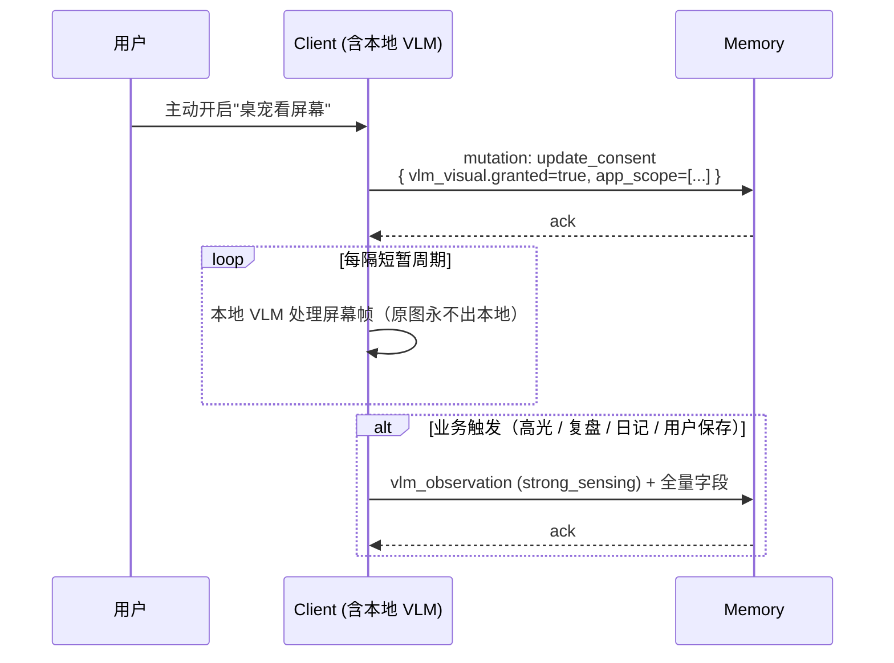

#### 6.7.2 弱感知

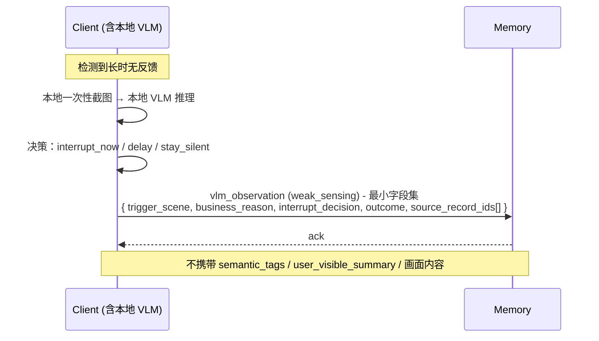

### 6.8 离线 → 网络恢复 → 批量补传

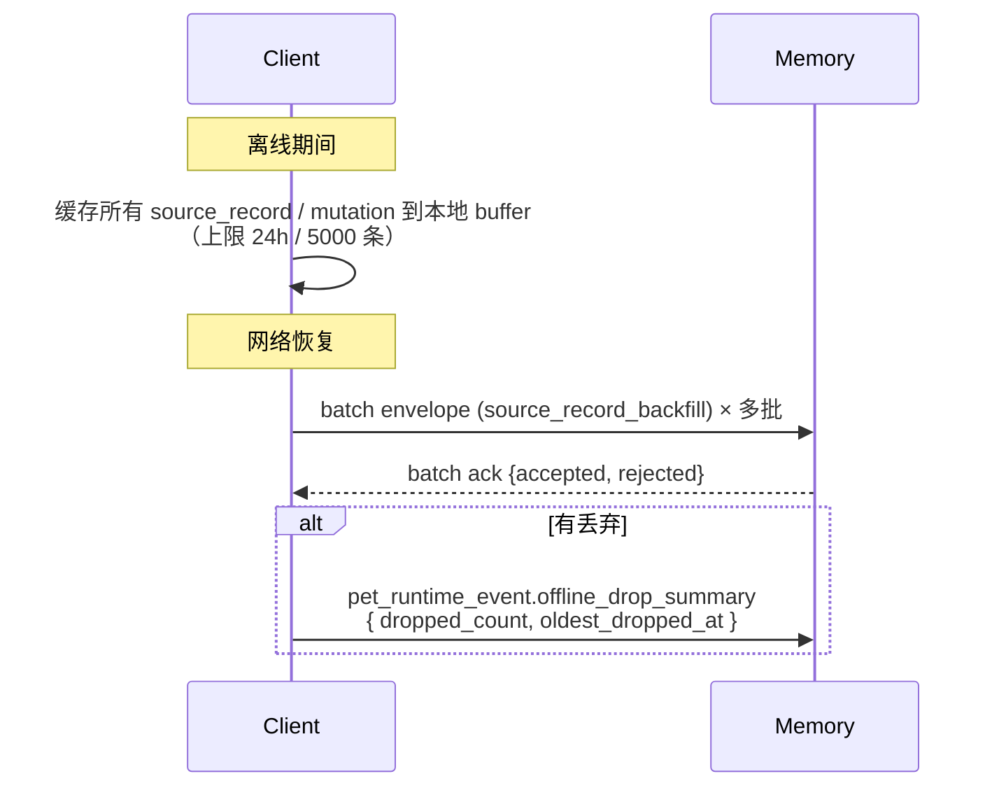

---

## 7. 优先级建议

| 优先级 | 数据 / 能力 | 原因 |
| --- | --- | --- |
| P0 | 统一 envelope 通用字段 | 没有统一外壳，后续数据源会散 |
| P0 | `game_id` + `game_user_id_pseudonym` | 多游戏 / 多用户隔离的最低要求 |
| P0 | 游戏通用事件 8 个（§3.1.2.1） | 所有接入游戏的最小闭环 |
| P0 | `idip_snapshot` 心跳 + 服务端 diff | 无 SDK 实时事件的游戏靠这条链路成立 |
| P0 | `chat_message` / `pet_runtime_event` 上报 | 用户主动表达 / 桌宠运行行为 |
| P0 | 用户控制 mutation（保存 / 删除 / 纠错 / 授权 / 重新总结） | 记忆系统信任底座 |
| P0 | `consent_snapshot_id` 反向索引 + 撤回清理 | 隐私合规底线 |
| P0 | Memory pull query 5 类（startup / conversation / profile / session / preferences） | 客户端按场景获取详情主路径 |
| P0 | Memory push 轻通知 + 去重 | 加工结果变化通知；不推大对象 |
| P0 | `profile_meta` / `profile.*` 核心字段 | 客户端解释 / 纠错 / 画像页基础 |
| P0 | `user_preferences` + `privacy_grants` 基础授权 | 用户控制根 |
| P0 | 证据链字段（record_id ↔ source_record_ids ↔ target_resource_id ↔ updated_resource_refs） | 闭环的连接器 |
| P1 | VLM 强感知 + 弱感知（最小字段集） | 高光 / 复盘 / 打扰判断的增强证据 |
| P1 | PC 环境信号（§3.1.3 全部字段） | 打扰判断、场景理解、行为画像 |
| P1 | MCP 通道（经客户端中转） | 外部 app 元数据 / 任务标题 / 自生成摘要 |
| P1 | `episode` / `highlight_event` / `assessment` 详情消费 | 画像页 / 日记 / 复盘 / 高光 / 角色测定 |
| P1 | 离线批量补传 | 弱网容错 |
| 扩展 | 系统音频 mood / bpm 派生信号 | 听音乐跳舞场景；待 PRIVACY_BOUNDARY 修订提案通过 |

---

## 8. 隐私与排除项

| 数据 | 是否进入跨系统 | 说明 |
| --- | --- | --- |
| Game SDK 结构化事件 | 是 | 标准化后作为事实源 |
| 完整 idip snapshot（含心跳） | 是 | 启动 / 关闭 / 心跳均可完整上报；服务端做 diff |
| 用户首方聊天 | 授权后是 | `privacy_grants.chat_content=true`；可删除 / 纠错 |
| 桌宠运行事件 | 是 | 桌宠消息送达 / 用户忽略 / 主动表达 |
| 用户显式操作（mutation） | 是 | 保存 / 删除 / 确认 / 纠错 / 授权变更 / 重新总结 |
| PC 低敏环境信号（§3.1.3） | 授权后是 | 标准化事实，不写完整时间线；窗口标题必须脱敏 |
| MCP app 白名单字段（经客户端中转） | 授权后是 | 只允许元数据 / 任务标题 / app 自生成摘要 / 来源类型 |
| VLM 强感知语义结果 | 选择性是 | 必须带 source_record_ids；原图永不进 |
| VLM 弱感知最小字段（business_reason + decision + outcome） | 是 | **不**带 semantic_tags / summary / 画面内容 |
| profile / profile_meta / highlight / assessment | 是 | Memory 加工结果返回客户端；用户可删除 / 纠错 / 反馈 |
| user_preferences / privacy_grants | 是 | 用户显式设置，Memory 持久化 |
| **`current_context` 完整对象** | **否** | 客户端运行时判断，不是长期事实 |
| **原始截图 / 屏幕帧** | **否** | 客户端本地处理后丢弃 |
| **原始音频 / 人声 / 通话内容 / 转写文本** | **否** | 不在本分支跨系统范围 |
| **键盘字符流 / 输入法明文** | **否** | 永禁；只允许桶化统计 |
| **第三方 app 正文 / 邮件 / 文档 / 会议正文** | **否** | 即使有 MCP 授权也不允许 |
| **VLM 弱感知的 semantic_tags / summary / 画面内容** | **否** | 弱感知刻意不留细节 |
| **真实账号 / 实名信息 / 付费记录** | **否** | 永禁；只用 `game_user_id_pseudonym` |

---

## 9. 待确认问题

| # | 问题 | 建议 |
| --- | --- | --- |
| 1 | `idip_snapshot` 心跳间隔默认 60s 是否需要按游戏类型差异化？ | 先用 60s 起步，按游戏接入实测调整，最终值锁在 game 接入配置 |
| 2 | 离线 buffer 上限 24h / 5000 条是否合理？ | Engineering 压测后确认；超出按 §3.3 规则丢弃并审计上报 |
| 3 | 游戏 `custom_fields` schema review 由谁拍板？ | 建议 PM + Engineering + 游戏接入方三方 review；首批游戏接入时建模板 |
| 4 | Memory pull query SLA P99 ≤ 200ms / 详情类 ≤ 2s 是否可达？ | Engineering 服务架构选型后回填 |
| 5 | 日记 / 复盘正文（客户端本地大模型生成）是否回写 Memory？ | 默认不回写生成正文；用户保存为日记 / 高光成品时才作为 user_action 写入 |
| 6 | 弱感知 `outcome` 字段是否需要细化分类？ | 先列 5 档（stayed_silent / interrupted_succeeded / interrupted_user_dismissed / delayed_then_interrupted / canceled），不足再扩 |
| 7 | `consent_revoke_overdue` 告警如何投递给用户？ | 建议 push: `consent_revoke_overdue_warning` + 设置页红点；待 Design 收口 |
| 8 | MCP app 若客户端长期离线，是否允许 MCP server 端临时缓存？ | 默认不允许；客户端是数据流唯一节点 |
| 9 | 服务端 idip diff 的"显著变化"阈值如何定义？ | 由 Memory 团队定可配置规则；建议起点：level / rank / chapter / gold > 阈值 |
| 10 | 双向字段拆名（`_observed` / `_derived` / `_inferred` / `_user_set`）是否需要在 schema 检查工具中强制？ | 建议是；Engineering 实施时加 schema lint |

---

## 10. 验收标准

| # | 标准 | 验收方式 |
| --- | --- | --- |
| 1 | **只包含跨系统数据** | 全文 grep `Client → Memory` / `Memory → Client` / `Client ↔ Memory`，无方向字段的 row 不应出现 |
| 2 | **数据对象三分类完整** | 每条数据都标 source_record / derived_memory / user_control_state 之一 |
| 3 | **双向字段全部拆名** | 全文不存在"方向同时是 Client→Memory 且 Memory→Client"的字段 |
| 4 | **envelope 统一但不大包** | 每类数据有独立 record_type，按业务时机分别上报，没有"一个大 JSON 装所有" |
| 5 | **游戏最小闭环成立** | 无 SDK 实时事件的游戏，靠 `game_launch` + 60s `idip_snapshot` 心跳 + `game_close` 能形成 episode / digest |
| 6 | **VLM 边界清晰** | 原图永不进；强 / 弱感知字段集分明；弱感知不带 semantic_tags / summary |
| 7 | **MCP 路径单一** | MCP app → 客户端 → 记忆系统；记忆系统不直连任何 MCP server |
| 8 | **current_context 边界清晰** | 客户端本地合成，不回写完整对象；本文档不出现 current_context 字段表 |
| 9 | **Push 不推大对象** | 每条 push 只有 summary + resource_refs[]；客户端按需 pull |
| 10 | **Mutation 有 ack 闭环** | 全部 mutation_type 都对应 ack_status 处理路径 |
| 11 | **证据链可串通** | 任选一条 derived_memory，能反查到 source_record；任选一条 mutation 能找到 target_resource_id 与 updated_resource_refs |
| 12 | **授权撤回有反向清理机制** | 撤回任一 `privacy_grants.*` 后，§5.4 流程完成，受影响 derived_memory 在 24h 内标失效 |
| 13 | **运营参数有默认推荐值** | §2.4 全部参数都有起点值，标"Engineering 可调优" |
| 14 | **场景接力图覆盖核心流程** | §6 八个场景的 Mermaid 图与表格能让读者一眼看完闭环 |

---

> **变更说明（v2）**：本版本相对 v1 做了**全文重写**，主要变化：
> 1. 骨架从"传输契约 + 数据类别 + 场景"三层并列改为"按数据流向（上报 / 返回 / mutation）单线索"。
> 2. 删除 v1 §4.8 `current_context` 字段表（纯本地对象不在本文档范围）。
> 3. v1 §4.x 13 个业务类别表合并入 §3.1（事实源）/ §4.1（加工记忆）/ §4.2（控制状态），同一数据只讲一次。
> 4. 新增 §1.2 客户端数据来源全貌图、§2.4 运营参数推荐值表、§5.4 授权撤回反向清理机制、§6 八个场景接力图。
> 5. 双向字段全部拆名（`emotion_signal_observed` / `_derived`，`playstyle_tags_user_set` / `_inferred` 等）。
> 6. 游戏数据明确"通用事件清单 + 自定义事件 + IDIP 心跳 + 服务端 diff"四件套。
> 7. VLM 弱感知字段集精简到 7 个核心字段，不再携带 semantic_tags / summary。
> 8. MCP 路径明确"经客户端中转"。
> 9. PC 环境信号（v1 §4.2 + §4.3 + 多个 v2.5 通道）合并为 §3.1.3 一节，按子表分类。
