# 数据流通需求说明书：记忆系统 ↔ 客户端

---

## 目录

- [§0 文档定位](http://localhost:7799/projects/desktop-pet/01-pm/branches/memory-dataset/DATA_FLOW_REQUIREMENT_SPECIFICATION.md#0-%E6%96%87%E6%A1%A3%E5%AE%9A%E4%BD%8D)
- [§1 系统分工与数据原则](http://localhost:7799/projects/desktop-pet/01-pm/branches/memory-dataset/DATA_FLOW_REQUIREMENT_SPECIFICATION.md#1-%E7%B3%BB%E7%BB%9F%E5%88%86%E5%B7%A5%E4%B8%8E%E6%95%B0%E6%8D%AE%E5%8E%9F%E5%88%99)
- [§2 统一传输契约](#2-%E7%BB%9F%E4%B8%80%E4%BC%A0%E8%BE%93%E5%A5%91%E7%BA%A6)
- [§3 Client → Memory 上报](#3-client--memory-%E4%B8%8A%E6%8A%A5)
- [§4 Memory → Client 返回](#4-memory--client-%E8%BF%94%E5%9B%9E)
- [§5 Mutation / Ack 双向闭环](#5-mutation--ack-%E5%8F%8C%E5%90%91%E9%97%AD%E7%8E%AF)
- [§6 业务场景接力图](#6-%E4%B8%9A%E5%8A%A1%E5%9C%BA%E6%99%AF%E6%8E%A5%E5%8A%9B%E5%9B%BE)
- [§7 优先级建议](#7-%E4%BC%98%E5%85%88%E7%BA%A7%E5%BB%BA%E8%AE%AE)
- [§8 隐私与排除项](#8-%E9%9A%90%E7%A7%81%E4%B8%8E%E6%8E%92%E9%99%A4%E9%A1%B9)
- [§9 待确认问题](#9-%E5%BE%85%E7%A1%AE%E8%AE%A4%E9%97%AE%E9%A2%98)
- [§10 验收标准](#10-%E9%AA%8C%E6%94%B6%E6%A0%87%E5%87%86)

---

## 0. 文档定位

### 0.1 本文档解决什么

| 维度 | 本文档回答 |
| --- | --- |
| **数据范围** | 哪些数据会在客户端和记忆系统之间流动；纯本地或不入记忆的数据不写。 |
| **数据方向** | 每条数据是 Client→Memory、Memory→Client，还是双向 mutation。 |
| **触发时机** | 每条数据在什么业务场景、什么时刻被传输（实时事件 / 生命周期 / 心跳 / 用户触发 / 后台 push / 批量补传）。 |
| **传输方式** | 用哪种契约管道（上报 envelope / pull query / 轻量 push / mutation）。 |
| **闭环验证** | 一条事实源如何被加工、被消费、被反馈、被失效，形成可追溯的证据链与状态机。 |

### 0.2 排除项

| 数据 / 对象 | 原因 |
| --- | --- |
| `current_context`（客户端临时决策包） | 100% 客户端本地合成，不回写完整对象；它的"输入材料"分别在 §3 / §4 已覆盖。 |
| VLM 原始帧 / 屏幕截图 | 客户端本地处理后即丢弃，永不进入跨系统传输。 |
| 原始系统音频 / 麦克风音频 / 通话内容 | 不属本分支；音频只送派生信号入记忆，原始流不跨系统。 |
| 键盘字符流 / 输入法明文 / 第三方 app 正文 | 永禁；只允许桶化统计或语义事件。 |
| 客户端本地未上报的 chat draft、未提交的设置 | 未发送前不属跨系统数据。 |
| Game SDK 私有协议细节 | 由"Game SDK → 客户端"段承担，本文档只关心"客户端 → 记忆系统"那一跳。 |

---

## 1. 系统分工与数据原则

### 1.1 角色与责任

| 角色 | 数据舱角色 | 主要职责 | **不**做 |
| --- | --- | --- | --- |
| **记忆系统**（Memory System） | 数据舱 | <ul><li>接收客户端上报的事实源；</li><li>持久化用户控制状态；</li><li>后台加工生成 `derived_memory`；</li><li>响应客户端 pull；</li><li>变化时 push 轻通知；</li><li>执行 mutation 并返回 ack；</li><li>维护证据链与失效状态机。</li></ul> | <ul><li>不直接采集游戏 SDK / 屏幕 / 音频 / MCP；</li><li>不决定桌宠当下是否说话；</li><li>不绕过授权写入。</li></ul> |
| **客户端**（Pet Client） | 数据采集与消费端 | <ul><li>采集并标准化游戏 SDK / PC 环境 / 用户输入 / VLM 语义；</li><li>按业务场景上报事实源；</li><li>按场景 pull 加工记忆；</li><li>本地合成 `current_context`；</li><li>接收用户保存 / 删除 / 纠错 / 授权变更并回写为 mutation。</li></ul> | <ul><li>不长期保存完整记忆；</li><li>不把临时判断伪装成长期事实；</li><li>不上传原图 / 原始音频 / 键盘字符流。</li></ul> |
| **Game SDK** | 数据生产者 | 向客户端推送游戏生命周期、状态快照、实时事件、自定义字段。 | 不直接绕过客户端写入记忆系统。 |
| **授权 MCP app** | 数据生产者 | 在用户授权后向**客户端**提供白名单字段（任务标题 / 元数据 / app 自生成摘要）。 | 不直接连记忆系统（详见 §3.1.4）；不暴露正文 / 附件。 |

### 1.2 客户端的数据来源全貌（明确边界）

客户端实际有 5 类数据来源，但**只有 2 类涉及跨系统流通**：

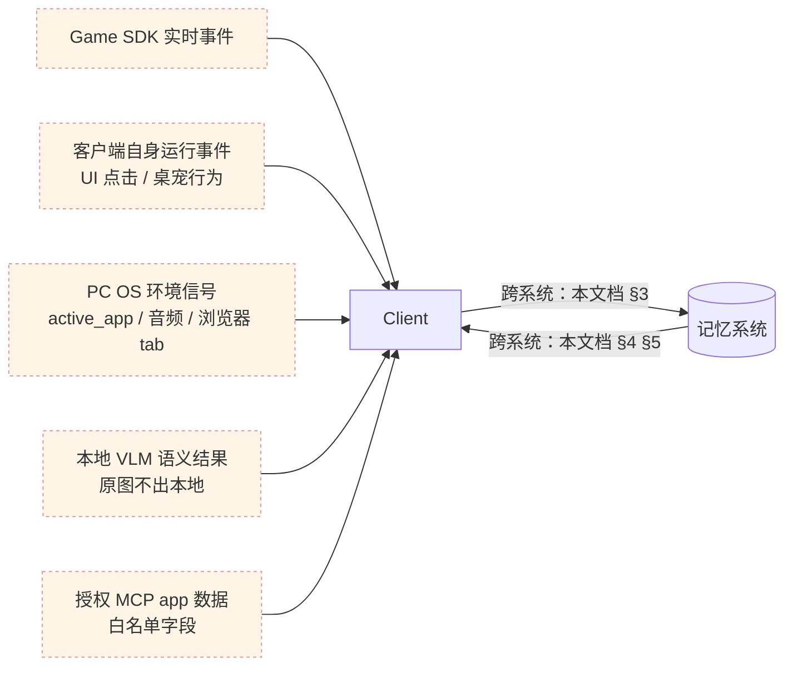
```mermaid
flowchart LR
  A[Game SDK 实时事件]:::nonflow --> Client
  B[客户端自身运行事件<br/>UI 点击 / 桌宠行为]:::nonflow --> Client
  C[PC OS 环境信号<br/>active_app / 音频 / 浏览器 tab]:::nonflow --> Client
  D[本地 VLM 语义结果<br/>原图不出本地]:::nonflow --> Client
  E[授权 MCP app 数据<br/>白名单字段]:::nonflow --> Client
  Client -->|跨系统：本文档 §3| Memory[(记忆系统)]
  Memory -->|跨系统：本文档 §4 §5| Client
  classDef nonflow fill:#fff5e6,stroke:#d99,stroke-dasharray:3 3;
```

- 5 类来源 → 客户端的过程是"采集"，由客户端本地负责，**不在本文档范围**。
- 客户端 ↔ 记忆系统的过程是本文档要严格契约化的部分。
- 客户端最终交付给桌宠的"当下决策包"`current_context` 由：①记忆系统返回的画像 / 摘要 / 偏好（来自 §4） + ②客户端 5 类本地来源 合成 —— 合成结果**不回写**，只把支撑它的 raw `source_record` 按需上报。

### 1.3 数据对象三分类

所有跨系统数据按"是什么"分三类。每条数据在表格里都标注分类，便于判断"谁能写谁、能否被加工覆盖"。

| 分类 | 含义 | 谁写入 | 能否被自动覆盖 | 例子 |
| --- | --- | --- | --- | --- |
| **`source_record`**（事实源记录） | 客户端采集到的 raw 事实，原样上报给记忆系统。 | Client → Memory | 不会被自动覆盖；只能被失效（`is_active=false`）。 | `chat_message` / `game_event` / `pc_signal` / `vlm_observation` / `mcp_observation` |
| **`derived_memory`**（加工记忆） | 记忆系统基于多条 `source_record` 后台加工出的可消费记忆。 | Memory → Client | 会被记忆系统重新加工而刷新；用户通过 `correct` action 可锁定。 | `atomic_facts` / `episode` / `profile.*` / `highlight_event` / `assessment` / `memory_digest` / `idip_delta` |
| **`user_control_state`**（用户控制状态） | 用户显式设置的授权 / 偏好 / 删除策略 / 称呼等；记忆系统持久化，客户端读取并严格执行。 | Client → Memory（mutation） | 永不被自动覆盖；只有用户 mutation 才能改。 | `privacy_grants.*` / `display_name` / `disturbance_boundaries` / `do_not_remember_rules[]` / `deletion_policy` |

> **规则**：一条字段只能属于一类。如果一个业务概念既需要"客户端推导"又需要"记忆系统加工"，**拆成两个字段**（详见 §1.4 D3）。

### 1.4 数据流原则

| # | 原则 | 含义 |
| --- | --- | --- |
| 1 | **先事实，再加工** | <ul><li>`source_record` 必须先写入，`derived_memory` 才能被派生；</li><li>客户端不能直接上报"加工结论"。</li></ul> |
| 2 | **加工结果可解释** | 每条 `derived_memory` 必须带 `source_record_ids[]` 或 `evidence_ids[]`，让客户端可以反查证据。 |
| 3 | **用户控制最高优先级** | <ul><li>`user_control_state` 不会被任何加工覆盖；</li><li>用户 mutation 永远优先于 AI 推断。</li></ul> |
| 4 | **双向字段必拆名** | 同一业务概念若客户端和记忆系统都要写，拆成两个字段（如 `emotion_signal_observed` / `emotion_signal_derived`，`playstyle_tags_user_set` / `playstyle_tags_inferred`），避免方向歧义。 |
| 5 | **授权快照贯穿全链** | <ul><li>每条 `source_record` 必带当时的 `consent_snapshot_id`；</li><li>用户撤回授权时，记忆系统沿这条链反向溅透清理（详见 §5.4）。</li></ul> |
| 6 | **本地合成不回写完整对象** | 客户端的 `current_context` 是临时决策包，只回写支撑它的 raw `source_record` 或用户明确确认的 mutation，永不回写整个 context。 |

### 1.5 总体数据流


```mermaid
flowchart LR
  GameSDK["Game SDK<br/>(生命周期+事件)"]:::ext --> Client
  PC["PC 环境<br/>(active_app/音频/tab/OSA)"]:::ext --> Client
  Screen["屏幕画面帧"]:::ext --> LocalVLM["客户端本地 VLM"]:::local
  LocalVLM -->|语义结果| Client
  UserPet["用户 ↔ 桌宠交互"]:::ext --> Client
  MCPApp["授权 MCP app"]:::ext -->|经客户端中转| Client

  Client -->|"§3.1 事实源上报<br/>chat / game / pc / vlm / mcp"| Memory[(记忆系统)]
  Client -->|"§3.2 mutation<br/>保存/删除/纠错/授权/重新总结"| Memory
  Memory -->|"§4.1 加工记忆 pull response<br/>profile / episode / highlight / assessment"| Client
  Memory -->|"§4.2 控制状态 pull response<br/>preferences / consent"| Client
  Memory -->|"§4.3 轻量 push<br/>resource_refs + summary"| Client
  Memory -->|"§5 ack<br/>mutation 处理结果"| Client

  classDef ext fill:#eef,stroke:#88a;
  classDef local fill:#fff5e6,stroke:#d99;
```

---

## 2. 统一传输契约

### 2.1 四种管道

> 跨系统流通统一用 4 种管道，每条数据只走其中一种主管道：

| 管道 | 方向 | 适合数据 | 同步特征 |
| --- | --- | --- | --- |
| **上报 Envelope** | Client → Memory | `source_record`（含 mutation 也复用同一外壳） | <ul><li>一条 envelope 一个 `record_id`；</li><li>可单发、可批量补传。</li></ul> |
| **Pull Query / Response** | Client → Memory → Client | 客户端主动取加工记忆或控制状态 | <ul><li>客户端按业务场景发起，Memory 返回详情；</li></ul> |
| **轻量 Push** | Memory → Client | 加工结果变化通知 | <ul><li>只带 `resource_refs[]` 和短摘要；</li><li>不推大对象；</li><li>客户端按需 pull。</li></ul> |
| **Mutation / Ack** | Client → Memory（mutation） + Memory → Client（ack） | 用户操作改变记忆系统状态 | 必有 `ack_status`，失败可重试或提示。 |

### 2.2 上报 Envelope 通用字段

> 所有 source_record 和 mutation 都用同一envelope，客户端按业务时机分别上报。

| 字段 | 含义 | 格式 | 必填 | 优先级 | 说明 |
| --- | --- | --- | --- | --- | --- |
| `envelope_version` | 协议版本 | string | 是 | P0 | 协议升级用 |
| `record_id` | 事实源唯一 ID | string | 是 | P0 | 客户端生成；本地去重 |
| `record_type` | 事实源类型 | enum | 是 | P0 | 见 §3.1 各子节 |
| `game_id` | 游戏标识 | string | 是 | P0 | 不同游戏数据隔离 |
| `game_user_id_pseudonym` | 用户脱敏 ID | string | 是 | P0 | 不存真实账号 |
| `occurred_at` | 事件实际发生时间 | ISO 8601 | 是 | P0 | 排序、时间线、衰减 |
| `sent_at` | 客户端发送时间 | ISO 8601 | 是 | P0 | 排查延迟、离线补传 |
| `consent_snapshot_id` | 当时授权快照 ID | string | 是 | P0 | 反向溅透清理用（§5.4） |
| `payload_schema_version` | payload schema 版本 | string | 是 | P0 | 兼容字段升级 |
| `trigger_cause` | 触发因（详见 §2.3.1） | enum | 是 | P0 | `event_driven` / `threshold_crossed` / `scheduled` / `user_action` / `external_push` |
| `delivery_mode` | 传输模式（详见 §2.3.1） | enum | 是 | P0 | 默认 `realtime`；其余：`aggregated` / `batched_recovery` / `batched_startup` |
| `payload` | 业务内容 | object | 是 | P0 | 按 `record_type` 各自定义 |

**通用 envelope 示例**：

```json
{
  "envelope_version": "1.0",
  "record_id": "rec_<type>_<uuid>",
  "record_type": "<game_event | chat_message | pet_runtime_event | pc_signal | vlm_observation | mcp_observation | idip_snapshot | user_action>",
  "game_id": "game_abc",
  "game_user_id_pseudonym": "u_hash_123",
  "occurred_at": "2026-05-18T21:10:00Z",
  "sent_at": "2026-05-18T21:10:01Z",
  "consent_snapshot_id": "consent_20260518_001",
  "payload_schema_version": "<type>.v1",
  "payload": { "...": "见各 record_type 定义" }
}
```

#### 2.2.1 `record_type` 枚举清单

> `record_type` 决定 envelope 的 payload schema 长什么样、由谁加工、走哪条业务管道。

| `record_type` | 含义 | 数据对象 | 典型 trigger_cause | 详细定义 | 优先级 |
| --- | --- | --- | --- | --- | --- |
| `chat_message` | 用户与桌宠的单条对话消息（文本，含 STT 转写） | source_record | `event_driven` | §3.1.1.2 | P0 |
| `pet_runtime_event` | 桌宠运行时事件（消息送达 / 用户忽略 / 主动表达 / 强感知会话审计 / 离线丢弃汇总 等） | source_record | `event_driven` | §3.1.1.3 + §3.1.1.4（event_type 枚举） | P0 |
| `game_event` | 游戏内事件（含 8 通用事件 + 游戏自定义事件，如 boss_defeated） | source_record | `event_driven` | §3.1.2.1 / §3.1.2.3 | P0 |
| `idip_snapshot` | 游戏状态完整快照（生命周期边界 + 周期心跳） | source_record | `scheduled` 心跳 / `event_driven` 生命周期 | §3.1.2.2 | P0 |
| `pc_signal` | PC 环境信号（active_app / 输入派生 / 音频 / now_playing / 浏览器 tab / OSA Bridge） | source_record | `threshold_crossed` / `scheduled` | §3.1.3 | P1 |
| `vlm_observation` | 弱感知 VLM 语义观察结果（**强感知不入记忆**） | source_record | `scheduled` | §3.1.5.2 | P1 |
| `mcp_observation` | 授权 MCP app 经客户端中转的白名单字段 | source_record | `scheduled` / `external_push` | §3.1.4 | P1 |
| `user_action` | 用户主动触发的 mutation（save / update / delete / restore / correct / confirm / request / feedback） | 跨系统 mutation 载体（不是单纯 source_record） | `user_action` | §3.2 | P0 |

> **判别规则**：客户端发任何一条 envelope，必须先确定 `record_type`，再按对应子节填充 payload。`record_type` 与 `payload_schema_version` 配对使用（如 `record_type=chat_message` ⇒ `payload_schema_version=chat_message.v1`）。

### 2.3 触发因术语表

#### 2.3.1 `trigger_cause`（触发因）

| `trigger_cause` | 含义 | 举例 | 典型 record_type |
| --- | --- | --- | --- |
| `event_driven` | 具体离散事件触发 | 用户发一条消息 / 游戏 SDK 推一条事件 / 用户启动游戏 | `chat_message` / `game_event (realtime_push)` / `game_launch` / `session_start` / `session_end` / `pet_runtime_event` |
| `threshold_crossed` | 字段值跨阈值 / 枚举切换 | active_app 从 Steam 切到 Chrome / idle_signal 从 active 跳到 idle_5min | `pc_signal.active_app_change` / `pc_signal.idle_signal` 跨档 / `app_switch_burst` / `now_playing_change` |
| `scheduled` | 按固定或可配频率周期采集 | idip 心跳 60s 上报 / 弱感知 VLM 每 10min 截图 / PC 信号 30s 心跳 | `idip_snapshot` 心跳 / `pc_signal_heartbeat` / `pc_signal.input_digest` / `vlm_observation` 弱感知 |
| `user_action` | 用户主动触发（mutation） | 用户点赞回复/ 用户撤回授权 / 用户说"我不喜欢这个形容“ | 所有 `user_action` (mutation=true) |
| `external_push` | 外部系统主动推入 | MCP app（如飞书）主动通知"你有新待办" | MCP app 主动通知客户端 → `mcp_observation` |

#### 2.3.2 `delivery_mode`（传输模式，默认 `realtime`）

| `delivery_mode` | 含义 |
| --- | --- |
| `realtime`（默认） | 触发即发，单发 envelope |
| `aggregated` | 周期内聚合 N 条信号成一条二阶统计（input_digest / typing_rhythm / mouse_heatmap_top3 等） |
| `batched_recovery` | 离线 / 网络恢复批量补传 |
| `batched_startup` | 客户端冷启动一次性批量同步 |

#### 2.3.3 SLA 对应表

| `trigger_cause` | 默认 SLA | 批量是否允许 |
| --- | --- | --- |
| `event_driven` | 发生后 ≤ 2 秒 | 离线时通过 `batched_recovery` 批量 |
| `threshold_crossed` | 状态变化后 ≤ 1 秒 | 否 |
| `scheduled` | 按配置间隔（见 §2.4） | `aggregated` 内合并 |
| `user_action` | 用户操作后 ≤ 1 秒，必有 ack | 否 |
| `external_push` | 外部推入后 ≤ 2 秒 | 否 |
| `batched_recovery` | 网络恢复后 ≤ 30 秒内启动 | 是 |
| `batched_startup` | 客户端 ready 后 ≤ 10 秒 | 是 |

### 2.4 参数参考值

| 参数 | 推荐值 | 单位 | 备注 |
| --- | --- | --- | --- |
| `idip_heartbeat_interval_sec` | **60** | 秒 | A 类游戏（有 SDK 实时事件）兜底 120s，B 类（无 SDK 实时事件）主通道 60s |
| `pc_signal_heartbeat_sec` | **30** | 秒 | active_app / idle_signal / is_fullscreen_game 三字段最低频率 |
| `idle_signal_thresholds_sec` | **[60, 300, 1800]** | 秒 | active / idle_1min / idle_5min / idle_30min+ 跨档触发 |
| `digest_aggregation_window_min` | **10** | 分钟 | 输入派生 / mouse / tab digest 的聚合窗口 |
| `push_dedup_window_sec` | **30** | 秒 | 同 `resource_ref` 在窗口内只 push 一次 |
| `offline_buffer_max_hours` | **24** | 小时 | 超出丢弃并记录 `offline_dropped_count` |
| `offline_buffer_max_records` | **5000** | 条 | 防止低端机内存爆炸 |
| `mutation_ack_timeout_sec` | **5** | 秒 | 同步 mutation 超时阈值，超时客户端进入"处理中" |
| `mutation_async_max_wait_min` | **30** | 分钟 | 异步 mutation（request_*）最长等待时间，超时记录 `mutation_async_overdue` 告警 |
| `pull_query_p99_ms` | **200** | 毫秒 | 实时 query（startup_context / conversation_context） |
| `pull_query_batch_p99_ms` | **2000** | 毫秒 | 详情类（highlight_detail / episode_detail / assessment_result） |
| `vlm_weak_sensing_interval_sec` | **600** | 秒 | 默认 10 分钟一次；用户可调档位：30 / 60 / 300 / 600 / 1800 / off |
| `vlm_weak_sensing_cooldown_sec` | **60** | 秒 | 弱感知两次本地推理之间最小间隔（防同档过密） |
| `mcp_pull_interval_sec` | **300** | 秒 | 客户端主动从 MCP app 拉取的最小间隔（每 app 独立） |
| `consent_revoke_cleanup_max_hours` | **24** | 小时 | 撤回授权后受影响 `derived_memory` 失效完成时限 |

---

## 3. Client → Memory 上报

### 3.0 章节预览

| 子节 | 内容 | 优先级 |
| --- | --- | --- |
| §3.1 | 事实源记录（`source_record`），按 5 大类细分 | P0 |
| §3.2 | 用户控制 mutation（保存 / 删除 / 纠错 / 授权 / 重新总结 / 反馈） | P0 |
| §3.3 | 批量补传规则 | P1 |

### 3.1 事实源记录 source_record

#### 3.1.1 聊天与桌宠运行事件

| `record_type` | 含义 | 触发时机 | 关键 payload 字段 | 优先级 |
| --- | --- | --- | --- | --- |
| `chat_message` | 用户与桌宠之间的单条对话消息（含语音转文本后的干净文本） | `event_driven`（用户发送 / 桌宠输出每条消息后立即触发） | `conversation_id` / `speaker`（user/pet）/ `message_type`（text/voice_transcribed）/ `content` / `client_scene` | P0 |
| `pet_runtime_event` | 桌宠运行时产生的非对话事件，含消息送达 / 用户忽略 / 桌宠主动表达 / 强感知会话审计等 | `event_driven`（桌宠产生主动行为 / 用户对桌宠消息做出反馈 / 强感知会话起止） | `event_type` / `client_scene` / `related_record_ids[]` / `message_template_id` / `user_interruption_level` | P0 |

> **来源边界**：`chat_message.content` 一律视为"干净文本"，不带 input_modality（键盘 / STT 都不区分）。voice-interaction 分支输出的 STT 文本进入这里时也一样。

**示例**：

```json
{
  "record_type": "chat_message",
  "payload_schema_version": "chat_message.v1",
  "payload": {
    "conversation_id": "conv_001",
    "speaker": "user",
    "message_type": "text",
    "content": "刚才那把翻盘了！",
    "client_scene": "post_game_chat"
  }
}
```

##### 3.1.1.2 `chat_message` payload 字段表

| 字段 | 含义 | 数据类型 | 必填 | 示例值 | 优先级 |
| --- | --- | --- | --- | --- | --- |
| `conversation_id` | 当前会话主键（用于把多条消息绑成一段对话） | string | 是 | "conv_2026051821001" | P0 |
| `speaker` | 发言方枚举 | enum (`user` / `pet`) | 是 | "user" | P0 |
| `message_type` | 消息形态 | enum (`text` / `voice_transcribed`) | 是 | "text" | P0 |
| `content` | 干净文本（无 markdown / 无格式 / 不区分输入通道） | string | 是 | "刚才那把翻盘了！" | P0 |
| `client_scene` | 客户端业务场景（枚举完整清单见 §3.1.1.5） | enum | 是 | "post_game_chat" | P0 |
| `reply_to_message_id` | 回复对象（多轮对话的上下文锚点） | string | 否 | "msg_2026051821000" | P1 |

##### 3.1.1.3 `pet_runtime_event` payload 字段表

| 字段 | 含义 | 数据类型 | 必填 | 示例值 | 优先级 |
| --- | --- | --- | --- | --- | --- |
| `event_type` | 运行事件类型（完整枚举见 §3.1.1.4） | enum | 是 | "proactive_speak" | P0 |
| `client_scene` | 触发该事件的客户端业务场景（枚举完整清单见 §3.1.1.5） | enum | 是 | "long_no_feedback" | P0 |
| `related_record_ids[]` | 与本事件相关的 source_record / mutation 引用 | array<string> | 否 | ["rec_pc_signal_001"] | P1 |
| `message_template_id` | 若为桌宠主动表达，对应消息模板 ID | string | 否 | "tmpl_encourage_002" | P1 |
| `user_interruption_level` | 该事件对用户的打扰级别（`low` / `mid` / `high`） | enum | 否 | "low" | P1 |
| `extra` | 业务自定义扩展（强感知会话审计的 duration_sec / app_scope 等放这里） | object | 否 | { "duration_sec": 1200 } | P1 |

##### 3.1.1.4 `pet_runtime_event.event_type` 枚举清单

> `pet_runtime_event.event_type` 是 payload 内的字段，标识桌宠运行时的具体事件子类型。

**类别 A：桌宠消息交付与用户反馈**

| 值 | 含义 | 典型 client_scene | 优先级 |
| --- | --- | --- | --- |
| `message_delivered` | 桌宠输出的消息已送达用户（UI 渲染完成） | 全部聊天场景 | P0 |
| `message_ignored` | 桌宠输出消息超过 N 秒用户未响应 | `idle_chat` / `post_game_chat` 等 | P0 |
| `message_dismissed` | 用户主动关闭桌宠消息卡片 | 同上 | P1 |
| `proactive_speak` | 桌宠主动开口（兜底通用） | `proactive_speak` / `proactive_comfort` / `proactive_congratulate` / `proactive_reminder` / `proactive_share_observation` | P0 |
| `proactive_speak_skipped` | 桌宠想说但因打扰边界 / 用户偏好抑制了主动表达 | `long_no_feedback` | P1 |

**类别 B：VLM 强感知会话审计**

| 值 | 含义 | 典型 client_scene | 优先级 |
| --- | --- | --- | --- |
| `vlm_strong_sensing_session_start` | 用户开启屏幕共享，强感知会话开始 | `user_initiated_screen_share` | P0 |
| `vlm_strong_sensing_session_end` | 用户关闭屏幕共享，强感知会话结束（extra.duration_sec 必填） | `user_initiated_screen_share` | P0 |

**类别 C：授权与隐私审计**

| 值 | 含义 | 典型 client_scene | 优先级 |
| --- | --- | --- | --- |
| `consent_change_audit` | 用户授权变更后客户端落地审计事件（与 mutation `update + consent.*` 配套，用于跨端审计） | `consent_change` | P0 |

**类别 D：系统与离线**

| 值 | 含义 | 典型 client_scene | 优先级 |
| --- | --- | --- | --- |
| `offline_drop_summary` | 离线缓存超出 24h / 5000 条上限丢弃事件汇总（extra.dropped_count / extra.oldest_dropped_at） | `offline_drop` | P0 |
| `mcp_pull_error` | MCP app 拉取失败 / 鉴权失效（extra.mcp_app_id / extra.error_code） | `mcp_event` | P1 |
| `network_recovered` | 客户端网络从离线恢复，准备启动 batched_recovery 补传 | `offline_drop` | P1 |

##### 3.1.1.5 `client_scene` 枚举清单

**类别 A：用户主动聊天场景**（`chat_message` 用，speaker=user 或 pet 回应）

| 值 | 含义 | 触发时机 | 关联章节 | 优先级 |
| --- | --- | --- | --- | --- |
| `idle_chat` | 用户空闲时主动找桌宠聊天 | 用户点击桌宠 / 桌面双击发起 | §6 通用 | P0 |
| `pre_game_chat` | 游戏启动后开局前的对话 | `game_launch` 之后、`session_start` 之前 | §6.1 | P0 |
| `during_game_chat` | 对局中实时聊天（不打断游戏的轻量对话） | `session_start` 与 `session_end` 之间 | §6.2 | P0 |
| `post_game_chat` | 结算后聊天 | `session_end` 之后 | §6.3 | P0 |
| `diary_chat` | 日记页对话 | 用户进入日记页 | §6.4 | P1 |
| `highlight_recall` | 高光回顾对话 | 用户进入高光页 | §6.4 | P1 |
| `memory_review` | 个人画像页对话 | 用户进入个人画像页 | §6.5 | P1 |
| `settings_chat` | 设置页对话（如询问关系定位、授权说明） | 用户在设置页与桌宠对话 | §6.6 | P1 |
| `screen_share_chat` | 强感知屏幕共享期间的对话 | `vlm_strong_sensing` 开启期间 | §6.7.1 | P1 |

**类别 B：桌宠主动表达场景**（`chat_message` 用，speaker=pet）

| 值 | 含义 | 触发时机 | 关联章节 | 优先级 |
| --- | --- | --- | --- | --- |
| `proactive_speak` | 桌宠主动开口（通用，未细分） | 各种主动表达兜底 | §6 通用 | P0 |
| `proactive_comfort` | 连败 / 卡关时主动安慰 | `idip_anomaly` 触发 / `fail` 事件多次 | §6.2 / §6.3 | P1 |
| `proactive_congratulate` | 里程碑 / 高光达成主动祝贺 | `idip_milestone` / `highlight_ready` push | §6.3 / §6.4 | P1 |
| `proactive_reminder` | 任务 / 待办主动提醒（来自 MCP） | `mcp_summary_ready` push | §6.9 | P1 |
| `proactive_share_observation` | 弱感知发现"用户在干什么"后主动评论 | `vlm_observation` 弱感知触发 | §6.7.2 | P1 |

**类别 C：运行事件场景**（`pet_runtime_event` 用，不出现在 `chat_message`）

| 值 | 含义 | 触发时机 | 关联章节 | 优先级 |
| --- | --- | --- | --- | --- |
| `long_no_feedback` | 用户长时无反馈触发弱感知或主动判断 | 用户超 5min 无操作 | §6.7.2 | P1 |
| `user_initiated_screen_share` | 用户开 / 关强感知屏幕共享 | `update + consent.vlm_strong_sensing` | §6.7.1 | P1 |
| `consent_change` | 授权变更（开 / 关某类授权） | `update + consent.*` | §6.6 | P0 |
| `offline_drop` | 离线缓存满 / 超时丢弃事件 | offline_buffer 超限 | §3.3 | P1 |
| `mcp_event` | MCP app 主动通知客户端 | MCP `external_push` | §6.9 | P1 |

#### 3.1.2 游戏数据

> **核心**：所有游戏数据 envelope 必带 6 个键 —— `game_id` / `game_user_id_pseudonym` / `occurred_at` / `event_type` / `common_fields` / `custom_fields`。前两个在 envelope 通用字段里已带，后四个在 payload 里。

##### 3.1.2.1 通用事件清单

| `event_type` | 性质 | 触发因（trigger_cause） | 必含 `common_fields` | 优先级 |
| --- | --- | --- | --- | --- |
| `game_launch` | 生命周期 | `event_driven`（游戏进程拉起 / 桌宠绑定游戏） | `client_version` / `game_version` / `launch_id` / `initial_idip_snapshot` | P0 |
| `game_close` | 生命周期 | `event_driven`（游戏退出 / 用户终止） | `launch_id` / `session_ids[]` / `close_reason` / `final_idip_snapshot` | P0 |
| `session_start` | 生命周期 | `event_driven`（一局 / 一段游戏开始） | `session_id` / `session_type` / `map_id`?/ `team_size`? / `idip_snapshot` | P0 |
| `session_end` | 生命周期 | `event_driven`（一局 / 一段游戏结束） | `session_id` / `session_type` / `session_result`（win/lose/draw/quit）/ `duration_sec` / `idip_snapshot` | P0 |
| `settlement` | 生命周期 | `event_driven`（结算页打开） | `session_id` / `score`? / `rewards`? | P0 |
| `objective_progress` | 实时事件 | `event_driven`（目标进度变化） | `session_id` / `objective_id` / `progress_value` | P0 |
| `success` | 实时事件 | `event_driven`（通用成功事件：通关 / 杀敌 / 任务完成等业务集合） | `session_id` / `success_category` | P0 |
| `fail` | 实时事件 | `event_driven`（通用失败事件：死亡 / 卡关 / 任务失败等） | `session_id` / `fail_category` | P0 |

##### 3.1.2.2 IDIP 心跳与服务端 diff（所有游戏适用）

- **A 类游戏（有 SDK 实时事件）**：心跳是**兜底**通道，**120 秒**一次。作用是 SDK 偶发丢事件 / 客户端短暂掉线时记忆系统仍能拿到完整状态、避免"看不见"状态变化。A 类游戏的状态变更主路径是 `game_event (realtime_push)`。
- **B 类游戏（无 SDK 实时事件）**：心跳是**主**通道， **60 秒**一次。客户端必须按时上报完整 `idip_snapshot`，记忆系统服务端做相邻快照 diff 生成 `idip_delta` 推回。**客户端不做本地 diff**，避免双端状态不一致。

**统一规则**：客户端永远只上报"快照本身"，diff 计算永远在记忆系统服务端。

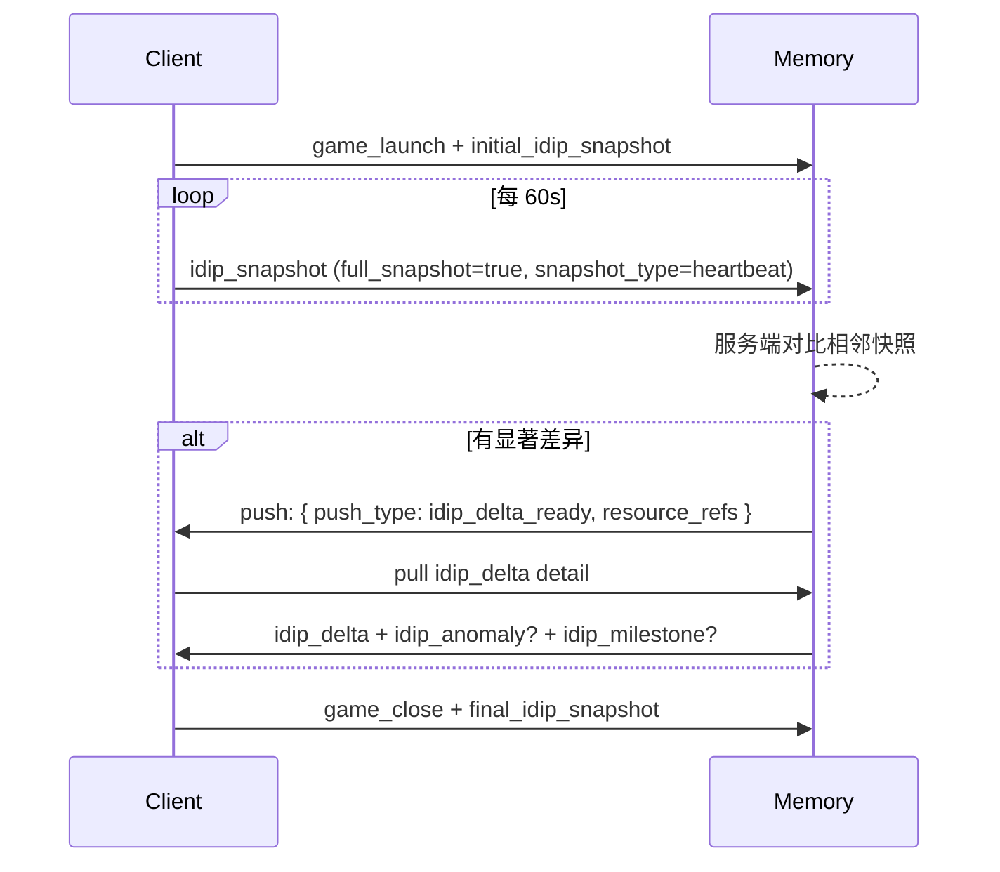
```mermaid
sequenceDiagram
    participant C as Client
    participant M as Memory
    C->>M: game_launch + initial_idip_snapshot
    loop 每 60s
        C->>M: idip_snapshot (full_snapshot=true, snapshot_type=heartbeat)
    end
    M-->>M: 服务端对比相邻快照
    alt 有显著差异
        M->>C: push: { push_type: idip_delta_ready, resource_refs }
        C->>M: pull idip_delta detail
        M->>C: idip_delta + idip_anomaly? + idip_milestone?
    end
    C->>M: game_close + final_idip_snapshot
```

**心跳 envelope**：

```json
{
  "record_type": "idip_snapshot",
  "payload_schema_version": "idip_snapshot.v1",
  "payload": {
    "snapshot_type": "heartbeat",
    "full_snapshot": true,
    "heartbeat_interval_sec": 60,
    "session_id": "sess_001",
    "fields": {
      "level": 36, "rank": "gold",
      "current_mode": "ranked_match",
      "current_chapter": "chapter_02",
      "gold": 1280
    }
  }
}
```

##### 3.1.2.3 游戏自定义事件

游戏有 SDK 的，可在通用事件之外追加自定义 `event_type`（envelope 字段 `trigger_cause=event_driven`），通过 `custom_fields` 携带特定字段。`custom_fields` 禁止承载真实账号、付费记录、实名信息。

**示例**：

```json
{
  "record_type": "game_event",
  "payload_schema_version": "game_event.v1",
  "payload": {
    "event_type": "boss_defeated",
    "session_id": "sess_001",
    "match_id": "match_789",
    "common_fields": {
      "level_id": "chapter_02",
      "difficulty": "hard",
      "client_locale": "zh-CN"
    },
    "custom_fields": {
      "boss_id": "boss_dragon",
      "duration_sec": 420,
      "party_size": 4,
      "remaining_hp_percent": 12
    }
  }
}
```

> envelope 外层 `trigger_cause=event_driven` 已表达"实时事件性质"，payload 内**不再**重复使用 `event_mode` 字段。客户端不应在 payload 中携带 `event_mode`。

##### 3.1.2.4 `common_fields` 字段表

> `common_fields` 是 game_event payload 内的固定子对象，承载跨游戏共有的会话 / 关卡 / 难度 / 区服等结构化字段。`custom_fields` 才允许游戏自定义。

| 字段 | 含义 | 数据类型 | 必填 | 示例值 | 优先级 |
| --- | --- | --- | --- | --- | --- |
| `session_id` | 一局 / 一段游戏的会话 ID | string | 是 | "sess_2026051821001" | P0 |
| `match_id` | 对局 / 比赛 ID（PvP 类游戏） | string | 否 | "match_789" | P0 |
| `level_id` | 关卡 / 章节 ID（PvE 类游戏） | string | 否 | "chapter_02" | P0 |
| `difficulty` | 难度档位 | enum / string | 否 | "hard" | P0 |
| `client_locale` | 客户端语言区域 | string (BCP47) | 是 | "zh-CN" | P1 |
| `game_version` | 游戏版本号 | string | 是 | "2.7.1" | P1 |
| `game_mode` | 游戏模式（ranked / casual / arena / ...） | string | 否 | "ranked_match" | P0 |
| `team_size` | 当前队伍人数 | integer | 否 | 5 | P1 |

#### 3.1.3 PC 环境信号

##### 3.1.3.1 active_app 与 idle 信号

| 字段 | 含义 | 数据对象 | 触发时机（trigger_cause + delivery_mode） | 优先级 |
| --- | --- | --- | --- | --- |
| `active_app.name` | 前台 app 显示名 | source_record | `threshold_crossed` + `scheduled (30s)` | P0 |
| `active_app.bundle_id` | 前台 app 标识符（macOS bundle id / Windows AUMID） | source_record | `threshold_crossed` + `scheduled (30s)` | P0 |
| `active_app.is_fullscreen` | 前台 app 是否全屏 | source_record | `threshold_crossed` | P0 |
| `idle_signal` | 用户闲置状态枚举（active / idle_1min / idle_5min / idle_30min+） | source_record | `threshold_crossed`（跨档触发） | P0 |
| `is_fullscreen_game` | 是否前台游戏窗口处于全屏（用于打扰判断） | source_record | `threshold_crossed` | P0 |
| `app_switch_burst` | 短窗口高频切 app 的二阶统计（60s 内切 ≥5 次） | source_record | `threshold_crossed` + `aggregated` | P1 |
| `recent_apps_top3` | 近 digest 窗口内使用频次 top3 app | source_record | `scheduled (digest 10min)` + `aggregated` | P1 |

##### 3.1.3.2 输入与 UI 派生

| 字段 | 含义 | 数据对象 | 触发时机（trigger_cause + delivery_mode） | 优先级 |
| --- | --- | --- | --- | --- |
| `window_title_redacted` | 脱敏后的窗口标题（去除文件名 / 路径 / 用户名 / URL） | source_record | `threshold_crossed` | P0 |
| `input_intensity_level` | 输入强度桶化等级（low / mid / high） | source_record | `threshold_crossed` | P0 |
| `ime_state` | 输入法状态（zh / en / off） | source_record | `threshold_crossed` | P1 |
| `typing_rhythm_signal` | 打字节奏（steady / bursty / pause_heavy） | source_record | `scheduled (digest 10min)` + `aggregated` | P1 |
| `text_edit_action_burst` | 短窗口内编辑动作高频统计（60s ≥10 次） | source_record | `threshold_crossed` + `aggregated` | P1 |
| `undo_redo_rate_per_min` | 撤销 / 重做频率 | source_record | `scheduled (digest 10min)` + `aggregated` | P1 |
| `mouse_region_heatmap_top3` | digest 窗口内鼠标活跃区域 top3 | source_record | `scheduled (digest 10min)` + `aggregated` | P1 |
| `scroll_intensity_signal` | 滚动强度等级 | source_record | `threshold_crossed` | P1 |
| `ui_semantic_tags[]` | 授权窗口检测到的 UI 元素（如 error_dialog） | source_record | `event_driven`（语义事件触发） | P1 |
| `focused_element_role` | 焦点控件类型（input / button / list 等） | source_record | `threshold_crossed` | P1 |
| `semantic_events[]` | OS 级白名单语义事件（save / undo / paste / app_switch） | source_record | `event_driven` | P1 |

> **永禁**：原始按键字符、窗口全文、文件路径、URL、第三方 app 正文。

##### 3.1.3.3 音频派生与 Now Playing

| 字段 | 含义 | 数据对象 | 触发时机（trigger_cause + delivery_mode） | 优先级 |
| --- | --- | --- | --- | --- |
| `audio_mood_tag` | 系统音频派生的情绪标签（节拍 / 能量 / 调式聚合） —— 仅在 `privacy_grants.system_audio_music_context.granted=true` | source_record | `scheduled (digest)` + `aggregated`；mood 跨档时 `threshold_crossed` | P1 |
| `audio_bpm_signal` | 系统音频派生的 BPM 信号 | source_record | `scheduled (digest)` + `aggregated` | P1 |
| `now_playing.app` | 当前播放音乐 / 视频的来源 app（macOS MediaRemote / Windows SMTC） | source_record | `threshold_crossed`（曲目切换） | P1 |
| `now_playing.track_title` | 当前播放标题 | source_record | `threshold_crossed` | P1 |
| `now_playing.artist` | 当前播放艺术家 / 频道 | source_record | `threshold_crossed` | P1 |
| `now_playing.platform_category` | 来源平台归类（music / podcast / video） | source_record | `threshold_crossed` | P1 |

##### 3.1.3.4 浏览器 tab 与 OS Scripting Bridge

| 字段 | 含义 | 数据对象 | 触发时机（trigger_cause + delivery_mode） | 优先级 |
| --- | --- | --- | --- | --- |
| `active_tab_signal.category` | 当前浏览器活动 tab 的归类（video / social / dev / news / shopping / other 6 类，**不读 URL / 不读正文**） | source_record | `threshold_crossed`（浏览器扩展上报 tab 切换） | P1 |
| `recent_tab_categories_top3` | digest 窗口内 tab 类别 top3 | source_record | `scheduled (digest 10min)` + `aggregated` | P1 |
| `osa_bridge.app_id` | OSA / COM 桥接到的桌面 app 标识（Spotify / Music / VLC / IINA / Notes / Bear / Office 等用户授权范围内） | source_record | `threshold_crossed` | P1 |
| `osa_bridge.app_metadata_summary` | OSA / COM 拉取的元数据摘要（不含正文） | source_record | `threshold_crossed` 或 `scheduled (digest)` + `aggregated` | P1 |
| `osa_bridge.ui_indicator_shown_per_app` | 是否对用户显示采集状态指示（每 app 维度） | source_record | `threshold_crossed` | P1 |

##### 3.1.3.5 PC 信号示例（4 类典型场景）

**示例 1：active_app 切换（threshold_crossed）**

```json
{
  "record_type": "pc_signal",
  "payload_schema_version": "pc_signal.v1",
  "payload": {
    "signal_kind": "active_app_change",
    "trigger_cause": "threshold_crossed",
    "delivery_mode": "realtime",
    "active_app": {
      "name": "Steam",
      "bundle_id": "com.valvesoftware.steam",
      "is_fullscreen": false
    },
    "idle_signal": "active",
    "ime_state": "zh",
    "window_title_redacted": "Steam - Library"
  }
}
```

**示例 2：输入派生 digest（scheduled + aggregated）**

```json
{
  "record_type": "pc_signal",
  "payload_schema_version": "pc_signal.v1",
  "payload": {
    "signal_kind": "input_digest",
    "trigger_cause": "scheduled",
    "delivery_mode": "aggregated",
    "aggregation_window_min": 10,
    "input_intensity_level": "mid",
    "typing_rhythm_signal": "steady",
    "undo_redo_rate_per_min": 1.2,
    "mouse_region_heatmap_top3": ["center_main", "right_panel", "top_menu"]
  }
}
```

**示例 3：now_playing 切换（threshold_crossed）**

```json
{
  "record_type": "pc_signal",
  "payload_schema_version": "pc_signal.v1",
  "payload": {
    "signal_kind": "now_playing_change",
    "trigger_cause": "threshold_crossed",
    "delivery_mode": "realtime",
    "now_playing": {
      "app": "Apple Music",
      "track_title": "Lofi Study Beats",
      "artist": "Various",
      "platform_category": "music"
    }
  }
}
```

**示例 4：浏览器 tab + OSA Bridge（threshold_crossed）**

```json
{
  "record_type": "pc_signal",
  "payload_schema_version": "pc_signal.v1",
  "payload": {
    "signal_kind": "active_tab_and_osa_change",
    "trigger_cause": "threshold_crossed",
    "delivery_mode": "realtime",
    "active_tab_signal": {
      "category": "video"
    },
    "osa_bridge": {
      "app_id": "com.apple.Music",
      "app_metadata_summary": "正在播放：Lofi Study Beats",
      "ui_indicator_shown_per_app": true
    }
  }
}
```

#### 3.1.4 MCP 通道（经客户端中转）

> **架构决策**：MCP app → 客户端 → 记忆系统。客户端是唯一网络出口，负责：①MCP 协议握手；②白名单字段过滤；③脱敏；④统一按 envelope 上报。MCP 永禁直连记忆系统。

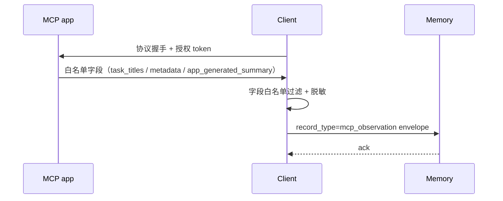
```mermaid
sequenceDiagram
    participant MCP as MCP app
    participant C as Client
    participant M as Memory
    C->>MCP: 协议握手 + 授权 token
    MCP->>C: 白名单字段（task_titles / metadata / app_generated_summary）
    C->>C: 字段白名单过滤 + 脱敏
    C->>M: record_type=mcp_observation envelope
    M-->>C: ack
```

| `record_type` | 含义 | 关键 payload 字段 | 触发时机（trigger_cause） | 优先级 |
| --- | --- | --- | --- | --- |
| `mcp_observation` | 经客户端中转的授权 MCP app 白名单字段 / 任务标题 / 元数据摘要 | `mcp_app_id` / `metadata_summary` / `task_titles[]` / `app_generated_summary` / `summary_source_type` | `scheduled (mcp_pull_interval_sec=300)`（客户端按最小间隔主动拉取）+ `external_push`（MCP app 主动通知，如支持） | P1 |

**MVP 接入清单（5 个领域）**：

| 领域 | 候选 app | 备注 |
| --- | --- | --- |
| 工作 | 飞书 / 钉钉 / Office（Word / Excel / Outlook 元数据） | 仅任务标题 / 会议元数据 / 文档元数据，永禁正文 |
| 购物 | 淘宝 / 京东 / 拼多多 | 仅订单元数据 + 平台自生成摘要，永禁地址 / 支付信息 |
| 娱乐 | 哔哩哔哩 / 抖音 / YouTube | 仅当前播放标题 / 频道 / 平台分类，永禁评论 / 私信 |
| 音乐 | 网易云音乐 / QQ 音乐 / Spotify | 已通过 OSA Bridge 部分覆盖；MCP 通道用于补全播放列表元数据 |
| 社交 | 微信（仅元数据）/ 小红书 / 微博 | **隐私风险最高**，最后接入；永禁聊天 / 私信 / 朋友圈 / 评论正文 |

**接入优先级**：

1. P0 起步：**音乐 + 娱乐**（隐私风险低、用户感知强）
2. P1：**工作**（任务标题 + 会议元数据，对桌宠"工作陪伴"价值高）
3. P2：**购物 + 社交**（购物有支付风险，社交有隐私风险，需 PRIVACY_BOUNDARY 专项评审）

**永禁字段重申**：第三方聊天正文 / 邮件正文 / 文档正文 / 会议正文 / 附件内容 / 朋友圈正文 / 私信内容 / 真实账号 / 财务详情 / 未授权 app 数据。

#### 3.1.5 VLM 语义观察

> **核心约束**：原图永不进入跨系统；本地 VLM 在客户端完成全部画面理解。
> **新设计（v2.1 翻转）**：强感知 = 实时陪伴，**不入记忆**；弱感知 = 长期数据源，**入记忆**。原 v2 把强感知作为"完整字段回写"、弱感知作为"最小字段"的设计被翻转。

##### 3.1.5.1 强感知（实时陪伴，不入记忆）

> **定位**：用户主动开启屏幕共享，本地 VLM 实时处理后**直接喂当下对话**。桌宠基于"看到的画面 + 当下对话上下文"回应，但**不写 `vlm_observation`**。强感知本身不沉淀为长期记忆，因为：
> 1. 用户预期是"陪我看一下"，不是"把我此刻屏幕画面长期记下来"。
> 2. 强感知通常是短时高密度采集，写入记忆会迅速污染画像。
> 3. 真正有价值的"高光 / 复盘 / 日记"片段，应该靠用户主动 mutation（`save + highlight`）或弱感知长期采样自然沉淀。

| 维度 | 设计 |
| --- | --- |
| 触发 | 用户在桌宠 UI 或设置页主动开启"桌宠看屏幕"，伴随明显可见的状态指示（ui_indicator_shown=true） |
| 数据流 | 屏幕帧 → 客户端本地 VLM → 直接进入当前对话上下文（current_context.local_visual_hint）。**不**写 `vlm_observation`，**不**回写画面任何语义字段到记忆系统 |
| 关闭 | 用户主动关闭，或客户端检测到强感知会话超过 `vlm_strong_sensing_max_duration_sec`（默认 30 分钟）自动退出 |
| 隐私指示 | 强感知期间必须显示可见 UI 指示器，OS 顶部状态栏也建议显示采集状态 |
| 入记忆的字段 | **仅** 两类审计 / 控制事件（见下表） |

**强感知下唯一进入跨系统的两类事件**：

| 事件 | record_type | 说明 |
| --- | --- | --- |
| ① 开关变化 | `user_action` (mutation) | `update + consent.vlm_strong_sensing`，记录开 / 关时刻和 app_scope |
| ② 会话审计 | `pet_runtime_event` | `event_type=vlm_strong_sensing_session_start` / `vlm_strong_sensing_session_end`，含 duration_sec / app_scope / ui_indicator_shown |

##### 3.1.5.2 弱感知（长期数据源，入记忆）

> **定位**：用户在隐私设置里**开启** + **配置采样频率**后，客户端本地 VLM 按固定档位**定时**采集屏幕、本地推理出语义结果，**完整回写 `vlm_observation`** 作为长期事实源。原图仍永不出本地。
> 弱感知是 PC 端"画面层"的等价物：就像 active_app / now_playing 是"OS 层"的环境信号一样，弱感知是"画面语义层"的长期低频环境信号。

| 维度 | 设计 |
| --- | --- |
| 触发 | 用户在隐私设置中显式开启 `vlm_visual` + `vlm_weak_sensing_interval_sec`；之后客户端按档位定时采集 |
| 采样档位 | `30 / 60 / 300 / 600（默认）/ 1800 / off`（秒）；用户可随时切换或关闭 |
| 数据流 | 屏幕帧 → 本地 VLM → 完整 `vlm_observation` envelope 上报（含语义标签 / 摘要等）。原图永不出本地（`raw_frame_uploaded=false`，`raw_frame_stored=false`） |
| 黑名单 | 用户可在 `vlm_weak_sensing_app_blacklist` 中配置不采集的 app（默认包含金融 / 密码 / 隐私会议类） |
| 触发子类型 | `scheduled` / `long_no_feedback` / `post_session` / `pre_proactive_speak` |
| 隐私指示 | 弱感知期间客户端**应**给出可见提示（如菜单栏图标变色 + 设置页倒计时），具体形态由 Design 收口 |

##### 3.1.5.3 弱感知 `vlm_observation` 字段表

| 字段名 | 含义 | 数据类型 | 必填 | 示例值 | 优先级 |
| --- | --- | --- | --- | --- | --- |
| `observation_id` | 本次弱感知观察唯一 ID（客户端生成） | string | 是 | "vlm_obs_2026051821001" | P0 |
| `captured_at` | 本次画面采样的本地时间 | ISO 8601 | 是 | "2026-05-18T21:10:00Z" | P0 |
| `activity_category` | AI 推断的主活动大类（受限枚举，如 `gaming / coding / reading / video_watching / browsing / chat / idle / other`） | enum | 是 | "gaming" | P0 |
| `semantic_tags[]` | AI 推断的细粒度语义标签（受限词表 + 安全过滤） | array&lt;string&gt; | 是 | ["game_result_screen", "victory"] | P1 |
| `user_visible_summary` | 给用户看的一句话画面摘要（脱敏，不含可识别个体 / 敏感正文） | string | 是 | "用户处于游戏结算界面，本局胜利。" | P1 |
| `confidence` | 本次推理置信度（0-1） | number | 是 | 0.86 | P0 |
| `source_record_ids[]` | 与本次画面同时段的相邻 source_record（active_app / now_playing / chat_message 等） | array&lt;string&gt; | 否 | ["rec_pc_signal_001"] | P1 |
| `raw_frame_uploaded` | 恒 false（审计字段，证明原图未上传） | boolean | 是 | false | P0 |
| `raw_frame_stored` | 恒 false（审计字段，证明原图未本地持久化） | boolean | 是 | false | P0 |
| `ui_indicator_shown` | 本次采样时是否对用户显示了采集状态 | boolean | 是 | true | P0 |
| `sampling_interval_sec` | 本次采样所属档位（30 / 60 / 300 / 600 / 1800） | integer | 是 | 600 | P0 |
| `trigger_subtype` | 触发子类型：`scheduled` / `long_no_feedback` / `post_session` / `pre_proactive_speak` | enum | 是 | "scheduled" | P0 |

> **永禁字段**：原图 / 帧 hash 可反查原图的引用 / 第三方账号 / 真实姓名 / 完整 URL / 完整文件路径 / 邮件正文 / 聊天正文 / 财务详情。

##### 3.1.5.4 用户控制字段（写入 `privacy_grants`，详见 §4.2）

| 字段 | 含义 | 数据类型 | 默认值 |
| --- | --- | --- | --- |
| `privacy_grants.vlm_visual.granted` | 是否授权 VLM 访问屏幕画面（强 / 弱共用根开关） | boolean | false |
| `privacy_grants.vlm_strong_sensing.granted` | 强感知（实时陪伴）单独开关 | boolean | false |
| `privacy_grants.vlm_weak_sensing_interval_sec` | 弱感知采样档位（30 / 60 / 300 / 600 / 1800 / 0=off） | integer | 600 |
| `privacy_grants.vlm_weak_sensing_app_blacklist[]` | 弱感知不采集的 app 列表（bundle_id 或 AUMID） | array&lt;string&gt; | 默认含金融 / 密码 / 视频会议类 |

##### 3.1.5.5 envelope 示例

**弱感知 vlm_observation（入记忆）**：

```json
{
  "record_type": "vlm_observation",
  "payload_schema_version": "vlm_observation.weak.v2",
  "payload": {
    "observation_id": "vlm_obs_2026051821001",
    "captured_at": "2026-05-18T21:10:00Z",
    "activity_category": "gaming",
    "semantic_tags": ["game_result_screen", "victory"],
    "user_visible_summary": "用户处于游戏结算界面，本局胜利。",
    "confidence": 0.86,
    "source_record_ids": ["rec_pc_signal_001"],
    "raw_frame_uploaded": false,
    "raw_frame_stored": false,
    "ui_indicator_shown": true,
    "sampling_interval_sec": 600,
    "trigger_subtype": "scheduled"
  }
}
```

**强感知会话审计事件（不写 vlm_observation，只写 pet_runtime_event）**：

```json
{
  "record_type": "pet_runtime_event",
  "payload_schema_version": "pet_runtime_event.v1",
  "payload": {
    "event_type": "vlm_strong_sensing_session_start",
    "client_scene": "user_initiated_screen_share",
    "ui_indicator_shown": true,
    "app_scope": ["com.tencent.lol"],
    "extra": {
      "expected_max_duration_sec": 1800
    }
  }
}
```

对应的 session_end 事件含 `duration_sec` 字段，记录强感知会话实际持续时长。

### 3.2 用户控制 mutation

> 所有 mutation 必有 ack（详见 §5）。失败时客户端不进入本地"成功态"，UI 给用户明确反馈。
> **设计变更（v2.1）**：把 v2 的 13 个枚举式 `mutation_type` 收敛为 **7 个通用 `action` × N 个 `target_type`** 的二维组合。任何记忆系统对象的 CRUD / 用户控制都用同一套 action 覆盖。

#### 3.2.1 七个通用 action

| `action` | 含义 | 是否带 `new_value` | 是否带 `corrected_value` | 是否异步 | 典型 target_type | 优先级 |
| --- | --- | --- | --- | --- | --- | --- |
| `save` | 保存新对象（用户主动创建）；包含原 `save_highlight` / `add_do_not_remember_rule` | 否（载体是 `payload`） | 否 | 同步 | `highlight` / `rule.do_not_remember` / `free_form_note` | P0 |
| `update` | **强行覆盖**已有字段值；必带 `new_value` | **必带** | 否 | 同步 | `highlight` / `profile_field.*` / `preference.*` / `consent.*` / `assessment.use_for_companion` / `preference.notification` | P0 |
| `delete` | 标 `is_active=false`，记 `inactive_reason=user_deleted`（不物理删除） | 否 | 否 | 同步 | 任意可失效资源 | P0 |
| `restore` | **新增**。把 `is_active=false → true`；仅 `inactive_reason ∈ {user_deleted, user_rejected, expired}` 可恢复；`conflict_with_newer_evidence` 不可恢复 | 否 | 否 | 同步 | 任意"用户撤销" / "用户拒绝" / "过期"对象 | P1 |
| `correct` | 用户纠错；必带 `corrected_value`，可附 `original_value` | 否 | **必带** | 同步 | `profile_field.*` / `episode` / `highlight` / `assessment` 解释 | P0 |
| `confirm` | **新增**。用户接受 derived / inferred 推断为准。**不**带 new_value / corrected_value，只把 `profile_meta.confidence` 提升到 1.0 + `user_attested=true` | 否 | 否 | 同步 | `profile_field.*` / `assessment.matched_*` / `episode.title` | P0 |
| `request` | 触发后台异步流程，必带 `request_type` | 否 | 否 | **异步** | `request_type=resummarize_profile` / `character_similarity_assessment` / `profile_reset` | P0 |
| `feedback` | 用户反馈 like / dislike / inaccurate / ignored，不直接改对象，只写 `user_feedback[]` 与 derived 重新加工的输入 | 否 | 否 | 同步 | `episode` / `highlight` / `profile_field.*` / `assessment` | P1 |

> **schema 约束**：
> - `update` schema 必带 `new_value`，schema lint 校验。
> - `confirm` schema **禁止**出现 `new_value`（出现即 `rejected: invalid_payload`）。
> - `correct` schema 必带 `corrected_value`，允许 `original_value` 留痕。
> - `request` schema 必带 `request_type`，进入 `pending` 状态；后续状态由 push 或 ack 后续帧承担。

#### 3.2.2 target_type 命名约定

采用点号子类型，让一个 action 可以精确定位到字段而不是整张表：

| target_type 示例 | 含义 | 指向 |
| --- | --- | --- |
| `profile_field.playstyle_profile.playstyle_tags_inferred` | 玩法画像族下的"玩法标签数组（AI 推断版本）"字段 | 玩法标签数组 |
| `profile_field.profile_identity.preferred_call_name_candidate` | 身份画像族下的"桌宠对用户称呼候选（AI 推断版本）"字段 | 推断称呼候选 |
| `consent.vlm_visual` | 隐私授权族下的"VLM 访问屏幕画面"根开关（强 / 弱共用） | VLM 总开关 |
| `consent.vlm_strong_sensing` | 隐私授权族下的"VLM 强感知（实时陪伴）"单独开关 | VLM 强感知 |
| `preference.notification.disturbance_boundaries` | 偏好族下的"打扰边界"配置（时段 / 强度 / 渠道等） | 打扰边界 |
| `preference.diary_style.length` | 偏好族下的"日记长度"配置 | 日记长度 |
| `assessment.use_for_companion` | 角色相似度测定族下的"是否允许测定结果影响陪伴策略"开关 | 是否用于陪伴策略 |
| `highlight` | 单条高光对象（必带 `target_resource_id`） | 单条高光 |
| `rule.do_not_remember` | 不可记忆规则（按 id 指向已有规则 / 或 `save` 新建一条） | 不可记忆规则 |

#### 3.2.3 v2 → v2.1 mutation_type 映射

| v2 mutation_type | v2.1 action | v2.1 target_type |
| --- | --- | --- |
| `save_highlight` | `save` | `highlight` |
| `update_highlight` | `update` | `highlight` |
| `delete_memory` | `delete` | （任意） |
| `correct_memory` | `correct` | `profile_field.*` / `episode` / ... |
| `update_profile_field` | `update` | `profile_field.*` |
| `update_preferences` | `update` | `preference.*` |
| `update_consent` | `update` | `consent.*` |
| `request_resummarize` | `request` | `request_type=resummarize_profile` |
| `add_do_not_remember_rule` | `save` | `rule.do_not_remember` |
| `submit_feedback` | `feedback` | (target by id) |
| `request_character_similarity_assessment` | `request` | `request_type=character_similarity_assessment` |
| `set_assessment_use_for_companion` | `update` | `assessment.use_for_companion` |
| `reset_profile` | `request` | `request_type=profile_reset` |
| —（新增） | `restore` | （任意失效对象） |
| —（新增） | `confirm` | `profile_field.*` 等推断结果 |

#### 3.2.4 envelope 示例

**示例 1：`correct + profile_field`（纠错画像玩法标签）**

```json
{
  "record_type": "user_action",
  "payload_schema_version": "user_action.mutation.v2",
  "payload": {
    "mutation": true,
    "mutation_id": "mut_correct_001",
    "action": "correct",
    "target_type": "profile_field.playstyle_profile.playstyle_tags_inferred",
    "target_resource_id": "playstyle_tags_inferred",
    "original_value": ["aggressive", "risk_taker"],
    "corrected_value": ["steady", "calculated"],
    "user_intent": "用户明确纠正玩法标签"
  }
}
```

**示例 2：`confirm + profile_field`（接受推断为准）**

```json
{
  "record_type": "user_action",
  "payload_schema_version": "user_action.mutation.v2",
  "payload": {
    "mutation": true,
    "mutation_id": "mut_confirm_001",
    "action": "confirm",
    "target_type": "profile_field.profile_identity.preferred_call_name_candidate",
    "target_resource_id": "preferred_call_name_candidate",
    "user_intent": "用户认可桌宠目前的称呼推断"
  }
}
```

> 注意：`confirm` 不携带 `new_value` / `corrected_value`。Memory 收到后将该字段的 `profile_meta.confidence` 提升到 1.0 并标 `user_attested=true`。

**示例 3：`request` 异步流程（重新总结画像）**

```json
{
  "record_type": "user_action",
  "payload_schema_version": "user_action.mutation.v2",
  "payload": {
    "mutation": true,
    "mutation_id": "mut_req_001",
    "action": "request",
    "request_type": "resummarize_profile",
    "user_intent": "用户说'重新总结我'"
  }
}
```

> 异步 action 的 ack 序列：`pending → in_progress → applied/rejected`，详见 §5.2。

**示例 4：`restore + highlight`（恢复用户误删的高光）**

```json
{
  "record_type": "user_action",
  "payload_schema_version": "user_action.mutation.v2",
  "payload": {
    "mutation": true,
    "mutation_id": "mut_restore_001",
    "action": "restore",
    "target_type": "highlight",
    "target_resource_id": "hl_2026051200031",
    "user_intent": "用户撤销刚才的删除"
  }
}
```

> 若该 highlight 的 `inactive_reason ∈ {conflict_with_newer_evidence}`，Memory 返回 `ack_status=rejected, reason=non_restorable_inactive_reason`。

### 3.3 批量补传

| 场景 | 触发 | 规则 |
| --- | --- | --- |
| 网络恢复 | 客户端检测到联通后 30s 内启动 | 每条仍带独立 `record_id` / `occurred_at` / `consent_snapshot_id`（不是补传时刻）；按 `occurred_at` 时序上报 |
| 客户端空闲 | 后台周期任务 | 同上 |
| 退出前 flush | `before_quit` hook | 同上 |
| 超时丢弃 | 离线超 `offline_buffer_max_hours=24` 或超 `offline_buffer_max_records=5000` | 客户端记录 `offline_dropped_count` 并在下次启动时上报一条 `pet_runtime_event.offline_drop_summary`（不补传内容） |

**批量 envelope**：

```json
{
  "batch_id": "batch_offline_001",
  "batch_type": "source_record_backfill",
  "game_id": "game_abc",
  "game_user_id_pseudonym": "u_hash_123",
  "sent_at": "2026-05-18T22:10:00Z",
  "retry_count": 1,
  "items": [
    { "envelope_version": "1.0", "record_id": "rec_offline_game_event_001", "...": "..." }
  ]
}
```

**Memory 批量 ack**：

```json
{
  "batch_ack_id": "batch_ack_offline_001",
  "batch_id": "batch_offline_001",
  "status": "partial_success",
  "accepted_record_ids": ["rec_offline_game_event_001"],
  "rejected_records": [
    { "record_id": "rec_offline_user_action_001", "reason": "duplicate_record_id" }
  ]
}
```

---

## 4. Memory → Client 返回

### 4.0 章节地图

| 子节 | 内容 |
| --- | --- |
| §4.1 | 加工记忆 pull response（按 `query_type` 列） |
| §4.2 | 用户控制状态 pull response（preferences / consent / deletion_policy） |
| §4.3 | 轻量 push 通知 |

### 4.1 加工记忆 pull response（derived_memory）

#### 4.1.1 `Pull Query` 请求字段

| 字段 | 含义 | 必填 | 优先级 |
| --- | --- | --- | --- |
| `query_id` | 查询 ID | 是 | P0 |
| `query_type` | 查询类型，见 §4.1.2 | 是 | P0 |
| `game_id` / `game_user_id_pseudonym` | 数据隔离 | 是 | P0 |
| `scene` | 客户端业务场景 | 是 | P0 |
| `time_window` | 查询时间窗 `{from, to}` | 否 | P1 |
| `resource_refs[]` | 从 push 拿到的资源引用 | 取决于 `query_type` | P0 |

#### 4.1.2 `query_type` 与返回结构

| `query_type` | 客户端场景 | 返回内容（derived_memory） |
| --- | --- | --- |
| `startup_context` | 游戏 / 客户端启动 | 当前游戏下近期 `memory_digest` + 关键 `profile.summary` + 未处理提醒清单 + `consent_snapshot` |
| `conversation_context` | 桌宠准备回应前 | 当前 `profile` 关键字段 + 近期 `atomic_facts[]` + `episode` refs + `disturbance_boundaries` |
| `session_memory` | 一局结束 / 结算页 | 本 session 的 `episode` + `idip_delta` + `highlight_event` refs + 事件摘要 |
| `profile_detail` | 画像页 / 对话前 | `profile.*` 全量 + `profile_meta`（含 evidence_ids） |
| `episode_detail` | 跨日召回 / 日记 / 复盘 | `episode` 详情 + evidence_ids |
| `highlight_detail` | 高光页 / 日记 / 分享 | `highlight_event` 详情 + evidence_ids |
| `preferences_state` | 设置页 / 能力调用前 | `user_preferences` + `privacy_grants` + `deletion_policy` |
| `mcp_context` | 外部 app 轻量提醒 | 已授权 MCP app 的 `metadata_summary` + `task_titles[]` + `app_generated_summary` |
| `assessment_result` | 角色相似度结果页 | `game_character_similarity_assessment` 详情 |
| `resource_detail` | 收到 push 后按 `resource_refs[]` 拉详情 | 与 refs 对应的具体资源 |

#### 4.1.3 加工记忆主要资源族（Memory → Client 字段映射）

> **每个资源族给一张完整字段表**：字段名 / 含义 / 数据类型 / 示例值 / 触发返回的 query_type / 优先级。字段语义对齐 DRS §3。

##### 4.1.3.1 `atomic_facts[]`

| 字段名 | 含义 | 数据类型 | 示例值 | query_type | 优先级 |
| --- | --- | --- | --- | --- | --- |
| `atomic_facts[].fact` | AI 从聊天 segment 抽取的单条事实陈述 | string | "用户喜欢稳定策略" | conversation_context / session_memory / episode_detail | P0 |
| `atomic_facts[].quote_eligible` | 原话是否可被桌宠原文引用；由 PII 检测 + NER 决定 | boolean | true | 同上 | P0 |
| `atomic_facts[].meta` | 该原子事实的 `profile_meta`（见 4.1.3.15） | object | { confidence:0.85, source_category:["chat"], generation_method:"inferred", evidence_ids:["chat_segment_2026042100012"] } | 同上 | P0 |

##### 4.1.3.2 `episode`

| 字段名 | 含义 | 数据类型 | 示例值 | query_type | 优先级 |
| --- | --- | --- | --- | --- | --- |
| `episode.episode_id` | 情节主键，用于 evidence_ids 反查 | string | "episode_2026051000031" | conversation_context / session_memory / episode_detail | P0 |
| `episode.title` | AI 摘要的情节标题 | string | "讨论刺客职业天赋树调整" | 同上 | P0 |
| `episode.content` | AI 摘要的情节内容正文 | string | "用户和桌宠讨论了..." | session_memory / episode_detail | P0 |
| `episode.time_range` | 情节起止时间 | object {start,end} | { start:"...", end:"..." } | 同上 | P0 |
| `episode.participants` | 参与方枚举 | array&lt;string&gt; | ["pet","user"] | session_memory / episode_detail | P0 |
| `episode.highlight_score` | 情节高光排序分（0-1） | number | 0.82 | highlight_detail / episode_detail | P1 |
| `episode.score_version` | 高光分版本号 | string | "highlight_score_default" | 同上 | P1 |
| `episode.score_reason[]` | 高光分推理因子列表 | array&lt;string&gt; | ["milestone_hit","user_starred"] | 同上 | P1 |
| `episode.meta` | profile_meta（见 4.1.3.15） | object | (同 4.1.3.15) | 同上 | P0 |

##### 4.1.3.3 `profile.summary`

| 字段名 | 含义 | 数据类型 | 示例值 | query_type | 优先级 |
| --- | --- | --- | --- | --- | --- |
| `profile.summary.value` | 当前画像的整体一句话总结（AI 生成，用户可 request 重新总结） | string | "喜欢稳定策略型玩家，目前主玩排位刺客线" | startup_context / profile_detail | P0 |
| `profile.summary.meta` | profile_meta（含 evidence_summary） | object | (同 4.1.3.15) | 同上 | P0 |

##### 4.1.3.4 `profile_identity_inferred`

| 字段名 | 含义 | 数据类型 | 示例值 | query_type | 优先级 |
| --- | --- | --- | --- | --- | --- |
| `profile_identity_inferred.preferred_call_name_candidate.value` | 由 chat 推断的桌宠对用户的称呼候选 | string | "队长" | profile_detail / conversation_context | P0 |
| `profile_identity_inferred.preferred_call_name_candidate.meta` | profile_meta（含 generation_method=inferred） | object | { confidence:0.7, generation_method:"inferred", evidence_ids:[...] } | 同上 | P0 |

##### 4.1.3.5 `pet_relationship_inferred`

| 字段名 | 含义 | 数据类型 | 示例值 | query_type | 优先级 |
| --- | --- | --- | --- | --- | --- |
| `pet_relationship_inferred.relationship_mode_candidate.value` | 由互动推断的桌宠角色模式（朋友 / 助理 / 教练 等） | string | "coach" | profile_detail / conversation_context | P0 |
| `pet_relationship_inferred.relationship_mode_candidate.meta` | profile_meta | object | (同 4.1.3.15) | 同上 | P0 |

##### 4.1.3.6 `game_profile_inferred`

| 字段名 | 含义 | 数据类型 | 示例值 | query_type | 优先级 |
| --- | --- | --- | --- | --- | --- |
| `game_profile_inferred.favorite_roles_inferred.value` | AI 推断的偏好角色 / 职业 | array&lt;string&gt; | ["assassin","mage"] | profile_detail | P0 |
| `game_profile_inferred.favorite_roles_inferred.meta` | profile_meta | object | (同 4.1.3.15) | profile_detail | P0 |
| `game_profile_inferred.favorite_modes_inferred.value` | AI 推断的偏好模式 | array&lt;string&gt; | ["ranked","arcade"] | profile_detail | P0 |
| `game_profile_inferred.favorite_modes_inferred.meta` | profile_meta | object | (同上) | profile_detail | P0 |
| `game_profile_inferred.game_goals_inferred.value` | AI 推断的游戏目标 | array&lt;string&gt; | ["上钻石","凑齐皮肤"] | profile_detail | P0 |
| `game_profile_inferred.game_goals_inferred.meta` | profile_meta | object | (同上) | profile_detail | P0 |

##### 4.1.3.7 `playstyle_profile_inferred`

| 字段名 | 含义 | 数据类型 | 示例值 | query_type | 优先级 |
| --- | --- | --- | --- | --- | --- |
| `playstyle_profile_inferred.playstyle_tags_inferred.value` | 玩法风格标签（受限词表） | array&lt;string&gt; | ["steady","calculated"] | profile_detail | P0 |
| `playstyle_profile_inferred.playstyle_tags_inferred.meta` | profile_meta | object | (同 4.1.3.15) | profile_detail | P0 |
| `playstyle_profile_inferred.risk_preference_inferred.value` | 风险偏好（受限枚举：cautious / balanced / risk_taker） | enum | "balanced" | profile_detail | P0 |
| `playstyle_profile_inferred.risk_preference_inferred.meta` | profile_meta | object | (同上) | profile_detail | P0 |
| `playstyle_profile_inferred.learning_stage_inferred.value` | 学习阶段（新手 / 中阶 / 老手 等） | enum | "mid" | profile_detail | P0 |
| `playstyle_profile_inferred.learning_stage_inferred.meta` | profile_meta | object | (同上) | profile_detail | P0 |

##### 4.1.3.8 `companion_profile_inferred`

| 字段名 | 含义 | 数据类型 | 示例值 | query_type | 优先级 |
| --- | --- | --- | --- | --- | --- |
| `companion_profile_inferred.preferred_conversation_topics_inferred.value` | AI 推断的偏好对话主题 | array&lt;string&gt; | ["职业天赋","赛季节奏"] | profile_detail / conversation_context | P0 |
| `companion_profile_inferred.preferred_conversation_topics_inferred.meta` | profile_meta | object | (同 4.1.3.15) | 同上 | P0 |
| `companion_profile_inferred.avoided_conversation_topics_inferred.value` | AI 推断的回避主题 | array&lt;string&gt; | ["现实工作压力"] | 同上 | P0 |
| `companion_profile_inferred.avoided_conversation_topics_inferred.meta` | profile_meta | object | (同上) | 同上 | P0 |

##### 4.1.3.9 `progress_profile_derived`

| 字段名 | 含义 | 数据类型 | 示例值 | query_type | 优先级 |
| --- | --- | --- | --- | --- | --- |
| `progress_profile_derived.current_goal_inferred.value` | 当前推断的近期目标 | string | "本赛季上钻石" | session_memory / profile_detail | P1 |
| `progress_profile_derived.current_goal_inferred.meta` | profile_meta | object | (同 4.1.3.15) | 同上 | P1 |
| `progress_profile_derived.stuck_points_inferred.value` | 推断的卡点 | array&lt;string&gt; | ["小龙团战决策"] | session_memory / profile_detail | P1 |
| `progress_profile_derived.stuck_points_inferred.meta` | profile_meta | object | (同上) | 同上 | P1 |
| `progress_profile_derived.recent_achievements_inferred.value` | 近期成就 | array&lt;string&gt; | ["首杀 chapter_02 BOSS"] | session_memory / profile_detail | P1 |
| `progress_profile_derived.recent_achievements_inferred.meta` | profile_meta | object | (同上) | 同上 | P1 |
| `progress_profile_derived.long_term_milestones_derived.value` | 长期里程碑（多源加工） | array&lt;object&gt; | [{ name:"全英雄熟练度A", achieved_at:"..." }] | profile_detail | P1 |
| `progress_profile_derived.long_term_milestones_derived.meta` | profile_meta | object | (同上) | profile_detail | P1 |

##### 4.1.3.10 `idip_delta` / `idip_anomaly` / `idip_milestone`

| 字段名 | 含义 | 数据类型 | 示例值 | query_type | 优先级 |
| --- | --- | --- | --- | --- | --- |
| `idip_delta.changed_fields` | 服务端 diff 出来的字段变更字典 | object | { level:"+1", gold:"+310" } | session_memory | P1 |
| `idip_delta.from_snapshot_id` | 起始快照 id | string | "idip_020" | session_memory | P1 |
| `idip_delta.to_snapshot_id` | 终点快照 id | string | "idip_030" | session_memory | P1 |
| `idip_delta.evidence_ids[]` | 关联 raw idip_snapshot 的 record_id | array&lt;string&gt; | ["rec_idip_..."] | session_memory | P1 |
| `idip_anomaly.type` | 异常分类（卡关 / 异常掉段 / 异常长时不前进 等） | enum | "stuck_on_level" | session_memory | P1 |
| `idip_anomaly.evidence_ids[]` | 异常证据 | array&lt;string&gt; | [...] | session_memory | P1 |
| `idip_milestone[].name` | 里程碑名 | string | "首次上王者" | session_memory / profile_detail | P1 |
| `idip_milestone[].achieved_at` | 达成时间 | ISO 8601 | "2026-05-18T21:30:00Z" | 同上 | P1 |
| `idip_milestone[].evidence_ids[]` | 达成证据 | array&lt;string&gt; | [...] | 同上 | P1 |

##### 4.1.3.11 `highlight_event`

| 字段名 | 含义 | 数据类型 | 示例值 | query_type | 优先级 |
| --- | --- | --- | --- | --- | --- |
| `highlight_event.highlight_id` | 高光唯一 ID | string | "hl_2026051200031" | highlight_detail | P1 |
| `highlight_event.title` | 标题（AI 生成 + 用户可编辑） | string | "首杀 chapter_02 BOSS" | highlight_detail | P1 |
| `highlight_event.time` | 发生时间（或时段中点） | ISO 8601 | "2026-05-12T20:31:00Z" | highlight_detail | P1 |
| `highlight_event.scene` | 业务场景（settlement / chat / replay 等） | enum | "settlement" | highlight_detail | P1 |
| `highlight_event.event_summary` | 一句话事件摘要 | string | "用户操控法师 12% HP 翻盘" | highlight_detail | P1 |
| `highlight_event.category` | 业务分类（victory / milestone / funny / emo 等） | enum | "victory" | highlight_detail | P1 |
| `highlight_event.tags[]` | 标签 | array&lt;string&gt; | ["boss_kill","comeback"] | highlight_detail | P1 |
| `highlight_event.source` | 来源（ai_auto / user_saved / vlm_capture 等） | enum | "user_saved" | highlight_detail | P1 |
| `highlight_event.privacy_level` | 隐私级别（private / shareable_anonymized / shareable_full） | enum | "private" | highlight_detail | P1 |
| `highlight_event.pinned` | 是否被用户置顶 | boolean | false | highlight_detail | P1 |
| `highlight_event.evidence_ids[]` | 证据链 | array&lt;string&gt; | ["episode_...","rec_..."] | highlight_detail | P1 |
| `highlight_event.is_active` | 是否仍生效 | boolean | true | highlight_detail | P0 |
| `highlight_event.inactive_reason` | 失效原因（user_deleted / consent_revoked / expired 等） | enum | null | highlight_detail | P0 |
| `highlight_event.inactive_at` | 失效时间 | ISO 8601 | null | highlight_detail | P0 |

##### 4.1.3.12 `memory_digest`

| 字段名 | 含义 | 数据类型 | 示例值 | query_type | 优先级 |
| --- | --- | --- | --- | --- | --- |
| `memory_digest.digest_id` | 摘要主键 | string | "digest_2026w20" | startup_context / profile_detail | P1 |
| `memory_digest.period` | 摘要时间段 | object { start, end, granularity } | { start:"...", end:"...", granularity:"week" } | 同上 | P1 |
| `memory_digest.profile_summary_ref` | 引用本期 profile.summary 的 ref | string | "profile_summary_ref_..." | startup_context | P1 |
| `memory_digest.recent_episodes_ref` | 本期关键 episode refs | array&lt;string&gt; | ["episode_...","episode_..."] | startup_context | P1 |
| `memory_digest.top_events` | 本期 top 事件文本概览 | array&lt;string&gt; | [...] | startup_context | P1 |
| `memory_digest.top_emotions` | 本期主导情绪 | array&lt;string&gt; | ["excitement","frustration"] | startup_context | P1 |

##### 4.1.3.13 `emotion_signal_derived`

| 字段名 | 含义 | 数据类型 | 示例值 | query_type | 优先级 |
| --- | --- | --- | --- | --- | --- |
| `emotion_signal_derived.dominant_emotion.value` | Memory 基于 chat + game_event 聚合的主导情绪 | enum | "excitement" | session_memory / conversation_context | P0 |
| `emotion_signal_derived.dominant_emotion.meta` | profile_meta | object | (同 4.1.3.15) | 同上 | P0 |
| `emotion_signal_derived.recent_distribution` | 近窗口情绪分布 | object | { excitement:0.6, neutral:0.3, frustration:0.1 } | 同上 | P0 |
| `emotion_signal_derived.window` | 计算窗口 | object { from, to } | { from:"...", to:"..." } | 同上 | P0 |

##### 4.1.3.14 `game_character_similarity_assessment`

| 字段名 | 含义 | 数据类型 | 示例值 | query_type | 优先级 |
| --- | --- | --- | --- | --- | --- |
| `assessment_id` | 测定主键 | string | "assess_001" | assessment_result | P1 |
| `character_taxonomy_version` | 使用的角色分类体系版本 | string | "char_tax_v1" | assessment_result | P1 |
| `input_scope` | 使用了哪些数据维度（聊天 / 游戏行为 / VLM / MCP 等） | array&lt;string&gt; | ["chat","game_event"] | assessment_result | P1 |
| `consent_snapshot` | 测定使用的授权快照 | object | { snapshot_id:"...", scopes:[...] } | assessment_result | P0 |
| `allowed_evidence_types_used[]` | 实际使用的证据类型（剔除未授权） | array&lt;string&gt; | ["chat_message","game_event"] | assessment_result | P1 |
| `assessment_status` | 测定状态（pending / in_progress / completed / rejected） | enum | "completed" | assessment_result | P1 |
| `matched_character_id` | 匹配到的角色 ID | string | "char_silver_fang" | assessment_result | P1 |
| `matched_character_name` | 匹配角色名 | string | "银牙" | assessment_result | P1 |
| `similarity_score` | 相似度 0-1 | number | 0.78 | assessment_result | P1 |
| `matched_traits[]` | 匹配上的特质 | array&lt;string&gt; | ["calm","tactical"] | assessment_result | P1 |
| `unmatched_traits[]` | 用户和角色明显不同的特质 | array&lt;string&gt; | ["impatient_under_pressure"] | assessment_result | P1 |
| `not_evaluable_traits[]` | 数据不足无法评估的特质 | array&lt;string&gt; | ["leadership_in_team"] | assessment_result | P1 |
| `data_window` | 测定使用的数据时间窗 | object { from, to } | { from:"...", to:"..." } | assessment_result | P1 |
| `assessment_at` | 测定完成时间 | ISO 8601 | "2026-05-18T22:00:00Z" | assessment_result | P1 |
| `user_feedback` | 用户对测定的反馈（like / dislike / inaccurate / ignored） | enum | "like" | assessment_result | P1 |
| `use_for_companion` | 是否允许影响陪伴策略 | boolean | true | assessment_result | P1 |
| `is_active` | 是否仍生效 | boolean | true | assessment_result | P0 |
| `inactive_reason` | 失效原因 | enum | null | assessment_result | P0 |
| `inactive_at` | 失效时间 | ISO 8601 | null | assessment_result | P0 |

##### 4.1.3.15 `profile_meta` 元字段（每条 derived_memory 必带）

| 字段名 | 含义 | 数据类型 | 示例值 | query_type | 优先级 |
| --- | --- | --- | --- | --- | --- |
| `meta.confidence` | 置信度 0-1（user_attested=true 时为 1.0） | number | 0.85 | 随每条 derived | P0 |
| `meta.source_category[]` | 证据来源大类（chat / game_event / pc_signal / vlm / mcp / user_set） | array&lt;string&gt; | ["chat","game_event"] | 随每条 derived | P0 |
| `meta.generation_method` | 生成方式（inferred / derived / user_set / hybrid） | enum | "inferred" | 随每条 derived | P0 |
| `meta.evidence_ids[]` | 强证据链：直接被引用的 source_record / episode IDs | array&lt;string&gt; | ["rec_...","episode_..."] | 随每条 derived | P0 |
| `meta.evidence_summary` | 给用户看的证据短解释 | string | "源于近 30 天的 12 条聊天和 8 局排位" | 随每条 derived | P0 |
| `meta.first_seen_at` | 首次出现时间 | ISO 8601 | "2026-04-21T10:00:00Z" | 随每条 derived | P0 |
| `meta.last_confirmed_at` | 最近一次被新证据确认时间 | ISO 8601 | "2026-05-18T20:00:00Z" | 随每条 derived | P0 |
| `meta.is_active` | 是否仍生效 | boolean | true | 随每条 derived | P0 |
| `meta.inactive_reason` | 失效原因 | enum (user_deleted / user_rejected / expired / consent_revoked / conflict_with_newer_evidence) | null | 随每条 derived | P0 |
| `meta.inactive_at` | 失效时间 | ISO 8601 | null | 随每条 derived | P0 |
| `meta.decay_score` | 衰减分（用于排序，越低越旧） | number | 0.72 | 随每条 derived | P1 |
| `meta.user_feedback` | 用户对该条的反馈（feedback action 写入） | enum (like / dislike / inaccurate / ignored / null) | null | 随每条 derived | P1 |
| `meta.user_attested` | 是否被用户 `confirm` action 确认过 | boolean | false | 随每条 derived | P1 |

> **关键命名约定（实施 §1.4 D3）**：所有"既可能由客户端推导也可能由记忆系统加工"的概念字段都拆名。客户端上报版本以 `_observed` 结尾，记忆系统返回版本以 `_derived` 或 `_inferred` 结尾；用户显式设置版本以 `_user_set` 结尾。

#### 4.1.4 Pull Response 示例（`session_memory`）

```json
{
  "query_id": "qry_001",
  "query_type": "session_memory",
  "result": {
    "session_id": "sess_001",
    "episode": {
      "title": "首杀 chapter_02 BOSS",
      "content": "用户操控法师...",
      "time_range": { "start": "...", "end": "..." },
      "highlight_score": 0.82,
      "evidence_ids": ["rec_game_event_001", "rec_session_end_001"]
    },
    "idip_delta": {
      "changed_fields": { "level": "+1", "gold": "+310" },
      "from_snapshot_id": "idip_020",
      "to_snapshot_id": "idip_030"
    },
    "highlight_candidates": [
      { "highlight_id": "hl_001", "title": "首杀 BOSS", "evidence_ids": [...] }
    ],
    "emotion_signal_derived": "excitement"
  }
}
```

### 4.2 用户控制状态 pull response（user_control_state）

记忆系统对 `user_control_state` 是**只持久化、不加工**。客户端通过 `preferences_state` query 一次性拿到全套。

| 字段族 | 主要字段 | 优先级 |
| --- | --- | --- |
| `profile_identity_user_set` | `display_name` / `preferred_call_name` | P0 |
| `pet_relationship_user_set` | `relationship_mode` | P0 |
| `companion_profile_user_set` | `emotion_support_preference` / `disturbance_boundaries` / `preferred_conversation_topics[]` / `avoided_conversation_topics[]` | P0 |
| `progress_profile_user_set` | `current_goal` / `stuck_points_user_marked[]` | P0 |
| `game_profile_user_set` | `favorite_roles[]` / `favorite_modes[]` / `game_goals[]` | P0 |
| `content_type` | `enabled[]` / `priority[]` / `user_feedback[]` | P1 |
| `diary_style` | `frequency` / `length` / `focus` / `quote_user_original` | P1 |
| `privacy_grants` | `chat_content` / `game_event_memory` / `behavior_data` / `vlm_visual` / `ui_text_reading` / `system_audio_music_context` / `mcp_sources[]` / `profile_inference` / `character_similarity_assessment` / `diary_quote` | P0 |
| `deletion_policy` | `delete_on_revoke` / `profile_reset_at` | P0 |
| `memory_controls` | `resummarize_requested_at` / `do_not_remember_rules[]` | P0 |

### 4.3 轻量 push 通知

> **核心约束**：push 只带 `summary` 和 `resource_refs[]`，**不**推大对象。客户端按需 pull 详情。Push 的作用是"提醒"，不是替代 query response。

#### 4.3.1 Push envelope

| 字段 | 含义 | 优先级 |
| --- | --- | --- |
| `push_id` | 推送 ID | P0 |
| `push_type` | 推送类型，见 §4.3.2 | P0 |
| `summary` | 一句话摘要（UI 可直接显示） | P0 |
| `resource_refs[]` | 可拉详情的资源引用 | P0 |
| `suggested_action` | 建议客户端动作（如 `pull_detail` / `show_light_tip` / `refresh_settings`） | P1 |
| `created_at` | 推送创建时间 | P0 |

#### 4.3.2 `push_type` 清单

| `push_type` | 触发 | 客户端典型反应 | 优先级 |
| --- | --- | --- | --- |
| `memory_digest_ready` | 低频摘要生成或刷新 | 低打扰提示 + 必要时 pull `memory_digest` | P1 |
| `episode_ready` | 新情节摘要可用 | 在对话 / 日记 / 复盘场景 pull `episode_detail` | P0 |
| `profile_updated` | `profile` / `profile_meta` 有变化 | 画像页刷新 / 对话前 pull `profile_detail` | P0 |
| `highlight_ready` | 新高光候选 / 高光详情可用 | 结算页 / 高光页 pull `highlight_detail` | P1 |
| `idip_delta_ready` | 服务端 diff 生成新 delta | session 中 / 结算页 pull `session_memory` | P1 |
| `preferences_changed` | `user_preferences` / `privacy_grants` 被多端修改 | 设置页刷新 + 更新本地能力开关 | P0 |
| `mcp_summary_ready` | MCP app 有新的白名单摘要 | 按场景 pull `mcp_context` | P1 |
| `assessment_ready` | 角色相似度测定完成或状态变化 | 结果页 pull `assessment_result` | P1 |
| `resource_invalidated` | 记忆被删除 / 纠错 / 过期 / 替换 / 授权撤回 | 刷新受影响页面和本地缓存 | P0 |

#### 4.3.3 Push 去重规则

- 同 `resource_ref` 在 `push_dedup_window_sec=30` 秒内只推送一次。
- `resource_invalidated` 不去重（强一致优先）。
- 离线期间堆积的 push 在客户端上线后按 `created_at` 时序 replay，过期（>1h）的 `memory_digest_ready` 与 `mcp_summary_ready` 可丢弃。

**Push 示例**：

```json
{
  "push_id": "push_001",
  "push_type": "highlight_ready",
  "summary": "本局生成 1 条高光候选",
  "resource_refs": ["highlight_candidate_001"],
  "suggested_action": "pull_detail",
  "created_at": "2026-05-18T21:30:00Z"
}
```

---

## 5. Mutation / Ack 双向闭环

### 5.1 Mutation 契约

mutation 复用 §2.2 通用 envelope，但 `payload.mutation = true`，且必含 `mutation_id`、`target_resource_id`（或同义字段）、`user_intent`（可读说明）。详见 §3.2 类型清单。

### 5.2 Ack 状态机

> **设计变更（v2.1）**：配合 §3.2 七 action 设计，Ack 状态机按 action 类型分化：

#### 5.2.1 同步 action 状态机（`update` / `delete` / `confirm` / `restore` / `correct` / `save` / `feedback`）

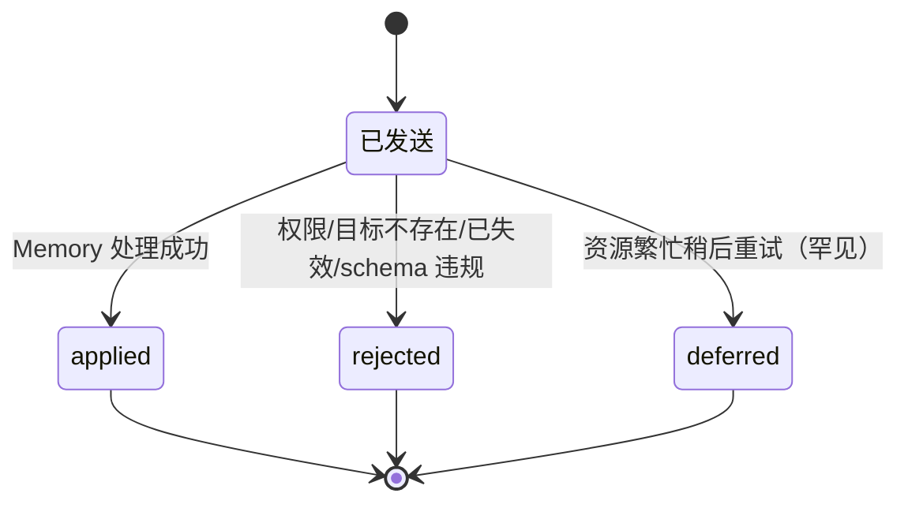
```mermaid
stateDiagram-v2
    [*] --> 已发送
    已发送 --> applied: Memory 处理成功
    已发送 --> rejected: 权限/目标不存在/已失效/schema 违规
    已发送 --> deferred: 资源繁忙稍后重试（罕见）
    applied --> [*]
    rejected --> [*]
    deferred --> [*]
```

#### 5.2.2 异步 action 状态机（`request`）

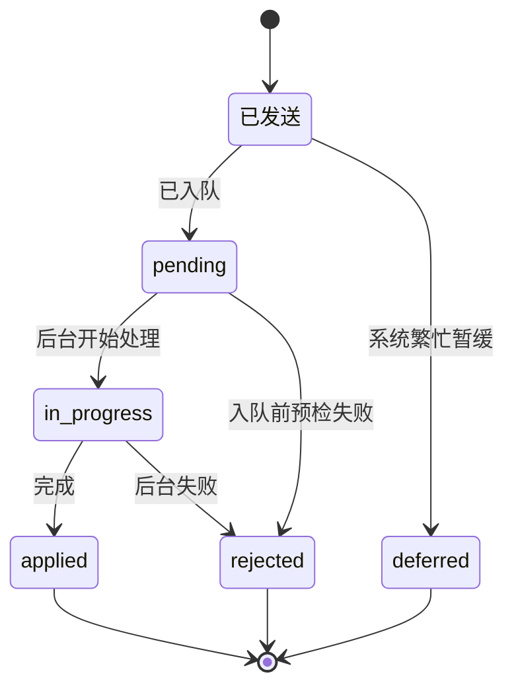
```mermaid
stateDiagram-v2
    [*] --> 已发送
    已发送 --> pending: 已入队
    pending --> in_progress: 后台开始处理
    in_progress --> applied: 完成
    in_progress --> rejected: 后台失败
    pending --> rejected: 入队前预检失败
    已发送 --> deferred: 系统繁忙暂缓
    applied --> [*]
    rejected --> [*]
    deferred --> [*]
```

#### 5.2.3 批量 action 状态机

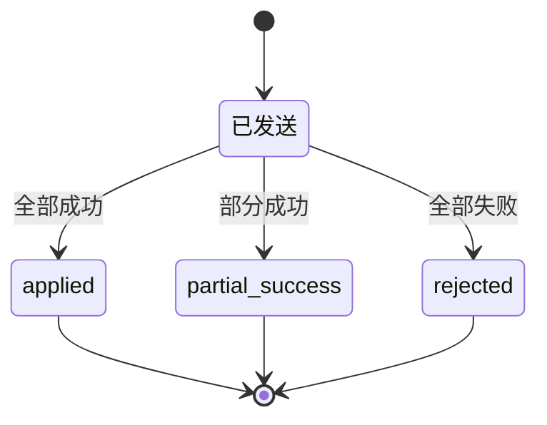
```mermaid
stateDiagram-v2
    [*] --> 已发送
    已发送 --> applied: 全部成功
    已发送 --> partial_success: 部分成功
    已发送 --> rejected: 全部失败
    applied --> [*]
    partial_success --> [*]
    rejected --> [*]
```

#### 5.2.4 `ack_status` 释义

| `ack_status` | 适用场景 | 含义 | 客户端处理 |
| --- | --- | --- | --- |
| `applied` | 同步 / 异步 / 批量 | 已完成变更 | 刷新 UI；按 `updated_resource_refs[]` 重新 pull |
| `rejected` | 同步 / 异步 / 批量 | 拒绝（无权限 / 目标不存在 / 资源已失效 / schema 违规 / 不可恢复） | 展示失败原因；不进入本地成功态 |
| `deferred` | 同步 / 异步 | 系统繁忙暂缓，客户端按 `retry_after_sec` 重发 | 显示"稍后重试"或自动 backoff |
| `pending` | 异步 | 已入队，未开始处理 | 显示"处理中"；等 push / 轮询 |
| `in_progress` | 异步 | 后台已开始处理 | 显示"处理中"；可显示进度 |
| `partial_success` | 批量 | 批量中部分成功 | 刷新成功部分；失败项提示或重试 |

**Ack envelope**：

```json
{
  "ack_id": "ack_mut_correct_001",
  "request_record_id": "rec_user_action_correct_001",
  "mutation_id": "mut_correct_001",
  "status": "applied",
  "processed_at": "2026-05-18T21:44:03Z",
  "updated_resource_refs": ["profile_fact_001"],
  "client_action": "refresh_affected_resources"
}
```

### 5.3 证据链字段流转

证据链不是单独的数据包，而是贯穿 source_record → derived_memory → mutation → ack 的引用关系。

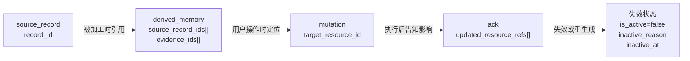
```mermaid
flowchart LR
    SR["source_record<br/>record_id"] -->|被加工时引用| DM["derived_memory<br/>source_record_ids[]<br/>evidence_ids[]"]
    DM -->|用户操作时定位| MUT["mutation<br/>target_resource_id"]
    MUT -->|执行后告知影响| ACK["ack<br/>updated_resource_refs[]"]
    ACK -->|失效或重生成| INV["失效状态<br/>is_active=false<br/>inactive_reason<br/>inactive_at"]
```

| 阶段 | 字段 | 含义 | 谁写入 |
| --- | --- | --- | --- |
| 上报 | `record_id` | 每条 raw 事实源的唯一 ID | Client |
| 上报 | `record_type` | 事实源类型 | Client |
| 上报 | `consent_snapshot_id` | 事实发生时的授权快照 | Client |
| 加工 | `source_record_ids[]` / `evidence_ids[]` | 这条加工结果引用了哪些事实源 | Memory |
| 加工 | `evidence_summary` | 给用户看的证据短解释 | Memory |
| Mutation | `target_resource_id` | 用户要操作的对象 | Client |
| Ack | `updated_resource_refs[]` | 本次 mutation 影响了哪些结果 | Memory |
| 失效 | `is_active` / `inactive_reason` / `inactive_at` | 加工结果是否还能用、为什么失效、何时失效 | Memory |

### 5.4 授权撤回反向溅透清理（v2 新增）

> **问题**：用户撤回某类授权后，记忆系统如何找出所有"依赖被撤回授权"的 derived_memory 并清理？

#### 5.4.1 触发与流程

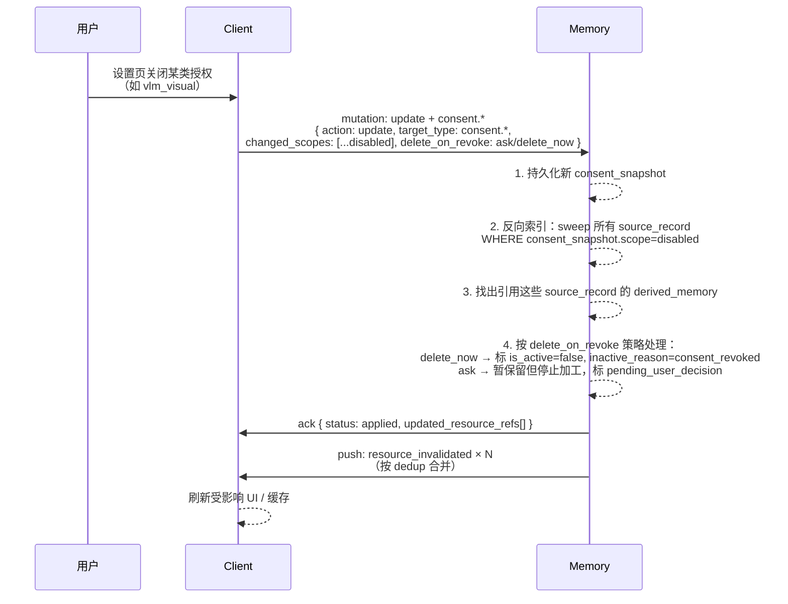
```mermaid
sequenceDiagram
    participant U as 用户
    participant C as Client
    participant M as Memory

    U->>C: 设置页关闭某类授权<br/>（如 vlm_visual）
    C->>M: mutation: update + consent.*<br/>{ action: update, target_type: consent.*,<br/>  changed_scopes: [...disabled], delete_on_revoke: ask/delete_now }
    M-->>M: 1. 持久化新 consent_snapshot
    M-->>M: 2. 反向索引：sweep 所有 source_record<br/>WHERE consent_snapshot.scope=disabled
    M-->>M: 3. 找出引用这些 source_record 的 derived_memory
    M-->>M: 4. 按 delete_on_revoke 策略处理：<br/>delete_now → 标 is_active=false, inactive_reason=consent_revoked<br/>ask → 暂保留但停止加工，标 pending_user_decision
    M->>C: ack { status: applied, updated_resource_refs[] }
    M->>C: push: resource_invalidated × N<br/>（按 dedup 合并）
    C-->>C: 刷新受影响 UI / 缓存
```

#### 5.4.2 必备机制

| 机制 | 说明 | 责任 |
| --- | --- | --- |
| **`consent_snapshot_id` 反向索引** | 每条 source_record 都有 `consent_snapshot_id`；记忆系统维护 `consent_snapshot → source_record_ids[]` 反向索引 | Memory |
| **`derived_memory.source_record_ids[]` 强制非空** | 每条 derived_memory 必须挂证据 ID；没有证据链的 derived_memory 拒绝写入 | Memory |
| **`delete_on_revoke` 用户偏好** | `delete_now` / `ask` / `keep_silent` 三档；记录在 `deletion_policy` 中 | Client → Memory |
| **失效完成时限** | `consent_revoke_cleanup_max_hours=24`，超时记录 `consent_revoke_overdue` 告警 | Memory |
| **审计日志** | 每次撤回清理生成审计记录，记录 `revoked_scope` / `affected_count` / `completed_at`，可在 Memory Center 查看 | Memory |

#### 5.4.3 边界情况

| 情况 | 处理 |
| --- | --- |
| derived_memory 同时引用了多类授权的 source_record，其中一类被撤回 | 默认整条标失效；若 derived_memory 可仅基于剩余授权重新加工，触发"重新加工"任务 |
| 用户重新开启同类授权 | 不自动恢复已失效 derived_memory；用户可在 Memory Center 手动"恢复"或"重新生成" |
| user_action mutation（如 `save + highlight`）已用户确认 | 即使依赖的 vlm_observation 因撤回失效，也保留 `is_active=true`（用户确认权重高于源失效）；但 evidence_summary 中标注"原画面证据已不可用" |

---

## 6. 业务场景接力图

> 每个场景统一三道泳道：`Game SDK` / `Client` / `Memory`，MCP 场景多一道 `MCP app`。所有接力图都对应前面 §3 / §4 / §5 的具体字段。

### 6.1 游戏启动

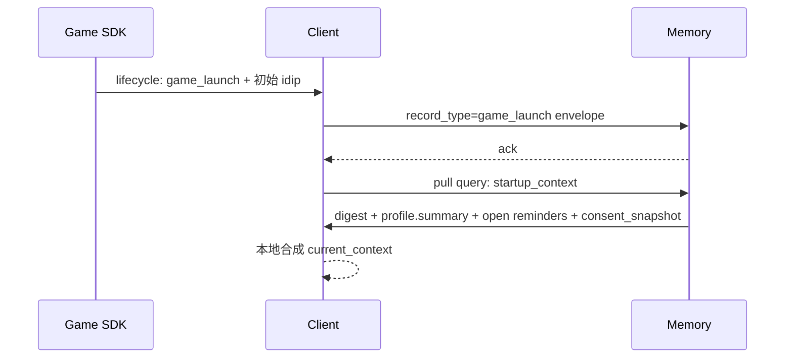
```mermaid
sequenceDiagram
    participant SDK as Game SDK
    participant C as Client
    participant M as Memory
    SDK->>C: lifecycle: game_launch + 初始 idip
    C->>M: record_type=game_launch envelope
    M-->>C: ack
    C->>M: pull query: startup_context
    M->>C: digest + profile.summary + open reminders + consent_snapshot
    C-->>C: 本地合成 current_context
```

| 步骤 | 客户端 | 记忆系统 | 数据 / 回执 | 回写 |
| --- | --- | --- | --- | --- |
| 1 | 接收 SDK `game_launch` | 存 source_record | envelope ack | 是（事实源） |
| 2 | 上报 `idip_snapshot.initial` | 存初始状态 | ack | 是 |
| 3 | pull `startup_context` | 返回 digest + profile + consent | query response | 否 |
| 4 | 本地合成 `current_context` | 不参与 | — | 否（不回写完整对象） |

### 6.2 对局中

#### 6.2.1 有 SDK 实时事件（A 类游戏）

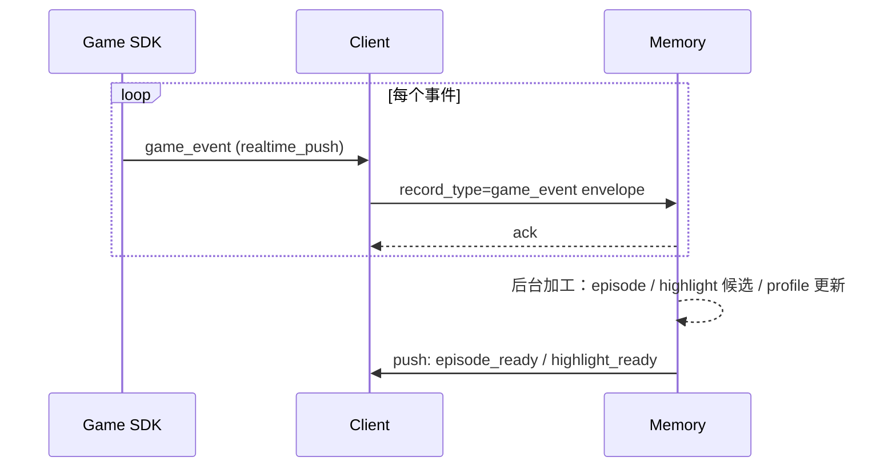
```mermaid
sequenceDiagram
    participant SDK as Game SDK
    participant C as Client
    participant M as Memory
    loop 每个事件
        SDK->>C: game_event (realtime_push)
        C->>M: record_type=game_event envelope
        M-->>C: ack
    end
    M-->>M: 后台加工：episode / highlight 候选 / profile 更新
    M->>C: push: episode_ready / highlight_ready
```

#### 6.2.2 无 SDK 实时事件（B 类游戏，靠 idip 心跳 diff）

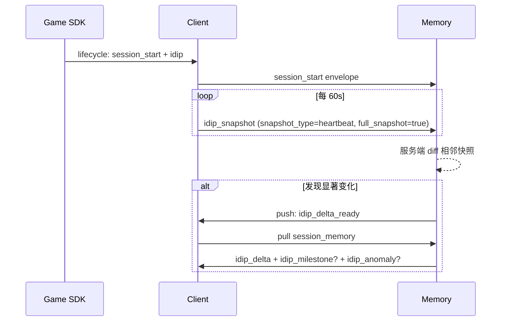
```mermaid
sequenceDiagram
    participant SDK as Game SDK
    participant C as Client
    participant M as Memory
    SDK->>C: lifecycle: session_start + idip
    C->>M: session_start envelope
    loop 每 60s
        C->>M: idip_snapshot (snapshot_type=heartbeat, full_snapshot=true)
    end
    M-->>M: 服务端 diff 相邻快照
    alt 发现显著变化
        M->>C: push: idip_delta_ready
        C->>M: pull session_memory
        M->>C: idip_delta + idip_milestone? + idip_anomaly?
    end
```

| 步骤 | 客户端 | 记忆系统 | 回写 |
| --- | --- | --- | --- |
| 1 | session_start + idip 上报 | 存初始 | 是 |
| 2 | 60s 心跳 idip_snapshot | 累积快照 | 是 |
| 3 | — | 服务端对比相邻快照，差异显著时生成 derived_memory | 否 |
| 4 | 收到 push 后 pull session_memory | 返回 delta / milestone / anomaly | 否 |

### 6.3 结算与复盘

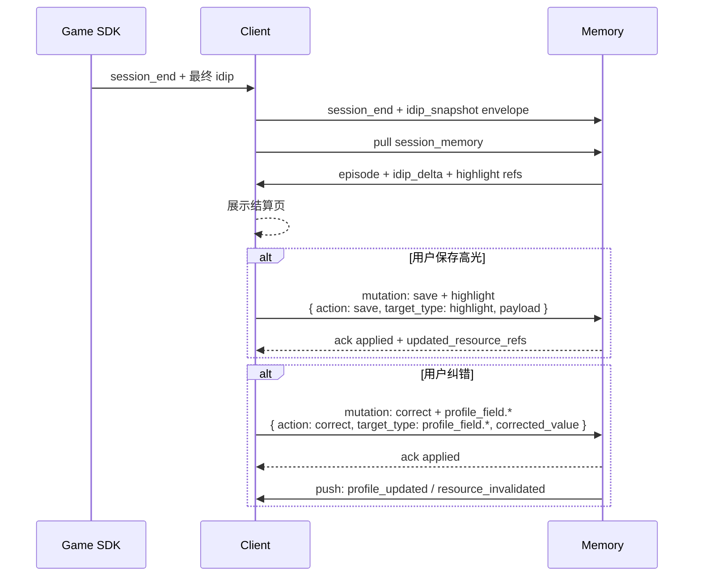
```mermaid
sequenceDiagram
    participant SDK as Game SDK
    participant C as Client
    participant M as Memory
    SDK->>C: session_end + 最终 idip
    C->>M: session_end + idip_snapshot envelope
    C->>M: pull session_memory
    M->>C: episode + idip_delta + highlight refs
    C-->>C: 展示结算页
    alt 用户保存高光
        C->>M: mutation: save + highlight<br/>{ action: save, target_type: highlight, payload }
        M-->>C: ack applied + updated_resource_refs
    end
    alt 用户纠错
        C->>M: mutation: correct + profile_field.*<br/>{ action: correct, target_type: profile_field.*, corrected_value }
        M-->>C: ack applied
        M->>C: push: profile_updated / resource_invalidated
    end
```

### 6.4 日记 / 高光生成与保存

| 步骤 | 客户端 | 记忆系统 | 数据 / 回执 |
| --- | --- | --- | --- |
| 1 | 用户进入日记页 | — | — |
| 2 | pull `episode_detail` + `highlight_detail` | 返回候选 | query response |
| 3 | 客户端本地大模型生成日记草稿（不入 Memory） | — | — |
| 4 | 用户编辑并保存 | — | — |
| 5 | mutation: `save + highlight` 或 `update + profile_field.*` | 持久化 + 加工 | ack applied |
| 6 | 若引用原话：检查 `atomic_facts.quote_eligible=true` 且 `privacy_grants.diary_quote.granted=true` | 仅当两个条件都成立才允许引用 | — |

### 6.5 用户主动纠错 / 删除 / 重新总结

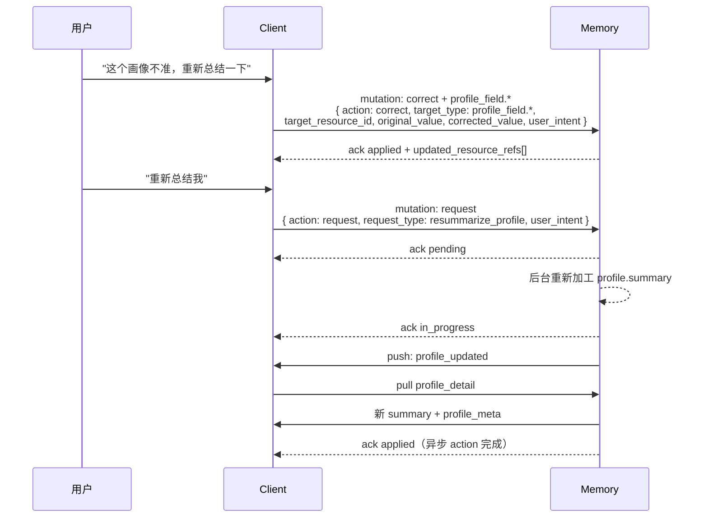
```mermaid
sequenceDiagram
    participant U as 用户
    participant C as Client
    participant M as Memory
    U->>C: "这个画像不准，重新总结一下"
    C->>M: mutation: correct + profile_field.*<br/>{ action: correct, target_type: profile_field.*,<br/>  target_resource_id, original_value, corrected_value, user_intent }
    M-->>C: ack applied + updated_resource_refs[]
    U->>C: "重新总结我"
    C->>M: mutation: request<br/>{ action: request, request_type: resummarize_profile, user_intent }
    M-->>C: ack pending
    M-->>M: 后台重新加工 profile.summary
    M-->>C: ack in_progress
    M->>C: push: profile_updated
    C->>M: pull profile_detail
    M->>C: 新 summary + profile_meta
    M-->>C: ack applied（异步 action 完成）
```

### 6.6 授权变更（含撤回反向清理）

详见 §5.4 流程图。补充表格：

| 步骤 | 客户端 | 记忆系统 | 是否对用户可见 |
| --- | --- | --- | --- |
| 1 | 用户在设置页关闭某类授权（如 VLM） | — | 是 |
| 2 | 弹窗询问 `delete_on_revoke` 偏好（若用户未设默认值） | — | 是 |
| 3 | mutation: `update + consent.*`（含 `delete_on_revoke` 偏好） | — | — |
| 4 | — | 持久化新 consent_snapshot | — |
| 5 | — | 沿反向索引找出受影响 source_record + derived_memory | 后台 |
| 6 | — | 按策略标 `is_active=false, inactive_reason=consent_revoked` 或 `pending_user_decision` | 后台 |
| 7 | 收到 ack + push: `resource_invalidated` × N | — | 否（合并后只一次提示） |
| 8 | 刷新设置页 + 受影响页面 | — | 是 |
| 9 | （可选）Memory Center 审计页显示清理记录 | 提供 audit log | 是 |

### 6.7 VLM 强 / 弱感知

#### 6.7.1 强感知（实时陪伴，不入记忆）

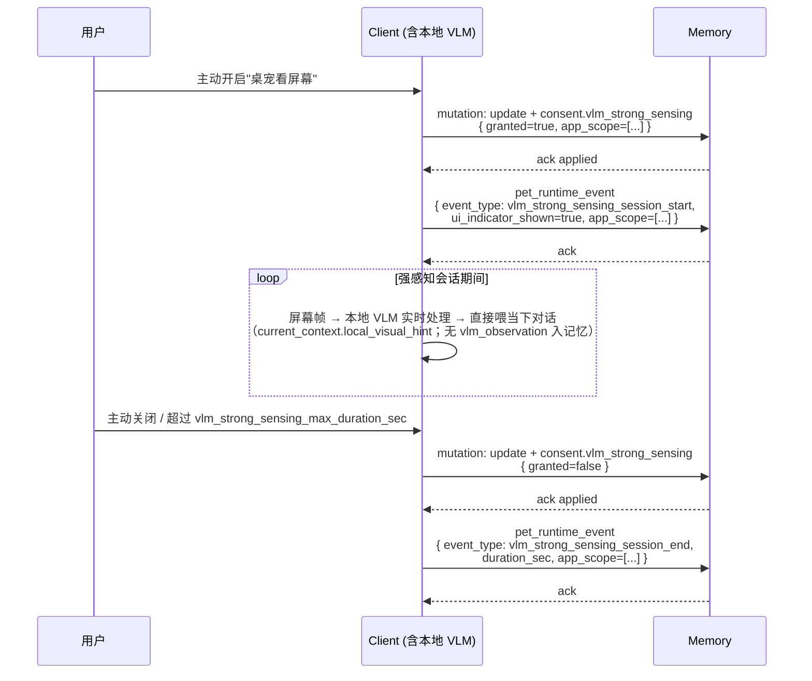
```mermaid
sequenceDiagram
    participant U as 用户
    participant C as Client (含本地 VLM)
    participant M as Memory
    U->>C: 主动开启"桌宠看屏幕"
    C->>M: mutation: update + consent.vlm_strong_sensing<br/>{ granted=true, app_scope=[...] }
    M-->>C: ack applied
    C->>M: pet_runtime_event<br/>{ event_type: vlm_strong_sensing_session_start,<br/>  ui_indicator_shown=true, app_scope=[...] }
    M-->>C: ack
    loop 强感知会话期间
        C->>C: 屏幕帧 → 本地 VLM 实时处理 → 直接喂当下对话<br/>（current_context.local_visual_hint；无 vlm_observation 入记忆）
    end
    U->>C: 主动关闭 / 超过 vlm_strong_sensing_max_duration_sec
    C->>M: mutation: update + consent.vlm_strong_sensing<br/>{ granted=false }
    M-->>C: ack applied
    C->>M: pet_runtime_event<br/>{ event_type: vlm_strong_sensing_session_end,<br/>  duration_sec, app_scope=[...] }
    M-->>C: ack
```

> 强感知期间画面语义只服务实时对话，**不**写 `vlm_observation`。跨系统只留两类事件：①`update + consent.vlm_strong_sensing` mutation；②`pet_runtime_event` 会话起止审计。

#### 6.7.2 弱感知（长期数据源，入记忆）

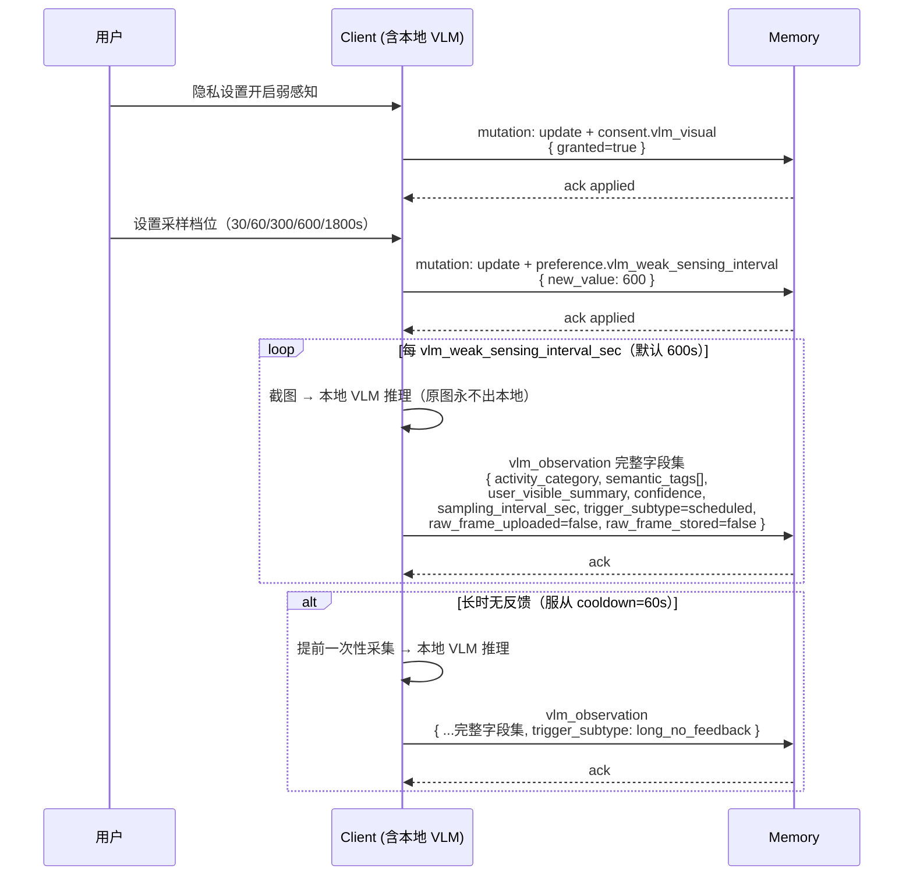
```mermaid
sequenceDiagram
    participant U as 用户
    participant C as Client (含本地 VLM)
    participant M as Memory
    U->>C: 隐私设置开启弱感知
    C->>M: mutation: update + consent.vlm_visual<br/>{ granted=true }
    M-->>C: ack applied
    U->>C: 设置采样档位（30/60/300/600/1800s）
    C->>M: mutation: update + preference.vlm_weak_sensing_interval<br/>{ new_value: 600 }
    M-->>C: ack applied
    loop 每 vlm_weak_sensing_interval_sec（默认 600s）
        C->>C: 截图 → 本地 VLM 推理（原图永不出本地）
        C->>M: vlm_observation 完整字段集<br/>{ activity_category, semantic_tags[],<br/>  user_visible_summary, confidence,<br/>  sampling_interval_sec, trigger_subtype=scheduled,<br/>  raw_frame_uploaded=false, raw_frame_stored=false }
        M-->>C: ack
    end
    alt 长时无反馈（服从 cooldown=60s）
        C->>C: 提前一次性采集 → 本地 VLM 推理
        C->>M: vlm_observation<br/>{ ...完整字段集, trigger_subtype: long_no_feedback }
        M-->>C: ack
    end
```

> 弱感知是 PC 端"画面层"的长期低频环境信号，完整字段（含 semantic_tags / user_visible_summary）入记忆作为长期数据源。原图永不出本地。

### 6.8 离线 → 网络恢复 → 批量补传

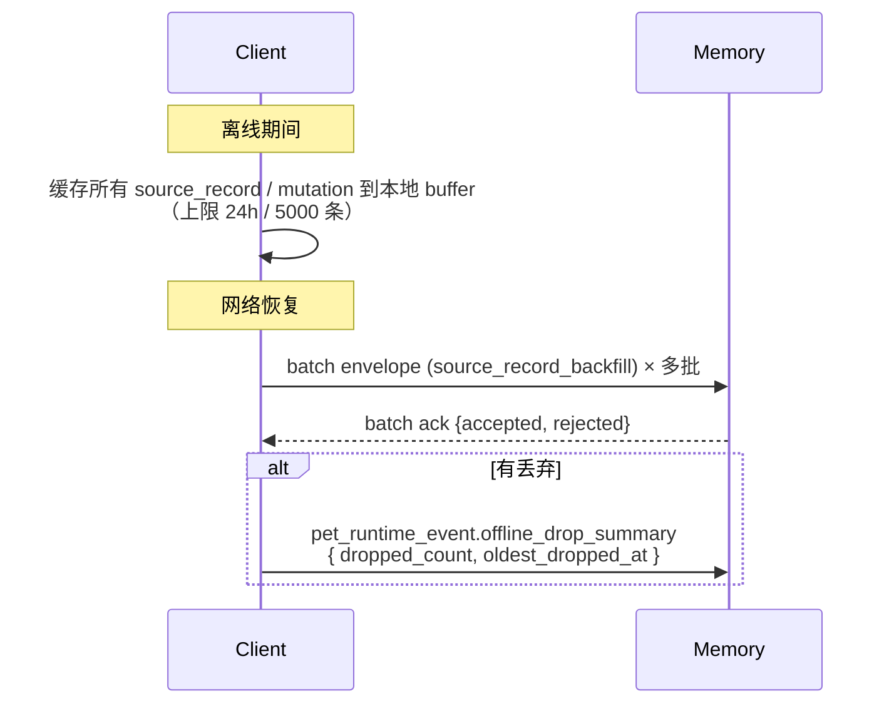
```mermaid
sequenceDiagram
    participant C as Client
    participant M as Memory
    Note over C: 离线期间
    C->>C: 缓存所有 source_record / mutation 到本地 buffer<br/>（上限 24h / 5000 条）
    Note over C: 网络恢复
    C->>M: batch envelope (source_record_backfill) × 多批
    M-->>C: batch ack {accepted, rejected}
    alt 有丢弃
        C->>M: pet_runtime_event.offline_drop_summary<br/>{ dropped_count, oldest_dropped_at }
    end
```

---

## 7. 优先级建议

| 优先级 | 数据 / 能力 | 原因 |
| --- | --- | --- |
| P0 | 统一 envelope 通用字段 | 没有统一外壳，后续数据源会散 |
| P0 | `game_id` + `game_user_id_pseudonym` | 多游戏 / 多用户隔离的最低要求 |
| P0 | 游戏通用事件 8 个（§3.1.2.1） | 所有接入游戏的最小闭环 |
| P0 | `idip_snapshot` 心跳 + 服务端 diff | 无 SDK 实时事件的游戏靠这条链路成立 |
| P0 | `chat_message` / `pet_runtime_event` 上报 | 用户主动表达 / 桌宠运行行为 |
| P0 | 用户控制 mutation（保存 / 删除 / 纠错 / 授权 / 重新总结） | 记忆系统信任底座 |
| P0 | `consent_snapshot_id` 反向索引 + 撤回清理 | 隐私合规底线 |
| P0 | Memory pull query 5 类（startup / conversation / profile / session / preferences） | 客户端按场景获取详情主路径 |
| P0 | Memory push 轻通知 + 去重 | 加工结果变化通知；不推大对象 |
| P0 | `profile_meta` / `profile.*` 核心字段 | 客户端解释 / 纠错 / 画像页基础 |
| P0 | `user_preferences` + `privacy_grants` 基础授权 | 用户控制根 |
| P0 | 证据链字段（record_id ↔ source_record_ids ↔ target_resource_id ↔ updated_resource_refs） | 闭环的连接器 |
| P1 | VLM 弱感知（完整字段集，入记忆作为长期数据源） | 画面层长期低频环境信号；行为画像 / 复盘 / 打扰判断的增强证据 |
| P2 | VLM 强感知会话审计（不入记忆，仅 mutation + pet_runtime_event） | 实时陪伴场景的隐私可审计 |
| P1 | PC 环境信号（§3.1.3 全部字段） | 打扰判断、场景理解、行为画像 |
| P1 | MCP 通道（经客户端中转） | 外部 app 元数据 / 任务标题 / 自生成摘要 |
| P1 | `episode` / `highlight_event` / `assessment` 详情消费 | 画像页 / 日记 / 复盘 / 高光 / 角色测定 |
| P1 | 离线批量补传 | 弱网容错 |
| 扩展 | 系统音频 mood / bpm 派生信号 | 听音乐跳舞场景；待 PRIVACY_BOUNDARY 修订提案通过 |

---

## 8. 隐私与排除项

| 数据 | 是否进入跨系统 | 说明 |
| --- | --- | --- |
| Game SDK 结构化事件 | 是 | 标准化后作为事实源 |
| 完整 idip snapshot（含心跳） | 是 | 启动 / 关闭 / 心跳均可完整上报；服务端做 diff |
| 用户首方聊天 | 授权后是 | `privacy_grants.chat_content=true`；可删除 / 纠错 |
| 桌宠运行事件 | 是 | 桌宠消息送达 / 用户忽略 / 主动表达 |
| 用户显式操作（mutation） | 是 | 保存 / 删除 / 确认 / 纠错 / 授权变更 / 重新总结 |
| PC 低敏环境信号（§3.1.3） | 授权后是 | 标准化事实，不写完整时间线；窗口标题必须脱敏 |
| MCP app 白名单字段（经客户端中转） | 授权后是 | 只允许元数据 / 任务标题 / app 自生成摘要 / 来源类型 |
| **VLM 强感知语义结果** | **否** | mentor 反馈翻转：仅服务实时陪伴对话，**不**写 `vlm_observation`；跨系统只留 `update + consent.vlm_strong_sensing` mutation 与 `pet_runtime_event` 会话审计事件 |
| **VLM 弱感知完整语义结果** | **授权后是** | mentor 反馈翻转：作为长期数据源；按用户配置档位（30/60/300/600/1800s）定时采集；含 `activity_category` / `semantic_tags[]` / `user_visible_summary` / `confidence`；原图永不进 |
| profile / profile_meta / highlight / assessment | 是 | Memory 加工结果返回客户端；用户可删除 / 纠错 / 反馈 |
| user_preferences / privacy_grants | 是 | 用户显式设置，Memory 持久化 |
| **`current_context` 完整对象** | **否** | 客户端运行时判断，不是长期事实 |
| **原始截图 / 屏幕帧** | **否** | 客户端本地处理后丢弃 |
| **原始音频 / 人声 / 通话内容 / 转写文本** | **否** | 不在本分支跨系统范围 |
| **键盘字符流 / 输入法明文** | **否** | 永禁；只允许桶化统计 |
| **第三方 app 正文 / 邮件 / 文档 / 会议正文** | **否** | 即使有 MCP 授权也不允许 |
| **VLM 原图 / 帧 hash 可反查原图的引用** | **否** | 强 / 弱感知均永禁；客户端本地处理后即丢弃（`raw_frame_uploaded=false`，`raw_frame_stored=false`） |
| **真实账号 / 实名信息 / 付费记录** | **否** | 永禁；只用 `game_user_id_pseudonym` |

---

## 9. 待确认问题

| # | 问题 | 建议 |
| --- | --- | --- |
| 1 | `idip_snapshot` 心跳间隔默认 60s 是否需要按游戏类型差异化？ | 先用 60s 起步，按游戏接入实测调整，最终值锁在 game 接入配置 |
| 2 | 离线 buffer 上限 24h / 5000 条是否合理？ | Engineering 压测后确认；超出按 §3.3 规则丢弃并审计上报 |
| 3 | 游戏 `custom_fields` schema review 由谁拍板？ | 建议 PM + Engineering + 游戏接入方三方 review；首批游戏接入时建模板 |
| 4 | Memory pull query SLA P99 ≤ 200ms / 详情类 ≤ 2s 是否可达？ | Engineering 服务架构选型后回填 |
| 5 | 日记 / 复盘正文（客户端本地大模型生成）是否回写 Memory？ | 默认不回写生成正文；用户保存为日记 / 高光成品时才作为 user_action 写入 |
| 6 | 弱感知 `trigger_subtype` 枚举（`scheduled` / `long_no_feedback` / `post_session` / `pre_proactive_speak`）是否需要细化分类？ | 建议先用 4 档起步，按运营数据反馈再扩 |
| 7 | `consent_revoke_overdue` 告警如何投递给用户？ | 建议 push: `consent_revoke_overdue_warning` + 设置页红点；待 Design 收口 |
| 8 | MCP app 若客户端长期离线，是否允许 MCP server 端临时缓存？ | 默认不允许；客户端是数据流唯一节点 |
| 9 | 服务端 idip diff 的"显著变化"阈值如何定义？ | 由 Memory 团队定可配置规则；建议起点：level / rank / chapter / gold > 阈值 |
| 10 | 双向字段拆名（`_observed` / `_derived` / `_inferred` / `_user_set`）是否需要在 schema 检查工具中强制？ | 建议是；Engineering 实施时加 schema lint |

---

## 10. 验收标准

| # | 标准 | 验收方式 |
| --- | --- | --- |
| 1 | **只包含跨系统数据** | 全文 grep `Client → Memory` / `Memory → Client` / `Client ↔ Memory`，无方向字段的 row 不应出现 |
| 2 | **数据对象三分类完整** | 每条数据都标 source_record / derived_memory / user_control_state 之一 |
| 3 | **双向字段全部拆名** | 全文不存在"方向同时是 Client→Memory 且 Memory→Client"的字段 |
| 4 | **envelope 统一但不大包** | 每类数据有独立 record_type，按业务时机分别上报，没有"一个大 JSON 装所有" |
| 5 | **游戏最小闭环成立** | 无 SDK 实时事件的游戏，靠 `game_launch` + 60s `idip_snapshot` 心跳 + `game_close` 能形成 episode / digest |
| 6 | **VLM 边界翻转落实** | 强感知**不**写 `vlm_observation`，仅留 `update + consent.vlm_strong_sensing` mutation 与 `pet_runtime_event` 会话审计；弱感知用**完整字段集** + 用户可调采样档位（30/60/300/600/1800s）；原图永不进 |
| 7 | **MCP 路径单一** | MCP app → 客户端 → 记忆系统；记忆系统不直连任何 MCP server |
| 8 | **current_context 边界清晰** | 客户端本地合成，不回写完整对象；本文档不出现 current_context 字段表 |
| 9 | **Push 不推大对象** | 每条 push 只有 summary + resource_refs[]；客户端按需 pull |
| 10 | **Mutation 7 action 通用化** | 全文不出现旧 13 个 `mutation_type` 作为正源；统一用 `action × target_type` 表达；§3.2.3 v2 → v2.1 映射表保留作为兼容参考 |
| 11 | **`confirm` vs `update` 区分** | `confirm` schema **禁止**带 `new_value`（违反即 `rejected: invalid_payload`）；`update` schema **必带** `new_value`；schema lint 强制校验 |
| 12 | **Ack 状态机按 action 分化** | 同步 action（save/update/delete/restore/correct/confirm/feedback）用 `applied / rejected / deferred`；异步 action（request）用 `pending / in_progress / applied / rejected / deferred`；批量用 `applied / partial_success / rejected` |
| 13 | **证据链可串通** | 任选一条 derived_memory，能反查到 source_record；任选一条 mutation 能找到 target_resource_id 与 updated_resource_refs |
| 14 | **授权撤回有反向清理机制** | 撤回任一 `privacy_grants.*` 后，§5.4 流程完成，受影响 derived_memory 在 24h 内标失效 |
| 15 | **运营参数有默认推荐值** | §2.4 全部参数都有起点值与单位，标"Engineering 可调优" |
| 16 | **场景接力图覆盖核心流程** | §6 八个场景的 Mermaid 图与表格能让读者一眼看完闭环；所有 mutation 写法已对齐新 `action × target_type` |

---

> **变更说明（v2.1）**：本版本相对 v2 做了围绕 mentor 反馈与审查员清单的**精准修订**，主要变化：
>
> **v2.1 新增（mentor 反馈 + 审查员清单）**：
> 1. **VLM 角色翻转**（mentor 反馈）：强感知 = 实时陪伴**不入记忆**；弱感知 = 用户可调档位（30/60/300/600/1800s）定时采集**入记忆作为长期数据源**。重写 §3.1.5 + §6.7。
> 2. **触发时机重新设计**：原 9 个混杂术语收敛为 5 个 `trigger_cause`（`event_driven` / `threshold_crossed` / `scheduled` / `user_action` / `external_push`）+ 4 个 `delivery_mode`（`realtime` / `aggregated` / `batched_recovery` / `batched_startup`）。详见 §2.3。
> 3. **Mutation 通用化**：13 个枚举式 `mutation_type` → 7 个通用 `action`（`save` / `update` / `delete` / `restore` / `correct` / `confirm` / `request` / `feedback`）× N 个 `target_type`；新增 `restore`、`confirm` action。详见 §3.2。
> 4. **Ack 状态机分化**：同步 / 异步 / 批量三类各自的可达状态分别定义。详见 §5.2。
> 5. **§4.1.3 详细化**：15 个加工记忆资源族每族一张完整字段表，含字段名 / 含义 / 数据类型 / 示例值 / 触发返回的 query_type / 优先级。
> 6. **§3.1.3 所有 PC 信号子表补"含义"列**，便于读者快速理解字段语义。
> 7. **§3.1.1 chat / pet_runtime_event payload 字段表新增**（§3.1.1.2 / §3.1.1.3），不再只给 enum 概述。
> 8. **§3.1.2.5 `common_fields` 字段表新增**，承载跨游戏共有的会话 / 关卡 / 难度 / 区服等结构化字段。
> 9. **§3.1.2.2 IDIP 心跳澄清**：心跳并非 B 类游戏专享；**所有游戏适用**——A 类兜底 120s，B 类主通道 60s。
> 10. **§3.1.3.5 PC 信号示例**按 4 个典型子类（active_app / input_digest / now_playing / tab + OSA Bridge）各给一个示例。
> 11. **§3.1.4 MCP MVP 接入清单**扩展到 5 个领域：工作 / 购物 / 娱乐 / 音乐 / 社交。
> 12. **§2.4 运营参数全部补单位**（秒 / 分钟 / 小时 / 毫秒 / 条），并新增弱感知 / MCP 拉取相关参数。
>
> **v2 → v1 既有变化（保留）**：
> 1. 骨架从"传输契约 + 数据类别 + 场景"三层并列改为"按数据流向（上报 / 返回 / mutation）单线索"。
> 2. 删除 v1 §4.8 `current_context` 字段表（纯本地对象不在本文档范围）。
> 3. v1 §4.x 13 个业务类别表合并入 §3.1（事实源）/ §4.1（加工记忆）/ §4.2（控制状态），同一数据只讲一次。
> 4. 新增 §1.2 客户端数据来源全貌图、§2.4 运营参数推荐值表、§5.4 授权撤回反向清理机制、§6 八个场景接力图。
> 5. 双向字段全部拆名（`emotion_signal_observed` / `_derived`，`playstyle_tags_user_set` / `_inferred` 等）。
> 6. 游戏数据明确"通用事件清单 + 自定义事件 + IDIP 心跳 + 服务端 diff"四件套。
> 7. MCP 路径明确"经客户端中转"。
> 8. PC 环境信号（v1 §4.2 + §4.3 + 多个 v2.5 通道）合并为 §3.1.3 一节，按子表分类。
