# 数据流通需求说明书：记忆系统 ↔ 客户端

---

## 目录

- [§0 文档定位](http://localhost:7799/projects/desktop-pet/01-pm/branches/memory-dataset/DATA_FLOW_REQUIREMENT_SPECIFICATION.md#0-%E6%96%87%E6%A1%A3%E5%AE%9A%E4%BD%8D)
- [§1 系统分工与数据原则](http://localhost:7799/projects/desktop-pet/01-pm/branches/memory-dataset/DATA_FLOW_REQUIREMENT_SPECIFICATION.md#1-%E7%B3%BB%E7%BB%9F%E5%88%86%E5%B7%A5%E4%B8%8E%E6%95%B0%E6%8D%AE%E5%8E%9F%E5%88%99)
- [§2 统一传输契约](#2-%E7%BB%9F%E4%B8%80%E4%BC%A0%E8%BE%93%E5%A5%91%E7%BA%A6)
- [§3 Client → Memory 上报](#3-client--memory-%E4%B8%8A%E6%8A%A5)
- [§4 Memory → Client 返回](#4-memory--client-%E8%BF%94%E5%9B%9E)
- [§5 业务场景接力图](#5-%E4%B8%9A%E5%8A%A1%E5%9C%BA%E6%99%AF%E6%8E%A5%E5%8A%9B%E5%9B%BE)
- [§6 优先级建议](#6-%E4%BC%98%E5%85%88%E7%BA%A7%E5%BB%BA%E8%AE%AE)
- [§7 隐私与排除项](#7-%E9%9A%90%E7%A7%81%E4%B8%8E%E6%8E%92%E9%99%A4%E9%A1%B9)
- [§8 待确认问题](#8-%E5%BE%85%E7%A1%AE%E8%AE%A4%E9%97%AE%E9%A2%98)
- [§9 验收标准](#9-%E9%AA%8C%E6%94%B6%E6%A0%87%E5%87%86)

---

## 0. 文档定位

### 0.1 本文档解决什么

| 维度 | 本文档回答 |
| --- | --- |
| **数据范围** | 哪些数据会在客户端和记忆系统之间流动；纯本地或不入记忆的数据不写。 |
| **数据方向** | 每条数据是 Client→Memory、Memory→Client，还是双向 mutation。 |
| **触发时机** | 每条数据在什么业务场景、什么时刻被传输（实时事件 / 生命周期 / 心跳 / 用户触发 / 后台 push / 批量补传）。 |
| **传输方式** | 用哪种契约管道（上报 envelope / pull query / 轻量 push / mutation）。 |
| **闭环验证** | 一条事实源如何被加工、被消费、被反馈、被失效，形成可追溯的证据链与状态机。 |

### 0.2 排除项

| 数据 / 对象 | 原因 |
| --- | --- |
| `current_context`（客户端临时决策包） | 100% 客户端本地合成，不回写完整对象；它的"输入材料"分别在 §3 / §4 已覆盖。 |
| VLM 原始帧 / 屏幕截图 | 客户端本地处理后即丢弃，永不进入跨系统传输。 |
| 原始系统音频 / 麦克风音频 / 通话内容 | 不属本分支；音频只送派生信号入记忆，原始流不跨系统。 |
| 键盘字符流 / 输入法明文 / 第三方 app 正文 | 永禁；只允许桶化统计或语义事件。 |
| 客户端本地未上报的 chat draft、未提交的设置 | 未发送前不属跨系统数据。 |
| Game SDK 私有协议细节 | 由"Game SDK → 客户端"段承担，本文档只关心"客户端 → 记忆系统"那一跳。 |

---

## 1. 系统分工与数据原则

### 1.1 角色与责任

| 角色 | 数据舱角色 | 主要职责 | **不**做 |
| --- | --- | --- | --- |
| **记忆系统**（Memory System） | 数据舱 | <ul><li>接收客户端上报的事实源；</li><li>持久化用户控制状态；</li><li>后台加工生成 `derived_memory`；</li><li>响应客户端 pull；</li><li>变化时 push 轻通知；</li><li>执行 mutation 并返回 ack；</li><li>维护证据链与失效状态机。</li></ul> | <ul><li>不直接采集游戏 SDK / 屏幕 / 音频 / MCP；</li><li>不决定桌宠当下是否说话；</li><li>不绕过授权写入。</li></ul> |
| **客户端**（Pet Client） | 数据采集与消费端 | <ul><li>采集并标准化游戏 SDK / PC 环境 / 用户输入 / VLM 语义；</li><li>按业务场景上报事实源；</li><li>按场景 pull 加工记忆；</li><li>本地合成 `current_context`；</li><li>接收用户保存 / 删除 / 纠错 / 授权变更并回写为 mutation。</li></ul> | <ul><li>不长期保存完整记忆；</li><li>不把临时判断伪装成长期事实；</li><li>不上传原图 / 原始音频 / 键盘字符流。</li></ul> |
| **Game SDK** | 数据生产者 | 向客户端推送游戏生命周期、状态快照、实时事件、自定义字段。 | 不直接绕过客户端写入记忆系统。 |
| **授权 MCP app** | 数据生产者 | 在用户授权后向**客户端**提供白名单字段（任务标题 / 元数据 / app 自生成摘要）。 | 不直接连记忆系统（详见 §3.1.4）；不暴露正文 / 附件。 |

### 1.2 客户端的数据来源全貌

客户端实际有 5 类数据来源，但**只有 2 类涉及跨系统流通**：

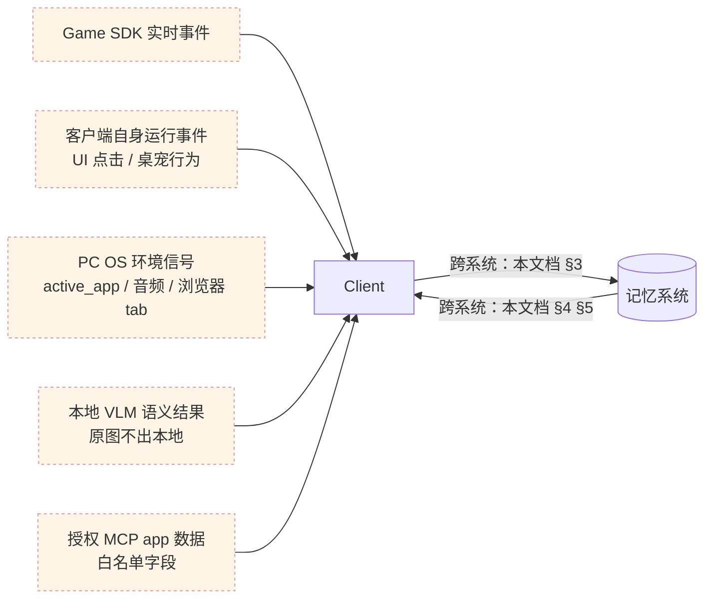

- 5 类来源 → 客户端的过程是"采集"，由客户端本地负责，**不在本文档范围**。
- 客户端 ↔ 记忆系统的过程是本文档要严格契约化的部分。
- 客户端最终交付给桌宠的"当下决策包"`current_context` 由：①记忆系统返回的画像 / 摘要 / 偏好（来自 §4） + ②客户端 5 类本地来源 合成 —— 合成结果**不回写**，只把支撑它的 raw `source_record` 按需上报。

### 1.3 数据对象三分类

所有跨系统数据按"是什么"分三类。每条数据在表格里都标注分类，便于判断"谁能写谁、能否被加工覆盖"。

| 分类 | 含义 | 谁写入 | 能否被自动覆盖 | 例子 |
| --- | --- | --- | --- | --- |
| **`source_record`**（事实源记录） | 客户端采集到的 raw 事实，原样上报给记忆系统。 | Client → Memory | 不会被自动覆盖；只能被失效（`is_active=false`）。 | `chat_message` / `game_event` / `pc_signal` / `vlm_observation` / `mcp_observation` |
| **`derived_memory`**（加工记忆） | 记忆系统基于多条 `source_record` 后台加工出的可消费记忆。 | Memory → Client | 会被记忆系统重新加工而刷新；用户通过 `update` action（带 `is_correction=true`）可锁定。 | `atomic_facts` / `episode` / `profile.*` / `highlight_event` / `assessment` / `idip_delta` |
| **`user_control_state`**（用户控制状态） | 用户显式设置的授权 / 偏好 / 删除策略 / 称呼等；记忆系统持久化，客户端读取并严格执行。 | Client → Memory（mutation） | 永不被自动覆盖；只有用户 mutation 才能改。 | `privacy_grants.*` / `display_name` / `disturbance_boundaries` / `do_not_remember_rules[]` / `deletion_policy` |

> **规则**：一条字段只能属于一类。如果一个业务概念既需要"客户端推导"又需要"记忆系统加工"，**拆成两个字段**（详见 §1.4 D3）。

### 1.4 数据流原则

| # | 原则 | 含义 |
| --- | --- | --- |
| 1 | **先事实，再加工** | <ul><li>`source_record` 必须先写入，`derived_memory` 才能被派生；</li><li>客户端不能直接上报"加工结论"。</li></ul> |
| 2 | **加工结果可解释** | 每条 `derived_memory` 必须带 `source_record_ids[]` 或 `evidence_ids[]`，让客户端可以反查证据。 |
| 3 | **用户控制最高优先级** | <ul><li>`user_control_state` 不会被任何加工覆盖；</li><li>用户 mutation 永远优先于 AI 推断。</li></ul> |
| 4 | **双向字段必拆名** | 同一业务概念若客户端和记忆系统都要写，拆成两个字段（如 `emotion_signal_observed` / `emotion_signal_derived`，`playstyle_tags_user_set` / `playstyle_tags_inferred`），避免方向歧义。 |
| 5 | **授权快照贯穿全链** | <ul><li>每条 `source_record` 必带当时的 `consent_snapshot_id`；</li><li>用户撤回授权时，记忆系统沿这条链反向清理受影响的 `derived_memory`，24 小时内全部标 `is_active=false, inactive_reason=consent_revoked`（详见 §7 隐私表与 §5.6 授权变更场景）。</li></ul> |
| 6 | **本地合成不回写完整对象** | 客户端的 `current_context` 是临时决策包，只回写支撑它的 raw `source_record` 或用户明确确认的 mutation，永不回写整个 context。 |
| 7 | **证据链贯穿** | 任何 `derived_memory` 都能反查源头：`record_id`（事实源 ID）→ `source_record_ids[]` / `evidence_ids[]`（被引用的事实源）→ `target_resource_id`（用户操作的对象）→ `updated_resource_refs[]`（ack 返回的影响范围）。具体字段定义散落在 §2.2 / §3.2 / §3.2.5 / §4.1.3.13。 |

### 1.5 总体数据流

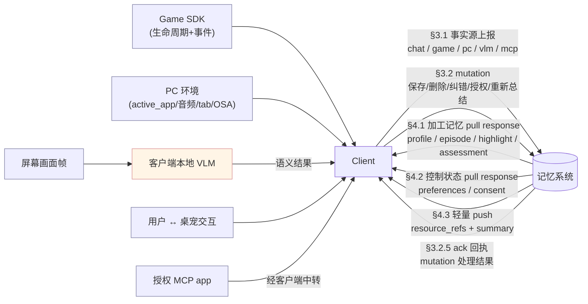

---

## 2. 统一传输契约

### 2.1 四种管道

> 跨系统流通统一用 4 种管道，每条数据只走其中一种主管道：

| 管道 | 方向 | 适合数据 | 同步特征 |
| --- | --- | --- | --- |
| **上报 Envelope** | Client → Memory | `source_record`（含 mutation 也复用同一外壳） | <ul><li>一条 envelope 一个 `record_id`；</li><li>可单发、可批量补传。</li></ul> |
| **Pull Query / Response** | Client → Memory → Client | 客户端主动取加工记忆或控制状态 | <ul><li>客户端按业务场景发起，Memory 返回详情；</li></ul> |
| **轻量 Push** | Memory → Client | 加工结果变化通知 | <ul><li>只带 `resource_refs[]` 和短摘要；</li><li>不推大对象；</li><li>客户端按需 pull。</li></ul> |
| **Mutation / Ack** | Client → Memory（mutation） + Memory → Client（ack） | 用户操作改变记忆系统状态 | 必有 `ack_status`，失败可重试或提示。 |

### 2.2 上报 Envelope 通用字段

> 所有 source_record 和 mutation 都用同一envelope，客户端按业务时机分别上报。

| 字段 | 含义 | 格式 | 必填 | 优先级 | 说明 |
| --- | --- | --- | --- | --- | --- |
| `envelope_version` | 协议版本 | string | 是 | P0 | 协议升级用 |
| `record_id` | 事实源唯一 ID | string | 是 | P0 | 客户端生成；本地去重 |
| `record_type` | 事实源类型 | enum | 是 | P0 | 见 §3.1 各子节 |
| `game_id` | 游戏标识 | string | 是 | P0 | 不同游戏数据隔离 |
| `game_user_id_pseudonym` | 用户在**单个游戏**下的脱敏 ID（hash） | string | 是 | P0 | **每个游戏独立 pseudonym**（隐私优先），同一用户在不同游戏间不可关联；不存真实账号 |
| `game_sub_account_id` | 用户在同一游戏内的**子账号 ID**（小号 / 大号 / 测试号区分） | string | 否 | P1 | 用户在同游戏切换不同账号时上报；空表示主账号或游戏无多账号机制；同一 `game_user_id_pseudonym` 下不同 `game_sub_account_id` 的画像默认**互不合并** |
| `occurred_at` | 事件实际发生时间 | ISO 8601 | 是 | P0 | 排序、时间线、衰减 |
| `sent_at` | 客户端发送时间 | ISO 8601 | 是 | P0 | 排查延迟、离线补传 |
| `consent_snapshot_id` | 当时授权快照 ID | string | 是 | P0 | 反向清理用（§5.6 业务场景 + §7.1 数据约束） |
| `payload_schema_version` | payload schema 版本 | string | 是 | P0 | 兼容字段升级 |
| `trigger_cause` | 触发因（详见 §2.3.1） | enum | 是 | P0 | `scheduled` / `event_driven`（**2 选 1**） |
| `delivery_mode` | 传输模式（详见 §2.3.1） | enum | 是 | P0 | 默认 `realtime`；其余：`aggregated` / `batched_recovery` / `batched_startup` |
| `payload` | 业务内容 | object | 是 | P0 | 按 `record_type` 各自定义 |

**通用 envelope 示例**：

```json
{
  "envelope_version": "1.0",
  "record_id": "rec_<type>_<uuid>",
  "record_type": "<game_event | chat_message | pet_runtime_event | pc_signal | vlm_observation | mcp_observation | idip_snapshot | user_action>",
  "game_id": "game_abc",
  "game_user_id_pseudonym": "u_hash_123",
  "game_sub_account_id": null,
  "occurred_at": "2026-05-18T21:10:00Z",
  "sent_at": "2026-05-18T21:10:01Z",
  "consent_snapshot_id": "consent_20260518_001",
  "payload_schema_version": "<type>.v1",
  "payload": { "...": "见各 record_type 定义" }
}
```

#### 2.2.1 `record_type` 枚举清单

> `record_type` 决定 envelope 的 payload schema 长什么样、由谁加工、走哪条业务管道。

| `record_type` | 含义 | 数据对象 | 典型 trigger_cause | 详细定义 | 优先级 |
| --- | --- | --- | --- | --- | --- |
| `chat_message` | 用户与桌宠的单条对话消息（文本，含 STT 转写） | source_record | `event_driven` | §3.1.1.2 | P0 |
| `pet_runtime_event` | 桌宠运行时事件（消息送达 / 用户忽略 / 主动表达 / 强感知会话审计 / 离线丢弃汇总 等） | source_record | `event_driven` | §3.1.1.3 + §3.1.1.4（event_type 枚举） | P0 |
| `game_event` | 游戏内事件（含 8 通用事件 + 游戏自定义事件，如 boss_defeated） | source_record | `event_driven` | §3.1.2.1 / §3.1.2.3 | P0 |
| `idip_snapshot` | 游戏状态完整快照（生命周期边界 + 周期心跳） | source_record | 心跳=`scheduled`；生命周期边界=`event_driven` | §3.1.2.2 | P0 |
| `pc_signal` | PC 环境信号（active_app / 输入派生 / 音频 / now_playing / 浏览器 tab / OSA Bridge） | source_record | 状态变化=`event_driven`；心跳/digest=`scheduled` | §3.1.3 | P1 |
| `vlm_observation` | 弱感知 VLM 语义观察结果（**强感知不入记忆**） | source_record | `scheduled` | §3.1.5.2 | P1 |
| `mcp_observation` | 授权 MCP app 经客户端中转的白名单字段 | source_record | 客户端定时拉=`scheduled`；MCP 主动推=`event_driven` | §3.1.4 | P1 |
| `diary_reply` | 用户对桌宠日记的回信（关联 diary_id，带 reply_intent） | source_record | `event_driven` | §3.1.6 | P1 |
| `user_action` | 用户主动触发的 mutation（save / update / delete / request / feedback） | 跨系统 mutation 载体（不是单纯 source_record） | `event_driven` | §3.2 | P0 |

> **判别规则**：客户端发任何一条 envelope，必须先确定 `record_type`，再按对应子节填充 payload。`record_type` 与 `payload_schema_version` 配对使用（如 `record_type=chat_message` ⇒ `payload_schema_version=chat_message.v1`）。

### 2.3 触发因与传输模式术语表

#### 2.3.1 `trigger_cause`（触发因，2 选 1）

| `trigger_cause` | 含义 | 典型场景 | 默认 SLA |
| --- | --- | --- | --- |
| `scheduled` | **按固定或可配频率周期采集**，无论值是否变化 | idip 心跳 60s / pc_signal 心跳 30s / digest 聚合 10min / 弱感知 VLM 用户配置频率 | 按配置间隔（见 §2.4） |
| `event_driven` | **事件触发**（其他一切：离散事件 / 状态变化 / 用户操作 / 外部推入） | 用户发消息 / 游戏 SDK 推事件 / active_app 切换 / 用户保存日记 / MCP 主动通知 | 触发后 ≤ 2 秒；用户 mutation ≤ 1 秒（必有 ack）；MCP 外部推入 ≤ 2 秒 |

**判别决策**：

```
这条数据是定时器触发发出的吗？
  ├── 是 → scheduled
  └── 否 → event_driven
```

#### 2.3.2 `delivery_mode`（传输模式，默认 `realtime`）

| `delivery_mode` | 含义 |
| --- | --- |
| `realtime`（默认） | 触发即发，单发 envelope |
| `aggregated` | 不上报每个原始动作，而是在一个窗口内收集 N 条信号，算出一个二阶统计结果，把这个结果作为一条 envelope 上报。例如 mouse_region_heatmap_top3统计的是几轮鼠标移动的事件。 |
| `batched_recovery` | 离线 / 网络恢复后批量把积压的数据传输，保证及时数据延迟也能到达。 |
| `batched_startup` | 客户端冷启动一次性批量同步，把本地性缓存批量同步 |

#### 2.3.3 SLA -> 服务等级约定

> 客户端从"事件发生"到"成功发出 envelope"应该在多久内完成

| 场景 | 默认 SLA | 批量是否允许 |
| --- | --- | --- |
| `trigger_cause=event_driven`（例如chat_message、pc_signal变换） | chat触发后 ≤ 2 秒 | 离线时通过 `batched_recovery` 批量 |
| `trigger_cause=event_driven` + `record_type=user_action`（mutation） | 用户操作后 ≤ 1 秒，必有 ack（确认是否用户的操作顺利执行） | 否（mutation 单条发） |
| `trigger_cause=event_driven` + `record_type=mcp_observation`（外部推入） | 外部推入后 ≤ 2 秒 | 否 |
| `trigger_cause=scheduled`（心跳 / 周期采集） | 按配置间隔（见 §2.4） | `delivery_mode=aggregated` 内允许合并 |
| `delivery_mode=batched_recovery` | 网络恢复后 ≤ 30 秒内启动 | 是 |
| `delivery_mode=batched_startup` | 客户端 ready 后 ≤ 10 秒 | 是 |

### 2.4 参数参考值

| 参数 | 参考值 | 单位 | 备注 |
| --- | --- | --- | --- |
| `idip_heartbeat_interval_sec` | **60** | 秒 | 有 SDK 实时事件的游戏兜底 120s，无 SDK 实时事件的游戏主通道 60s |
| `pc_signal_heartbeat_sec` | **30** | 秒 | active_app / idle_signal / is_fullscreen_game 三字段最低频率 |
| `idle_signal_thresholds_sec` | **[60, 300, 1800]** | 秒 | active / idle_1min / idle_5min / idle_30min+ 跨档触发 |
| `digest_aggregation_window_min` | **10** | 分钟 | 输入派生 / mouse / tab digest 的聚合窗口 |
| `push_dedup_window_sec` | **30** | 秒 | 同 `resource_ref` 在窗口内只 push 一次 |
| `offline_buffer_max_hours` | **24** | 小时 | 超出丢弃并记录 `offline_dropped_count` |
| `offline_buffer_max_records` | **5000** | 条 | 防止低端机内存爆炸 |
| `mutation_ack_timeout_sec` | **5** | 秒 | 同步 mutation 超时阈值，超时客户端进入"处理中" |
| `mutation_async_max_wait_min` | **30** | 分钟 | 异步 mutation（request_*）最长等待时间，超时记录 `mutation_async_overdue` 告警 |
| `pull_query_p99_ms` | **200** | 毫秒 | 实时 query（startup_context / conversation_context） |
| `pull_query_batch_p99_ms` | **2000** | 毫秒 | 详情类（diary_detail / episode_detail / assessment_result） |
| `vlm_weak_sensing_interval_sec` | **600** | 秒 | 默认 10 分钟一次；普通用户档位 300 / 600 / 1800 / off；高级设置页另开放 30 / 60 |
| `vlm_weak_sensing_cooldown_sec` | **60** | 秒 | 弱感知两次本地推理之间最小间隔（防同档过密） |
| `mcp_pull_interval_sec` | **300** | 秒 | 客户端主动从 MCP app 拉取的最小间隔（每 app 独立） |
| `consent_revoke_cleanup_max_hours` | **24** | 小时 | 撤回授权后受影响 `derived_memory` 失效完成时限 |

---

## 3. Client → Memory 上报

### 3.0 章节预览

客户端 → 记忆系统的数据流分三类：**实时上报原始事实**、**回写用户操作**、**离线补传**。

| 子节 | 内容 | 主语 | 优先级 |
| --- | --- | --- | --- |
| §3.1 | **客户端上报：原始事实**（`source_record`） | 客户端实时发起 | P0 |
| §3.2 | **客户端上报：用户操作**（`mutation`） | 用户触发 | P0 |
| §3.3 | **客户端补传：离线积压的数据** | 网络恢复 / 启动后发起 | P1 |

### 3.1 客户端上报：原始事实（source_record）

#### 3.1.1 聊天与桌宠运行事件

| `record_type` | 含义 | 触发时机 | 关键 payload 字段 | 优先级 |
| --- | --- | --- | --- | --- |
| `chat_message` | 用户与桌宠之间的单条对话消息（含语音转文本后的干净文本） | `event_driven`（用户发送 / 桌宠输出每条消息后立即触发） | `conversation_id` / `speaker`（user/pet）/ `message_type`（text/voice_transcribed）/ `content` / `client_scene` | P0 |
| `pet_runtime_event` | 桌宠运行时的**行为 / 状态元事件**（**不**承载对话文本内容 —— 文本走 §3.1.1.2 chat_message）。含：①对话元事件（消息送达 / 用户忽略 / 桌宠主动开口 / 抑制主动表达）；②强感知会话审计（开 / 关 / 时长）；③授权变更审计；④系统离线 / MCP 错误 / 网络恢复等 | `event_driven`（桌宠产生主动行为 / 用户对桌宠消息做出反馈 / 强感知会话起止 / 系统状态变化） | `event_type` / `client_scene` / `related_record_ids[]` / `message_template_id` / `user_interruption_level` | P0 |

> **来源边界**：`chat_message.content` 一律视为"干净文本"，不带 input_modality（键盘 / STT 都不区分）。voice-interaction 分支输出的 STT 文本进入这里时也一样。

**示例**：

```json
{
  "record_type": "chat_message",
  "payload_schema_version": "chat_message.v1",
  "payload": {
    "conversation_id": "conv_001",
    "speaker": "user",
    "message_type": "text",
    "content": "刚才那把翻盘了！",
    "client_scene": "post_game_chat"
  }
}
```

##### 3.1.1.2 `chat_message` payload 字段表

| 字段 | 含义 | 数据类型 | 必填 | 示例值 | 优先级 |
| --- | --- | --- | --- | --- | --- |
| `conversation_id` | 当前会话主键（用于把多条消息绑成一段对话） | string | 是 | "conv_2026051821001" | P0 |
| `speaker` | 发言方枚举 | enum (`user` / `pet`) | 是 | "user" | P0 |
| `message_type` | 消息形态 | enum (`text` / `voice_transcribed`) | 是 | "text" | P0 |
| `content` | 干净文本（无 markdown / 无格式 / 不区分输入通道） | string | 是 | "刚才那把翻盘了！" | P0 |
| `client_scene` | 客户端业务场景（枚举完整清单见 §3.1.1.5） | enum | 是 | "post_game_chat" | P0 |
| `game_session_id` | 关联的游戏对局 ID。当 `client_scene ∈ {pre_game_chat, during_game_chat, post_game_chat, settings_chat}` 等与对局相关的场景时填写；让 Memory 能把"这条 chat"与"哪一局游戏事件"关联 | string \| null | 否 | "sess_2026051820001" | P1 |
| `message_sequence` | 会话内序号。同一 `conversation_id` 内单调递增（0 为会话首条）。用于离线 / 弱网情况下的乱序重排 | integer | 否 | 5 | P1 |

##### 3.1.1.3 `pet_runtime_event` payload 字段表

> `pet_runtime_event` 记录的是桌宠运行时的**行为 / 状态元事件**，**不**承载对话**文本内容**。对话**文本**走 §3.1.1.2 `chat_message`；本 record_type 只承载**和对话相关的元事件**（如"桌宠那条消息送达了"/"用户超时未响应"/"桌宠想说但因打扰边界抑制了"）+ **非对话的系统类事件**（强感知会话审计 / 授权变更 / 离线丢弃 / MCP 错误 等）。
>
> 类比：chat_message 是"对话框里的气泡内容"；pet_runtime_event 是"气泡的送达状态 / 用户读没读 / 系统状态变化" —— 类似 IM 应用里"已读 / 已撤回 / 网络断开" 这类信号事件。

| 字段 | 含义 | 数据类型 | 必填 | 示例值 | 优先级 |
| --- | --- | --- | --- | --- | --- |
| `event_type` | 运行事件类型（完整枚举见 §3.1.1.4） | enum | 是 | "proactive_speak" | P0 |
| `client_scene` | 触发该事件的客户端业务场景（枚举完整清单见 §3.1.1.5） | enum | 是 | "long_no_feedback" | P0 |
| `related_record_ids[]` | 与本事件相关的 source_record / mutation 引用 | array | 否 | ["rec_pc_signal_001"] | P1 |
| `message_template_id` | 若为桌宠主动表达，对应消息模板 ID | string | 否 | "tmpl_encourage_002" | P1 |
| `user_interruption_level` | 该事件对用户的打扰级别（`low` / `mid` / `high`） | enum | 否 | "low" | P1 |
| `extra` | 业务自定义扩展（强感知会话审计的 duration_sec / app_scope 等放这里） | object | 否 | { "duration_sec": 1200 } | P1 |

##### 3.1.1.4 `pet_runtime_event.event_type` 枚举清单

> `pet_runtime_event.event_type` 是 payload 内的字段，标识桌宠运行时的具体事件子类型。

**类别 A：桌宠消息交付与用户反馈**

| 值 | 含义 | 典型 client_scene | 优先级 |
| --- | --- | --- | --- |
| `message_delivered` | 桌宠输出的消息已送达用户（UI 渲染完成） | 全部聊天场景 | P0 |
| `message_ignored` | 桌宠输出消息超过 N 秒用户未响应 | `idle_chat` / `post_game_chat` 等 | P0 |
| `message_dismissed` | 用户主动关闭桌宠消息卡片 | 同上 | P1 |
| `proactive_speak` | 桌宠主动开口（兜底通用） | `proactive_speak` / `proactive_comfort` / `proactive_congratulate` / `proactive_reminder` / `proactive_share_observation` | P0 |
| `proactive_speak_skipped` | 桌宠想说但因打扰边界 / 用户偏好抑制了主动表达 | `long_no_feedback` | P1 |

**类别 B：VLM 强感知会话审计**

| 值 | 含义 | 典型 client_scene | 优先级 |
| --- | --- | --- | --- |
| `vlm_strong_sensing_session_start` | 用户开启屏幕共享，强感知会话开始 | `user_initiated_screen_share` | P0 |
| `vlm_strong_sensing_session_end` | 用户关闭屏幕共享，强感知会话结束（extra.duration_sec 必填） | `user_initiated_screen_share` | P0 |

**类别 C：授权与隐私审计**

| 值 | 含义 | 典型 client_scene | 优先级 |
| --- | --- | --- | --- |
| `consent_change_audit` | 用户授权变更后客户端落地审计事件（与 mutation `update + consent.*` 配套，用于跨端审计） | `consent_change` | P0 |

**类别 D：系统与离线**

| 值 | 含义 | 典型 client_scene | 优先级 |
| --- | --- | --- | --- |
| `offline_drop_summary` | 离线缓存超出 24h / 5000 条上限丢弃事件汇总（extra.dropped_count / extra.oldest_dropped_at） | `offline_drop` | P0 |
| `mcp_pull_error` | MCP app 拉取失败 / 鉴权失效（extra.mcp_app_id / extra.error_code） | `mcp_event` | P1 |
| `network_recovered` | 客户端网络从离线恢复，准备启动 batched_recovery 补传 | `offline_drop` | P1 |

##### 3.1.1.5 `client_scene` 枚举清单

**类别 A：用户主动聊天场景**（`chat_message` 用，speaker=user 或 pet 回应）

| 值 | 含义 | 触发时机 | 关联章节 | 优先级 |
| --- | --- | --- | --- | --- |
| `idle_chat` | 用户空闲时主动找桌宠聊天 | 用户点击桌宠 / 桌面双击发起 | §5 通用 | P0 |
| `pre_game_chat` | 游戏启动后开局前的对话 | `game_launch` 之后、`session_start` 之前 | §5.1 | P0 |
| `during_game_chat` | 对局中实时聊天（不打断游戏的轻量对话） | `session_start` 与 `session_end` 之间 | §5.2 | P0 |
| `post_game_chat` | 结算后聊天 | `session_end` 之后 | §5.3 | P0 |
| `diary_chat` | 日记页对话 | 用户进入日记页 | §5.4 | P1 |
| `memory_review` | 个人画像页对话 | 用户进入个人画像页 | §5.5 | P1 |
| `settings_chat` | 设置页对话（如询问关系定位、授权说明） | 用户在设置页与桌宠对话 | §5.6 | P1 |
| `screen_share_chat` | 强感知（屏幕共享）期间的对话 | 用户已开 `consent.vlm_strong_sensing` 且在与桌宠对话 | §3.1.5.1 | P1 |

**类别 B：桌宠主动表达场景**（`chat_message` 用，speaker=pet）

| 值 | 含义 | 触发时机 | 关联章节 | 优先级 |
| --- | --- | --- | --- | --- |
| `proactive_speak` | 桌宠主动开口（通用，未细分） | 各种主动表达兜底 | §5 通用 | P0 |
| `proactive_comfort` | 连败 / 卡关时主动安慰 | `idip_anomaly` 触发 / `fail` 事件多次 | §5.2 / §5.3 | P1 |
| `proactive_congratulate` | 里程碑达成主动祝贺 | `idip_milestone` push | §5.3 | P1 |
| `proactive_reminder` | 任务 / 待办主动提醒（来自 MCP） | `mcp_summary_ready` push | §3.1.4 MCP 通道 | P1 |
| `proactive_share_observation` | 弱感知发现"用户在干什么"后主动评论 | `vlm_observation` 弱感知触发 | §5.7.2 | P1 |

**类别 C：运行事件场景**（`pet_runtime_event` 用，不出现在 `chat_message`）

| 值 | 含义 | 触发时机 | 关联章节 | 优先级 |
| --- | --- | --- | --- | --- |
| `long_no_feedback` | 用户长时无反馈触发弱感知或主动判断 | 用户超 5min 无操作 | §5.7.2 | P1 |
| `user_initiated_screen_share` | 用户开 / 关强感知屏幕共享 | `update + consent.vlm_strong_sensing` | §5.7.1 | P1 |
| `consent_change` | 授权变更（开 / 关某类授权） | `update + consent.*` | §5.6 | P0 |
| `offline_drop` | 离线缓存满 / 超时丢弃事件 | offline_buffer 超限 | §3.3 | P1 |
| `mcp_event` | MCP app 主动通知客户端 | MCP 主动推入（`record_type=mcp_observation` + `trigger_cause=event_driven`） | §3.1.4 MCP 通道 | P1 |

***pet_runtime_event的envelope示例***

```json
{
    "envelope_version": "1.0",
    "record_id": "rec_pet_runtime_001",
    "record_type": "pet_runtime_event",
    "game_id": "wangzhe",
    "game_user_id_pseudonym": "u_hash_123",
    "game_sub_account_id": null,
    "occurred_at": "2026-05-19T22:31:00Z",
    "sent_at": "2026-05-19T22:31:01Z",
    "consent_snapshot_id": "consent_001",
    "trigger_cause": "event_driven",
    "delivery_mode": "realtime",
    "payload_schema_version": "pet_runtime_event.v1",
    "payload": {
      "event_type": "vlm_strong_sensing_session_end",
      "client_scene": "user_initiated_screen_share",
      "related_record_ids": ["rec_pet_runtime_vlm_start_001"],
      "user_interruption_level": "low",
      "extra": {
        "duration_sec": 1200,
        "app_scope": ["lol_client"],
        "ui_indicator_shown": true
      }
    }
  }
```

#### 3.1.2 游戏数据

> **核心**：所有游戏数据 envelope 必带 6 个键 —— `game_id` / `game_user_id_pseudonym` / `occurred_at` / `event_type` / `common_fields` / `custom_fields`。前两个在 envelope 通用字段里已带，后四个在 payload 里。

##### 3.1.2.1 通用事件清单

| `event_type` | 性质 | 触发因（trigger_cause） | 必含 `common_fields` | 优先级 |
| --- | --- | --- | --- | --- |
| `game_launch` | 生命周期 | `event_driven`（游戏进程拉起 / 桌宠绑定游戏） | `client_version` / `game_version` / `launch_id` / `initial_idip_snapshot` | P0 |
| `game_close` | 生命周期 | `event_driven`（游戏退出 / 用户终止） | `launch_id` / `session_ids[]` / `close_reason` / `final_idip_snapshot` | P0 |
| `session_start` | 生命周期 | `event_driven`（一局 / 一段游戏开始） | `session_id` / `session_type` / `map_id`?/ `team_size`? / `idip_snapshot` | P0 |
| `session_end` | 生命周期 | `event_driven`（一局 / 一段游戏结束） | `session_id` / `session_type` / `session_result`（win/lose/draw/quit）/ `duration_sec` / `idip_snapshot` | P0 |
| `settlement` | 生命周期 | `event_driven`（结算页打开） | `session_id` / `score`? / `rewards`? | P0 |
| `objective_progress` | 实时事件 | `event_driven`（目标进度变化） | `session_id` / `objective_id` / `progress_value` | P0 |
| `success` | 实时事件 | `event_driven`（通用成功事件：通关 / 杀敌 / 任务完成等业务集合） | `session_id` / `success_category` | P0 |
| `fail` | 实时事件 | `event_driven`（通用失败事件：死亡 / 卡关 / 任务失败等） | `session_id` / `fail_category` | P0 |

##### 3.1.2.2 IDIP 心跳与服务端 diff（所有游戏适用）

- **有SDK 实时事件的游戏**：心跳是**兜底**通道，**120 秒**一次。作用是 SDK 偶发丢事件 / 客户端短暂掉线时记忆系统仍能拿到完整状态、避免"看不见"状态变化。A 类游戏的状态变更主路径是 `game_event (realtime_push)`。
- **无 SDK 实时事件的游戏**：心跳是**主**通道， **60 秒**一次。客户端必须按时上报完整 `idip_snapshot`，记忆系统服务端做相邻快照 diff 生成 `idip_delta` 推回。**客户端不做本地 diff**，避免双端状态不一致。

**统一规则**：客户端永远只上报"快照本身"，diff 计算永远在记忆系统服务端。

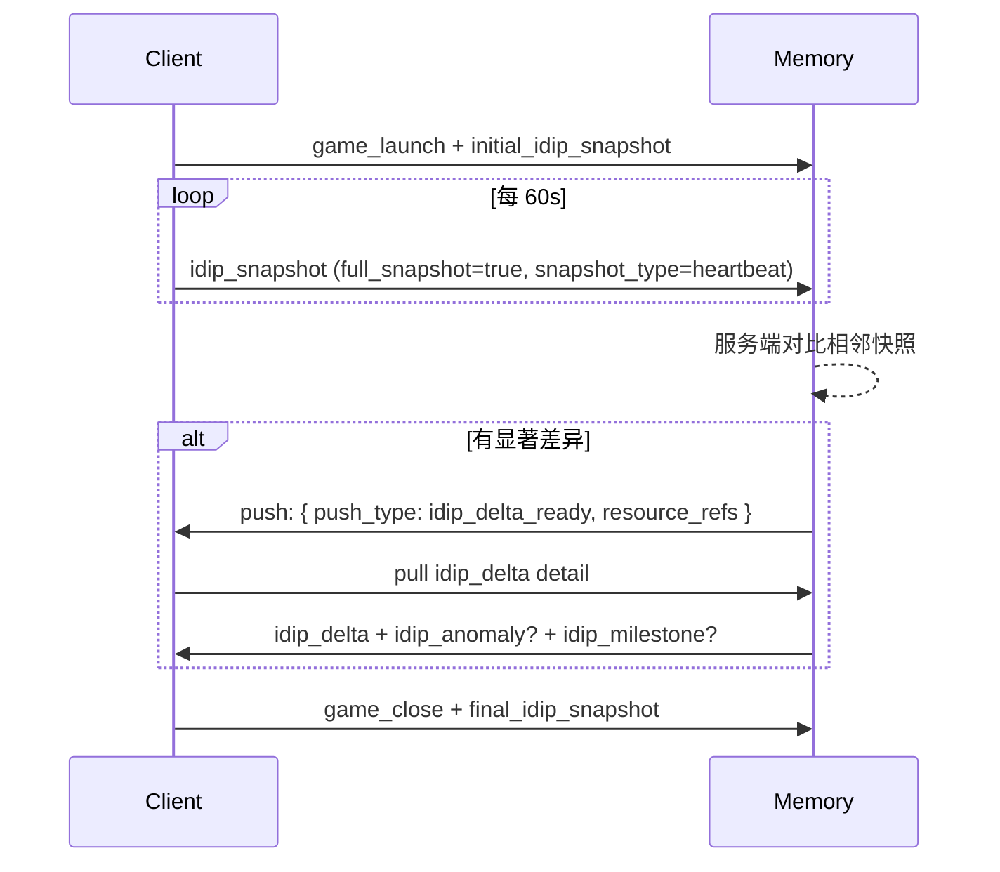

**心跳 envelope**：

```json
{
  "record_type": "idip_snapshot",
  "payload_schema_version": "idip_snapshot.v1",
  "payload": {
    "snapshot_type": "heartbeat",
    "full_snapshot": true,
    "heartbeat_interval_sec": 60,
    "session_id": "sess_001",
    "fields": {
      "level": 36, "rank": "gold",
      "current_mode": "ranked_match",
      "current_chapter": "chapter_02",
      "gold": 1280
    }
  }
}
```

##### 3.1.2.3 游戏自定义事件

游戏有 SDK 的，可在通用事件之外追加自定义 `event_type`（envelope 字段 `trigger_cause=event_driven`），通过 `custom_fields` 携带该游戏专属字段。`custom_fields` 禁止承载真实账号、付费记录、实名信息。

> **三层字段归属**：① `common_fields` 第一层（**所有游戏共通**，见 §3.1.2.4） + ② `common_fields` 第二层（**按 game_category 适用**，见 §3.1.2.5） + ③ `custom_fields`（该**单个游戏**专属）。

**示例（PvP 对战类游戏 game_category=pvp_battle）**：

```json
{
  "record_type": "game_event",
  "payload_schema_version": "game_event.v1",
  "payload": {
    "event_type": "boss_defeated",
    "session_id": "sess_001",
    "common_fields": {
      "game_category": "pvp_battle",
      "game_mode": "ranked_match",
      "client_locale": "zh-CN",
      "game_version": "2.7.1",
      "match_id": "match_789",
      "match_result": "win",
      "team_size": 5,
      "map_id": "summoner_rift"
    },
    "custom_fields": {
      "boss_id": "boss_dragon",
      "duration_sec": 420,
      "remaining_hp_percent": 12
    }
  }
}
```

##### 3.1.2.4 `common_fields` 第一层：跨所有游戏通用字段

> 这一层字段**任何 game_category 都适用**，必填字段所有接入游戏都必须提供。`game_category` 字段是游戏接入时固定的（同一游戏只有一个值），用来决定第二层（§3.1.2.5）适用哪套字段。

| 字段 | 含义 | 数据类型 | 必填 | 示例值 | 优先级 |
| --- | --- | --- | --- | --- | --- |
| `session_id` | 一局 / 一段游戏的会话 ID | string | 是 | "sess_2026051821001" | P0 |
| `game_category` | **游戏类别**（决定第二层字段适用范围，详见 §3.1.2.5）。enum：`pvp_battle` / `pve_quest` / `pve_roguelike` / `open_world` / `card_strategy` / `simulation` / `other` | enum | 是 | "pvp_battle" | **P0** |
| `game_mode` | 运行时游戏模式（同一游戏不同模式可变，如 ranked / casual / story / coop / ...） | string | 否 | "ranked_match" | P0 |
| `client_locale` | 客户端语言区域 | string (BCP47) | 是 | "zh-CN" | P1 |
| `game_version` | 游戏版本号 | string | 是 | "2.7.1" | P1 |

> **`game_category` vs `game_mode` 的边界**：category 在游戏**接入时固定**，整个生命周期不变；mode 是**运行时**用户选择的玩法模式，可在同一游戏内切换。一个 `pvp_battle` 游戏可能有 `ranked / casual / arena` 多种 mode；一个 `pve_quest` 游戏可能有 `story / coop / hard_mode` 多种 mode。

##### 3.1.2.5 `common_fields` 第二层：按 `game_category` 适用的字段

> 每个 game_category 给出**典型的、跨同类游戏可比较**的字段。游戏接入方按 category 选用适用字段，**不适用的字段不填**；该游戏**独有**的字段走 §3.1.2.3 `custom_fields`。每个游戏接入时由 PM + Engineering + 游戏接入方三方 review schema。

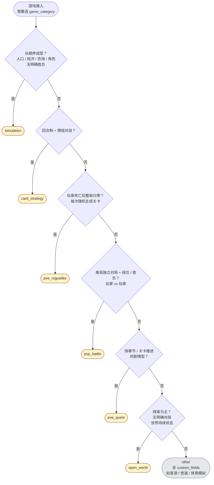

###### A. `pvp_battle` PvP 对战类（MOBA / FPS / 格斗 / 即时战略）

> **核心特征**：玩家 vs 玩家，每局独立 `match_id`，段位 / 排名是核心成长。**典型游戏**：王者荣耀 / LoL / DOTA2 / CS:GO / Valorant / Apex / 街霸。 
> ​**桌宠陪伴重点**：赛后复盘、连败安慰、上分庆祝。

| 字段 | 含义 | 数据类型 | 必填 | 示例值 | 优先级 |
| --- | --- | --- | --- | --- | --- |
| `match_id` | 对局 / 比赛 ID | string | 是（对该类必填） | "match_789" | P0 |
| `match_result` | 对局结果 | enum (`win` / `lose` / `draw` / `quit`) | 否 | "win" | P0 |
| `mmr` | 匹配分 | number | 否 | 2350 | P1 |
| `rank_tier` | 段位（铂金 / 钻石 / 王者 等，游戏自定义枚举） | string | 否 | "diamond_3" | P1 |
| `team_size` | 当前队伍人数 | integer | 否 | 5 | P1 |
| `opponent_count` | 对方人数 | integer | 否 | 5 | P1 |
| `map_id` | 地图 ID | string | 否 | "summoner_rift" | P1 |
| `kda` | 击杀 / 死亡 / 助攻三元组 | object `{k, d, a}` | 否 | `{k:8, d:3, a:12}` | P1 |

###### B. `pve_quest` PvE 剧情 / 任务类（RPG / 解谜 / 单机闯关）

> **核心特征**：按章节 / 关卡推进，有明确进度感和叙事；死亡重来仍在原关卡。 
> ​**典型游戏**：仙剑奇侠传 / 巫师 3 / FF7 Remake / 战神 / 空洞骑士 / 传送门。 
> ​**桌宠陪伴重点**：剧情共鸣、卡点安慰、通关庆祝（"卡在BOSS关"是最常引用的场景）。

| 字段 | 含义 | 数据类型 | 必填 | 示例值 | 优先级 |
| --- | --- | --- | --- | --- | --- |
| `level_id` | 关卡 / 章节 ID | string | 是（对该类必填） | "chapter_02" | P0 |
| `chapter_id` | 大章节 ID（与 level 分两级） | string | 否 | "act_03" | P1 |
| `difficulty` | 难度档位 | enum / string | 否 | "hard" | P0 |
| `objective_id` | 当前目标 / 任务 ID | string | 否 | "obj_kill_dragon" | P1 |
| `chapter_progress` | 章节进度百分比（0-100） | number | 否 | 65 | P1 |
| `retry_count` | 本关重试次数 | integer | 否 | 3 | P1 |
| `save_slot_id` | 存档槽位（多周目用） | string | 否 | "slot_2" | P1 |

###### C. `pve_roguelike` PvE 肉鸽 / 无尽类（rogue / 塔防 / 无尽闯关）

> **核心特征**：每次开局重新开始（`run_id` 归零），构筑 / 流派每局变；与 `pve_quest` 的关键区别是"死亡整局归零、关卡随机生成"。 
> ​**典型游戏**：杀戮尖塔 / 哈迪斯 / 以撒 / 吸血鬼幸存者 / 元气骑士 / 植物大战僵尸。 
> ​**桌宠陪伴重点**：构筑讨论、run 内死亡安慰、突破最高楼层庆祝。

| 字段 | 含义 | 数据类型 | 必填 | 示例值 | 优先级 |
| --- | --- | --- | --- | --- | --- |
| `run_id` | 本次跑团 / 跑塔的唯一 ID（死后归零） | string | 是（对该类必填） | "run_2026051901" | P0 |
| `floor_id` / `wave_id` | 当前楼层 / 波次 | string / integer | 否 | "floor_15" / 23 | P0 |
| `character_build` | 当前构筑 / 流派 | string | 否 | "fire_mage" | P1 |
| `death_count` | 本 run 死亡次数 | integer | 否 | 2 | P1 |
| `difficulty` | 本 run 难度 | enum / string | 否 | "ascension_5" | P1 |

###### D. `open_world` 开放世界 / 沙盒探险类

> **核心特征**：没有明确"对局"或"关卡"，世界是持续状态；同存档可玩几百小时；任务可并行 / 自由选择。 
> ​**典型游戏**：原神 / 塞尔达旷野之息 / 艾尔登法环 / GTA 5 / Minecraft / Terraria。 
> ​**桌宠陪伴重点**：探索发现分享、任务推荐、长 session 健康提醒。

| 字段 | 含义 | 数据类型 | 必填 | 示例值 | 优先级 |
| --- | --- | --- | --- | --- | --- |
| `region_id` | 当前地图区域 ID | string | 是（对该类必填） | "mondstadt" | P0 |
| `current_quest_id` | 当前主线 / 支线任务 ID | string | 否 | "quest_main_007" | P1 |
| `world_progress` | 世界探索完成度（0-100）或里程碑标识 | number / string | 否 | 78 | P1 |
| `playtime_in_session_min` | 本 session 已游玩分钟数 | integer | 否 | 45 | P1 |

###### E. `card_strategy` 卡牌 / 策略类

> **核心特征**：基于回合制对战，牌组构筑是核心元玩法；与 `pvp_battle` 的区别是"决策 / 构筑主导"而非"操作主导"，回合制让单一动作复盘成为可能。 
> ​**典型游戏**：炉石传说 / 万智牌 Arena / 影之诗 / 云顶之弈 / 多多自走棋。 
> ​**桌宠陪伴重点**：牌组调整建议、卡关分析（"输给快攻太多了"）。

| 字段 | 含义 | 数据类型 | 必填 | 示例值 | 优先级 |
| --- | --- | --- | --- | --- | --- |
| `match_id` | 对局 ID | string | 是（对该类必填） | "match_card_001" | P0 |
| `deck_id` | 使用的牌组 ID | string | 否 | "deck_aggro_red" | P0 |
| `opponent_archetype` | 对手套路 / 流派 | string | 否 | "control_blue" | P1 |
| `turn_count` | 本局回合数 | integer | 否 | 14 | P1 |
| `match_result` | 对局结果 | enum (`win` / `lose` / `draw` / `concede`) | 否 | "win" | P0 |

###### F. `simulation` 模拟经营 / 养成类

> **核心特征**：长期培养一个对象（城市 / 角色 / 农场），时间感强（"游戏内第 N 天"）；没有明确胜负，累计成就是核心；与 `open_world` 的区别是"建设型"vs"探索型"。 
> ​**典型游戏**：模拟城市 / 城市天际线 / 双点医院 / 动物森友会 / 星露谷物语 / 放置奇兵 / 文明 6。 
> ​**桌宠陪伴重点**：阶段性成就庆祝（"今天人口破千了"）、经营建议、看用户养成进度。

| 字段 | 含义 | 数据类型 | 必填 | 示例值 | 优先级 |
| --- | --- | --- | --- | --- | --- |
| `in_game_day` | 游戏内第几天 | integer | 是（对该类必填） | 47 | P0 |
| `economy_score` | 经济 / 资源综合分 | number | 否 | 8500 | P1 |
| `population` | 当前人口 / 经营单位数 | integer | 否 | 230 | P1 |
| `building_count` | 已建造建筑数 | integer | 否 | 42 | P1 |

###### G. `other` 其他 / 未来扩展（如 racing / music_rhythm / puzzle / social_sandbox）

> 当前 未覆盖的游戏类别。接入时全部字段走 §3.1.2.3 `custom_fields`；如同类游戏接入超过 2 个，建议升级为独立 category 并补 schema。

---

#### 3.1.3 PC 环境信号

##### 3.1.3.1 active_app 与 idle 信号

| 字段 | 含义 | 数据对象 | 触发时机（trigger_cause + delivery_mode） | 优先级 |
| --- | --- | --- | --- | --- |
| `active_app.name` | 前台 app 显示名 | source_record | `event_driven` + `scheduled (30s)` | P0 |
| `active_app.bundle_id` | 前台 app 标识符（macOS bundle id / Windows AUMID） | source_record | `event_driven` + `scheduled (30s)` | P0 |
| `active_app.is_fullscreen` | 前台 app 是否全屏 | source_record | `event_driven` | P0 |
| `idle_signal` | 用户闲置状态枚举（active / idle_1min / idle_5min / idle_30min+） | source_record | `event_driven`（跨档触发） | P0 |
| `is_fullscreen_game` | 是否前台游戏窗口处于全屏（用于打扰判断） | source_record | `event_driven` | P0 |
| `app_switch_burst` | 短窗口高频切 app 的二阶统计（60s 内切 ≥5 次） | source_record | `event_driven` + `aggregated` | P1 |
| `recent_apps_top3` | 近 digest 窗口内使用频次 top3 app | source_record | `scheduled (digest 10min)` + `aggregated` | P1 |

##### 3.1.3.2 输入与 UI 派生

| 字段 | 含义 | 数据对象 | 触发时机（trigger_cause + delivery_mode） | 优先级 |
| --- | --- | --- | --- | --- |
| `window_title_redacted` | 脱敏后的窗口标题（去除文件名 / 路径 / 用户名 / URL） | source_record | `event_driven` | P0 |
| `input_intensity_level` | 输入强度桶化等级（low / mid / high） | source_record | `event_driven` | P0 |
| `ime_state` | 输入法状态（zh / en / off） | source_record | `event_driven` | P1 |
| `typing_rhythm_signal` | 打字节奏（steady / bursty / pause_heavy） | source_record | `scheduled (digest 10min)` + `aggregated` | P1 |
| `text_edit_action_burst` | 短窗口内编辑动作高频统计（60s ≥10 次） | source_record | `event_driven` + `aggregated` | P1 |
| `undo_redo_rate_per_min` | 撤销 / 重做频率 | source_record | `scheduled (digest 10min)` + `aggregated` | P1 |
| `mouse_region_heatmap_top3` | digest 窗口内鼠标活跃区域 top3 | source_record | `scheduled (digest 10min)` + `aggregated` | P1 |
| `scroll_intensity_signal` | 滚动强度等级 | source_record | `event_driven` | P1 |
| `ui_semantic_tags[]` | 授权窗口检测到的 UI 元素（如 error_dialog） | source_record | `event_driven`（语义事件触发） | P1 |
| `focused_element_role` | 焦点控件类型（input / button / list 等） | source_record | `event_driven` | P1 |
| `semantic_events[]` | OS 级白名单语义事件（save / undo / paste / app_switch） | source_record | `event_driven` | P1 |

##### 3.1.3.3 音频派生与 Now Playing

| 字段 | 含义 | 数据对象 | 触发时机（trigger_cause + delivery_mode） | 优先级 |
| --- | --- | --- | --- | --- |
| `audio_mood_tag` | 系统音频派生的情绪标签（节拍 / 能量 / 调式聚合） —— 仅在 `privacy_grants.system_audio_music_context.granted=true` | source_record | `scheduled (digest)` + `aggregated`； <br>mood 跨档时 `event_driven` | P1 |
| `audio_bpm_signal` | 系统音频派生的 BPM 信号 | source_record | `scheduled (digest)` + `aggregated` | P1 |
| `now_playing.app` | 当前播放音乐 / 视频的来源 app（macOS MediaRemote / Windows SMTC） | source_record | `event_driven`（曲目切换） | P1 |
| `now_playing.track_title` | 当前播放标题 | source_record | `event_driven` | P1 |
| `now_playing.artist` | 当前播放艺术家 / 频道 | source_record | `event_driven` | P1 |
| `now_playing.platform_category` | 来源平台归类（music / podcast / video） | source_record | `event_driven` | P1 |

##### 3.1.3.4 浏览器 tab 与 OS Scripting Bridge

- **浏览器 tab ：os层面会被沙箱阻断），若不开启共享屏幕权限，靠浏览器扩展**
- ***OS Scripting Bridge：一些app没有mcp或者没有专门获取状态的api，但是暴露了 OSA / COM 接口让其他 app 可以查它们的状态.***

> [!NOTE] OS OS Scripting Bridge与MCP的区别在于前者遵循macOS OSA / Windows COM的协议，只开放少量原数据，后者遵循MCP协议，开放的是app的白名单数据（eg.飞书）

| 字段 | 含义 | 数据对象 | 触发时机（trigger_cause + delivery_mode） | 优先级 |
| --- | --- | --- | --- | --- |
| `active_tab_signal.category` | 当前浏览器活动 tab 的归类（video / social / dev / news / shopping / other 6 类，**不读 URL / 不读正文**） | source_record | `event_driven`（浏览器扩展上报 tab 切换） | P1 |
| `recent_tab_categories_top3` | digest 窗口内 tab 类别 top3 | source_record | `scheduled (digest 10min)` + `aggregated` | P1 |
| `osa_bridge.app_id` | OSA / COM 桥接到的桌面 app 标识（Spotify / Music / VLC / IINA / Notes / Bear / Office 等用户授权范围内） | source_record | `event_driven` | P1 |
| `osa_bridge.app_metadata_summary` | OSA / COM 拉取的元数据摘要（不含正文） | source_record | `event_driven` 或 `scheduled (digest)` + `aggregated` | P1 |
| `osa_bridge.ui_indicator_shown_per_app` | 是否对用户显示采集状态指示（每 app 维度） | source_record | `event_driven` | P1 |

##### 3.1.3.5 PC 信号示例（4 类典型场景）

**示例 1：active_app 切换（event_driven）**

```json
{
  "record_type": "pc_signal",
  "payload_schema_version": "pc_signal.v1",
  "payload": {
    "signal_kind": "active_app_change",
    "trigger_cause": "event_driven",
    "delivery_mode": "realtime",
    "active_app": {
      "name": "Steam",
      "bundle_id": "com.valvesoftware.steam",
      "is_fullscreen": false
    },
    "idle_signal": "active",
    "ime_state": "zh",
    "window_title_redacted": "Steam - Library"
  }
}
```

**示例 2：输入派生 digest（scheduled + aggregated）**

```json
{
  "record_type": "pc_signal",
  "payload_schema_version": "pc_signal.v1",
  "payload": {
    "signal_kind": "input_digest",
    "trigger_cause": "scheduled",
    "delivery_mode": "aggregated",
    "aggregation_window_min": 10,
    "input_intensity_level": "mid",
    "typing_rhythm_signal": "steady",
    "undo_redo_rate_per_min": 1.2,
    "mouse_region_heatmap_top3": ["center_main", "right_panel", "top_menu"]
  }
}
```

**示例 3：now_playing 切换（event_driven）**

```json
{
  "record_type": "pc_signal",
  "payload_schema_version": "pc_signal.v1",
  "payload": {
    "signal_kind": "now_playing_change",
    "trigger_cause": "event_driven",
    "delivery_mode": "realtime",
    "now_playing": {
      "app": "Apple Music",
      "track_title": "Lofi Study Beats",
      "artist": "Various",
      "platform_category": "music"
    }
  }
}
```

**示例 4：浏览器 tab + OSA Bridge（event_driven）**

```json
{
  "record_type": "pc_signal",
  "payload_schema_version": "pc_signal.v1",
  "payload": {
    "signal_kind": "active_tab_and_osa_change",
    "trigger_cause": "event_driven",
    "delivery_mode": "realtime",
    "active_tab_signal": {
      "category": "video"
    },
    "osa_bridge": {
      "app_id": "com.apple.Music",
      "app_metadata_summary": "正在播放：Lofi Study Beats",
      "ui_indicator_shown_per_app": true
    }
  }
}
```

#### 3.1.4 MCP 通道（经客户端中转）

> **架构决策**：MCP app → 客户端 → 记忆系统。客户端是唯一网络出口，负责：①MCP 协议握手；②白名单字段过滤；③脱敏；④统一按 envelope 上报。MCP 永禁直连记忆系统。

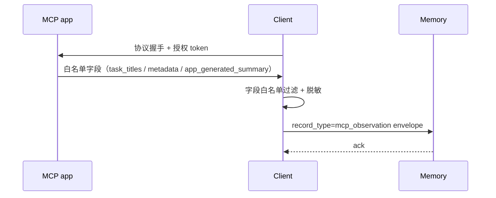

| `record_type` | 含义 | 关键 payload 字段 | 触发时机（trigger_cause） | 优先级 |
| --- | --- | --- | --- | --- |
| `mcp_observation` | 经客户端中转的授权 MCP app 白名单字段 / 任务标题 / 元数据摘要 | `mcp_app_id` / `metadata_summary` / `task_titles[]` / `app_generated_summary` / `summary_source_type` | 客户端定时拉取=`scheduled (mcp_pull_interval_sec=300)`；MCP app 主动通知=`event_driven`（如 MCP 支持 push） | P1 |

**MVP 接入清单（5 个领域）**：

| 领域 | 候选 app | 备注 |
| --- | --- | --- |
| 工作 | 飞书 / 钉钉 / Office（Word / Excel / Outlook 元数据） | 仅任务标题 / 会议元数据 / 文档元数据，永禁正文 |
| 购物 | 淘宝 / 京东 / 拼多多 | 仅订单元数据 + 平台自生成摘要，永禁地址 / 支付信息 |
| 娱乐 | 哔哩哔哩 / 抖音 / YouTube | 仅当前播放标题 / 频道 / 平台分类，永禁评论 / 私信 |
| 音乐 | 网易云音乐 / QQ 音乐 / Spotify | 已通过 OSA Bridge 部分覆盖；MCP 通道用于补全播放列表元数据 |
| 社交 | 微信（仅元数据）/ 小红书 / 微博 | **隐私风险最高**，最后接入；永禁聊天 / 私信 / 朋友圈 / 评论正文 |

**接入优先级**：

1. P0 起步：**音乐 + 娱乐**（隐私风险低、用户感知强）
2. P1：**工作**（任务标题 + 会议元数据，对桌宠"工作陪伴"价值高）
3. P2：**购物 + 社交**（购物有支付风险，社交有隐私风险，需 PRIVACY_BOUNDARY 专项评审）

**永禁字段重申**：第三方聊天正文 / 邮件正文 / 文档正文 / 会议正文 / 附件内容 / 朋友圈正文 / 私信内容 / 真实账号 / 财务详情 / 未授权 app 数据。

##### 3.1.4.1 `mcp_observation` payload 字段表

| 字段 | 含义 | 数据类型 | 必填 | 示例值 | 优先级 |
| --- | --- | --- | --- | --- | --- |
| `mcp_app_id` | MCP app 唯一标识（feishu / dida / netease_music / bilibili / taobao 等） | string | 是 | "feishu" | P0 |
| `mcp_event_type` | 上报触发类型（区分客户端定时拉 vs MCP app 主动推） | enum (`scheduled_pull` / `push_notification`) | 是 | "scheduled_pull" | P0 |
| `summary_source_type` | 数据维度类型（让 Memory 区分如何加工，见 §3.1.4.3 枚举清单） | enum | 是 | "task_summary" | P0 |
| `app_generated_summary` | app **自生成**的一句话摘要（**非**客户端 AI 加工，是 MCP app 直接提供的短文本） | string | 否 | "今天有 3 个待办，2 个会议" | P1 |
| `task_titles[]` | 任务 / 待办标题数组（**仅标题，永禁正文**） | array&lt;string&gt; | 否 | ["写周报", "提交报销"] | P1 |
| `metadata_summary` | 结构化元数据（按 app 类型决定子字段，object 兜底） | object | 否 | `{ unread_count: 5, today_meetings: 2 }` | P1 |
| `external_event_data` | MCP app **主动 push** 时携带的事件详情（仅 `mcp_event_type=push_notification` 时填） | object | 否 | `{ event: "new_message", from: "team_channel" }` | P1 |
| `mcp_pull_metadata` | 客户端拉取元信息（拉取时间 / token 是否刷新 / 是否降级），用于审计 | object | 否 | `{ started_at: "...", auth_refreshed: false }` | P2 |

##### 3.1.4.2 envelope JSON 示例

**示例 1：飞书 `scheduled_pull`（工作类，客户端定时拉取）**

```json
{
  "envelope_version": "1.0",
  "record_id": "rec_mcp_feishu_20260520_001",
  "record_type": "mcp_observation",
  "game_id": "wangzhe",
  "game_user_id_pseudonym": "u_hash_123",
  "game_sub_account_id": null,
  "occurred_at": "2026-05-20T09:30:00Z",
  "sent_at": "2026-05-20T09:30:01Z",
  "consent_snapshot_id": "consent_20260520_001",
  "trigger_cause": "scheduled",
  "delivery_mode": "realtime",
  "payload_schema_version": "mcp_observation.v1",
  "payload": {
    "mcp_app_id": "feishu",
    "mcp_event_type": "scheduled_pull",
    "summary_source_type": "task_summary",
    "app_generated_summary": "今天有 3 个待办，2 个会议，1 个逾期任务",
    "task_titles": [
      "写本周周报",
      "提交 4 月报销",
      "审核游戏接入合同"
    ],
    "metadata_summary": {
      "unread_messages_count": 5,
      "today_meetings_count": 2,
      "today_first_meeting_time": "10:30",
      "today_last_meeting_time": "16:00",
      "overdue_tasks_count": 1,
      "pending_approvals_count": 0
    },
    "mcp_pull_metadata": {
      "started_at": "2026-05-20T09:29:58Z",
      "completed_at": "2026-05-20T09:30:00Z",
      "auth_refreshed": false
    }
  }
}
```

**示例 2：网易云音乐 `scheduled_pull`（音乐类）**

```json
{
  "envelope_version": "1.0",
  "record_id": "rec_mcp_netease_20260520_001",
  "record_type": "mcp_observation",
  "game_id": "wangzhe",
  "game_user_id_pseudonym": "u_hash_123",
  "game_sub_account_id": null,
  "occurred_at": "2026-05-20T22:15:00Z",
  "sent_at": "2026-05-20T22:15:02Z",
  "consent_snapshot_id": "consent_20260520_001",
  "trigger_cause": "scheduled",
  "delivery_mode": "realtime",
  "payload_schema_version": "mcp_observation.v1",
  "payload": {
    "mcp_app_id": "netease_music",
    "mcp_event_type": "scheduled_pull",
    "summary_source_type": "playback_summary",
    "app_generated_summary": "今天听了 18 首歌，主要是 Lofi 和 Chillhop 风格",
    "metadata_summary": {
      "tracks_played_count": 18,
      "top_genres": ["lofi", "chillhop", "jazz_hiphop"],
      "current_playing_title": "Lofi Study Beats",
      "current_playing_artist": "Various Artists",
      "playlist_id_used": "user_daily_recommend",
      "session_duration_min": 95
    }
  }
}
```

**示例 3：哔哩哔哩 `push_notification`（娱乐类，MCP app 主动推）**

```json
{
  "envelope_version": "1.0",
  "record_id": "rec_mcp_bilibili_20260520_001",
  "record_type": "mcp_observation",
  "game_id": "wangzhe",
  "game_user_id_pseudonym": "u_hash_123",
  "game_sub_account_id": null,
  "occurred_at": "2026-05-20T21:08:30Z",
  "sent_at": "2026-05-20T21:08:31Z",
  "consent_snapshot_id": "consent_20260520_001",
  "trigger_cause": "event_driven",
  "delivery_mode": "realtime",
  "payload_schema_version": "mcp_observation.v1",
  "payload": {
    "mcp_app_id": "bilibili",
    "mcp_event_type": "push_notification",
    "summary_source_type": "playback_summary",
    "app_generated_summary": "用户开始看关注 UP 主的新视频",
    "external_event_data": {
      "event": "video_play_started",
      "video_category": "knowledge_tech",
      "uploader_subscribed": true,
      "video_duration_min": 12
    }
  }
}
```

**示例 4：淘宝 `push_notification`（购物类，MCP app 主动推订单状态变更）**

```json
{
  "envelope_version": "1.0",
  "record_id": "rec_mcp_taobao_20260520_001",
  "record_type": "mcp_observation",
  "game_id": "wangzhe",
  "game_user_id_pseudonym": "u_hash_123",
  "game_sub_account_id": null,
  "occurred_at": "2026-05-20T14:25:00Z",
  "sent_at": "2026-05-20T14:25:01Z",
  "consent_snapshot_id": "consent_20260520_001",
  "trigger_cause": "event_driven",
  "delivery_mode": "realtime",
  "payload_schema_version": "mcp_observation.v1",
  "payload": {
    "mcp_app_id": "taobao",
    "mcp_event_type": "push_notification",
    "summary_source_type": "order_summary",
    "app_generated_summary": "您有 2 件商品已发货",
    "external_event_data": {
      "event": "shipment_status_changed",
      "from_status": "preparing",
      "to_status": "shipped",
      "items_count": 2,
      "items_categories": ["electronics", "books"]
    },
    "metadata_summary": {
      "pending_shipments_count": 1,
      "in_transit_count": 2,
      "awaiting_pickup_count": 0,
      "active_orders_total": 3
    }
  }
}
```

> **约束**：永禁字段包括 —— ❌ 收件人姓名 / 收货地址 / 电话 / 支付方式 / 支付金额 / 具体商品标题（含商品 SKU 名）/ 卖家昵称 / 评价正文。**仅允许**：订单数量、状态枚举、商品**大类**（electronics / books / clothing / food 等粗类别）、时间戳。

**示例 5：小红书 `scheduled_pull`（社交类，客户端定时拉取通知元数据）**

```json
{
  "envelope_version": "1.0",
  "record_id": "rec_mcp_xhs_20260520_001",
  "record_type": "mcp_observation",
  "game_id": "wangzhe",
  "game_user_id_pseudonym": "u_hash_123",
  "game_sub_account_id": null,
  "occurred_at": "2026-05-20T20:00:00Z",
  "sent_at": "2026-05-20T20:00:02Z",
  "consent_snapshot_id": "consent_20260520_001",
  "trigger_cause": "scheduled",
  "delivery_mode": "realtime",
  "payload_schema_version": "mcp_observation.v1",
  "payload": {
    "mcp_app_id": "xiaohongshu",
    "mcp_event_type": "scheduled_pull",
    "summary_source_type": "notification_summary",
    "app_generated_summary": "今天有 3 条关注更新，5 个点赞，无未读私信",
    "metadata_summary": {
      "unread_messages_count": 0,
      "new_followers_count": 2,
      "today_new_posts_from_followed": 3,
      "today_likes_received": 5,
      "today_comments_received": 1,
      "today_mentions_count": 0
    },
    "mcp_pull_metadata": {
      "started_at": "2026-05-20T19:59:58Z",
      "completed_at": "2026-05-20T20:00:00Z",
      "auth_refreshed": false
    }
  }
}
```

> **约束**：永禁字段 —— 私信正文 / 评论正文 / 笔记正文 / 朋友圈正文 / 关注者具体昵称 / 用户头像 / 群名 / 群成员列表 / 关键词搜索历史 / 浏览历史中的具体笔记 ID 或标题。 
> ​**仅允许**：未读数量、关注 / 点赞 / 评论 / 提及的**纯计数**、时间戳。 
> ​`app_generated_summary` 由 app 自生成（如"3 条更新 / 5 个点赞"这种聚合数字），**禁止**包含任何具体用户名 / 内容片段。

**示例 6：微信 `push_notification`（社交类，最严边界 / 仅元数据）**

```json
{
  "envelope_version": "1.0",
  "record_id": "rec_mcp_wechat_20260520_001",
  "record_type": "mcp_observation",
  "game_id": "wangzhe",
  "game_user_id_pseudonym": "u_hash_123",
  "game_sub_account_id": null,
  "occurred_at": "2026-05-20T19:30:00Z",
  "sent_at": "2026-05-20T19:30:01Z",
  "consent_snapshot_id": "consent_20260520_001",
  "trigger_cause": "event_driven",
  "delivery_mode": "realtime",
  "payload_schema_version": "mcp_observation.v1",
  "payload": {
    "mcp_app_id": "wechat",
    "mcp_event_type": "push_notification",
    "summary_source_type": "notification_summary",
    "app_generated_summary": "您有未读消息（来源：1 个群聊 + 2 位好友）",
    "external_event_data": {
      "event": "new_message_received",
      "chat_type_distribution": {
        "group": 1,
        "friend": 2,
        "official_account": 0
      }
    },
    "metadata_summary": {
      "unread_messages_total": 5,
      "unread_chats_count": 3
    }
  }
}
```

> **约束：**`app_generated_summary` 中**禁止**出现具体好友昵称 / 群名 / 消息片段。`external_event_data.chat_type_distribution` 仅传**类型计数**（group / friend / official_account 几个枚举），不传任何具体 ID / 名称。设计原则：桌宠只需要知道"用户在 IM 上忙不忙"，不需要知道"用户在跟谁说什么"。

##### 3.1.4.3 `summary_source_type` enum 清单

| enum 值 | 适用 app 类别 | 含义 | 典型 metadata_summary 子字段 |
| --- | --- | --- | --- |
| `task_summary` | 工作类（飞书 / 钉钉 / Trello / dida） | 任务 / 待办 / 会议 元数据 | unread_messages_count / today_meetings_count / overdue_tasks_count |
| `playback_summary` | 音乐 / 娱乐类（网易云 / Spotify / B 站 / 抖音 / 优酷） | 播放历史 / 当前播放元数据 | tracks_played_count / top_genres / current_playing_title / session_duration_min |
| `order_summary` | 购物类（淘宝 / 京东 / 拼多多） | 订单状态 / 收藏 / 待发货 元数据 | pending_shipments_count / favorites_count / unread_promotions_count |
| `notification_summary` | 社交类（微信元数据 / 小红书 / 微博） | 未读数 / 关注更新 元数据 | unread_messages_count / new_followers_count / mention_count |
| `other` | 兜底 | 其他类型 | 自由 object |

> **数据边界（重申）**：`task_titles[]` 只列标题；`metadata_summary` 只承载**数量 / 时间 / 枚举类**元数据；`external_event_data` 只承载推送事件的**结构化元数据**。任何 app 的**正文 / 内容 / 用户私人数据**永禁出现。

#### 3.1.5 VLM 语义观察

> **核心约束**：强感知 = 实时陪伴，**仅视觉数据（`vlm_observation`）不入记忆**（chat / pc_signal / user_action 等其他 record_type 照常上报）；弱感知 = 长期数据源，**入记忆**。

##### 3.1.5.1 强感知（实时陪伴，**仅视觉数据**不入记忆）

| 维度 | 设计 |
| --- | --- |
| 触发 | 用户在桌宠 UI 或设置页主动开启"桌宠看屏幕"，伴随明显可见的状态指示（ui_indicator_shown=true） |
| **画面数据流（不入记忆）** | 屏幕帧 → 客户端本地 VLM → 直接进入当前对话上下文（current_context.local_visual_hint）。**不**写 `vlm_observation`，**不**回写画面任何语义字段到记忆系统 |
| **其他数据（正常入记忆）** | 强感知期间用户的 `chat_message`（与桌宠的对话内容）/ `pc_signal`（行为信号）/ `user_action`（mutation）等**所有非视觉 record_type 正常上报记忆系统**，与是否开强感知无关 |
| 关闭 | 用户主动关闭，或客户端检测到强感知会话超过 `vlm_strong_sensing_max_duration_sec`（默认 30 分钟）自动退出 |
| 隐私指示 | 强感知期间必须显示可见 UI 指示器，OS 顶部状态栏也建议显示采集状态 |
| 强感知**专属**审计字段 | 见下表两类事件 |

**强感知**新增**入记忆的两类事件**（除常规 chat / pc_signal / 等 record_type 外）：

| 事件 | record_type | 说明 |
| --- | --- | --- |
| ① 开关变化 | `user_action` (mutation) | `update + consent.vlm_strong_sensing`，记录开 / 关时刻和 app_scope |
| ② 会话审计 | `pet_runtime_event` | `event_type=vlm_strong_sensing_session_start` / `vlm_strong_sensing_session_end`，含 duration_sec / app_scope / ui_indicator_shown |

> **关键约束（v2.1 终版修订）**：强感知"不入记忆"的边界**只覆盖屏幕画面 / 视觉语义结果**（即 `vlm_observation` 不写入；原图、帧、画面 hash 永禁出本地）。**其他数据照常上报**：
>
> - ✅ 强感知期间用户对桌宠说的话 → 正常入 `chat_message`（`client_scene=screen_share_chat` 标识场景）
> - ✅ 强感知期间用户的 app 切换 / 输入派生 / 鼠标活动 → 正常入 `pc_signal`
> - ✅ 强感知期间用户在桌宠 UI 上的任何操作 → 正常入 `user_action`
> - ❌ **仅**屏幕画面 / VLM 推理结果 / 帧 hash → 永不入记忆
>
> **设计直觉类比**：强感知 = "让朋友看一眼电脑屏幕"。朋友看完就走 —— **没拍照、没记录画面内容**；但你和朋友期间聊了什么、点了什么按钮，**照常作为你的记忆留存**。这与"屏幕共享 = 全程脱网"是两回事；强感知只对**视觉数据**留痕设防。

> **`screen_share_chat` client_scene 恢复**（v2.1 终版修订）：基于上述边界修正，§3.1.1.5 类别 A 重新列出 `screen_share_chat`（"强感知屏幕共享期间的对话"），用于标识 chat_message 发生在强感知期间的业务场景。详见 §3.1.1.5。

##### 3.1.5.2 弱感知（长期数据源，入记忆）

> **定位**：用户在隐私设置里**开启** + **配置采样频率**后，客户端本地 VLM 按固定档位**定时**采集屏幕、本地推理出语义结果，**完整回写 `vlm_observation`** 作为长期事实源。原图仍永不出本地。
> 弱感知是 PC 端"画面层"的等价物：就像 active_app / now_playing 是"OS 层"的环境信号一样，弱感知是"画面语义层"的长期低频环境信号。

| 维度 | 设计 |
| --- | --- |
| 触发 | 用户在隐私设置中显式开启 `vlm_visual` + `vlm_weak_sensing_interval_sec`；之后客户端按档位定时采集 |
| 采样档位 | `30 / 60 / 300 / 600（默认）/ 1800 / off`（秒）；用户可随时切换或关闭 |
| 数据流 | 屏幕帧 → 本地 VLM → 完整 `vlm_observation` envelope 上报（含语义标签 / 摘要等）。原图永不出本地（`raw_frame_uploaded=false`，`raw_frame_stored=false`） |
| 黑名单 | 用户可在 `vlm_weak_sensing_app_blacklist` 中配置不采集的 app（默认包含金融 / 密码 / 隐私会议类） |
| 触发子类型 | `scheduled` / `long_no_feedback` / `post_session` / `pre_proactive_speak` |
| 隐私指示 | 弱感知期间客户端**应**给出可见提示（如菜单栏图标变色 + 设置页倒计时），具体形态由 Design 收口 |

##### 3.1.5.3 弱感知 `vlm_observation` 字段表

| 字段名 | 含义 | 数据类型 | 必填 | 示例值 | 优先级 |
| --- | --- | --- | --- | --- | --- |
| `observation_id` | 本次弱感知观察唯一 ID（客户端生成） | string | 是 | "vlm_obs_2026051821001" | P0 |
| `captured_at` | 本次画面采样的本地时间 | ISO 8601 | 是 | "2026-05-18T21:10:00Z" | P0 |
| `activity_category` | AI 推断的主活动大类（受限枚举，如 `gaming / coding / reading / video_watching / browsing / chat / idle / other`） | enum | 是 | "gaming" | P0 |
| `semantic_tags[]` | AI 推断的细粒度语义标签（受限词表 + 安全过滤） | array&lt;string&gt; | 是 | ["game_result_screen", "victory"] | P1 |
| `user_visible_summary` | 给用户看的一句话画面摘要（脱敏，不含可识别个体 / 敏感正文） | string | 是 | "用户处于游戏结算界面，本局胜利。" | P1 |
| `confidence` | 本次推理置信度（0-1） | number | 是 | 0.86 | P0 |
| `source_record_ids[]` | 与本次画面同时段的相邻 source_record（active_app / now_playing / chat_message 等） | array&lt;string&gt; | 否 | ["rec_pc_signal_001"] | P1 |
| `raw_frame_uploaded` | 恒 false（审计字段，证明原图未上传） | boolean | 是 | false | P0 |
| `raw_frame_stored` | 恒 false（审计字段，证明原图未本地持久化） | boolean | 是 | false | P0 |
| `ui_indicator_shown` | 本次采样时是否对用户显示了采集状态 | boolean | 是 | true | P0 |
| `sampling_interval_sec` | 本次采样所属档位（30 / 60 / 300 / 600 / 1800） | integer | 是 | 600 | P0 |
| `trigger_subtype` | 触发子类型：`scheduled` / `long_no_feedback` / `post_session` / `pre_proactive_speak` | enum | 是 | "scheduled" | P0 |

##### 3.1.5.4 用户控制字段（写入 `privacy_grants`，详见 §4.2）

| 字段 | 含义 | 数据类型 | 默认值 |
| --- | --- | --- | --- |
| `privacy_grants.vlm_visual.granted` | 是否授权"客户端获取屏幕画面"（强 / 弱感知 + Diary 本地截图保存 三者共用的**根开关**） | boolean | false |
| `privacy_grants.vlm_strong_sensing.granted` | 强感知（实时陪伴）子开关 | boolean | false |
| `privacy_grants.vlm_visual.allow_local_save_for_diary` | **新增**。是否允许 Diary 模块在高光时刻**本地保存截图**作为日记插图（原图永不上传记忆系统，仅本地保留为客户端 asset） | boolean | false |
| `privacy_grants.vlm_weak_sensing_interval_sec` | 弱感知采样档位（300 / 600 / 1800 / 0=off）；**30 / 60 仅在"高级设置页"开放**（需用户二次确认） | integer | 600 |
| `privacy_grants.vlm_weak_sensing_app_blacklist[]` | 弱感知不采集的 app 列表（bundle_id 或 AUMID） | array&lt;string&gt; | 默认含金融 / 密码 / 视频会议类 |

> **UI 约束**（v2.1）：普通用户在设置页可见档位为 **300s / 600s（默认）/ 1800s / off**。`30s` 和 `60s` 两档因为对电池 / 性能 / 隐私感知压力大，仅在"高级设置页"开放，并需要弹窗二次确认提示用户"高频采集可能影响电池续航和隐私感知"。
>
> **截图三种用途的授权层次**（v2.1）：根开关 `vlm_visual.granted` 控制"客户端能否获取屏幕画面"；其下三个子开关分别控制三种具体用途 —— `vlm_strong_sensing` 强感知实时陪伴 / 弱感知（开根开关 + `vlm_weak_sensing_interval_sec != 0` 自动启用）/ `vlm_visual.allow_local_save_for_diary` 高光时刻本地截图作日记插图。**任何一个子开关都依赖根开关**；根开关关闭则三种用途全部失效。所有用途**原图永不上传记忆系统**。

##### 3.1.5.5 envelope 示例

**弱感知 vlm_observation（入记忆）**：

```json
{
  "record_type": "vlm_observation",
  "payload_schema_version": "vlm_observation.weak.v2",
  "payload": {
    "observation_id": "vlm_obs_2026051821001",
    "captured_at": "2026-05-18T21:10:00Z",
    "activity_category": "gaming",
    "semantic_tags": ["game_result_screen", "victory"],
    "user_visible_summary": "用户处于游戏结算界面，本局胜利。",
    "confidence": 0.86,
    "source_record_ids": ["rec_pc_signal_001"],
    "raw_frame_uploaded": false,
    "raw_frame_stored": false,
    "ui_indicator_shown": true,
    "sampling_interval_sec": 600,
    "trigger_subtype": "scheduled"
  }
}
```

**强感知会话审计事件（不写 vlm_observation，只写 pet_runtime_event）**：

```json
{
  "record_type": "pet_runtime_event",
  "payload_schema_version": "pet_runtime_event.v1",
  "payload": {
    "event_type": "vlm_strong_sensing_session_start",
    "client_scene": "user_initiated_screen_share",
    "ui_indicator_shown": true,
    "app_scope": ["com.tencent.lol"],
    "extra": {
      "expected_max_duration_sec": 1800
    }
  }
}
```

对应的 session_end 事件含 `duration_sec` 字段，记录强感知会话实际持续时长。

#### 3.1.6 日记回信 diary_reply（对接 Diary PRD §七.4）

> **新增于 v2.1**。用户在日记详情页对桌宠日记的回信文本作为**独立 source_record** 持久化，默认进入长期记忆。与 §3.1.1.2 chat_message 的关键区别：①必须关联 `diary_id`；②带 `reply_intent` enum；③记忆系统应据 `reply_intent` 决定是否派生 feedback / 触发 derived_memory 更新。

##### 3.1.6.1 `record_type`

`diary_reply`

##### 3.1.6.2 `diary_reply` payload 字段表

| 字段 | 含义 | 数据类型 | 必填 | 示例值 | 优先级 |
| --- | --- | --- | --- | --- | --- |
| `reply_id` | 回信唯一 ID（客户端生成） | string | 是 | "reply_2026051921001" | P0 |
| `diary_id` | 对应日记 ID（指向 diary_entry 的 target_resource_id） | string | 是 | "diary_2026051820001" | P0 |
| `reply_text` | 用户回信文本内容 | string | 是 | "嗯，今天打得是有点累" | P0 |
| `reply_intent` | 回信意图分类（影响记忆系统派生 feedback / 偏好学习） | enum (`positive` / `negative` / `correction` / `preference` / `casual` / `delete_request`) | 是 | "casual" | P0 |
| `created_at` | 回信时间 | ISO 8601 | 是 | "2026-05-19T21:05:00Z" | P0 |
| `client_scene` | 回信发生时的客户端场景（一般固定为 `diary_chat`） | enum (见 §3.1.1.5) | 否 | "diary_chat" | P1 |
| `replied_to_pet_reaction_id` | 若回信是对桌宠某条反应的回复，关联 reaction_id；否则空 | string \| null | 否 | null | P1 |

##### 3.1.6.3 触发因与传输模式

| 字段 | 取值 |
| --- | --- |
| `trigger_cause` | `event_driven` |
| `delivery_mode` | `realtime`（离线时进入 `batched_recovery`） |
| 隐私授权依赖 | `privacy_grants.chat_content.granted=true`（与 chat_message 共用，回信本质是用户首方文本） |

##### 3.1.6.4 reply_intent 与记忆系统派生行为的关系

| `reply_intent` | 记忆系统派生 |
| --- | --- |
| `positive` | 派生 feedback：feedback_value=`like`，target_resource_id=diary_id；提升对应 diary 来源组合的偏好权重 |
| `negative` | 派生 feedback：feedback_value=`dislike`，feedback_reason 由 LLM 从 reply_text 推断（如 `not_accurate` / `too_private` / `boring`） |
| `correction` | 派生 feedback：feedback_value=`inaccurate` + 触发 derived_memory 重加工（如纠正画像 / episode 标题） |
| `preference` | 不派生 feedback，但触发 `companion_profile_inferred.preferred_conversation_topics` / `avoided_conversation_topics` 加工 |
| `casual` | 仅持久化为 source_record，**不**派生 feedback / 不影响偏好权重 |
| `delete_request` | 不自动删除；记忆系统 push 一条 `delete_intent_detected` 通知到客户端，由客户端弹"是否删除这篇日记"确认弹窗，用户确认后客户端发 `delete + diary_entry` mutation |

##### 3.1.6.5 envelope 示例

```json
{
  "envelope_version": "1.0",
  "record_id": "rec_diary_reply_001",
  "record_type": "diary_reply",
  "game_id": "wangzhe",
  "game_user_id_pseudonym": "u_hash_123",
  "game_sub_account_id": null,
  "occurred_at": "2026-05-19T21:05:00Z",
  "sent_at": "2026-05-19T21:05:01Z",
  "consent_snapshot_id": "consent_20260519_001",
  "trigger_cause": "event_driven",
  "delivery_mode": "realtime",
  "payload_schema_version": "diary_reply.v1",
  "payload": {
    "reply_id": "reply_2026051921001",
    "diary_id": "diary_2026051820001",
    "reply_text": "嗯，今天打得是有点累",
    "reply_intent": "casual",
    "created_at": "2026-05-19T21:05:00Z",
    "client_scene": "diary_chat"
  }
}
```

### 3.2 客户端上报：用户操作（mutation）

#### 3.2.1 五个通用 action

| `action` | 含义 | 是否异步 | 适用 target_type 范围 | 优先级 |
| --- | --- | --- | --- | --- |
| `save` | **保存对象到长期记忆**。target_type 范围**开放**：任何支持"被用户主动创建"语义的对象都可作为 save 目标 | 同步 | **开放**：`rule.do_not_remember` / `free_form_note` / 未来扩展类型 | P0 |
| `update` | **修改已有对象的字段**。覆盖原 `update` / `correct`（纠错）/ `restore`（恢复 is_active=true）三种语义；用 `is_correction` / `new_value.is_active` 等子参数区分意图 | 同步 | `profile_field.*` / `preference.*` / `consent.*` / `assessment.use_for_companion` / `episode` / 任意可改字段对象 | P0 |
| `delete` | 标 `is_active=false`，记 `inactive_reason=user_deleted`（不物理删除，保留审计） | 同步 | 任意可失效对象 | P0 |
| `request` | 触发**后台异步流程**，必带 `request_type` | **异步** | `request_type=``character_similarity_assessment` | P0 |
| `feedback` | **用户态度表达（like/unlike）** | like同步 | 任意可被反馈对象 | P1 |

#### 3.2.2 action 子参数 schema 约束

| action | 必带子参数 | 可选子参数 | 禁带 |
| --- | --- | --- | --- |
| `save` | `payload`（新对象内容）+ `target_type` | — | `target_resource_id`（由 Memory 分配） |
| `update` | `target_resource_id` + `new_value` | `original_value`（留痕）、`is_correction`（true 时锁定字段不被 AI 后续覆盖）；如恢复 `is_active`：`new_value={is_active: true, ...}` | `feedback_value` |
| `delete` | `target_resource_id` | `delete_reason` | `new_value` |
| `request` | `request_type` | `request_params` | `target_resource_id`（除非流程指向具体对象，如 profile_reset 指向某 game_id 下的 profile） |
| `feedback` | `target_resource_id` + `feedback_value` | `feedback_reason`（**enum**，`accurate` / `not_accurate` / `not_like_me` / `wrong_tone` / `too_private` / `boring`/ `other`） | `new_value` |

#### 3.2.3 target_type 命名约定（开放命名空间）

##### 3.2.3.1 命名约定与三类划分

`target_type` 是 `user_action` mutation 中用来定位"操作哪个对象"的字段。**采用开放命名空间**，按对象产生方式分为三类：

| 类别 | 特征 | 谁产生 | 典型 mutation |
| --- | --- | --- | --- |
| **A 类：用户主动创建的顶层资源** | 用户在 UI 上点保存 / 添加规则 / 备忘等 | 用户 `save` action 创建 | save / update / delete / feedback |
| **B 类：Memory 自动加工的顶层资源** | 后台 LLM / 规则生成的 derived_memory 对象 | Memory 后台 | update / delete / feedback（不可 save） |
| **C 类：子命名空间字段（点号路径）** | 通过 `<root>.<sub>.<field>` 形式定位 §4.1.3 / §4.2 字段族下的某具体字段 | 多源（用户 update / Memory 推断 / 初始默认） | update / feedback（视字段而定） |

**点号路径规则**：根命名空间（`profile_field` / `preference` / `consent` / `assessment`） + `.` + 子族 + `.` + 字段名。Engineering 建议加 schema lint 强制路径合法。

> 下面 §3.2.3.2 列示例 target_type；不是完整清单。完整字段命名空间见 §4.1.3（derived_memory 族）+ §4.2.1-§4.2.5（user_control_state 族）。

##### 3.2.3.2 target_type 示例（按 A/B/C 三类分组）

| target_type | 类别 | 含义 | mutability_policy | 详见章节 |
| --- | --- | --- | --- | --- |
| `rule.do_not_remember` | A | 用户"以后别这样记"规则 | user_only | §4.2.4 memory_controls |
| `free_form_note` | A | 用户对桌宠说"记一下这件事"产生的自由备忘 | user_only | §3.2.4 envelope 示例 3 |
| `diary_entry` | B | 日记成品（每生理日由 Diary 模块自动生成 + 自动持久化，**非用户主动 save**；含 30+ 字段，DFRS 视为开放 schema） | ai_inferred_writable（Diary 模块加工，用户可改/删/反馈） | §3.1.6 + Diary PRD §七.2 |
| `episode` | B | 单条情节摘要（AI 聚合 chat segment） | ai_inferred_writable | §4.1.3.2 |
| `atomic_fact` | B | 单条原子事实（AI 从聊天抽取） | ai_inferred_writable | §4.1.3.1 |
| `diary_reply` | B' | 日记回信对象（**上报时**走 §3.1.6 独立 record_type；**仅作为 delete target_type** 使用） | ai_inferred_writable（用户 delete 自己的回信） | §3.1.6 |
| `profile_field.<族>.<字段>_user_set` | C | 用户显式设置的画像字段（如 `profile_field.profile_identity.preferred_call_name`） | user_only | §4.2.6 / §4.2.7 + §4.1.3.14 |
| `profile_field.<族>.<字段>_inferred` | C | AI 推断的画像字段（如 `profile_field.playstyle_profile.playstyle_tags_inferred`） | user_primary_ai_candidate 或 ai_inferred_writable | §4.1.3.4-§4.1.3.7 + §4.1.3.14 |
| `consent.<授权名>` | C | 隐私授权（12 项之一，如 `consent.vlm_visual` / `consent.chat_content`） | user_only | §4.2.1 |
| `preference.<偏好族>.<字段>` | C | 用户偏好（如 `preference.diary_style.length` / `preference.notification.disturbance_boundaries`） | user_only | §4.2.2 / §4.2.4 / §4.2.5 |
| `assessment.use_for_companion` | C | 角色相似度测定的"是否影响陪伴"开关 | user_only | §4.1.3.12 |
| `request_type=resummarize_profile` | request 专用 | "重新总结我"异步流程触发 | — | §3.2.4 envelope 示例 5 |
| `request_type=character_similarity_assessment` | request 专用 | 用户主动触发角色相似度测定 | — | §4.1.3.12 |
| `request_type=profile_reset` | request 专用 | 用户清空画像异步流程 | — | §3.2.2 schema 约束表 |

> **highlight_event 不在 target_type 表内**：v2.1 决策"高光完全后台化"，用户无任何 mutation 入口，highlight_event 仅作为 Memory 自动生成 / 自动失效的 derived_memory 存在（详见变更说明 #21）。

##### 3.2.3.3 action × target_type 矩阵

哪些 action 可作用于哪些 target_type：

| target_type | `save` | `update` | `delete` | `request` | `feedback` |
| --- | --- | --- | --- | --- | --- |
| `rule.do_not_remember` (A) | ✓ 创建 | — | ✓ | — | — |
| `free_form_note` (A) | ✓ 创建 | ✓ 改文本 | ✓ | — | — |
| `diary_entry` (B) | — | ✓ 改 favorited/mailbox_status 等 | ✓ | — | ✓ (含 boring) |
| `episode` (B) | — | ✓ 纠错（is_correction）| ✓ | — | ✓ |
| `atomic_fact` (B) | — | ✓ 纠错 | ✓ | — | ✓ |
| `diary_reply` (B') | — | — | ✓ 删除单条回信 | — | — |
| `profile_field.*_user_set` (C) | ✓ 首次设置 | ✓ 覆盖 | — | — | — |
| `profile_field.*_inferred` (C) | — | ✓（含 `is_correction=true` 锁定）| ✓ | — | ✓ (confirm/inaccurate) |
| `consent.*` (C) | — | ✓ | — | — | — |
| `preference.*` (C) | — | ✓ | — | — | — |
| `assessment.use_for_companion` (C) | — | ✓ | — | — | — |
| `request_type=*` | — | — | — | ✓ | — |

> **schema 一致性**：A/B/C 三类的 mutation envelope 都符合 §3.2.2 子参数 schema 约束；具体 envelope 示例见 §3.2.4。

#### 3.2.4 envelope 示例

**示例 1：`update + profile_field`（**纠错**画像玩法标签，带 is_correction）**

```json
{
  "record_type": "user_action",
  "payload_schema_version": "user_action.mutation.v2",
  "payload": {
    "mutation": true,
    "mutation_id": "mut_update_001",
    "action": "update",
    "target_type": "profile_field.playstyle_profile.playstyle_tags_inferred",
    "target_resource_id": "playstyle_tags_inferred",
    "new_value": ["steady", "calculated"],
    "original_value": ["aggressive", "risk_taker"],
    "is_correction": true,
    "user_intent": "用户明确纠正玩法标签，AI 推断错了"
  }
}
```

> `is_correction=true` 让 Memory 锁定该字段，禁止 AI 后续自动覆盖（除非用户再次 update）。

**示例 2：`feedback + profile_field`（**接受推断为准**，feedback_value=confirm）**

```json
{
  "record_type": "user_action",
  "payload_schema_version": "user_action.mutation.v2",
  "payload": {
    "mutation": true,
    "mutation_id": "mut_feedback_001",
    "action": "feedback",
    "target_type": "profile_field.playstyle_profile.playstyle_tags_inferred",
    "target_resource_id": "playstyle_tags_inferred",
    "feedback_value": "confirm",
    "user_intent": "用户认可 AI 推断的玩法风格标签"
  }
}
```

> **注意**：`feedback + confirm` 只能作用于 `_inferred` / `_candidate` 类字段（mutability_policy = `user_primary_ai_candidate` 或 `ai_inferred_writable`）。**不能**作用于 `user_only` 字段（如 `profile_identity.*` / `pet_relationship.*`），因为这类字段 AI 不会产生候选值。

> `feedback_value=confirm` 时 Memory 把该字段的 `profile_meta.confidence` 升到 1.0 + `user_attested=true`，但 `generation_method` 仍是 `inferred`（如需把字段升级为 `user_set` 真源，应改用 `update` action）。

**示例 3：`save + free_form_note`（用户对桌宠说"记一下这件事"）**

```json
{
  "record_type": "user_action",
  "payload_schema_version": "user_action.mutation.v2",
  "payload": {
    "mutation": true,
    "mutation_id": "mut_save_001",
    "action": "save",
    "target_type": "free_form_note",
    "payload": {
      "note_text": "下次打 BOSS 记得带火抗药水",
      "tags": ["游戏攻略", "BOSS战"]
    },
    "user_intent": "用户主动让桌宠记一笔"
  }
}
```

**示例 4：`update + free_form_note`（**恢复**用户误删的备忘，new_value.is_active=true）**

```json
{
  "record_type": "user_action",
  "payload_schema_version": "user_action.mutation.v2",
  "payload": {
    "mutation": true,
    "mutation_id": "mut_restore_001",
    "action": "update",
    "target_type": "free_form_note",
    "target_resource_id": "note_2026051200031",
    "new_value": { "is_active": true },
    "user_intent": "用户撤销刚才的删除"
  }
}
```

> 恢复仅当 `inactive_reason ∈ {user_deleted, user_rejected, expired}` 时允许；`conflict_with_newer_evidence` 不可恢复，Memory 返回 `rejected`。

**示例 5：`request` 异步流程（重新总结画像）**

```json
{
  "record_type": "user_action",
  "payload_schema_version": "user_action.mutation.v2",
  "payload": {
    "mutation": true,
    "mutation_id": "mut_req_001",
    "action": "request",
    "request_type": "resummarize_profile",
    "user_intent": "用户说'重新总结我'"
  }
}
```

> 异步 action 的 ack 序列：`pending → in_progress → applied/rejected`。

#### 3.2.5 Ack 回执（Memory → Client）

每条 mutation 都必须收到记忆系统的 ack 回执。Ack 是 Memory → Client 方向的小包，承载本次 mutation 的处理结果。

**Ack envelope 字段**：

| 字段 | 含义 | 数据类型 | 必填 |
| --- | --- | --- | --- |
| `mutation_id` | 对应客户端发起 mutation 的 ID | string | 是 |
| `status` | 处理状态（见 ack_status 枚举） | enum | 是 |
| `processed_at` | 记忆系统处理完成时间 | ISO 8601 | 是 |
| `updated_resource_refs[]` | 本次 mutation 影响的 derived_memory 资源 ID 数组（客户端按 ref 重新 pull 详情） | array&lt;string&gt; | 否（仅 `applied` 时有意义） |
| `reject_reason` | 拒绝原因（见 reject_reason 枚举） | enum | 仅 `status=rejected` 时必填 |
| `retry_after_sec` | 建议重试间隔 | number | 仅 `status=deferred` 时必填 |

**`ack_status` 6 个枚举值**：

| `ack_status` | 含义 | 适用 action 类别 |
| --- | --- | --- |
| `applied` | 已完成变更 | 同步 / 异步 / 批量 |
| `rejected` | 拒绝执行，必带 `reject_reason` 子类型 | 同步 / 异步 / 批量 |
| `deferred` | 系统繁忙暂缓，必带 `retry_after_sec` | 同步 / 异步 |
| `pending` | 已入队，未开始处理 | 仅异步 `request` |
| `in_progress` | 后台已开始处理 | 仅异步 `request` |
| `partial_success` | 批量中只有部分成功 | 仅批量 |

**`reject_reason` 8 个枚举值**：

| `reject_reason` | 触发场景 |
| --- | --- |
| `permission_denied` | 当前授权不足（如 `privacy_grants.profile_inference=false` 时尝试 `request resummarize_profile`） |
| `target_not_found` | `target_resource_id` 在记忆系统不存在 |
| `target_inactive` | 目标资源已 `is_active=false`（除"恢复"操作 `update + new_value.is_active=true` 外） |
| `schema_violation` | payload schema 不合法（如 `update` 缺 `new_value` / `feedback` 带 `new_value`） |
| `version_conflict` | （v2.2 引入并发控制后）客户端版本号过期 |
| `policy_violation` | 违反 `mutability_policy`（如 AI 流程尝试 `update` 一个 `user_only` 字段） |
| `unrecoverable_state` | 目标处于不可恢复状态（如尝试恢复一个 `inactive_reason=conflict_with_newer_evidence` 的对象） |
| `consent_cascade_blocked` | mutation 在授权撤回反向清理期间被阻塞 |

> Ack 状态机的具体流程（同步 / 异步 / 批量三套 mermaid 图）属于工程实施细节，交由 Engineering Thread 在工程文档中定义；本数据需求文档只规定字段值清单与触发场景。

### 3.3 客户端补传：离线积压的数据

| 场景 | 触发 | 规则 |
| --- | --- | --- |
| 网络恢复 | 客户端检测到联通后 30s 内启动 | 每条仍带独立 `record_id` / `occurred_at` / `consent_snapshot_id`（不是补传时刻）；按 `occurred_at` 时序上报 |
| 客户端空闲 | 后台周期任务 | 同上 |
| 退出前 flush | `before_quit` hook | 同上 |
| 超时丢弃 | 离线超 `offline_buffer_max_hours=24` 或超 `offline_buffer_max_records=5000` | 客户端记录 `offline_dropped_count` 并在下次启动时上报一条 `pet_runtime_event.offline_drop_summary`（不补传内容） |

**批量 envelope**：

```json
{
  "batch_id": "batch_offline_001",
  "batch_type": "source_record_backfill",
  "game_id": "game_abc",
  "game_user_id_pseudonym": "u_hash_123",
  "sent_at": "2026-05-18T22:10:00Z",
  "retry_count": 1,
  "items": [
    { "envelope_version": "1.0", "record_id": "rec_offline_game_event_001", "...": "..." }
  ]
}
```

**Memory 批量 ack**：

```json
{
  "batch_ack_id": "batch_ack_offline_001",
  "batch_id": "batch_offline_001",
  "status": "partial_success",
  "accepted_record_ids": ["rec_offline_game_event_001"],
  "rejected_records": [
    { "record_id": "rec_offline_user_action_001", "reason": "duplicate_record_id" }
  ]
}
```

---

## 4. Memory → Client 返回

### 4.0 章节地图

记忆系统 → 客户端的数据流分两种方式：**客户端主动取（Pull）** 和 **记忆系统主动推（Push）**。

| 子节 | 内容 | 主导方 |
| --- | --- | --- |
| §4.1 | **客户端主动取：桌宠能读到的记忆**（加工后的 derived_memory，按 `query_type` 分类） | 客户端发起 |
| §4.2 | **客户端主动取：用户的设置与授权状态**（偏好 / 隐私授权 / 删除策略 等 user_control_state） | 客户端发起 |
| §4.3 | **记忆系统主动推：变化轻通知**（只推 ref 和摘要，详情仍走 pull） | 记忆系统发起 |

### 4.1 客户端主动取：桌宠能读到的记忆（derived_memory）

#### 4.1.1 `Pull Query` 请求字段

| 字段 | 含义 | 必填 | 优先级 |
| --- | --- | --- | --- |
| `query_id` | 查询 ID | 是 | P0 |
| `query_type` | 查询类型，见 §4.1.2 | 是 | P0 |
| `game_id` / `game_user_id_pseudonym` | 数据隔离 | 是 | P0 |
| `scene` | 客户端业务场景 | 是 | P0 |
| `time_window` | 查询时间窗 `{from, to}` | 否 | P1 |
| `resource_refs[]` | 从 push 拿到的资源引用 | 取决于 `query_type` | P0 |

#### 4.1.2 `query_type` 与返回结构

| `query_type` | 客户端场景 | 返回内容（derived_memory） |
| --- | --- | --- |
| `startup_context` | 游戏 / 客户端启动 | 当前游戏下近期 episode refs（实时聚合的 top N）+ 关键 `profile.summary` + 未处理提醒清单 + `consent_snapshot`；客户端按需现场聚合 top_events / top_emotions，不依赖持久化 digest |
| `conversation_context` | 桌宠准备回应前 | 当前 `profile` 关键字段 + 近期 `atomic_facts[]` + `episode` refs + `disturbance_boundaries` |
| `session_memory` | 一局结束 / 结算页 | 本 session 的 `episode` + `idip_delta` + `highlight_event` refs + 事件摘要 |
| `profile_detail` | 画像页 / 对话前 | `profile.*` 全量 + `profile_meta`（含 evidence_ids） |
| `episode_detail` | 跨日召回 / 日记 / 复盘 | `episode` 详情 + evidence_ids |
| `preferences_state` | 设置页 / 能力调用前 | `user_preferences` + `privacy_grants` + `deletion_policy` |
| `mcp_context` | 外部 app 轻量提醒 | 已授权 MCP app 的 `metadata_summary` + `task_titles[]` + `app_generated_summary` |
| `assessment_result` | 角色相似度结果页 | `game_character_similarity_assessment` 详情 |
| `mailbox_summary` | 日记收信箱入口 / 桌宠头顶气泡判断 | 实时聚合返回：`unread_count`（未读日记数）/ `latest_unread_diary_id` / `has_new_diary_bubble` / `empty_state_type`（first_empty / no_new_today / generation_failed / quality_blocked）；**不持久化**，记忆系统每次 pull 时从 `diary_entry` 表实时 COUNT WHERE is_active=true AND mailbox_status='unread' |
| `diary_list` | 日记列表页 | 当前游戏下 diary_entry refs 分页列表 + 基础元信息（diary_id / title / visible_date / mailbox_status / is_favorited / is_active） |
| `diary_detail` | 日记详情页 | 单条 `diary_entry` 详情 + `evidence_ids[]` + `diary_reply[]` 列表 |
| `resource_detail` | 收到 push 后按 `resource_refs[]` 拉详情 | 与 refs 对应的具体资源 |

#### 4.1.3 桌宠能从记忆系统读到的内容（详细字段表）

> **每一类内容给一张完整字段表**：字段名 / 含义 / 数据类型 / 示例值 / 触发返回的 query_type / 优先级。字段语义对齐 DRS §3。
> 这些都是记忆系统**加工后**返回给桌宠 / 客户端的内容（derived_memory），不是原始事实源（source_record）。

##### 4.1.3.1 `atomic_facts[]`

| 字段名 | 含义 | 数据类型 | 示例值 | query_type | 优先级 |
| --- | --- | --- | --- | --- | --- |
| `atomic_facts[].fact` | AI 从聊天 segment 抽取的单条事实陈述 | string | "用户喜欢稳定策略" | conversation_context / session_memory / episode_detail | P0 |
| `atomic_facts[].quote_eligible` | 原话是否可被桌宠原文引用；由 PII 检测 + NER 决定 | boolean | true | 同上 | P0 |
| `atomic_facts[].meta` | 该原子事实的 `profile_meta`（见 4.1.3.13） | object | { confidence:0.85, source_category:["chat"], generation_method:"inferred", evidence_ids:["chat_segment_2026042100012"] } | 同上 | P0 |

##### 4.1.3.2 `episode`

| 字段名 | 含义 | 数据类型 | 示例值 | query_type | 优先级 |
| --- | --- | --- | --- | --- | --- |
| `episode.episode_id` | 情节主键，用于 evidence_ids 反查 | string | "episode_2026051000031" | conversation_context / session_memory / episode_detail | P0 |
| `episode.title` | AI 摘要的情节标题 | string | "讨论刺客职业天赋树调整" | 同上 | P0 |
| `episode.content` | AI 摘要的情节内容正文 | string | "用户和桌宠讨论了..." | session_memory / episode_detail | P0 |
| `episode.time_range` | 情节起止时间 | object {start,end} | { start:"...", end:"..." } | 同上 | P0 |
| `episode.participants` | 参与方枚举 | array&lt;string&gt; | ["pet","user"] | session_memory / episode_detail | P0 |
| `episode.highlight_score` | 情节高光排序分（0-1） | number | 0.82 | episode_detail / diary_detail | P1 |
| `episode.score_version` | 高光分版本号 | string | "highlight_score_default" | 同上 | P1 |
| `episode.score_reason[]` | 高光分推理因子列表 | array&lt;string&gt; | ["milestone_hit","user_starred"] | 同上 | P1 |
| `episode.meta` | profile_meta（见 4.1.3.13） | object | (同 4.1.3.13) | 同上 | P0 |

##### 4.1.3.3 `profile.summary`

| 字段名 | 含义 | 数据类型 | 示例值 | query_type | 优先级 |
| --- | --- | --- | --- | --- | --- |
| `profile.summary.value` | 当前画像的整体一句话总结（AI 生成，用户可 request 重新总结） | string | "喜欢稳定策略型玩家，目前主玩排位刺客线" | startup_context / profile_detail | P0 |
| `profile.summary.meta` | profile_meta（含 evidence_summary） | object | (同 4.1.3.13) | 同上 | P0 |

##### 4.1.3.4 `game_profile_inferred`

| 字段名 | 含义 | 数据类型 | 示例值 | query_type | 优先级 |
| --- | --- | --- | --- | --- | --- |
| `game_profile_inferred.favorite_roles_inferred.value` | AI 推断的偏好角色 / 职业 | array&lt;string&gt; | ["assassin","mage"] | profile_detail | P0 |
| `game_profile_inferred.favorite_roles_inferred.meta` | profile_meta | object | (同 4.1.3.13) | profile_detail | P0 |
| `game_profile_inferred.favorite_modes_inferred.value` | AI 推断的偏好模式 | array&lt;string&gt; | ["ranked","arcade"] | profile_detail | P0 |
| `game_profile_inferred.favorite_modes_inferred.meta` | profile_meta | object | (同上) | profile_detail | P0 |
| `game_profile_inferred.game_goals_inferred.value` | AI 推断的游戏目标 | array&lt;string&gt; | ["上钻石","凑齐皮肤"] | profile_detail | P0 |
| `game_profile_inferred.game_goals_inferred.meta` | profile_meta | object | (同上) | profile_detail | P0 |

##### 4.1.3.5 `playstyle_profile_inferred`

| 字段名 | 含义 | 数据类型 | 示例值 | query_type | 优先级 |
| --- | --- | --- | --- | --- | --- |
| `playstyle_profile_inferred.playstyle_tags_inferred.value` | 玩法风格标签（受限词表） | array&lt;string&gt; | ["steady","calculated"] | profile_detail | P0 |
| `playstyle_profile_inferred.playstyle_tags_inferred.meta` | profile_meta | object | (同 4.1.3.13) | profile_detail | P0 |
| `playstyle_profile_inferred.risk_preference_inferred.value` | 风险偏好（受限枚举：cautious / balanced / risk_taker） | enum | "balanced" | profile_detail | P0 |
| `playstyle_profile_inferred.risk_preference_inferred.meta` | profile_meta | object | (同上) | profile_detail | P0 |
| `playstyle_profile_inferred.learning_stage_inferred.value` | 学习阶段（新手 / 中阶 / 老手 等） | enum | "mid" | profile_detail | P0 |
| `playstyle_profile_inferred.learning_stage_inferred.meta` | profile_meta | object | (同上) | profile_detail | P0 |

##### 4.1.3.6 `companion_profile_inferred`

| 字段名 | 含义 | 数据类型 | 示例值 | query_type | 优先级 |
| --- | --- | --- | --- | --- | --- |
| `companion_profile_inferred.preferred_conversation_topics_inferred.value` | AI 推断的偏好对话主题 | array&lt;string&gt; | ["职业天赋","赛季节奏"] | profile_detail / conversation_context | P0 |
| `companion_profile_inferred.preferred_conversation_topics_inferred.meta` | profile_meta | object | (同 4.1.3.13) | 同上 | P0 |
| `companion_profile_inferred.avoided_conversation_topics_inferred.value` | AI 推断的回避主题 | array&lt;string&gt; | ["现实工作压力"] | 同上 | P0 |
| `companion_profile_inferred.avoided_conversation_topics_inferred.meta` | profile_meta | object | (同上) | 同上 | P0 |

##### 4.1.3.7 `progress_profile_derived`

| 字段名 | 含义 | 数据类型 | 示例值 | query_type | 优先级 |
| --- | --- | --- | --- | --- | --- |
| `progress_profile_derived.current_goal_inferred.value` | 当前推断的近期目标 | string | "本赛季上钻石" | session_memory / profile_detail | P1 |
| `progress_profile_derived.current_goal_inferred.meta` | profile_meta | object | (同 4.1.3.13) | 同上 | P1 |
| `progress_profile_derived.stuck_points_inferred.value` | 推断的卡点 | array&lt;string&gt; | ["小龙团战决策"] | session_memory / profile_detail | P1 |
| `progress_profile_derived.stuck_points_inferred.meta` | profile_meta | object | (同上) | 同上 | P1 |
| `progress_profile_derived.recent_achievements_inferred.value` | 近期成就 | array&lt;string&gt; | ["首杀 chapter_02 BOSS"] | session_memory / profile_detail | P1 |
| `progress_profile_derived.recent_achievements_inferred.meta` | profile_meta | object | (同上) | 同上 | P1 |
| `progress_profile_derived.long_term_milestones_derived.value` | 长期里程碑（多源加工） | array&lt;object&gt; | [{ name:"全英雄熟练度A", achieved_at:"..." }] | profile_detail | P1 |
| `progress_profile_derived.long_term_milestones_derived.meta` | profile_meta | object | (同上) | profile_detail | P1 |

##### 4.1.3.8 `idip_delta` / `idip_anomaly` / `idip_milestone`

| 字段名 | 含义 | 数据类型 | 示例值 | query_type | 优先级 |
| --- | --- | --- | --- | --- | --- |
| `idip_delta.changed_fields` | 服务端 diff 出来的字段变更字典 | object | { level:"+1", gold:"+310" } | session_memory | P1 |
| `idip_delta.from_snapshot_id` | 起始快照 id | string | "idip_020" | session_memory | P1 |
| `idip_delta.to_snapshot_id` | 终点快照 id | string | "idip_030" | session_memory | P1 |
| `idip_delta.evidence_ids[]` | 关联 raw idip_snapshot 的 record_id | array&lt;string&gt; | ["rec_idip_..."] | session_memory | P1 |
| `idip_anomaly.type` | 异常分类（卡关 / 异常掉段 / 异常长时不前进 等） | enum | "stuck_on_level" | session_memory | P1 |
| `idip_anomaly.evidence_ids[]` | 异常证据 | array&lt;string&gt; | [...] | session_memory | P1 |
| `idip_milestone[].name` | 里程碑名 | string | "首次上王者" | session_memory / profile_detail | P1 |
| `idip_milestone[].achieved_at` | 达成时间 | ISO 8601 | "2026-05-18T21:30:00Z" | 同上 | P1 |
| `idip_milestone[].evidence_ids[]` | 达成证据 | array&lt;string&gt; | [...] | 同上 | P1 |

##### 4.1.3.9 `highlight_event`

| 字段名 | 含义 | 数据类型 | 示例值 | query_type | 优先级 |
| --- | --- | --- | --- | --- | --- |
| `highlight_event.highlight_id` | 高光唯一 ID | string | "hl_2026051200031" | diary_detail | P1 |
| `highlight_event.title` | 标题（AI 生成；用户无直接编辑入口，仅通过日记反馈间接影响） | string | "首杀 chapter_02 BOSS" | diary_detail | P1 |
| `highlight_event.time` | 发生时间（或时段中点） | ISO 8601 | "2026-05-12T20:31:00Z" | diary_detail | P1 |
| `highlight_event.scene` | 业务场景（settlement / chat / replay 等） | enum | "settlement" | diary_detail | P1 |
| `highlight_event.event_summary` | 一句话事件摘要 | string | "用户操控法师 12% HP 翻盘" | diary_detail | P1 |
| `highlight_event.category` | 业务分类（victory / milestone / funny / emo 等） | enum | "victory" | diary_detail | P1 |
| `highlight_event.tags[]` | 标签 | array&lt;string&gt; | ["boss_kill","comeback"] | diary_detail | P1 |
| `highlight_event.source` | 来源（ai_auto / vlm_capture / idip_milestone_trigger 等） | enum | "ai_auto" | （内部加工，不对用户 query 暴露；仅通过 diary_detail 间接访问） | P1 |
| `highlight_event.privacy_level` | 隐私级别（private / shareable_anonymized / shareable_full）；用于日记分享时的可见性控制 | enum | "private" | diary_detail | P1 |
| `highlight_event.pinned` | 是否被系统标记为重点（后台加工字段，用户无直接置顶入口） | boolean | false | diary_detail | P1 |
| `highlight_event.evidence_ids[]` | 证据链 | array&lt;string&gt; | ["episode_...","rec_..."] | diary_detail | P1 |
| `highlight_event.is_active` | 是否仍生效 | boolean | true | diary_detail | P0 |
| `highlight_event.inactive_reason` | 失效原因（consent_revoked / expired / superseded 等；用户无直接删除入口） | enum | null | diary_detail | P0 |
| `highlight_event.inactive_at` | 失效时间 | ISO 8601 | null | diary_detail | P0 |

##### 4.1.3.10 `memory_digest`（**v2.1 终版：已删除，改为客户端现场聚合**）

> **v2.1 决策**：原 v2 设计中 `memory_digest` 作为"周期摘要的预计算缓存"持久化，但其内容（top_events / top_emotions / recent_episodes_ref）均可从 `episode` + `emotion_signal_derived` + `profile.summary` 现场聚合得到，**与上述字段存在数据冗余**。
>
> v2.1 终版**取消 memory_digest 作为持久化 derived_memory**：
> - 客户端 pull `query_type=startup_context` 时，记忆系统**实时**聚合 top N 个最近 `episode` refs + 当前 `profile.summary` + 当前 `emotion_signal_derived.recent_distribution`，组合返回；不存预计算 digest。
> - 客户端如需"本周回顾 / 本月回顾"类视图，pull `query_type=session_memory` 或 `episode_detail` 后**本地聚合**生成 UI 文案，不要求记忆系统持久化。
> - 相应地，§4.3.2 `push_type=memory_digest_ready` 也删除（见下节）；记忆系统不再主动推 digest 通知。
>
> 如未来 episode 数量过大导致 startup p99 超过 §2.4 的 200ms SLA，再评估是否引入 digest 缓存（届时作为 v2.2 增量）。

##### 4.1.3.11 `emotion_signal_derived`

| 字段名 | 含义 | 数据类型 | 示例值 | query_type | 优先级 |
| --- | --- | --- | --- | --- | --- |
| `emotion_signal_derived.dominant_emotion.value` | Memory 基于 chat + game_event 聚合的主导情绪 | enum | "excitement" | session_memory / conversation_context | P0 |
| `emotion_signal_derived.dominant_emotion.meta` | profile_meta | object | (同 4.1.3.13) | 同上 | P0 |
| `emotion_signal_derived.recent_distribution` | 近窗口情绪分布 | object | { excitement:0.6, neutral:0.3, frustration:0.1 } | 同上 | P0 |
| `emotion_signal_derived.window` | 计算窗口 | object { from, to } | { from:"...", to:"..." } | 同上 | P0 |

##### 4.1.3.12 `game_character_similarity_assessment`

| 字段名 | 含义 | 数据类型 | 示例值 | query_type | 优先级 |
| --- | --- | --- | --- | --- | --- |
| `assessment_id` | 测定主键 | string | "assess_001" | assessment_result | P1 |
| `character_taxonomy_version` | 使用的角色分类体系版本 | string | "char_tax_v1" | assessment_result | P1 |
| `input_scope` | 使用了哪些数据维度（聊天 / 游戏行为 / VLM / MCP 等） | array&lt;string&gt; | ["chat","game_event"] | assessment_result | P1 |
| `consent_snapshot` | 测定使用的授权快照 | object | { snapshot_id:"...", scopes:[...] } | assessment_result | P0 |
| `allowed_evidence_types_used[]` | 实际使用的证据类型（剔除未授权） | array&lt;string&gt; | ["chat_message","game_event"] | assessment_result | P1 |
| `assessment_status` | 测定状态（pending / in_progress / completed / rejected） | enum | "completed" | assessment_result | P1 |
| `matched_character_id` | 匹配到的角色 ID | string | "char_silver_fang" | assessment_result | P1 |
| `matched_character_name` | 匹配角色名 | string | "银牙" | assessment_result | P1 |
| `similarity_score` | 相似度 0-1 | number | 0.78 | assessment_result | P1 |
| `matched_traits[]` | 匹配上的特质 | array&lt;string&gt; | ["calm","tactical"] | assessment_result | P1 |
| `unmatched_traits[]` | 用户和角色明显不同的特质 | array&lt;string&gt; | ["impatient_under_pressure"] | assessment_result | P1 |
| `not_evaluable_traits[]` | 数据不足无法评估的特质 | array&lt;string&gt; | ["leadership_in_team"] | assessment_result | P1 |
| `data_window` | 测定使用的数据时间窗 | object { from, to } | { from:"...", to:"..." } | assessment_result | P1 |
| `assessment_at` | 测定完成时间 | ISO 8601 | "2026-05-18T22:00:00Z" | assessment_result | P1 |
| `user_feedback` | 用户对测定的反馈（like / dislike / inaccurate / ignored） | enum | "like" | assessment_result | P1 |
| `use_for_companion` | 是否允许影响陪伴策略 | boolean | true | assessment_result | P1 |
| `is_active` | 是否仍生效 | boolean | true | assessment_result | P0 |
| `inactive_reason` | 失效原因 | enum | null | assessment_result | P0 |
| `inactive_at` | 失效时间 | ISO 8601 | null | assessment_result | P0 |

##### 4.1.3.13 `profile_meta` 元字段（每条 derived_memory 必带）

| 字段名 | 含义 | 数据类型 | 示例值 | query_type | 优先级 |
| --- | --- | --- | --- | --- | --- |
| `meta.confidence` | 置信度 0-1（user_attested=true 时为 1.0） | number | 0.85 | 随每条 derived | P0 |
| `meta.source_category[]` | 证据来源大类（chat / game_event / pc_signal / vlm / mcp / user_set） | array&lt;string&gt; | ["chat","game_event"] | 随每条 derived | P0 |
| `meta.generation_method` | 生成方式（inferred / derived / user_set / hybrid） | enum | "inferred" | 随每条 derived | P0 |
| `meta.mutability_policy` | **新增**。字段的 AI 可改性策略，决定 AI 流程能否写入 / 覆盖该字段（详见 §4.1.3.14） | enum (`user_only` / `user_primary_ai_candidate` / `ai_inferred_writable`) | "user_primary_ai_candidate" | 随每条 derived | **P0** |
| `meta.review_status` | **新增**。字段当前在用户视角的审查状态（详见 §4.1.3.14 状态机） | enum (`accepted` / `pending_user_review` / `rejected`) | "accepted" | 随每条 derived | **P0** |
| `meta.evidence_ids[]` | 强证据链：直接被引用的 source_record / episode IDs | array&lt;string&gt; | ["rec_...","episode_..."] | 随每条 derived | P0 |
| `meta.evidence_summary` | 给用户看的证据短解释 | string | "源于近 30 天的 12 条聊天和 8 局排位" | 随每条 derived | P0 |
| `meta.first_seen_at` | 首次出现时间 | ISO 8601 | "2026-04-21T10:00:00Z" | 随每条 derived | P0 |
| `meta.last_user_edited_at` | **新增**。用户最后一次 `update` / `correct` 该字段的时间；`null` 表示用户从未编辑过；记忆系统后台加工时必须保留 `last_user_edited_at` 非空字段的当前值不被覆盖 | ISO 8601 \| null | "2026-05-15T22:01:00Z" | 随每条 derived | **P0** |
| `meta.last_confirmed_at` | **语义收窄（v2.1 终版）**。用户最后一次 `feedback` action 且 `feedback_value=confirm` 的时间，**不再**包含系统后台加工时间；`null` 表示用户从未 confirm 过 | ISO 8601 \| null | "2026-05-18T20:00:00Z" | 随每条 derived | P0 |
| `meta.last_system_processed_at` | **新增**。记忆系统后台最近一次重新加工 / refresh 该字段的时间 | ISO 8601 | "2026-05-19T03:00:00Z" | 随每条 derived | P1 |
| `meta.is_active` | 是否仍生效 | boolean | true | 随每条 derived | P0 |
| `meta.inactive_reason` | 失效原因 | enum (user_deleted / user_rejected / expired / consent_revoked / conflict_with_newer_evidence) | null | 随每条 derived | P0 |
| `meta.inactive_at` | 失效时间 | ISO 8601 | null | 随每条 derived | P0 |
| `meta.decay_score` | 衰减分（用于排序，越低越旧） | number | 0.72 | 随每条 derived | P1 |
| `meta.user_feedback` | 用户对该条的最近一次反馈（`feedback` action 写入） | enum (like / dislike / inaccurate / ignored / confirm / null) | null | 随每条 derived | P1 |
| `meta.user_feedback_reason` | **新增**。用户反馈的细分原因（来自 `feedback.feedback_reason` enum，详见 §3.2.2） | enum (accurate / not_accurate / not_like_me / wrong_tone / too_private / boring / other / null) | null | 随每条 derived | P1 |
| `meta.user_attested` | 是否被用户 `feedback` action（`feedback_value=confirm`）确认过 | boolean | false | 随每条 derived | P1 |

> **关键命名约定（实施 §1.4 D3）**：所有"既可能由客户端推导也可能由记忆系统加工"的概念字段都拆名。客户端上报版本以 `_observed` 结尾，记忆系统返回版本以 `_derived` 或 `_inferred` 结尾；用户显式设置版本以 `_user_set` 结尾。
>
> **时间戳三元组（v2.1 终版）**：
> - `last_user_edited_at` —— 仅用户 `update` / `correct` 触发；用于"重新整理 / 加工时保留用户改过的字段"
> - `last_confirmed_at` —— 仅用户 `feedback.feedback_value=confirm` 触发；用于"用户已认可，提升 confidence"
> - `last_system_processed_at` —— 记忆系统后台加工触发；用于审计 / 排序衰减
> 三者独立，不互相覆盖。

##### 4.1.3.14 `mutability_policy` 字段权限策略与 `review_status` 状态机

> **设计目的**：明确每条 derived_memory 字段"AI 能不能改、什么时候改、改完是否要等用户确认"，避免 AI 静默覆盖用户基本信息。

###### A. `mutability_policy` 三档

| 策略 | 含义 | 用户能写 | AI 能写 | AI 写入后的 review_status |
| --- | --- | --- | --- | --- |
| **`user_only`** | 用户独占字段。AI 流程**完全不能**写入，记忆系统拒绝来自 AI 推断流程的 mutation（返回 `rejected: policy_violation`） | ✅ user `update` / `delete` | ❌ AI 不能写 | — |
| **`user_primary_ai_candidate`** | 用户主导。用户 `update` 直接覆盖且写入 `accepted`；AI 后台推断可写入新候选值但**强制** `review_status=pending_user_review`，必须等用户 `feedback.feedback_value=confirm` 才能升格为 `accepted` | ✅ 直接覆盖 + accepted | 🟡 写入候选 + pending_user_review | `pending_user_review` |
| **`ai_inferred_writable`** | AI 可自由推断 / 覆盖；用户仍可 `update` 介入，且 `update + is_correction=true` 锁定后 AI 不再覆盖 | ✅ 任意时刻覆盖 | ✅ 后台加工随时覆盖 | `accepted` |

###### B. 各字段族 `mutability_policy` 映射

| 字段族 / 字段 | mutability_policy |
| --- | --- |
| `profile_identity.*`（user_set） | **user_only** |
| `pet_relationship.relationship_mode`（user_set） | **user_only** |
| `privacy_grants.*` | **user_only** |
| `diary_style.*` | **user_only** |
| `content_type.*` | **user_only** |
| `companion_profile_user_set.disturbance_boundaries` | **user_only** |
| `companion_profile_user_set.emotion_support_preference` | **user_only** |
| `game_profile_inferred.favorite_roles_inferred` | **user_primary_ai_candidate** |
| `game_profile_inferred.favorite_modes_inferred` | **user_primary_ai_candidate** |
| `game_profile_inferred.game_goals_inferred` | **user_primary_ai_candidate** |
| `playstyle_profile_inferred.playstyle_tags_inferred` | **user_primary_ai_candidate** |
| `playstyle_profile_inferred.risk_preference_inferred` | **user_primary_ai_candidate** |
| `playstyle_profile_inferred.learning_stage_inferred` | **user_primary_ai_candidate** |
| `companion_profile_inferred.preferred_conversation_topics_inferred` | **user_primary_ai_candidate** |
| `companion_profile_inferred.avoided_conversation_topics_inferred` | **user_primary_ai_candidate** |
| `progress_profile_derived.current_goal_inferred` | **ai_inferred_writable** |
| `progress_profile_derived.stuck_points_inferred` | **ai_inferred_writable** |
| `progress_profile_derived.recent_achievements_inferred` | **ai_inferred_writable** |
| `progress_profile_derived.long_term_milestones_derived` | **ai_inferred_writable** |
| `social_profile.social_preference_inferred` | **ai_inferred_writable** |
| `emotion_signal_derived.*` | **ai_inferred_writable** |
| `profile.summary` | **ai_inferred_writable**（但用户可 `request { request_type: resummarize_profile }` 强制重算） |
| `atomic_facts[]` / `episode` / `idip_delta` / `idip_anomaly` / `idip_milestone` | **ai_inferred_writable**（用户可 `delete` / `feedback`） |
| `highlight_event` | **ai_inferred_writable**（**完全后台**：用户无 mutation 入口；仅 Memory 自动加工生成、自动失效；用户对高光的反馈通过对包含该高光的日记 feedback 间接传递） |

###### C. `review_status` 状态机

```
                            ┌────────────────────────────────────────┐
                            │           review_status 状态机          │
                            └────────────────────────────────────────┘

  ━━ user_only 字段 ━━━━━━━━━━━━━━━━━━━━━━━━━━━━━━━━━━━━━━━━━━━━━━━━━━━
        [字段初始未设置]
              │
              ▼
        用户 update / save  ─────→  accepted
              │
              └─→ 用户 delete  ─────→  is_active=false（不进入 review 状态）

  ━━ user_primary_ai_candidate 字段 ━━━━━━━━━━━━━━━━━━━━━━━━━━━━━━━━━━━
        [字段初始未设置]
              │
              ├─→ 用户 update  ────────────→  accepted（用户主动写入）
              │
              └─→ AI 后台推断写入  ─────────→  pending_user_review
                                                      │
                                       ┌──────────────┼──────────────┐
                                       ▼              ▼              ▼
                              feedback=confirm    feedback=dislike   用户 update
                                  / like           / inaccurate     （直接改值）
                                       │              │              │
                                       ▼              ▼              ▼
                                  accepted       rejected         accepted

  ━━ ai_inferred_writable 字段 ━━━━━━━━━━━━━━━━━━━━━━━━━━━━━━━━━━━━━━━━
        [AI 后台推断 / 用户 update]
              │
              └────────────────────────→  accepted（直接生效，不进入 pending）
                                              │
                                              └─→ 用户 feedback=dislike  ─→  is_active=false
```

###### D. 客户端 / 画像服务派生规则

记忆系统**只存** review_status；主页面 / 缓冲页面归属由客户端 / 画像服务现场派生，**不持久化**：

```python
def get_display_tier(field):
    if field.meta.is_active == False:
        return "hidden"
    if field.meta.review_status == "rejected":
        return "hidden"
    if field.meta.review_status == "pending_user_review":
        return "more_discovery"  # 缓冲区（PRD 的"更多发现"二级星图）
    if field.meta.review_status == "accepted":
        return "main"             # 主星图
```

###### E. `mutation` 与 `review_status` 的写入规则速查

| mutation | 作用于 user_only 字段 | 作用于 user_primary_ai_candidate 字段 | 作用于 ai_inferred_writable 字段 |
| --- | --- | --- | --- |
| 用户 `update` | ✅ accepted；更新 `last_user_edited_at` | ✅ accepted；清空 pending_user_review；更新 `last_user_edited_at` | ✅ accepted；更新 `last_user_edited_at`；如带 `is_correction=true` 则锁定 |
| 用户 `delete` | ✅ is_active=false | ✅ is_active=false | ✅ is_active=false |
| 用户 `feedback (confirm)` | ✅ user_attested=true；不变 review_status | ✅ accepted（升格 pending → accepted） | ✅ user_attested=true；confidence→1.0 |
| 用户 `feedback (dislike/inaccurate)` | — | ✅ rejected | ✅ is_active=false |
| AI 流程写入 | ❌ **rejected: policy_violation** | ✅ pending_user_review；不覆盖 `last_user_edited_at` 非空字段（即用户改过的不动） | ✅ accepted；不覆盖 `last_user_edited_at` 非空 + `is_correction=true` 字段 |

#### 4.1.4 Pull Response 示例（`session_memory`）

```json
{
  "query_id": "qry_001",
  "query_type": "session_memory",
  "result": {
    "session_id": "sess_001",
    "episode": {
      "title": "首杀 chapter_02 BOSS",
      "content": "用户操控法师...",
      "time_range": { "start": "...", "end": "..." },
      "highlight_score": 0.82,
      "evidence_ids": ["rec_game_event_001", "rec_session_end_001"]
    },
    "idip_delta": {
      "changed_fields": { "level": "+1", "gold": "+310" },
      "from_snapshot_id": "idip_020",
      "to_snapshot_id": "idip_030"
    },
    "highlight_candidates": [
      { "highlight_id": "hl_001", "title": "首杀 BOSS", "evidence_ids": [...] }
    ],
    "emotion_signal_derived": "excitement"
  }
}
```

### 4.2 客户端主动取：用户的设置与授权状态（user_control_state）

`user_control_state` 对于数据的改变具有最高优先级

| 字段族 | 主要字段 | 优先级 |
| --- | --- | --- |
| `profile_identity_user_set` | `display_name` / `preferred_call_name`（详见 §4.2.6） | P0 |
| `pet_relationship_user_set` | `relationship_mode`（详见 §4.2.7） | P0 |
| `companion_profile_user_set` | `emotion_support_preference` / `disturbance_boundaries` / `preferred_conversation_topics[]` / `avoided_conversation_topics[]` | P0 |
| `progress_profile_user_set` | `current_goal` / `stuck_points_user_marked[]` | P0 |
| `game_profile_user_set` | `favorite_roles[]` / `favorite_modes[]` / `game_goals[]` | P0 |
| `content_type` | `enabled[]` / `priority[]` / `user_feedback[]` | P1 |
| `diary_style` | `frequency` / `length` / `focus` / `quote_user_original`（详见 §4.2.5） | P1 |
| `privacy_grants` | `chat_content` / `game_event_memory` / `behavior_data` / `vlm_visual` / `vlm_strong_sensing` / `vlm_visual.allow_local_save_for_diary` / `ui_text_reading` / `system_audio_music_context` / `mcp_sources[]` / `profile_inference` / `character_similarity_assessment` / `diary_quote`（详见 §4.2.1） | P0 |
| `companion_profile_user_set`（详见 §4.2.2） | `emotion_support_preference` / `disturbance_boundaries` / `preferred_conversation_topics[]` / `avoided_conversation_topics[]` | P0 |
| `deletion_policy` | `delete_on_revoke` / `profile_reset_at`（详见 §4.2.3） | P0 |
| `memory_controls` | `resummarize_requested_at` / `do_not_remember_rules[]`（详见 §4.2.4） | P0 |

#### 4.2.1 `privacy_grants` 子授权详细字段表

每个子授权独立 boolean / object，由用户在隐私设置页 / 首次启用引导中操作。

| 子授权字段 | 含义 | 数据类型 | 默认值 | 撤回后影响 |
| --- | --- | --- | --- | --- |
| `privacy_grants.chat_content.granted` | 用户首方对话内容入记忆系统（含 STT 转写） | boolean | false（首启询问）| 后续 chat_message 不再加工为 atomic_facts / episode；历史按 §7.1 24h 反向清理 |
| `privacy_grants.game_event_memory.granted` | 首方游戏事件可用于长期画像（不只实时反应）| boolean | true（默认开）| 后续 game_event 不入 derived_memory；只用于当前 session 实时反应 |
| `privacy_grants.behavior_data.granted` | PC 行为信号（active_app / 输入派生）画像授权 | boolean | false | pc_signal 不再用于 playstyle_profile / companion_profile 推断 |
| `privacy_grants.vlm_visual.granted` | 客户端获取屏幕画面（强 / 弱感知 + Diary 截图三种用途的根开关，详见 §3.1.5.4）| boolean | false | 强 / 弱感知 / Diary 截图全部停用 |
| `privacy_grants.vlm_strong_sensing.granted` | 强感知（实时陪伴）子开关，依赖 vlm_visual | boolean | false | 立即停止强感知会话 |
| `privacy_grants.vlm_visual.allow_local_save_for_diary` | Diary 高光时刻本地截图保存子开关，依赖 vlm_visual | boolean | false | 不再保存本地截图作日记插图 |
| `privacy_grants.ui_text_reading.granted` | 客户端读取焦点窗口的 UI 文字（OCR / accessibility API）| boolean | false | window_title_redacted / ui_semantic_tags 停止采集 |
| `privacy_grants.system_audio_music_context.granted` | 系统音频派生的音乐 / 氛围语义（now_playing / 音频派生）| boolean | false | audio_mood_tag / audio_bpm_signal / now_playing.* 停止采集 |
| `privacy_grants.mcp_sources[]` | 已授权 MCP app 列表（每项含 mcp_app_id / granted / granted_at / fields_whitelist[]） | array<object> | [] | 撤回该 app 后立即停止拉取；24h 内清理该 app 来源的 derived_memory |
| `privacy_grants.profile_inference.granted` | 允许 AI 后台对画像字段做 inferred 推断（关闭后 derived_memory 加工流程暂停）| boolean | true（首启询问）| 关闭后 review_status=pending_user_review 字段不再产生；已有 derived 保留 |
| `privacy_grants.character_similarity_assessment.granted` | 用户主动触发角色相似度测定的授权（每次测定时 consent_snapshot 引用）| boolean | false | 不可发起新测定；历史结果按 deletion_policy 处理 |
| `privacy_grants.diary_quote.granted` | 日记 / 高光 / 分享文案是否允许引用用户原话（叠加 `atomic_facts.quote_eligible=true` 才生效）| boolean | false | 后续生成内容只用转述，不引用原话 |

> 所有子授权撤回后，记忆系统在 24 小时内沿 `consent_snapshot_id` 反向清理受影响 `derived_memory`（详见 §7.1）。

#### 4.2.2 `companion_profile_user_set` 字段表

用户对桌宠陪伴风格的显式偏好。AI 不能写入（mutability_policy=user_only）。

| 字段 | 含义 | 数据类型 | 默认值 |
| --- | --- | --- | --- |
| `emotion_support_preference` | 情绪陪伴偏好 | enum (`comfort_first` 安慰优先 / `solution_first` 帮想办法优先 / `silent_company` 静静陪着 / `mixed` 混合) | mixed |
| `disturbance_boundaries` | 打扰边界（嵌入对象，含时段 / 强度 / 渠道控制） | object：`{ quiet_hours[]: ["22:00-08:00"], max_interruption_level: enum(low/mid/high), allowed_channels[]: enum(bubble/voice/notification) }` | `{ quiet_hours: [], max_interruption_level: mid, allowed_channels: [bubble] }` |
| `preferred_conversation_topics[]` | 用户希望桌宠主动聊的话题（自由文本数组）| array<string> | [] |
| `avoided_conversation_topics[]` | 用户不希望被聊的话题 | array<string> | [] |

#### 4.2.3 `deletion_policy` 字段表

| 字段 | 含义 | 数据类型 | 默认值 |
| --- | --- | --- | --- |
| `delete_on_revoke` | 撤回授权时受影响 derived_memory 的处理策略 | enum (`delete_now` 立即标失效 / `ask` 弹窗询问 / `keep_silent` 静默保留但不再加工) | ask（首启询问引导 + 用户首次撤回时弹窗确认）|
| `profile_reset_at` | 用户上次完整重置画像的时间戳（用 `request profile_reset` mutation 触发）| ISO 8601 \| null | null |

#### 4.2.4 `memory_controls` 字段表

| 字段 | 含义 | 数据类型 | 默认值 |
| --- | --- | --- | --- |
| `resummarize_requested_at` | 用户最近一次发起 `request resummarize_profile` mutation 的时间 | ISO 8601 \| null | null |
| `do_not_remember_rules[]` | 用户"以后别这样记"规则数组（通过 `save + rule.do_not_remember` mutation 添加） | array<object>：`{ rule_id, pattern, scope: enum(field/topic/event_type/source_type), created_at, is_active }` | [] |

#### 4.2.5 `diary_style` 字段表

Diary 模块的内容生成偏好（详见 Diary PRD 引用）。

| 字段 | 含义 | 数据类型 | 默认值 |
| --- | --- | --- | --- |
| `frequency` | 日记生成频率 | enum (`per_physiological_day` 每生理日 / `weekly` 每周 / `event_driven` 仅高光触发 / `off` 不生成) | per_physiological_day |
| `length` | 日记篇幅偏好 | enum (`short` ≤80 字 / `medium` 80-150 字 / `long` 150-300 字) | medium |
| `focus` | 日记内容侧重 | enum (`game_companion` 游戏陪伴向 / `daily_observation` 日常观察向 / `pet_interaction` 桌宠互动向 / `solo_theater` 桌宠独处小剧场 / `mixed` 混合) | mixed |
| `quote_user_original` | 是否允许日记引用用户原话（叠加 `privacy_grants.diary_quote.granted=true` 才生效）| boolean | false |

#### 4.2.6 `profile_identity_user_set` 字段表

> **mutability_policy = `user_only`**：用户身份基本信息字段由用户**独占**设置，AI 不参与推断。

| 字段 | 含义 | 数据类型 | 默认值 |
| --- | --- | --- | --- |
| `display_name` | 用户在桌宠界面展示的昵称 | string | null（首启引导用户填写） |
| `preferred_call_name` | 用户希望桌宠如何称呼自己（可与 display_name 不同，如"队长" / "老大"等亲昵称呼） | string | null（默认走桌宠 character_config 的通用称呼） |

> 客户端如需提示用户填写称呼，应通过 UI 引导用户主动 `update + profile_field.profile_identity.display_name` / `update + profile_field.profile_identity.preferred_call_name` mutation 写入，**不**应由 AI 推断后塞给用户确认。

#### 4.2.7 `pet_relationship_user_set` 字段表

> **mutability_policy = `user_only`**：用户对桌宠的关系定位由用户**独占**选择，AI 不参与推断。

| 字段 | 含义 | 数据类型 | 默认值 |
| --- | --- | --- | --- |
| `relationship_mode` | 用户希望和桌宠的关系定位 | enum：`friend`（朋友）/ `assistant`（助理）/ `mentor`（教练）/ `companion`（陪伴者）/ `partner`（搭档）等，具体枚举值由合作游戏 character_config 定义 | "friend"（默认朋友模式，首启引导用户主动选择） |

> 客户端在首启或用户进入设置页时引导用户主动选择关系模式；用户通过 `update + profile_field.pet_relationship.relationship_mode` mutation 写入。

### 4.3 记忆系统主动推：变化轻通知（push）

> **核心约束**：push 只带 `summary` 和 `resource_refs[]`，**不**推大对象。客户端按需 pull 详情。Push 的作用是"提醒"，不是替代 query response。

#### 4.3.1 Push envelope

| 字段 | 含义 | 优先级 |
| --- | --- | --- |
| `push_id` | 推送 ID | P0 |
| `push_type` | 推送类型，见 §4.3.2 | P0 |
| `summary` | 一句话摘要（UI 可直接显示） | P0 |
| `resource_refs[]` | 可拉详情的资源引用 | P0 |
| `suggested_action` | 建议客户端动作（如 `pull_detail` / `show_light_tip` / `refresh_settings`） | P1 |
| `created_at` | 推送创建时间 | P0 |

#### 4.3.2 `push_type` 清单

| `push_type` | 触发 | 客户端典型反应 | 优先级 |
| --- | --- | --- | --- |
| `episode_ready` | 新情节摘要可用 | 在对话 / 日记 / 复盘场景 pull `episode_detail` | P0 |
| `profile_updated` | `profile` / `profile_meta` 有变化 | 画像页刷新 / 对话前 pull `profile_detail` | P0 |
| `idip_delta_ready` | 服务端 diff 生成新 delta | session 中 / 结算页 pull `session_memory` | P1 |
| `preferences_changed` | `user_preferences` / `privacy_grants` 被多端修改 | 设置页刷新 + 更新本地能力开关 | P0 |
| `mcp_summary_ready` | MCP app 有新的白名单摘要 | 按场景 pull `mcp_context` | P1 |
| `assessment_ready` | 角色相似度测定完成或状态变化 | 结果页 pull `assessment_result` | P1 |
| `resource_invalidated` | 记忆被删除 / 纠错 / 过期 / 替换 / 授权撤回 | 刷新受影响页面和本地缓存 | P0 |

#### 4.3.3 Push 去重规则

- 同 `resource_ref` 在 `push_dedup_window_sec=30` 秒内只推送一次。
- `resource_invalidated` 不去重（强一致优先）。
- 离线期间堆积的 push 在客户端上线后按 `created_at` 时序 replay，过期（>1h）的 `mcp_summary_ready` 可丢弃。

**Push 示例**：

```json
{
  "push_id": "push_001",
  "push_type": "episode_ready",
  "summary": "本局生成 1 条情节摘要",
  "resource_refs": ["episode_001"],
  "suggested_action": "pull_detail",
  "created_at": "2026-05-18T21:30:00Z"
}
```

---

## 5. 业务场景接力图

> 每个场景统一三道泳道：`Game SDK` / `Client` / `Memory`，MCP 场景多一道 `MCP app`。所有接力图都对应前面 §3 / §4 的具体字段。

### 5.1 游戏启动

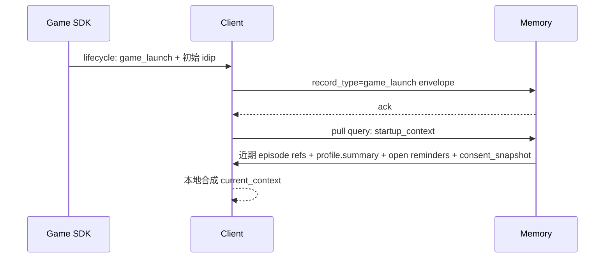

| 步骤 | 客户端 | 记忆系统 | 数据 / 回执 | 回写 |
| --- | --- | --- | --- | --- |
| 1 | 接收 SDK `game_launch` | 存 source_record | envelope ack | 是（事实源） |
| 2 | 上报 `idip_snapshot.initial` | 存初始状态 | ack | 是 |
| 3 | pull `startup_context` | 返回近期 episode refs + profile + consent | query response | 否 |
| 4 | 本地合成 `current_context` | 不参与 | — | 否（不回写完整对象） |

### 5.2 对局中

#### 5.2.1 有 SDK 实时事件（A 类游戏）

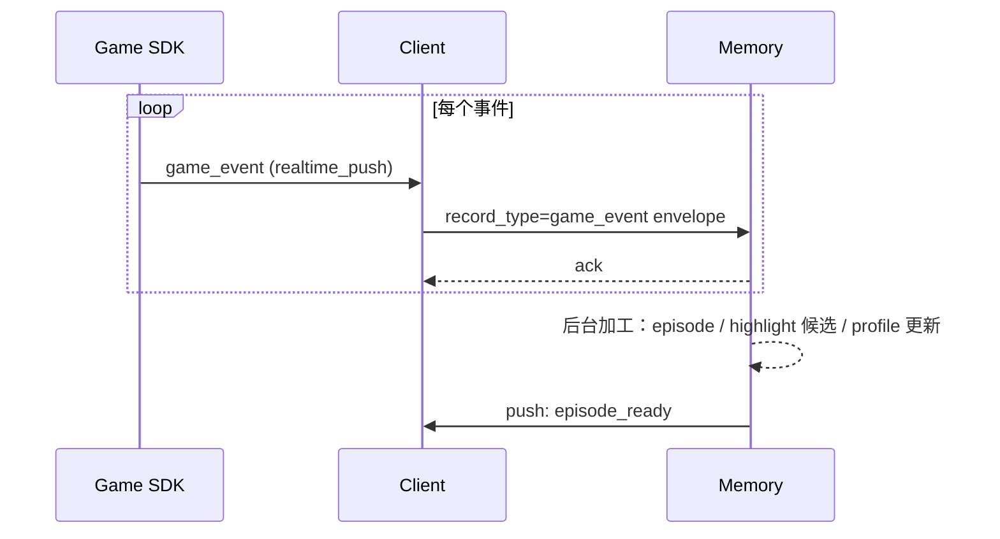

#### 5.2.2 无 SDK 实时事件（B 类游戏，靠 idip 心跳 diff）

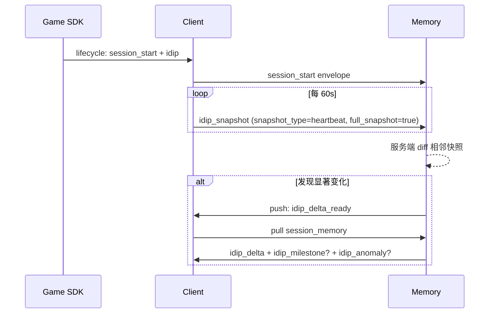

| 步骤 | 客户端 | 记忆系统 | 回写 |
| --- | --- | --- | --- |
| 1 | session_start + idip 上报 | 存初始 | 是 |
| 2 | 60s 心跳 idip_snapshot | 累积快照 | 是 |
| 3 | — | 服务端对比相邻快照，差异显著时生成 derived_memory | 否 |
| 4 | 收到 push 后 pull session_memory | 返回 delta / milestone / anomaly | 否 |

### 5.3 结算与复盘

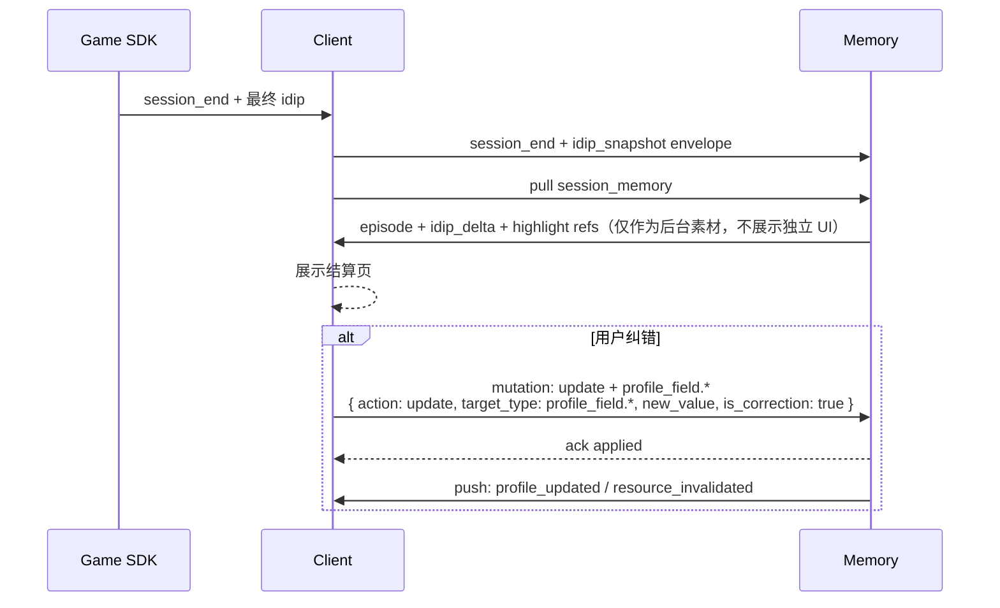

### 5.4 日记生成与保存

| 步骤 | 客户端 | 记忆系统 | 数据 / 回执 |
| --- | --- | --- | --- |
| 1 | 用户进入日记页 | — | — |
| 2 | pull `episode_detail` + `diary_detail`（候选素材已包含后台加工的 `highlight_event` 引用） | 返回候选 | query response |
| 3 | 客户端本地大模型生成日记草稿（不入 Memory）；记忆系统自动记录 `highlight_event` 作为日记素材，无需用户显式保存 | — | — |
| 4 | 用户编辑并保存 | — | — |
| 5 | mutation: `update + profile_field.*` / `update + diary_entry`（编辑标题/收藏 等）| 持久化 + 加工 | ack applied |
| 6 | 若引用原话：检查 `atomic_facts.quote_eligible=true` 且 `privacy_grants.diary_quote.granted=true` | 仅当两个条件都成立才允许引用 | — |

### 5.5 用户主动纠错 / 删除 / 重新总结

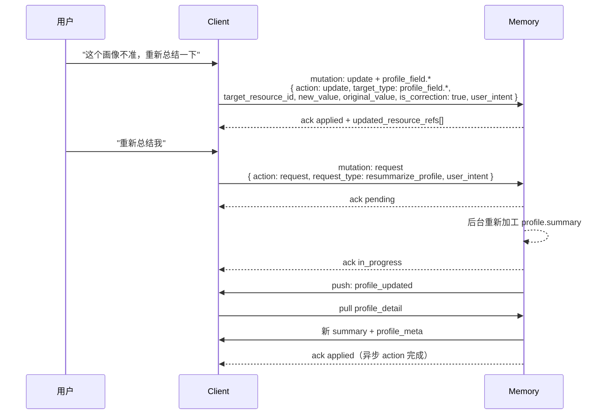

### 5.6 授权变更（含撤回反向清理）

**问题**：用户撤回某类授权后，记忆系统如何找出所有"依赖被撤回授权"的 derived_memory 并清理？数据约束见 §7.1，本节给完整时序。

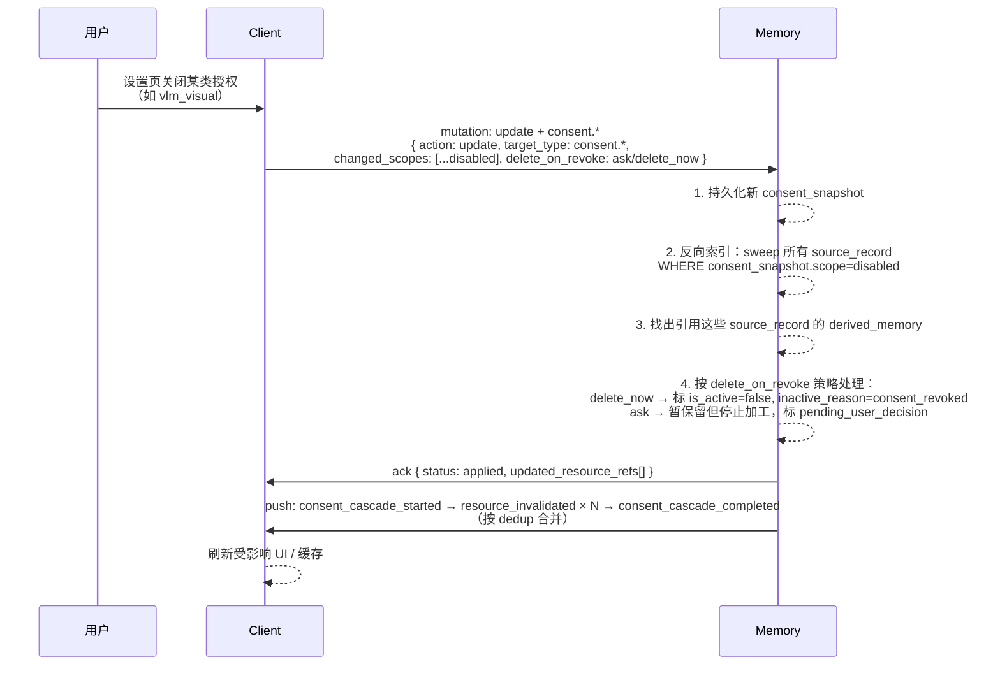

| 步骤 | 客户端 | 记忆系统 | 是否对用户可见 |
| --- | --- | --- | --- |
| 1 | 用户在设置页关闭某类授权（如 VLM） | — | 是 |
| 2 | 弹窗询问 `delete_on_revoke` 偏好（若用户未设默认值） | — | 是 |
| 3 | mutation: `update + consent.*`（含 `delete_on_revoke` 偏好） | — | — |
| 4 | — | 持久化新 consent_snapshot | — |
| 5 | — | 沿反向索引找出受影响 source_record + derived_memory | 后台 |
| 6 | — | 按策略标 `is_active=false, inactive_reason=consent_revoked` 或 `pending_user_decision` | 后台 |
| 7 | 收到 ack + push: `consent_cascade_started / completed` | — | 否（合并后只一次提示） |
| 8 | 刷新设置页 + 受影响页面 | — | 是 |
| 9 | （可选）设置页 → 隐私页 → 审计入口显示清理记录 | 提供 audit log | 是 |

**边界情况**：

| 情况 | 处理 |
| --- | --- |
| derived_memory 同时引用了多类授权的 source_record，其中一类被撤回 | 默认整条标失效；若 derived_memory 可仅基于剩余授权重新加工，触发"重新加工"任务 |
| 用户重新开启同类授权 | 不自动恢复已失效 derived_memory；用户可在设置页 / 画像页对单条记忆手动 `update + new_value.is_active=true` 或触发"重新生成" |
| user_action mutation（如 `save + free_form_note` / `update + diary_entry`）已用户确认 | 即使依赖的 vlm_observation 因撤回失效，也保留 `is_active=true`（用户确认权重高于源失效）；但 evidence_summary 中标注"原画面证据已不可用" |

### 5.7 VLM 强 / 弱感知

#### 5.7.1 强感知（实时陪伴，**仅视觉数据**不入记忆）

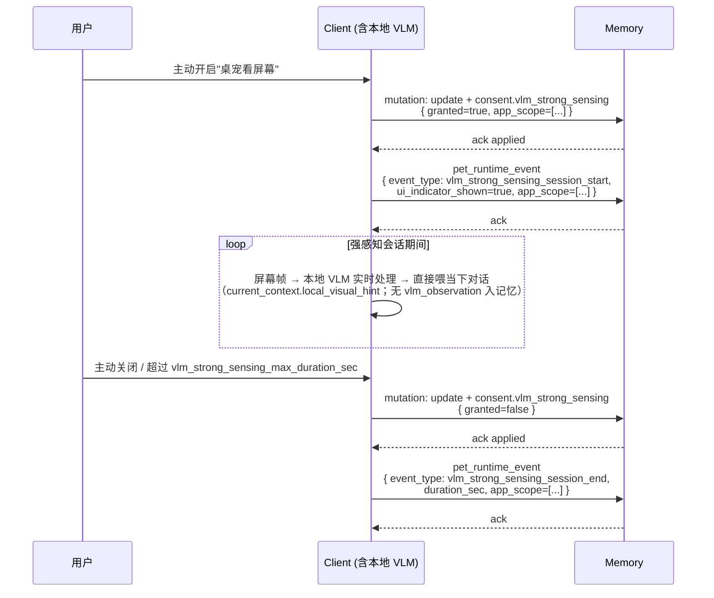

> 强感知期间画面语义只服务实时对话，**不**写 `vlm_observation`（即"视觉数据不入记忆"）。**其他 record_type 照常上报**：用户与桌宠的 `chat_message`（client_scene 用 `screen_share_chat` 标识）、`pc_signal`、`user_action` 等正常入记忆。强感知**专属新增**的跨系统审计事件有两类：①`update + consent.vlm_strong_sensing` mutation；②`pet_runtime_event` 会话起止审计。

#### 5.7.2 弱感知（长期数据源，入记忆）

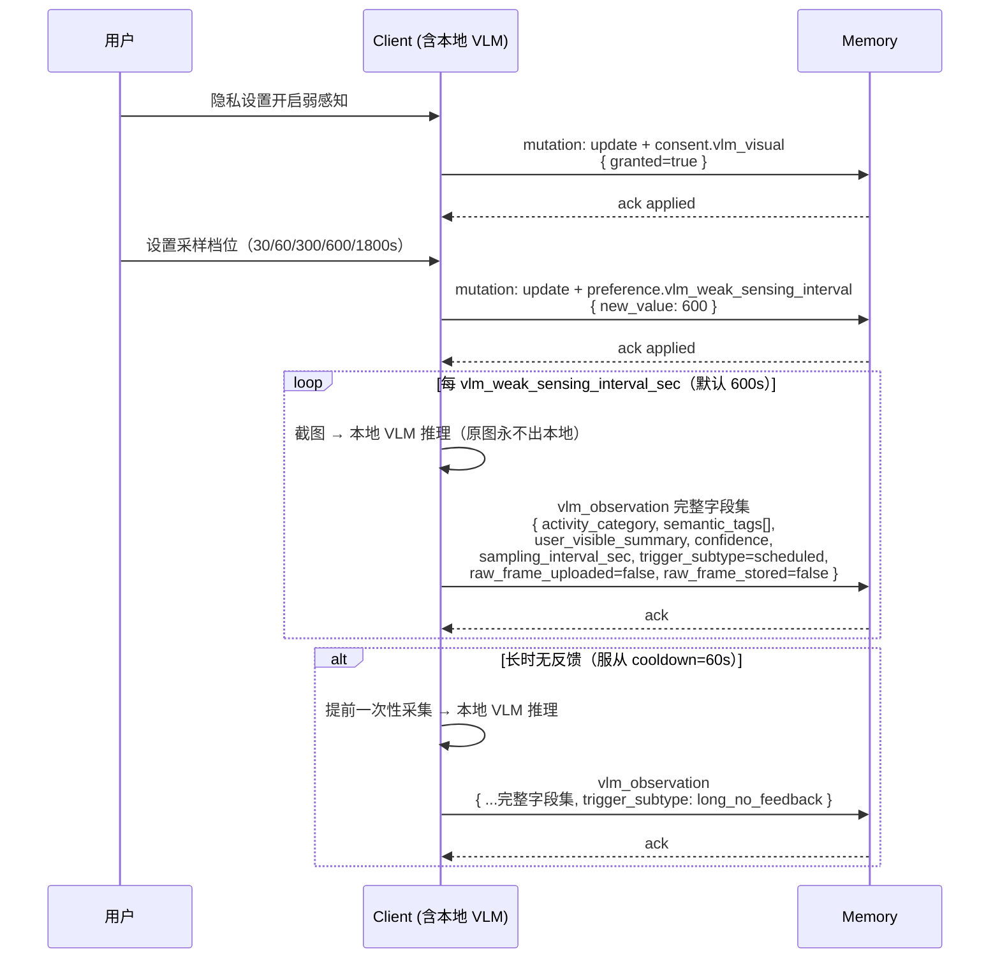

> 弱感知是 PC 端"画面层"的长期低频环境信号，完整字段（含 semantic_tags / user_visible_summary）入记忆作为长期数据源。原图永不出本地。

### 5.8 离线 → 网络恢复 → 批量补传

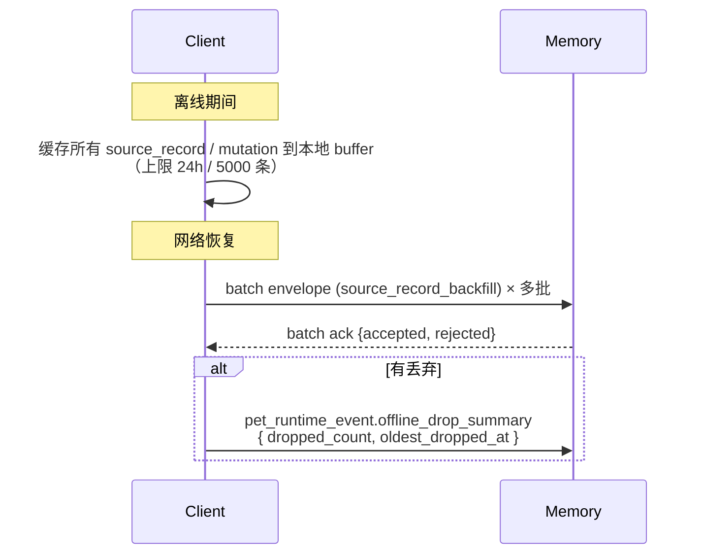

---

## 6. 优先级建议

| 优先级 | 数据 / 能力 | 原因 |
| --- | --- | --- |
| P0 | 统一 envelope 通用字段 | 没有统一外壳，后续数据源会散 |
| P0 | `game_id` + `game_user_id_pseudonym` | 多游戏 / 多用户隔离的最低要求 |
| P0 | 游戏通用事件 8 个（§3.1.2.1） | 所有接入游戏的最小闭环 |
| P0 | `idip_snapshot` 心跳 + 服务端 diff | 无 SDK 实时事件的游戏靠这条链路成立 |
| P0 | `chat_message` / `pet_runtime_event` 上报 | 用户主动表达 / 桌宠运行行为 |
| P0 | 用户控制 mutation（保存 / 删除 / 纠错 / 授权 / 重新总结） | 记忆系统信任底座 |
| P0 | `consent_snapshot_id` 反向索引 + 撤回清理 | 隐私合规底线 |
| P0 | Memory pull query 5 类（startup / conversation / profile / session / preferences） | 客户端按场景获取详情主路径 |
| P0 | Memory push 轻通知 + 去重 | 加工结果变化通知；不推大对象 |
| P0 | `profile_meta` / `profile.*` 核心字段 | 客户端解释 / 纠错 / 画像页基础 |
| P0 | `user_preferences` + `privacy_grants` 基础授权 | 用户控制根 |
| P0 | 证据链字段（record_id ↔ source_record_ids ↔ target_resource_id ↔ updated_resource_refs） | 闭环的连接器 |
| P1 | VLM 弱感知（完整字段集，入记忆作为长期数据源） | 画面层长期低频环境信号；行为画像 / 复盘 / 打扰判断的增强证据 |
| P2 | VLM 强感知会话审计（不入记忆，仅 mutation + pet_runtime_event） | 实时陪伴场景的隐私可审计 |
| P1 | PC 环境信号（§3.1.3 全部字段） | 打扰判断、场景理解、行为画像 |
| P1 | MCP 通道（经客户端中转） | 外部 app 元数据 / 任务标题 / 自生成摘要 |
| P1 | `episode` / `highlight_event` / `assessment` 详情消费 | 画像页 / 日记 / 复盘 / 角色测定 |
| P1 | 离线批量补传 | 弱网容错 |
| 扩展 | 系统音频 mood / bpm 派生信号 | 听音乐跳舞场景；待 PRIVACY_BOUNDARY 修订提案通过 |

---

## 7. 隐私与排除项

| 数据 | 是否进入跨系统 | 说明 |
| --- | --- | --- |
| Game SDK 结构化事件 | 是 | 标准化后作为事实源 |
| 完整 idip snapshot（含心跳） | 是 | 启动 / 关闭 / 心跳均可完整上报；服务端做 diff |
| 用户首方聊天 | 授权后是 | `privacy_grants.chat_content=true`；可删除 / 纠错 |
| 桌宠运行事件 | 是 | 桌宠消息送达 / 用户忽略 / 主动表达 |
| 用户显式操作（mutation） | 是 | 保存 / 删除 / 确认 / 纠错 / 授权变更 / 重新总结 |
| PC 低敏环境信号（§3.1.3） | 授权后是 | 标准化事实，不写完整时间线；窗口标题必须脱敏 |
| MCP app 白名单字段（经客户端中转） | 授权后是 | 只允许元数据 / 任务标题 / app 自生成摘要 / 来源类型 |
| **VLM 强感知语义结果** | **否** | mentor 反馈翻转：仅服务实时陪伴对话，**不**写 `vlm_observation`；跨系统只留 `update + consent.vlm_strong_sensing` mutation 与 `pet_runtime_event` 会话审计事件 |
| **VLM 弱感知完整语义结果** | **授权后是** | mentor 反馈翻转：作为长期数据源；按用户配置档位（30/60/300/600/1800s）定时采集；含 `activity_category` / `semantic_tags[]` / `user_visible_summary` / `confidence`；原图永不进 |
| profile / profile_meta / assessment | 是 | Memory 加工结果返回客户端；用户可删除 / 纠错 / 反馈 |
| highlight_event | 是 | Memory 后台加工，**完全后台对象**：用户无 mutation 入口，仅通过 diary_detail 间接访问；用户对高光的反馈通过对包含该高光的日记 feedback 间接传递 |
| user_preferences / privacy_grants | 是 | 用户显式设置，Memory 持久化 |
| **`current_context` 完整对象** | **否** | 客户端运行时判断，不是长期事实 |
| **原始截图 / 屏幕帧** | **否** | 客户端本地处理后丢弃 |
| **原始音频 / 人声 / 通话内容 / 转写文本** | **否** | 不在本分支跨系统范围 |
| **键盘字符流 / 输入法明文** | **否** | 永禁；只允许桶化统计 |
| **第三方 app 正文 / 邮件 / 文档 / 会议正文** | **否** | 即使有 MCP 授权也不允许 |
| **VLM 原图 / 帧 hash 可反查原图的引用** | **否** | 强 / 弱感知均永禁；客户端本地处理后即丢弃（`raw_frame_uploaded=false`，`raw_frame_stored=false`） |
| **真实账号 / 实名信息 / 付费记录** | **否** | 永禁；只用 `game_user_id_pseudonym` |

### 7.1 授权撤回的数据约束

| 约束 | 触发场景 | 时限 |
| --- | --- | --- |
| 撤回任一 `privacy_grants.*` 后，受影响 `derived_memory` 必须标 `is_active=false, inactive_reason=consent_revoked` | 用户在隐私设置页关闭某类授权 → `update + consent.*` mutation 写入新 consent_snapshot | **24 小时内**完成；记忆系统沿 `consent_snapshot_id` 反向索引 `source_record` → 反向索引引用它的 `derived_memory` → 批量失效 |
| 客户端必须收到 `consent_cascade_started` push（提示"正在清理 N 条受影响记忆"）和 `consent_cascade_completed` push（完成提示） | 同上 | push 时机由记忆系统决定，建议清理开始 / 完成时各推一次 |
| `delete_on_revoke` 用户偏好（`delete_now` / `ask` / `keep_silent`） | 用户首次撤回授权时弹窗询问 | 存储于 `user_control_state.deletion_policy.delete_on_revoke` |
| 反向清理超时告警 `consent_revoke_overdue` | 清理超过 24h 未完成 | 记忆系统记录审计日志，可投递给用户（详见 §8 待确认问题 #7） |

> 反向清理的具体技术机制（反向索引设计、清理流程图）属于工程实施细节，由 Engineering Thread 在工程文档定义；本数据需求文档只规定数据约束与时限。流程时序图见 §5 业务场景接力图的"授权变更场景"。

---

## 8. 待确认问题

| # | 问题 | 建议 |
| --- | --- | --- |
| 1 | `idip_snapshot` 心跳间隔默认 60s 是否需要按游戏类型差异化？ | 先用 60s 起步，按游戏接入实测调整，最终值锁在 game 接入配置 |
| 2 | 离线 buffer 上限 24h / 5000 条是否合理？ | Engineering 压测后确认；超出按 §3.3 规则丢弃并审计上报 |
| 3 | 游戏 `custom_fields` schema review 由谁拍板？ | 建议 PM + Engineering + 游戏接入方三方 review；首批游戏接入时建模板 |
| 4 | Memory pull query SLA P99 ≤ 200ms / 详情类 ≤ 2s 是否可达？ | Engineering 服务架构选型后回填 |
| 5 | 日记 / 复盘正文（客户端本地大模型生成）是否回写 Memory？ | 默认不回写生成正文；用户保存为日记成品时才作为 user_action 写入 |
| 6 | 弱感知 `trigger_subtype` 枚举（`scheduled` / `long_no_feedback` / `post_session` / `pre_proactive_speak`）是否需要细化分类？ | 建议先用 4 档起步，按运营数据反馈再扩 |
| 7 | `consent_revoke_overdue` 告警如何投递给用户？ | 建议 push: `consent_revoke_overdue_warning` + 设置页红点；待 Design 收口 |
| 8 | MCP app 若客户端长期离线，是否允许 MCP server 端临时缓存？ | 默认不允许；客户端是数据流唯一节点 |
| 9 | 服务端 idip diff 的"显著变化"阈值如何定义？ | 由 Memory 团队定可配置规则；建议起点：level / rank / chapter / gold > 阈值 |
| 10 | 双向字段拆名（`_observed` / `_derived` / `_inferred` / `_user_set`）是否需要在 schema 检查工具中强制？ | 建议是；Engineering 实施时加 schema lint |
| 11 | profile_meta 新增的 `node_version` / 并发控制是否 v2.2 引入？ | 当前桌宠单端使用，多端并发场景极少；v2.1 不引入；如未来上线多端（桌面 + 网页 + 移动）同步，v2.2 加 `node_version` + `version_conflict` ack 子类型 |
| 12 | `mutability_policy` 字段映射是否需要在每个游戏接入时按游戏特性微调？ | 建议默认遵守 §4.1.3.14 映射表；单个游戏如有特殊需求（如某游戏的 `game_goals_inferred` 应升级为 `ai_inferred_writable`），由 PM + Engineering review 后写入该游戏接入配置 |
| 13 | `review_status=pending_user_review` 的字段如果 30 天用户都没看 / 没反馈，怎么处理？ | 建议 30 天后自动转 `is_active=false, inactive_reason=expired`；记忆系统不再持续推送；用户在设置页审计入口仍可查看 |

---

## 9. 验收标准

| # | 标准 | 验收方式 |
| --- | --- | --- |
| 1 | **只包含跨系统数据** | 全文 grep `Client → Memory` / `Memory → Client` / `Client ↔ Memory`，无方向字段的 row 不应出现 |
| 2 | **数据对象三分类完整** | 每条数据都标 source_record / derived_memory / user_control_state 之一 |
| 3 | **双向字段全部拆名** | 全文不存在"方向同时是 Client→Memory 且 Memory→Client"的字段 |
| 4 | **envelope 统一但不大包** | 每类数据有独立 record_type，按业务时机分别上报，没有"一个大 JSON 装所有" |
| 5 | **游戏最小闭环成立** | 无 SDK 实时事件的游戏，靠 `game_launch` + 60s `idip_snapshot` 心跳 + `game_close` 能形成 episode 与近期聚合 |
| 6 | **VLM 边界翻转落实** | 强感知**不**写 `vlm_observation`，仅留 `update + consent.vlm_strong_sensing` mutation 与 `pet_runtime_event` 会话审计；弱感知用**完整字段集** + 用户可调采样档位（30/60/300/600/1800s）；原图永不进 |
| 7 | **MCP 路径单一** | MCP app → 客户端 → 记忆系统；记忆系统不直连任何 MCP server |
| 8 | **current_context 边界清晰** | 客户端本地合成，不回写完整对象；本文档不出现 current_context 字段表 |
| 9 | **Push 不推大对象** | 每条 push 只有 summary + resource_refs[]；客户端按需 pull |
| 10 | **Mutation 5 action 通用化** | 全文不出现旧 13 个 `mutation_type` 作为正源；统一用 `action × target_type` 表达；v2 → v2.1 旧 mutation_type 到新 `action × target_type` 的映射散见 §3.2 各示例与变更说明 #18 |
| 11 | **`feedback` vs `update` schema 区分** | `feedback` schema **禁止**带 `new_value`（违反即 `rejected: invalid_payload`，`feedback_value=confirm` 也不例外）；`update` schema **必带** `new_value`；`feedback_value=confirm` 仅提升 `profile_meta.confidence` + `user_attested=true`，不改 `generation_method`；schema lint 强制校验 |
| 12 | **Ack 状态机按 action 分化** | 同步 action（`save` / `update` / `delete` / `feedback`）用 `applied / rejected / deferred`；异步 action（`request`）用 `pending / in_progress / applied / rejected / deferred`；批量用 `applied / partial_success / rejected` |
| 13 | **证据链可串通** | 任选一条 derived_memory，能反查到 source_record；任选一条 mutation 能找到 target_resource_id 与 updated_resource_refs |
| 14 | **授权撤回有反向清理机制** | 撤回任一 `privacy_grants.*` 后，§5.6 流程完成，受影响 derived_memory 在 24h 内标失效 |
| 15 | **运营参数有默认推荐值** | §2.4 全部参数都有起点值与单位，标"Engineering 可调优" |
| 16 | **场景接力图覆盖核心流程** | §5 八个场景的 Mermaid 图与表格能让读者一眼看完闭环；所有 mutation 写法已对齐新 `action × target_type` |
| 17 | **字段权限策略 `mutability_policy` 落地** | 每条 derived_memory 字段 `profile_meta.mutability_policy` 必填且属 `user_only` / `user_primary_ai_candidate` / `ai_inferred_writable` 三选一；AI 后台流程尝试写入 `user_only` 字段时记忆系统返回 `rejected: policy_violation`；详见 §4.1.3.14 |
| 18 | **`review_status` 状态机落地** | `user_only` 字段无 review；`user_primary_ai_candidate` 字段 AI 写入强制 `pending_user_review`，用户 `feedback=confirm` / `update` 后升 `accepted`；`ai_inferred_writable` 字段 AI 写入直接 `accepted`；客户端 / 画像服务由 review_status 派生主 / 缓冲页归属，**不持久化** display_tier |
| 19 | **时间戳三元组语义独立** | `last_user_edited_at`（仅 update / correct 触发）/ `last_confirmed_at`（仅 feedback=confirm 触发）/ `last_system_processed_at`（系统后台触发）三者独立，记忆系统加工时**保留 `last_user_edited_at` 非空字段的当前值** |
| 20 | **`feedback_reason` 对齐 user-portrait PRD** | `feedback_reason` 为 enum：`accurate` / `not_accurate` / `not_like_me` / `wrong_tone` / `too_private` / `boring` / `other`；与 PRD §七.5 portrait_feedback.reason 一致（含 Diary 引入的 `boring`）|
| 21 | **`reject_reason` 子类型完整** | 所有 `rejected` ack 必带 `reject_reason` 子类型（permission_denied / target_not_found / target_inactive / schema_violation / version_conflict / policy_violation / unrecoverable_state / consent_cascade_blocked），详见 §3.2.5 |

---

> **变更说明（v2.1）**：本版本相对 v2 做了围绕 mentor 反馈与审查员清单的**精准修订**，主要变化：
>
> **v2.1 新增（mentor 反馈 + 审查员清单）**：
> 1. **VLM 角色翻转**（mentor 反馈）：强感知 = 实时陪伴，**仅视觉数据（`vlm_observation`）不入记忆**（chat / pc_signal / user_action 等其他 record_type 在强感知期间照常上报，见变更说明 #24）；弱感知 = 用户可调档位（30/60/300/600/1800s）定时采集**入记忆作为长期数据源**。重写 §3.1.5 + §5.7。
> 2. **触发时机精简（v2.1 终版）**：原 9 个混杂术语 → 中间过渡 5 个 `trigger_cause` → 最终精简为 **2 个 `trigger_cause`**（`scheduled` / `event_driven`，2 选 1）+ 4 个 `delivery_mode`（`realtime` / `aggregated` / `batched_recovery` / `batched_startup`）。"是否 mutation""数据来源""阈值跨越"等维度交由 `record_type` 区分。详见 §2.3。
> 3. **Mutation 通用化**：13 个枚举式 `mutation_type` → 中间版 7 个 → 最终精简为 **5 个通用 `action`**（`save` / `update` / `delete` / `request` / `feedback`）× N 个 `target_type`；`correct` / `restore` 合并入 `update`（用 `is_correction` / `new_value.is_active` 子参数区分意图），`confirm` 合并入 `feedback`（作为 `feedback_value` 之一）。详见 §3.2。
> 4. **Ack 状态机分化**：同步 / 异步 / 批量三类各自的可达状态分别定义。详见 §3.2.5 Ack 回执。
> 5. **§4.1.3 详细化**：15 个加工记忆字段族每族一张完整字段表，含字段名 / 含义 / 数据类型 / 示例值 / 触发返回的 query_type / 优先级。
> 6. **§3.1.3 所有 PC 信号子表补"含义"列**，便于读者快速理解字段语义。
> 7. **§3.1.1 chat / pet_runtime_event payload 字段表新增**（§3.1.1.2 / §3.1.1.3），不再只给 enum 概述。
> 8. **§3.1.2.5 `common_fields` 字段表新增**，承载跨游戏共有的会话 / 关卡 / 难度 / 区服等结构化字段。
> 9. **§3.1.2.2 IDIP 心跳澄清**：心跳并非 B 类游戏专享；**所有游戏适用**——A 类兜底 120s，B 类主通道 60s。
> 10. **§3.1.3.5 PC 信号示例**按 4 个典型子类（active_app / input_digest / now_playing / tab + OSA Bridge）各给一个示例。
> 11. **§3.1.4 MCP MVP 接入清单**扩展到 5 个领域：工作 / 购物 / 娱乐 / 音乐 / 社交。
> 12. **§2.4 运营参数全部补单位**（秒 / 分钟 / 小时 / 毫秒 / 条），并新增弱感知 / MCP 拉取相关参数。
> 13. **profile 字段权限策略（对齐 user-portrait PRD）**：profile_meta 新增 `mutability_policy`（user_only / user_primary_ai_candidate / ai_inferred_writable 三档）、`review_status`（accepted / pending_user_review / rejected 状态机）、`last_user_edited_at` 三个字段；§4.2.6 / §4.2.7 + §4.1.3.14 mutability_policy 表 `profile_identity` / `pet_relationship` 改为 user_only 类（删除 inferred 候选子表，指向 §4.2 user_control_state）。
> 14. **时间戳三元组**：`last_user_edited_at` / `last_confirmed_at`（语义收窄）/ `last_system_processed_at` 拆分独立，三者不互相覆盖。
> 15. **`feedback_reason` 改为 enum**：`accurate` / `not_accurate` / `not_like_me` / `wrong_tone` / `too_private` / `boring` / `other`，对齐 user-portrait PRD §七.5（含 Diary 引入的 `boring`）。
> 16. **`reject_reason` 子类型并入 §3.2.5**：所有 `rejected` ack 必带子类型，含 `policy_violation`（违反 mutability_policy）等 8 个子类型，便于客户端可解释 / 可重试。
> 17. **`memory_digest` 删除**：原 v2 设计的"周期摘要预计算缓存"与 `episode` / `profile.summary` / `emotion_signal_derived.recent_distribution` 字段存在数据冗余，且未达成本/性能引入门槛。改为客户端 / 记忆系统在 `query_type=startup_context` 时**实时聚合**，不持久化 digest；相应删除 `push_type=memory_digest_ready`。详见 §4.1.3.10。
> 18. **原 §5 Mutation / Ack 双向闭环整章删除**：v2 的 §5 包含 mermaid 状态机图、客户端处理建议等**工程实施细节**，不属于"数据需求文档"范畴。整章删除后做四处补丁：①ack envelope 字段定义并入 §3.2.5（mutation 配套小节，原 §3.2.6 在 §3.2 子节跳号修复后改为 §3.2.5）；②证据链贯穿合并为 §1.4 数据流原则第 7 条；③授权撤回 mermaid 时序图并入 §5.6 授权变更业务场景；④授权撤回的数据约束（24h 清理时限）汇总在 §7.1 隐私撤回数据约束。**后续 §6-§10 全部 -1**（场景接力图 §5、优先级 §6、隐私 §7、待确认 §8、验收 §9）。工程实施细节（状态机 mermaid、客户端处理建议）交由 Engineering Thread 在工程文档另行定义。
> 19. **隐私 / 账号 / 弱感知补丁（基于 §8 待确认问题二次审视）**：
>     - **`game_user_id_pseudonym` 每游戏独立**（隐私优先）：同一用户在不同游戏间的 pseudonym 不同，记忆系统不可跨游戏关联画像。详见 §2.2 envelope 字段表说明。
>     - **envelope 新增 `game_sub_account_id` 字段**（P1，可选）：用户在同一游戏内的小号 / 大号 / 测试号区分；空表示主账号或游戏无多账号机制；同一 game_user_id_pseudonym 下不同 game_sub_account_id 的画像**互不合并**。
>     - **弱感知 30s / 60s 档位限制**：普通用户在设置页可见档位为 300 / 600（默认）/ 1800 / off；30s 和 60s 因电池 / 性能 / 隐私感知压力大，仅在"高级设置页"开放并需弹窗二次确认。详见 §3.1.5.4 + §2.4。
>     - **不补的待确认项**：①数据保留期限（不属本文档，由记忆系统团队内部决定）；②MCP MVP 14 app 具体优先级（保持 §3.1.4 已写的 5 领域顺序）；③character_resonance_assessment 与 user-portrait PRD 字段对齐（PRD 多出字段由画像服务派生，不入记忆系统）；④多 OS 账户共用桌宠（桌宠按 OS 账户独立安装配置，envelope 不加 os_user_id_hash）。
> 20. **Diary 模块对接补丁（基于 Diary PRD 二次审视）**：
>     - **`feedback_reason` enum 加 `boring`**：日记特有的"内容无聊"反馈选项，§3.2.2 + §4.1.3.13 同步。
>     - **`vlm_visual.allow_local_save_for_diary` 子开关**：合并 Diary `privacy_grants.diary_screenshot` 到 vlm_visual 根开关下，作为子开关控制"高光时刻本地截图保存为日记插图"（原图永不上传，仅本地保留）。§3.1.5.4 新增。
>     - **`mailbox_summary` / `diary_list` / `diary_detail` 三个 query_type 新增**：客户端 pull 时记忆系统实时聚合 `unread_count` / `latest_unread_diary_id` / `has_new_diary_bubble`，**不持久化** mailbox_status。§4.1.2 新增。
>     - **`diary_reply` 新增 source_record**：作为独立 record_type，含 `reply_id` / `diary_id` / `reply_text` / `reply_intent`（positive/negative/correction/preference/casual/delete_request） / `created_at` 字段。记忆系统据 `reply_intent` 派生 feedback / 触发 derived_memory 更新。§3.1.6 新增。
>     - **`diary_entry` target_type 归类调整（v2.1 终版）**：原先列在 A 类（用户主动 save 创建），但 Diary PRD 实际流程是"每生理日 Diary 模块**自动生成 + 自动持久化**"，没有用户主动保存动作。已**移到 B 类**（Memory 自动加工的顶层资源，与 episode / atomic_fact 同类）；`save + diary_entry` mutation 路径**移除**；用户对日记的 mutation 入口仅剩 `update`（编辑标题/收藏/mailbox_status）/ `delete` / `feedback`。payload schema 仍由 Diary PRD §七.2 提供。
>     - **不补的 Diary 概念**：`mailbox_status`（实时聚合）/ `pet_reaction`（客户端现场生成）/ `diary_entry` UI 字段（card_visual_type / detail_layout_type 等）/ `character_config`（合作游戏接入资产）。
> 21. **高光页 UI 概念完全删除**：v2.1 决策"高光不作为独立 UI 页面，高光时刻通过日记自然提及"。具体修订：①删除 `highlight_recall` client_scene / `highlight_detail` query_type / `highlight_ready` push_type；②删除 save / update / delete / feedback + highlight 所有用户 mutation 入口（highlight 完全 ai_inferred_writable 后台化）；③§5.4 标题改为"日记生成与保存"，流程图删除"用户保存高光"步骤；④`proactive_congratulate` 桌宠主动祝贺改由 idip_milestone push 触发；⑤§4.1.3.9 highlight_event 字段表完整保留，但 query_type 列从 highlight_detail 改为 diary_detail（仅通过日记间接访问）；⑥highlight_event.source enum 去掉 `user_saved`。用户对高光的反馈通过对包含该高光的日记 feedback 间接传递。
> 24. **强感知边界修正 —— 仅视觉数据不入记忆**：v2.1 中间版曾收紧到"强感知会话期间客户端整段不上报任何 source_record"（chat / pc_signal / vlm 全屏蔽）。v2.1 终版**复议后修正**：强感知"不入记忆"边界过宽，错误把"对桌宠说的话 / 用户在 UI 上的操作"也排除在外，与"桌宠是用户记忆"基本盘冲突。**最终边界**：强感知期间**仅 `vlm_observation`（屏幕画面 / 视觉语义结果）不入记忆**；`chat_message` / `pc_signal` / `user_action` 等其他 record_type **正常上报**，只是 chat 用 `client_scene=screen_share_chat` 标识场景。设计直觉类比从"屏幕共享 = 全程脱网"修正为"让朋友看一眼屏幕 —— 朋友没拍照、没记录画面，但你和朋友期间聊了什么、点了什么按钮照常作为你的记忆留存"。具体修订：①§3.1.1.5 类别 A 重新加入 `screen_share_chat` 行；②§3.1.5.1 改写"画面数据流 / 其他数据"两行 + 关键约束改为仅围绕 vlm_observation；③标题改为"强感知（实时陪伴，**仅视觉数据**不入记忆）"。
> 23. **`game_category` 引入 + `common_fields` 分层重构**：解决原 common_fields 里 `match_id`（PvP）/ `level_id`（PvE）/ `difficulty` / `team_size` 等字段都标"否"必填、无法说清何时填的问题。①新增 **`game_category`** 字段（必填 enum：`pvp_battle` / `pve_quest` / `pve_roguelike` / `open_world` / `card_strategy` / `simulation` / `other`），游戏接入时固定，整个生命周期不变；②原 common_fields 拆为**三层**：§3.1.2.4 第一层（跨所有游戏通用，5 字段 session_id / game_category / game_mode / client_locale / game_version）+ §3.1.2.5 第二层（按 game_category 适用的字段示例，6 类 + other）+ §3.1.2.3 第三层 custom_fields（单游戏专属）；③明确 `game_category` 与 `game_mode` 的边界（前者接入时固定，后者运行时可变）；④第二层字段是 PM 推荐集，每游戏接入时三方 review schema。
> 22. **§3.2.3 target_type 重构为三表**：原 §3.2.3 单表存在 8 个问题（diary_reply 混淆 / "谁创建"列维度混乱 / 标题过简 / 缺 mutability_policy 列 / 示例 vs 完整清单模糊 / 排序混乱 / 与 §3.2.1 关系不清 / assessment 命名不一致）。重构为三个小节：①§3.2.3.1 命名约定与三类划分（**A 类用户主动 save / B 类 Memory 加工 / C 类子命名空间字段**）；②§3.2.3.2 target_type 示例表（按 A/B/C 分组，含 mutability_policy + 详见章节列）；③§3.2.3.3 action × target_type 矩阵（5 action × 12 target 类型完整可达性）。同时声明 highlight_event 不在 target_type 表内（v2.1 完全后台化）。
> 26. **chat_message 字段调整**：①删除 `reply_to_message_id`（桌宠对话是 1v1 + 时序线性，"引用回复历史某条"产品场景几乎不存在；日记回复已由 §3.1.6 `diary_reply.diary_id` 承载，无需在 chat 上再设字段）；②新增 `game_session_id`（关联当前游戏对局，让 Memory 能把"对局中聊的"与"具体哪一局"关联，跨对局复盘场景受益）；③新增 `message_sequence`（会话内单调递增序号，离线 / 弱网下防乱序，比纯 occurred_at 排序更可靠）。两个新字段都 P1 可选。
> 25. **§4.1.3 / §4.2 分层修正：profile_identity / pet_relationship 移到 §4.2**：原 §4.1.3.4 / §4.1.3.5 是 `user_only` 类占位章节（用户独占设置，AI 不参与推断），与 §4.1.3 章节定位"桌宠能从记忆系统读到的内容（derived_memory）"不符。v2.1 终版修订：①删除 §4.1.3.4 / §4.1.3.5 占位章节；②§4.1.3.6-§4.1.3.16 章节号全部 -2 顺移到 §4.1.3.4-§4.1.3.14；③§4.2 新增 §4.2.6 `profile_identity_user_set` + §4.2.7 `pet_relationship_user_set` 详细字段表；④全文 §4.1.3.X 引用同步 -2；⑤清理"资源族"工程化措辞为"字段族"。修订后 §4.1.3 纯 derived_memory + §4.2 纯 user_control_state，分层清晰。
>
> **v2 → v1 既有变化（保留）**：
> 1. 骨架从"传输契约 + 数据类别 + 场景"三层并列改为"按数据流向（上报 / 返回 / mutation）单线索"。
> 2. 删除 v1 §4.8 `current_context` 字段表（纯本地对象不在本文档范围）。
> 3. v1 §4.x 13 个业务类别表合并入 §3.1（事实源）/ §4.1（加工记忆）/ §4.2（控制状态），同一数据只讲一次。
> 4. 新增 §1.2 客户端数据来源全貌图、§2.4 运营参数推荐值表、§5.6 授权撤回业务场景 + §7.1 数据约束、§5 八个场景接力图。
> 5. 双向字段全部拆名（`emotion_signal_observed` / `_derived`，`playstyle_tags_user_set` / `_inferred` 等）。
> 6. 游戏数据明确"通用事件清单 + 自定义事件 + IDIP 心跳 + 服务端 diff"四件套。
> 7. MCP 路径明确"经客户端中转"。
> 8. PC 环境信号（v1 §4.2 + §4.3 + 多个 v2.5 通道）合并为 §3.1.3 一节，按子表分类。
