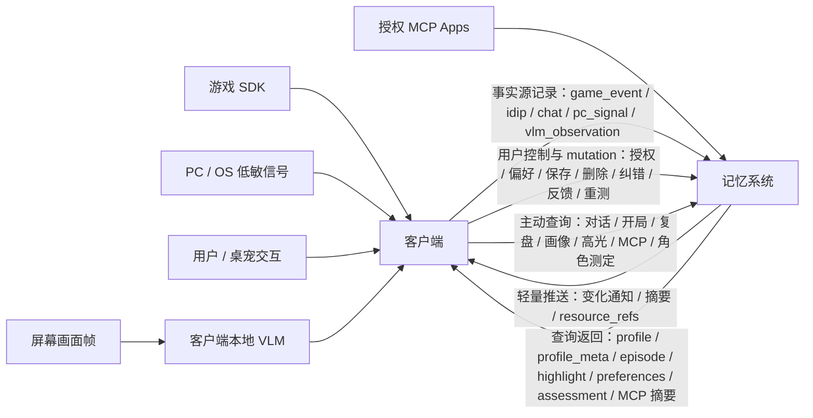

# Data Flow Requirement Specification: Memory System ↔ Client

## 0.概述

- 客户端负责采集、标准化、上报、消费和回写；
- ​记忆系统负责接收、存储、加工、查询、推送、删除与解释。

本文件的核心：

1. 哪些数据会从客户端进入记忆系统。
2. 哪些数据会从记忆系统返回客户端。
3. 哪些客户端本地判断不能完整回写，只能回写其事实源或业务确认后的子结果。
4. 每类数据在什么业务场景、什么触发时机、用什么方式传输。

---

## 1. 背景与目标

### 1.1 问题定义

| 维度 | 客户端需要什么 | 记忆系统需要提供什么 |
|---|---|---|
| 过去发生过什么 | 对话、游戏事件、用户保存、高光、纠错 | 可追溯的事实源、摘要、画像、证据链 |
| 用户现在在做什么 | 游戏实时事件、PC 状态、本地 VLM 语义、当前会话状态 | 可查询的历史上下文与近期记忆材料 |
| 用户希望桌宠怎么陪 | 偏好、授权、打扰边界、反馈 | 长期稳定的 preference / profile / consent 状态 |
| 哪些内容可被记住 | 用户确认、业务确认、隐私边界 | 写入规则、删除 / 纠错 / 失效机制 |

### 1.2 本文档目标

| 目标 | 说明 |
| --- | --- |
| 定义**跨系统数据** | 只写`客户端 ↔ 记忆系统`之间移动的数据 |
| 定义**触发时机** | 明确`实时事件`、`生命周期快照`、`周期心跳`、`批量补传`、`用户触发`、`后台加工推送` |
| 定义**传输方式** | 统一 envelope，但不把所有数据打成一个大包 |
| 定义**证据链** | 加工结果必须尽量追溯到 `source_record_ids[]` |
| 定义 **VLM 边界** | 客户端本地处理 VLM；原图不进记忆系统；语义结果按场景选择性回写 |

---

## 2. 核心分工与数据原则

### 2.1 系统分工

| 系统 | 负责 | 不负责 |
| --- | --- | --- |
| **客户端** | 1. 接收 Game SDK 数据并将其统一标准化； | 1. 不长期保存完整记忆； |
| **** | 2. 采集 PC / OS 低敏状态，并只上传允许进入 Memory 的标准化事实； | 2. 不把临时判断伪装成长期事实； |
| **** | 3. 本地处理 VLM，必要时只回写语义结果，不上传原图； | 3. 不把高敏原始数据上传给 Memory； |
| **** | 4. 拉取 Memory 返回的 `profile`、`profile_meta`、`episode`、`highlight_event`、`user_preferences`、MCP 摘要、角色相似度结果等数据； | 4. 不绕过 Memory 自行决定长期记忆的有效性； |
| **** | 5. 综合“Memory 返回 + 游戏实时数据 + PC 状态 + 本地 VLM”生成本地 `current_context`； | 5. 不把第三方 app 正文、窗口全文、原始音频、键盘字符流写入 Memory； |
| **** | 6. 回写用户保存、删除、纠错、反馈、授权、偏好、重测等 mutation； |  |
| **记忆系统** | 1. 作为数据舱接收客户端上报的标准化事实源； | 1. 不直接采集游戏 SDK； |
| **** | 2. 持久化用户授权、偏好、删除策略、记忆控制等显式配置； | 2. 不直接读用户屏幕或接收 VLM 原图； |
| **** | 3. 把事实源整理成客户端可消费的 `atomic_facts`、`episode`、`profile`、`profile_meta`、`highlight_event`、`memory_digest`、角色相似度结果等； | 3. 不决定桌宠当下是否开口； |
|  | 4. 接收客户端按业务场景发起的 pull query，返回详情数据； | 4. 不接收未授权 MCP app 数据或第三方正文内容； |
|  | 5. 后台加工结果变化时，只 push 变化通知和轻摘要，详情由客户端按需 pull； |  |
|  | 6. 执行保存、删除、纠错、授权变更、偏好变更、重测等 mutation，并返回处理回执（ack）； |  |
| **游戏 SDK** | 向客户端提供游戏生命周期、状态快照、实时事件和游戏自定义字段 | 不直接绕过客户端写入记忆系统 |
| **授权 MCP apps** | 在用户授权后向 Memory 提供白名单范围内的 app 元数据 / 任务标题 / app 自生成摘要 | 不向客户端或 Memory 暴露聊天、邮件、文档、会议正文和附件内容 |

### 2.2 数据对象分类

> 数据对象分类只描述 Envelope 内 payload 的业务性质，不等于传输格式。 
> ​Client ↔ Memory 之间的实际数据传送最终都必须按第 3 章用 Envelope 包装： 
> `​source_record` 通过上报 Envelope 发送 
> `​user_control_state `通过 query / mutation / consent Envelope 同步 
> `​derived_memory `通过 query response / push Envelope 返回。

| 概念 | 定义 | 解释 |
| --- | --- | --- |
| `source_record` | 事实源记录 | 不管内容来自游戏内、授权数据源、用户 PC 操作，还是用户与桌宠交互，只要由客户端拿到、整理成标准化结构，并且内容保持 raw，就属于上报给记忆系统的事实源记录。 |
| `derived_memory` | 加工记忆 | 记忆系统基于 `source_records` 加工出的客户端可消费记忆，例如原子事实、情节、画像、高光、摘要、角色相似度结果等。 |
| `user_control_state` | 用户控制状态 | 用户显式设置并由 Memory 持久化、客户端读取执行的授权、偏好、删除策略、纠错规则和确认状态。 |

### 2.3 数据流原则

| 原则 | 说明 |
| --- | --- |
| 先有原始事实，再有加工记忆 | 客户端先把 raw 的事实源上报给 Memory，Memory 再基于这些事实生成画像、情节、高光、摘要、角色测定等加工结果。 |
| 加工结果必须能解释来源 | 客户端展示画像、高光、角色测定等结果时，应能让用户知道这条结果大概来自哪些聊天、游戏事件、PC 信号或 VLM 语义结果。 |
| 用户纠错 / 删除要能影响正确对象 | 用户说“不准”“删除”“别记这个”时，客户端不能只发一句自然语言给 Memory，而要能指向要改的记忆或证据范围。 |
| 授权变化会影响已有记忆 | 用户撤回某类授权后，Memory 需要知道哪些加工结果依赖这类数据，从而停用、删除或重新加工。 |

### 2.4 总体数据流



---

## 3. 传输契约

### 3.1 统一上报 Envelope

统一 envelope 只统一外壳，不要求所有数据一起上传。每类数据按自己的触发时机单独发送，也允许离线后批量补传。

| 数据 | 解释 | 格式 | 示例值 | 数据移动方向 | 传送方式 | 消费侧获取的时机 / 场景 | 消费侧回写的时机 / 场景 | 优先级 |
| --- | --- | --- | --- | --- | --- | --- | --- | --- |
| `envelope_version` | 上报协议版本 | string | `"v1.0"` | Client → Memory | 所有上报都携带 | 不直接消费 | 协议升级时变更 | P0 |
| `record_id` | 事实源唯一 ID | string | `"src_game_event_001"` | Client → Memory | 单条 / 批量均携带 | Memory 返回 `source_record_ids[]` 时客户端可反查 | 客户端生成并保证本地去重 | P0 |
| `record_type` | 事实源类型 | enum | `game_event` | Client → Memory | 按事件类型独立发送 | 客户端查询记忆详情时识别来源 | 客户端上报时填写 | P0 |
| `game_id` | 游戏标识 | string | `"game_abc"` | Client → Memory / Memory → Client | 所有游戏相关数据必带 | 客户端按当前游戏过滤记忆 | 游戏切换、启动、关闭、查询时都带 | P0 |
| `game_user_id_pseudonym` | 游戏用户账号脱敏标识 | string | `"u_hash_123"` | Client → Memory / Memory → Client | 所有用户相关数据必带 | 客户端拉取该用户在该游戏下的记忆 | 首次绑定账号、上报任意数据时带 | P0 |
| `occurred_at` | 事件实际发生时间 | ISO 8601 | `"2026-05-18T21:10:00Z"` | Client → Memory | 所有事实源必带 | 排序、摘要、证据链 | 事件发生时写入 | P0 |
| `sent_at` | 客户端发送时间 | ISO 8601 | `"2026-05-18T21:10:01Z"` | Client → Memory | 所有上报必带 | 排查延迟 / 离线补传 | 发送时写入 | P0 |
| `consent_snapshot_id` | 当时授权状态快照 ID | string | `"consent_20260518_001"` | Client → Memory | 所有可能入记忆的数据必带 | Memory 判断是否可存 / 可加工 / 可回传 | 授权状态变化后更新 | P0 |
| `payload_schema_version` | payload schema 版本 | string | `"game_event.v1"` | Client → Memory | payload 随附 | 兼容不同游戏和字段版本 | 游戏接入或字段变更时更新 | P0 |
| `payload` | 具体事实内容 | object | `{event_type:"boss_defeated"}` | Client → Memory | 随 `record_type` 独立定义 | Memory 加工和后续返回依据 | 按对应场景上报 | P0 |

### 3.2 上报方式与触发

> 统一 Envelope 只表示“所有上报都有同一层外壳”，不表示所有数据要合成一个大包发送。客户端应按业务触发时机分别上报，Memory 负责在服务端侧做去重、对比、聚合和加工。

`user_action` 是用户行为大类，需要再区分两类：

1. 普通行为事实：例如用户点击、打开某个记忆页、忽略一条提示，作为事实源记录进入 Memory。
2. 状态变更行为：例如保存、删除、纠错、确认画像、授权变更，属于 mutation，会改变 Memory 中的记忆状态，必须有处理回执（ack）。

| 上报方式 | 适合数据 | 触发时机 | 是否允许批量 | 传输特点 | 优先级 |
| --- | --- | --- | --- | --- | --- |
| 实时事实源上报 | `game_event`、普通 `user_action`、`chat_message`、`pet_runtime_event` | 事件发生立即发送 | 不批量；离线时可补传 | 小包；低延迟；每条保留独立 `record_id` | P0 |
| 生命周期快照 | `game_launch`、`game_close`、`session_start`、`session_end`、完整 `idip_snapshot` | 游戏启动 / 关闭 / 一局开始结束 | 可按 session 批量补传 | 中小包；完整快照；用于建立 session 边界 | P0 |
| 周期心跳 | 完整 `idip_snapshot`、必要 PC 低敏状态 | 游戏运行中按配置间隔发送 | 可合并连续心跳 | 允许完整快照；由 Memory 做对比；不要求客户端只发 diff | P0 / P1 |
| VLM 语义观察上报 | `vlm_observation`、`semantic_tags[]`、`user_visible_summary` | 强感知开启且出现业务需要；弱感知仅在用户保存、高光、复盘、日记等确认场景 | 按观察事件发送 | 不上传原图；必须带 `source_record_ids[]` 与 `raw_frame_stored=false` | P1 |
| 用户变更回写 | `user_action.save_highlight`、`user_action.delete_memory`、`user_action.correct_memory`、`user_action.confirm_profile`、`consent_update` | 用户执行保存 / 删除 / 纠错 / 确认 / 授权变更时 | 不批量 | 高优先级 mutation；影响 Memory 状态；失败需重试或提示用户 | P0 |
| 批量补传 | 离线期间积压的 `source_records`、低频日志、延迟上传事件 | 网络恢复 / 客户端空闲 / 退出前 flush | 是 | 多条 Envelope 批量发送；单条仍保留独立 `record_id`、`occurred_at`、`consent_snapshot_id` | P1 |

**补充规则：**

- 上报通道不按数据来源统一打包，而按业务时机拆分：游戏事件实时发，生命周期和 IDIP 在关键边界发，心跳按频率发，用户 mutation 立即发。
- 对客户端来说，完整 `idip_snapshot` 可以全量发送；是否做差异比较、摘要或生成记忆，由 Memory 处理。
- 任何会改变 Memory 状态的用户动作，都必须使用 mutation 语义，并要求 Memory 返回处理结果。
- 离线上报允许补传原始事实，但补传不应绕过授权校验；每条记录仍要带当时的 `consent_snapshot_id`。

#### 3.2.1 上报 JSON 示例

以下 JSON 是需求级示例，用来表达不同触发场景下“客户端应该发什么”。最终接口字段可由工程侧再收敛，但不应改变这些业务语义。

**实时事实源上报：游戏实时事件**

```json
{
  "envelope_version": "1.0",
  "record_id": "rec_game_event_001",
  "record_type": "game_event",
  "game_id": "game_abc",
  "game_user_id_pseudonym": "u_hash_123",
  "occurred_at": "2026-05-18T21:10:00Z",
  "sent_at": "2026-05-18T21:10:01Z",
  "consent_snapshot_id": "consent_20260518_001",
  "payload_schema_version": "game_event.v1",
  "payload": {
    "source": "game_sdk",
    "event_mode": "realtime_push",
    "event_type": "boss_defeated",
    "session_id": "sess_001",
    "match_id": "match_789",
    "common_fields": {
      "level_id": "chapter_02",
      "difficulty": "hard",
      "client_locale": "zh-CN"
    },
    "custom_fields": {
      "boss_id": "boss_dragon",
      "duration_sec": 420,
      "party_size": 4,
      "remaining_hp_percent": 12
    }
  }
}
```

**实时事实源上报：普通用户行为**

```json
{
  "envelope_version": "1.0",
  "record_id": "rec_user_action_001",
  "record_type": "user_action",
  "game_id": "game_abc",
  "game_user_id_pseudonym": "u_hash_123",
  "occurred_at": "2026-05-18T21:12:00Z",
  "sent_at": "2026-05-18T21:12:01Z",
  "consent_snapshot_id": "consent_20260518_001",
  "payload_schema_version": "user_action.v1",
  "payload": {
    "source": "client",
    "action_category": "client_ui",
    "action_type": "open_memory_panel",
    "target": "highlight_tab",
    "mutation": false
  }
}
```

**实时事实源上报：用户与桌宠对话**

```json
{
  "envelope_version": "1.0",
  "record_id": "rec_chat_message_001",
  "record_type": "chat_message",
  "game_id": "game_abc",
  "game_user_id_pseudonym": "u_hash_123",
  "occurred_at": "2026-05-18T21:13:00Z",
  "sent_at": "2026-05-18T21:13:01Z",
  "consent_snapshot_id": "consent_20260518_001",
  "payload_schema_version": "chat_message.v1",
  "payload": {
    "conversation_id": "conv_001",
    "speaker": "user",
    "message_type": "text",
    "content": "刚才那局打得不错，帮我记一下",
    "client_scene": "post_game_chat"
  }
}
```

**实时事实源上报：桌宠运行事件**

```json
{
  "envelope_version": "1.0",
  "record_id": "rec_pet_runtime_event_001",
  "record_type": "pet_runtime_event",
  "game_id": "game_abc",
  "game_user_id_pseudonym": "u_hash_123",
  "occurred_at": "2026-05-18T21:14:00Z",
  "sent_at": "2026-05-18T21:14:01Z",
  "consent_snapshot_id": "consent_20260518_001",
  "payload_schema_version": "pet_runtime_event.v1",
  "payload": {
    "source": "client",
    "event_type": "pet_message_delivered",
    "client_scene": "post_game_chat",
    "related_record_ids": ["rec_session_end_001"],
    "message_template_id": "tmpl_post_game_praise_001",
    "user_interruption_level": "low"
  }
}
```

**生命周期快照：游戏启动**

```json
{
  "envelope_version": "1.0",
  "record_id": "rec_game_launch_001",
  "record_type": "game_launch",
  "game_id": "game_abc",
  "game_user_id_pseudonym": "u_hash_123",
  "occurred_at": "2026-05-18T21:00:00Z",
  "sent_at": "2026-05-18T21:00:02Z",
  "consent_snapshot_id": "consent_20260518_001",
  "payload_schema_version": "game_lifecycle.v1",
  "payload": {
    "source": "game_sdk",
    "lifecycle_event": "game_launch",
    "launch_id": "launch_001",
    "client_version": "1.4.0",
    "game_version": "2.8.1",
    "initial_idip_snapshot": {
      "snapshot_id": "idip_001",
      "full_snapshot": true,
      "level": 36,
      "rank": "gold",
      "current_chapter": "chapter_02",
      "inventory_summary": {
        "gold": 1200,
        "key_item_count": 3
      }
    }
  }
}
```

**生命周期快照：游戏关闭 / 退出前 flush**

```json
{
  "envelope_version": "1.0",
  "record_id": "rec_game_close_001",
  "record_type": "game_close",
  "game_id": "game_abc",
  "game_user_id_pseudonym": "u_hash_123",
  "occurred_at": "2026-05-18T22:05:00Z",
  "sent_at": "2026-05-18T22:05:01Z",
  "consent_snapshot_id": "consent_20260518_001",
  "payload_schema_version": "game_lifecycle.v1",
  "payload": {
    "source": "game_sdk",
    "lifecycle_event": "game_close",
    "launch_id": "launch_001",
    "session_ids": ["sess_001", "sess_002"],
    "close_reason": "user_exit",
    "final_idip_snapshot": {
      "snapshot_id": "idip_099",
      "full_snapshot": true,
      "level": 37,
      "rank": "gold",
      "current_chapter": "chapter_03",
      "inventory_summary": {
        "gold": 1510,
        "key_item_count": 4
      }
    }
  }
}
```

**生命周期快照：一局开始**

```json
{
  "envelope_version": "1.0",
  "record_id": "rec_session_start_001",
  "record_type": "session_start",
  "game_id": "game_abc",
  "game_user_id_pseudonym": "u_hash_123",
  "occurred_at": "2026-05-18T21:10:00Z",
  "sent_at": "2026-05-18T21:10:01Z",
  "consent_snapshot_id": "consent_20260518_001",
  "payload_schema_version": "game_session.v1",
  "payload": {
    "source": "game_sdk",
    "session_id": "sess_001",
    "session_type": "ranked_match",
    "map_id": "map_02",
    "team_size": 4,
    "idip_snapshot": {
      "snapshot_id": "idip_020",
      "full_snapshot": true,
      "level": 36,
      "rank": "gold",
      "selected_role": "support"
    }
  }
}
```

**生命周期快照：一局结束**

```json
{
  "envelope_version": "1.0",
  "record_id": "rec_session_end_001",
  "record_type": "session_end",
  "game_id": "game_abc",
  "game_user_id_pseudonym": "u_hash_123",
  "occurred_at": "2026-05-18T21:35:00Z",
  "sent_at": "2026-05-18T21:35:02Z",
  "consent_snapshot_id": "consent_20260518_001",
  "payload_schema_version": "game_session.v1",
  "payload": {
    "source": "game_sdk",
    "session_id": "sess_001",
    "session_type": "ranked_match",
    "session_result": "win",
    "duration_sec": 1500,
    "idip_snapshot": {
      "snapshot_id": "idip_030",
      "full_snapshot": true,
      "level": 36,
      "rank": "gold",
      "match_score": 9200
    }
  }
}
```

**周期心跳：完整 IDIP 快照**

```json
{
  "envelope_version": "1.0",
  "record_id": "rec_idip_heartbeat_001",
  "record_type": "idip_snapshot",
  "game_id": "game_abc",
  "game_user_id_pseudonym": "u_hash_123",
  "occurred_at": "2026-05-18T21:20:00Z",
  "sent_at": "2026-05-18T21:20:01Z",
  "consent_snapshot_id": "consent_20260518_001",
  "payload_schema_version": "idip_snapshot.v1",
  "payload": {
    "source": "game_sdk",
    "snapshot_type": "heartbeat",
    "full_snapshot": true,
    "heartbeat_interval_sec": 300,
    "session_id": "sess_001",
    "fields": {
      "level": 36,
      "rank": "gold",
      "current_mode": "ranked_match",
      "current_chapter": "chapter_02",
      "active_party_size": 4,
      "gold": 1280
    }
  }
}
```

**周期心跳：PC 低敏状态**

```json
{
  "envelope_version": "1.0",
  "record_id": "rec_pc_signal_001",
  "record_type": "pc_signal",
  "game_id": "game_abc",
  "game_user_id_pseudonym": "u_hash_123",
  "occurred_at": "2026-05-18T21:20:00Z",
  "sent_at": "2026-05-18T21:20:01Z",
  "consent_snapshot_id": "consent_20260518_001",
  "payload_schema_version": "pc_signal.v1",
  "payload": {
    "source": "client_os",
    "signal_type": "activity_state",
    "activity_state": "active",
    "active_app_category": "game",
    "active_app_id_hash": "app_hash_abc",
    "window_title_uploaded": false,
    "raw_keystrokes_uploaded": false
  }
}
```

**VLM 语义观察：强感知**

```json
{
  "envelope_version": "1.0",
  "record_id": "rec_vlm_observation_strong_001",
  "record_type": "vlm_observation",
  "game_id": "game_abc",
  "game_user_id_pseudonym": "u_hash_123",
  "occurred_at": "2026-05-18T21:36:00Z",
  "sent_at": "2026-05-18T21:36:02Z",
  "consent_snapshot_id": "consent_20260518_002",
  "payload_schema_version": "vlm_observation.v1",
  "payload": {
    "source": "local_vlm",
    "consent_mode": "strong_sensing",
    "trigger_scene": "explicit_screen_share",
    "raw_frame_uploaded": false,
    "raw_frame_stored": false,
    "local_frame_ref": "local_frame_001",
    "source_record_ids": ["rec_session_end_001", "rec_pc_signal_001"],
    "semantic_tags": ["game_result_screen", "victory", "high_score"],
    "user_visible_summary": "用户处于游戏结算界面，本局胜利且分数较高。",
    "confidence": 0.86
  }
}
```

**VLM 语义观察：弱感知**

```json
{
  "envelope_version": "1.0",
  "record_id": "rec_vlm_observation_weak_001",
  "record_type": "vlm_observation",
  "game_id": "game_abc",
  "game_user_id_pseudonym": "u_hash_123",
  "occurred_at": "2026-05-18T21:50:00Z",
  "sent_at": "2026-05-18T21:50:02Z",
  "consent_snapshot_id": "consent_20260518_003",
  "payload_schema_version": "vlm_observation.v1",
  "payload": {
    "source": "local_vlm",
    "consent_mode": "weak_sensing",
    "trigger_scene": "long_no_feedback",
    "business_reason": "interrupt_suitability_check",
    "raw_frame_uploaded": false,
    "raw_frame_stored": false,
    "source_record_ids": ["rec_pc_signal_001"],
    "semantic_tags": ["possibly_busy", "non_game_focus"],
    "user_visible_summary": "用户可能处于专注状态，当前不适合主动打扰。",
    "confidence": 0.71,
    "memory_write_policy": "write_only_if_user_confirmed_or_business_needed"
  }
}
```

**用户变更回写：保存高光**

```json
{
  "envelope_version": "1.0",
  "record_id": "rec_user_action_save_highlight_001",
  "record_type": "user_action",
  "game_id": "game_abc",
  "game_user_id_pseudonym": "u_hash_123",
  "occurred_at": "2026-05-18T21:40:00Z",
  "sent_at": "2026-05-18T21:40:01Z",
  "consent_snapshot_id": "consent_20260518_001",
  "payload_schema_version": "user_action.mutation.v1",
  "payload": {
    "source": "client",
    "action_category": "memory_mutation",
    "action_type": "save_highlight",
    "mutation": true,
    "mutation_id": "mut_save_highlight_001",
    "target_resource_id": "highlight_candidate_001",
    "source_record_ids": ["rec_game_event_001", "rec_session_end_001"],
    "user_intent": "用户确认保存本局高光"
  }
}
```

**用户变更回写：删除记忆**

```json
{
  "envelope_version": "1.0",
  "record_id": "rec_user_action_delete_001",
  "record_type": "user_action",
  "game_id": "game_abc",
  "game_user_id_pseudonym": "u_hash_123",
  "occurred_at": "2026-05-18T21:42:00Z",
  "sent_at": "2026-05-18T21:42:01Z",
  "consent_snapshot_id": "consent_20260518_001",
  "payload_schema_version": "user_action.mutation.v1",
  "payload": {
    "source": "client",
    "action_category": "memory_mutation",
    "action_type": "delete_memory",
    "mutation": true,
    "mutation_id": "mut_delete_001",
    "target_resource_id": "memory_episode_001",
    "delete_scope": "single_resource",
    "user_intent": "用户要求删除这条记忆"
  }
}
```

**用户变更回写：纠错记忆**

```json
{
  "envelope_version": "1.0",
  "record_id": "rec_user_action_correct_001",
  "record_type": "user_action",
  "game_id": "game_abc",
  "game_user_id_pseudonym": "u_hash_123",
  "occurred_at": "2026-05-18T21:44:00Z",
  "sent_at": "2026-05-18T21:44:01Z",
  "consent_snapshot_id": "consent_20260518_001",
  "payload_schema_version": "user_action.mutation.v1",
  "payload": {
    "source": "client",
    "action_category": "memory_mutation",
    "action_type": "correct_memory",
    "mutation": true,
    "mutation_id": "mut_correct_001",
    "target_resource_id": "profile_fact_001",
    "original_value": "用户喜欢困难模式",
    "corrected_value": "用户不喜欢困难模式，只是偶尔挑战",
    "user_intent": "用户明确纠正画像事实"
  }
}
```

**用户变更回写：确认画像**

```json
{
  "envelope_version": "1.0",
  "record_id": "rec_user_action_confirm_profile_001",
  "record_type": "user_action",
  "game_id": "game_abc",
  "game_user_id_pseudonym": "u_hash_123",
  "occurred_at": "2026-05-18T21:46:00Z",
  "sent_at": "2026-05-18T21:46:01Z",
  "consent_snapshot_id": "consent_20260518_001",
  "payload_schema_version": "user_action.mutation.v1",
  "payload": {
    "source": "client",
    "action_category": "memory_mutation",
    "action_type": "confirm_profile",
    "mutation": true,
    "mutation_id": "mut_confirm_profile_001",
    "target_resource_id": "profile_fact_002",
    "confirmed_value": "用户偏好团队协作玩法",
    "source_record_ids": ["rec_game_event_001", "rec_chat_message_001"]
  }
}
```

**用户变更回写：授权变更**

```json
{
  "envelope_version": "1.0",
  "record_id": "rec_consent_update_001",
  "record_type": "consent_update",
  "game_id": "game_abc",
  "game_user_id_pseudonym": "u_hash_123",
  "occurred_at": "2026-05-18T21:48:00Z",
  "sent_at": "2026-05-18T21:48:01Z",
  "consent_snapshot_id": "consent_20260518_004",
  "payload_schema_version": "consent_update.v1",
  "payload": {
    "source": "client",
    "mutation": true,
    "mutation_id": "mut_consent_001",
    "changed_scopes": [
      {
        "scope": "weak_vlm_semantic_observation",
        "status": "disabled"
      },
      {
        "scope": "game_event_memory",
        "status": "enabled"
      }
    ],
    "effective_at": "2026-05-18T21:48:00Z"
  }
}
```

**Memory 处理回执：mutation ack**

```json
{
  "ack_id": "ack_mut_delete_001",
  "request_record_id": "rec_user_action_delete_001",
  "mutation_id": "mut_delete_001",
  "status": "applied",
  "processed_at": "2026-05-18T21:42:03Z",
  "updated_resource_refs": ["memory_episode_001"],
  "client_action": "refresh_affected_resources"
}
```

**批量补传：离线 source records**

```json
{
  "batch_id": "batch_offline_001",
  "batch_type": "source_record_backfill",
  "game_id": "game_abc",
  "game_user_id_pseudonym": "u_hash_123",
  "sent_at": "2026-05-18T22:10:00Z",
  "retry_count": 1,
  "items": [
    {
      "envelope_version": "1.0",
      "record_id": "rec_offline_game_event_001",
      "record_type": "game_event",
      "occurred_at": "2026-05-18T21:30:00Z",
      "sent_at": "2026-05-18T22:10:00Z",
      "consent_snapshot_id": "consent_20260518_001",
      "payload_schema_version": "game_event.v1",
      "payload": {
        "source": "game_sdk",
        "event_type": "item_obtained",
        "session_id": "sess_001",
        "custom_fields": {
          "item_id": "rare_sword_001",
          "item_rarity": "rare"
        }
      }
    },
    {
      "envelope_version": "1.0",
      "record_id": "rec_offline_user_action_001",
      "record_type": "user_action",
      "occurred_at": "2026-05-18T21:31:00Z",
      "sent_at": "2026-05-18T22:10:00Z",
      "consent_snapshot_id": "consent_20260518_001",
      "payload_schema_version": "user_action.v1",
      "payload": {
        "source": "client",
        "action_category": "client_ui",
        "action_type": "ignore_memory_suggestion",
        "target": "highlight_candidate_001",
        "mutation": false
      }
    }
  ]
}
```

**Memory 处理回执：批量补传 ack**

```json
{
  "batch_ack_id": "batch_ack_offline_001",
  "batch_id": "batch_offline_001",
  "status": "partial_success",
  "processed_at": "2026-05-18T22:10:03Z",
  "accepted_record_ids": ["rec_offline_game_event_001"],
  "rejected_records": [
    {
      "record_id": "rec_offline_user_action_001",
      "reason": "duplicate_record_id"
    }
  ]
}
```

### 3.3 Memory Push Envelope

Memory Push 只推“有变化通知 + 轻摘要 + 可拉取引用”，不推大对象。客户端真正使用时再 pull 详情。Push 的作用是提醒客户端“有新的可消费结果或状态变化”，不是替代 query response。

| 数据 | 解释 | 格式 | 示例值 | 数据移动方向 | 传送方式 | 消费侧获取的时机 / 场景 | 消费侧回写的时机 / 场景 | 优先级 |
| --- | --- | --- | --- | --- | --- | --- | --- | --- |
| `push_id` | 推送 ID | string | `"push_001"` | Memory → Client | push | 客户端去重 / 展示轻提示 | 客户端 ack push 状态 | P0 |
| `push_type` | 推送类型 | enum | `highlight_ready` | Memory → Client | push | 判断是否需要 pull 详情 | 不直接回写 | P0 |
| `summary` | 轻摘要 | string | `"本局游戏已生成 1 条高光候选"` | Memory → Client | push | 低打扰提示、状态更新 | 不直接回写 | P0 |
| `resource_refs[]` | 可拉取详情的资源引用 | string[] | `["highlight_candidate_001"]` | Memory → Client | push | 客户端按场景 pull 详情 | 用户保存 / 忽略后回写动作 | P0 |
| `suggested_action` | 建议客户端动作 | enum | `pull_detail` | Memory → Client | push | 决定是否查询详情 | 不直接回写 | P1 |
| `created_at` | 推送创建时间 | ISO 8601 | `"2026-05-18T21:30:00Z"` | Memory → Client | push | 排序和过期 | 不直接回写 | P0 |

典型 `push_type`：

| push_type | 触发 | 客户端下一步 |
|---|---|---|
| `memory_digest_ready` | 低频摘要生成或刷新 | 低打扰展示，必要时 pull `memory_digest` |
| `episode_ready` | 新情节摘要可用 | 在对话、日记、复盘场景 pull `episode` |
| `profile_updated` | `profile` 或 `profile_meta` 有变化 | 画像页刷新，或对话前 pull profile detail |
| `highlight_ready` | 新高光候选 / 高光详情可用 | 结算页或高光页 pull `highlight_event` |
| `preferences_changed` | `user_preferences` / `privacy_grants` 被更新 | 设置页刷新，并更新本地能力开关 |
| `mcp_summary_ready` | 授权 MCP app 有新的白名单摘要 | 客户端按场景 pull MCP 摘要详情 |
| `assessment_ready` | 角色相似度测定完成或状态变化 | 结果页 pull `game_character_similarity_assessment` |
| `resource_invalidated` | 记忆被删除、纠错、过期或替换 | 客户端刷新受影响页面和本地缓存 |

```json
{
  "push_id": "push_001",
  "push_type": "highlight_ready",
  "summary": "本局游戏已生成 1 条高光候选",
  "resource_refs": ["highlight_candidate_001"],
  "suggested_action": "pull_detail",
  "created_at": "2026-05-18T21:30:00Z"
}
```

### 3.4 Client Pull Query

客户端进入具体业务场景时主动查询，不依赖 Memory 把所有数据都推过来。

| data_field | 解释 | 格式 | 示例值 | 数据移动方向 | 传送方式 | 消费侧获取的时机 / 场景 | 消费侧回写的时机 / 场景 | 优先级 |
| --- | --- | --- | --- | --- | --- | --- | --- | --- |
| `query_id` | 查询 ID | string | `"qry_001"` | Client → Memory | pull request | 对话前、开局、结算、画像页、日记页、复盘页 | 不直接回写 | P0 |
| `query_type` | 查询类型 | enum | `session_memory` | Client → Memory | pull request | 决定返回结构 | 不直接回写 | P0 |
| `game_id` | 游戏标识 | string | `"game_abc"` | Client → Memory | pull request | 限定当前游戏数据 | 游戏切换时更新 | P0 |
| `game_user_id_pseudonym` | 用户账号脱敏 ID | string | `"u_hash_123"` | Client → Memory | pull request | 限定当前用户数据 | 账号切换时更新 | P0 |
| `scene` | 客户端业务场景 | enum | `post_game_review` | Client → Memory | pull request | Memory 按场景裁剪结果 | 不直接回写 | P0 |
| `time_window` | 查询时间窗 | object | `{from:"...",to:"..."}` | Client → Memory | pull request | 复盘 / 日记 / 高光页使用 | 不直接回写 | P1 |
| `resource_refs[]` | 从 push 里拿到的引用 | string[] | `["highlight_candidate_001"]` | Client → Memory | pull request | 拉取具体详情 | 用户保存 / 删除后回写 | P0 |

典型 `query_type`：

| query_type | 客户端场景 | 期望返回 |
|---|---|---|
| `startup_context` | 游戏启动 / 客户端启动 | 授权状态、基础 profile、近期 digest、未处理提醒 |
| `conversation_context` | 桌宠准备回应前 | 可用 profile、recent facts、episode refs、打扰边界 |
| `session_memory` | 一局结束 / 结算页 | 本 session 的 episode、idip_delta、highlight refs、event summary |
| `profile_detail` | 画像页 / 对话前 | `profile` + `profile_meta` + evidence refs |
| `highlight_detail` | 高光页 / 日记 / 分享 | `highlight_event` 详情和 `evidence_ids[]` |
| `preferences_state` | 设置页 / 能力调用前 | `user_preferences`、`privacy_grants`、`deletion_policy` |
| `mcp_context` | 外部 app 轻量提醒 | 授权 MCP app 的 `metadata_summary`、`task_titles[]`、`app_generated_summary` |
| `assessment_result` | 角色相似度结果页 | `game_character_similarity_assessment` 详情 |
| `resource_detail` | 收到 push 后按 `resource_refs[]` 拉详情 | 与 refs 对应的具体资源 |

### 3.5 Mutation / Ack

所有用户保存、删除、纠错、授权变更、偏好变更、结果反馈和重测请求都必须有明确处理回执（ack），避免客户端和记忆系统状态不一致。

| data_field | 解释 | 格式 | 示例值 | 数据移动方向 | 传送方式 | 消费侧获取的时机 / 场景 | 消费侧回写的时机 / 场景 | 优先级 |
| --- | --- | --- | --- | --- | --- | --- | --- | --- |
| `mutation_id` | 变更请求 ID | string | `"mut_001"` | Client → Memory | mutation request | 用户操作后客户端跟踪状态 | 用户保存 / 删除 / 纠错 / 授权变更 | P0 |
| `mutation_type` | 变更类型 | enum | `delete_memory` | Client → Memory | mutation request | 决定 Memory 执行路径 | 用户动作发生时 | P0 |
| `target_resource_id` | 被操作对象 | string | `"profile_fact_001"` | Client → Memory | mutation request | 删除 / 纠错 / 保存具体对象 | 用户动作发生时 | P0 |
| `user_intent` | 用户意图说明 | string | `"这条不准，以后别这样记"` | Client → Memory | mutation request | 解释与后续避免重复生成 | 用户明确表达时 | P0 |
| `ack_status` | 执行结果 | enum | `applied` | Memory → Client | mutation response | 客户端刷新 UI / 状态 | Memory 完成后返回 | P0 |
| `updated_resource_refs[]` | 受影响资源 | string[] | `["profile_fact_001"]` | Memory → Client | mutation response | 客户端按需重新 pull | 不直接回写 | P1 |

典型 `mutation_type`：

| mutation_type | 触发场景 | 影响对象 |
|---|---|---|
| `save_highlight` | 用户保存高光候选 | `highlight_event` |
| `update_highlight` | 用户编辑高光标题、摘要、标签、隐私级别、置顶状态 | `highlight_event` |
| `delete_memory` | 用户删除 episode / profile fact / highlight / assessment | 任意可删除记忆资源 |
| `correct_memory` | 用户纠错画像、情节、高光、测定解释 | `profile` / `episode` / `highlight_event` / `assessment` |
| `update_profile_field` | 用户直接编辑昵称、称呼、目标、偏好、玩法标签等 | `profile.*` |
| `update_preferences` | 用户修改日记风格、内容类型、打扰边界等 | `user_preferences` / `companion_profile` |
| `update_consent` | 用户开启 / 撤回聊天、游戏事件、VLM、MCP、角色测定等授权 | `privacy_grants` |
| `request_resummarize` | 用户点击或说“重新总结我” | `profile.summary` / `memory_digest` |
| `add_do_not_remember_rule` | 用户说“以后别这样记” | `memory_controls.do_not_remember_rules[]` |
| `submit_feedback` | 用户点赞、点踩、忽略、表示像 / 不像 / 这不准 | `user_feedback[]` |
| `request_character_similarity_assessment` | 用户主动发起角色相似度测定 | `game_character_similarity_assessment` |
| `set_assessment_use_for_companion` | 用户允许或禁止测定结果影响日常陪伴 | `game_character_similarity_assessment.use_for_companion` |
| `reset_profile` | 用户清空画像 | `profile` / `deletion_policy.profile_reset_at` |

典型 `ack_status`：

| ack_status | 含义 | 客户端处理 |
|---|---|---|
| `applied` | Memory 已完成变更 | 刷新 UI，并按 `updated_resource_refs[]` 重新 pull |
| `rejected` | Memory 拒绝执行，通常因为无权限、目标不存在或资源已失效 | 展示失败原因，不做本地成功态 |
| `pending` | Memory 已接收，但需要异步处理 | 展示处理中，等待 push 或轮询 query |
| `partial_success` | 批量 mutation 中只有部分成功 | 刷新成功部分，对失败项提示或重试 |

---

### 3.6 证据链字段与流转

本节承接 3.1 的上报 Envelope 和 3.5 的 Mutation / Ack，说明“证据链”具体靠哪些字段串起来。它不是单独的数据包，而是贯穿 source record、derived memory、mutation response 的引用关系。

| 使用位置 | 字段 | 含义 | 谁写入 | 典型使用场景 |
| --- | --- | --- | --- | --- |
| 事实源上报 Envelope | `record_id` | 每条 raw 事实源的唯一 ID | Client | Memory 后续生成画像、高光、episode 时引用这条事实 |
| 事实源上报 Envelope | `record_type` | 事实源类型，例如 `game_event`、`chat_message`、`pc_signal` | Client | Memory 判断这条事实应进入哪类加工流程 |
| 事实源上报 Envelope | `occurred_at` | 事实实际发生时间 | Client | Memory 排序、生成时间线、判断新旧 |
| 事实源上报 Envelope | `consent_snapshot_id` | 事实发生 / 上报时对应的授权快照 | Client | 用户撤回授权后，Memory 判断哪些数据还能继续使用 |
| 加工结果返回 | `source_record_ids[]` / `evidence_ids[]` | 这条加工结果引用了哪些事实源 | Memory | 客户端展示“为什么这么记”、用户纠错时定位证据 |
| 加工结果返回 | `evidence_summary` | 给用户看的证据短解释 | Memory | 画像页、高光页、角色测定页解释来源 |
| Mutation 请求 | `target_resource_id` | 用户要保存、删除、纠错、反馈的对象 | Client | 用户点删除 / 纠错 / 不准时，Memory 知道要改哪条记忆 |
| Mutation 响应 | `updated_resource_refs[]` | 本次 mutation 影响了哪些结果 | Memory | 客户端按引用重新 pull 最新详情，刷新 UI |
| 加工结果状态 | `is_active` / `inactive_reason` / `inactive_at` | 加工结果是否还能被客户端使用，以及为什么失效 | Memory | 删除、纠错、授权撤回后，客户端过滤不可用记忆 |

例子：客户端用上报 Envelope 发送一条 `game_event`，它有自己的 `record_id`。Memory 后来生成一个 `highlight_event`，返回时带上 `evidence_ids[]` 指向这条 `game_event`。用户觉得这个高光不准时，客户端发 `correct_memory` mutation，并带上 `target_resource_id`；Memory 处理后返回 ack 和 `updated_resource_refs[]`，客户端再按引用拉取最新结果。

## 4. 数据需求详解

### 4.1 聊天数据 chat

| 数据 | 数据对象分类 | 解释 | 格式 | 示例值 | 数据移动方向 | 传送方式 | 客户端消费时机 / 场景 | 客户端回写时机 / 场景 | 优先级 |
| --- | --- | --- | --- | --- | --- | --- | --- | --- | --- |
| `chat_text` | `source_record` | 用户与桌宠对话原文 | string | `"刚才那把翻盘了！"` | Client → Memory | `chat_message` 实时上报 / 批量补传 | Memory 生成摘要或画像后，客户端在对话、日记、高光中消费加工结果 | 用户发送消息、会话结束、用户说“记住这把”时上报 | P0 |
| `chat_session_id` | `source_record` | 对话会话 ID | string | `"chat_001"` | Client ↔ Memory | envelope / query / response | 客户端按会话查看历史或拉取摘要 | 会话开始、结束、离线补传时带 | P0 |
| `atomic_facts[]` | `derived_memory` | Memory 从聊天中抽取的原子事实 | array | `[{fact:"用户喜欢稳定策略"}]` | Memory → Client | push refs + pull detail | 对话前、画像页、日记 / 高光生成前 | 用户否定、删除、纠错事实时回写 mutation | P0 |
| `atomic_facts.quote_eligible` | `derived_memory` | 原话是否允许引用 | boolean | `true` | Memory → Client | pull detail | 日记、高光、分享文案准备引用原话前检查 | 用户关闭引用授权或删除相关对话时回写 | P0 |
| `episode.title` | `derived_memory` | 聊天情节标题 | string | `"讨论刺客职业天赋树调整"` | Memory → Client | push refs + pull detail | 跨日召回、对话延续、Memory Center 展示 | 用户编辑标题、删除 episode 时回写 | P0 |
| `episode.content` | `derived_memory` | 聊天情节摘要内容 | string | `"用户和桌宠讨论了刺客天赋..."` | Memory → Client | pull detail | 日记、复盘、长期对话上下文 | 用户纠错、删除、要求重新总结时回写 | P0 |
| `episode.time_range` | `derived_memory` | 情节时间范围 | object | `{start:"...",end:"..."}` | Memory → Client | pull detail | 客户端按时间排序、筛选 | 不直接回写；由源消息时间决定 | P0 |
| `episode.participants` | `derived_memory` | 会话参与方 | string[] | `["pet","user"]` | Memory → Client | pull detail | 展示对话来源、解释 episode | 不直接回写 | P0 |
| `emotion_signal` | `source_record` / `derived_memory` | 对话片段情绪信号 | enum | `兴奋` / `沮丧` | Client → Memory / Memory → Client | source record / pull detail | 客户端决定回应语气、日记情绪锚点 | 实时对话判断或用户明确表达情绪时上报 | P0 |

### 4.2 行为数据 - PC 进程

PC 进程数据主要服务客户端 `current_context` 和打扰判断。只有低敏标准化事实可进入 Memory；P0 默认偏实时，P1 进入画像或长期分析必须依赖授权。

| 数据 | 数据对象分类 | 解释 | 格式 | 示例值 | 数据移动方向 | 传送方式 | 客户端消费时机 / 场景 | 客户端回写时机 / 场景 | 优先级 |
|---|---|---|---|---|---|---|---|---|---|
| `active_app.name` | `source_record` | 当前前台 app 名 | string | `"Steam"` | Client → Memory / Client local | pc_signal 变化上报 / 心跳 | 判断用户是否在游戏、工作、离开 | app 切换、游戏启动、复盘需要证据时上报 | P0 |
| `active_app.bundle_id` | `source_record` | 当前 app bundle ID | string | `"com.valvesoftware.steam"` | Client → Memory / Client local | pc_signal | app 分类、白名单匹配 | app 切换时上报，需脱敏或 hash 时按策略处理 | P0 |
| `active_app.is_fullscreen` | `source_record` | 当前 app 是否全屏 | boolean | `true` | Client → Memory / Client local | pc_signal | 打扰判断、游戏沉浸状态判断 | 状态变化或心跳时上报 | P0 |
| `idle_signal` | `source_record` | 用户闲置状态分级 | enum | `active` / `idle_5min` | Client → Memory / Client local | pc_signal 心跳 / 变化上报 | 判断用户是否离开、是否适合主动说话 | 状态跨级变化时上报 | P0 |
| `app_switch_burst` | `source_record` | 频繁切 app 信号 | boolean | `true` | Client → Memory / Client local | pc_signal / batch | 判断用户是否忙乱、是否不适合打扰 | 行为数据授权开启后，窗口统计命中时上报 | P1 |
| `recent_apps_top3` | `source_record` | 近期前台 app top3 聚合 | string[] | `["Game","Chrome","Steam"]` | Client → Memory / Client local | digest / query | 画像页、打扰策略、近期活动解释 | 行为数据授权开启且需要长期证据时上报 | P1 |

### 4.3 行为数据 - mac / win API & 用户操作

该模块只允许低敏状态、桶化统计和语义事件进入 Memory；不记录按键字符、窗口全文、文件路径、URL、第三方内容正文。

| 数据 | 数据对象分类 | 解释 | 格式 | 示例值 | 数据移动方向 | 传送方式 | 客户端消费时机 / 场景 | 客户端回写时机 / 场景 | 优先级 |
|---|---|---|---|---|---|---|---|---|---|
| `window_title_redacted` | `source_record` | 脱敏窗口标题 | string | `"在 IDE 编辑代码文件"` | Client → Memory / Client local | pc_signal / semantic observation | 打扰判断、当前活动解释 | 标题变化且已脱敏、在允许范围内时上报 | P0 |
| `is_fullscreen_game` | `source_record` | 游戏是否全屏 | boolean | `false` | Client → Memory / Client local | pc_signal | 游戏中闭嘴、结算后再说 | 状态变化或游戏 session 心跳时上报 | P0 |
| `input_intensity_level` | `source_record` | 输入强度桶 | enum | `low` / `mid` / `high` | Client → Memory / Client local | pc_signal | 判断用户是否高频输出、是否该打扰 | 只上传桶化结果，不上传按键内容 | P0 |
| `ui_semantic_tags[]` | `source_record` | 授权窗口 UI 语义标签 | string[] | `["error_dialog_visible"]` | Client → Memory / Client local | semantic observation | 游戏 HUD、弹窗、错误状态理解 | 用户 opt-in 且业务需要证据时上报 | P1 |
| `focused_element_role` | `source_record` | 当前焦点控件类型 | enum | `button` / `text_field` | Client → Memory / Client local | pc_signal | 正在输入时降低打扰 | 焦点变化且授权允许时上报 | P1 |
| `typing_rhythm_signal` | `source_record` | 打字节奏桶 | enum | `steady` / `bursty` | Client → Memory / Client local | pc_signal / digest | 专注状态、疲劳提示候选 | 行为数据授权开启后上报桶化结果 | P1 |
| `mouse_activity_burst` | `source_record` | 鼠标活动 burst | boolean | `true` | Client → Memory / Client local | pc_signal | 判断是否忙于操作 | 行为数据授权开启后上报 | P1 |
| `mouse_region_heatmap_top3` | `source_record` | 鼠标热区 top3 | string[] | `["center","top-right"]` | Client → Memory / Client local | digest | 当前操作区域推断 | 行为数据授权开启且仅上传区域枚举时上报 | P1 |
| `scroll_intensity_signal` | `source_record` | 滚动强度桶 | enum | `none` / `high` | Client → Memory / Client local | pc_signal | 判断浏览 / 检索状态 | 行为数据授权开启后上报 | P1 |
| `semantic_events[]` | `source_record` | 系统级语义事件 | array | `[{type:"save",at:"..."}]` | Client → Memory | user_action / pc_signal | 复盘工作流、解释用户刚保存 / 切换 | 仅白名单语义事件发生时上报 | P1 |
| `text_edit_action_burst` | `source_record` | 文本编辑动作 burst | boolean | `true` | Client → Memory / Client local | digest | 判断用户是否处于密集编辑状态 | 行为数据授权开启后上报二阶统计 | P1 |
| `undo_redo_rate_per_min` | `source_record` | undo/redo 频率 | number | `5` | Client → Memory / Client local | digest | 判断高频修改状态 | 只上传频率，不上传编辑内容 | P1 |
| `ime_state` | `source_record` | 输入法状态 | enum | `zh` / `en` / `off` | Client → Memory / Client local | pc_signal | 判断输入状态、减少打扰 | 授权允许时上报枚举 | P1 |
| `editing_session_duration_min` | `source_record` | 编辑会话时长 | number | `45` | Client → Memory / Client local | digest | 长 session 提醒、低打扰策略 | 行为数据授权开启后上报 | P1 |
| `text_edit_burst_frequency` | `source_record` | 编辑突发频率 | number | `2.3` | Client → Memory / Client local | digest | 判断高频产出 / 深度思考 | 行为数据授权开启后上报 | P1 |

### 4.4 APP 信号源 - MCP 通道

MCP 信号只接受用户授权 app 的白名单字段。客户端消费的是 Memory 返回的 app 元数据 / 摘要，不读取第三方聊天、邮件、文档、会议正文。

| 数据 | 数据对象分类 | 解释 | 格式 | 示例值 | 数据移动方向 | 传送方式 | 客户端消费时机 / 场景 | 客户端回写时机 / 场景 | 优先级 |
| --- | --- | --- | --- | --- | --- | --- | --- | --- | --- |
| `mcp_app_id` | `source_record` | MCP app 标识 | string | `"steam"` | Memory → Client / Client → Memory | pull response / consent mutation | 客户端展示数据来源和授权 app | 用户开启 / 关闭某 app 授权时回写 | P1 |
| `metadata_summary` | `source_record` | app 元数据摘要 | string | `"今天有 3 个待办"` | Memory → Client | pull detail / digest | 桌宠轻量提醒、当前上下文补充 | 不直接回写 | P1 |
| `task_titles[]` | `source_record` | 任务标题列表 | string[] | `["周报","游戏日常任务"]` | Memory → Client | pull detail | 提醒用户具体事项 | 用户关闭该 app 授权或删除相关引用时回写 | P1 |
| `app_generated_summary` | `source_record` | app 自生成摘要 | string | `"今天主要是日常任务和一项周报"` | Memory → Client | pull detail / digest | 桌宠自然语言引用 | 用户反馈“不准引用这个来源”时回写 | P1 |
| `summary_source_type` | `source_record` | 摘要来源类型 | enum | `task_status_summary` | Memory → Client | pull detail | 客户端判断能否展示 / 引用 | app 接入或授权变化时更新 | P1 |
| `authorized_sources[]` | `user_control_state` | 已授权 app 列表 | array | `[{source:"steam",granted:true}]` | Client ↔ Memory | consent query / mutation | 设置页展示当前授权 | 用户单 app 勾选 / 撤回时回写 | P1 |

### 4.5 游戏状态 / 进度数据 idip

游戏链路固定为 `Game SDK → Client → Memory`。客户端可以全量上报 `idip_snapshot`；差异、异常、里程碑由 Memory 或游戏侧整理后返回给客户端消费。

| 数据 | 数据对象分类 | 解释 | 格式 | 示例值 | 数据移动方向 | 传送方式 | 客户端消费时机 / 场景 | 客户端回写时机 / 场景 | 优先级 |
| --- | --- | --- | --- | --- | --- | --- | --- | --- | --- |
| `idip_snapshot` | `source_record` | 游戏状态完整快照 | object | `{level:88,rank:"钻石二"}` | Client → Memory | 生命周期快照 / 周期心跳 / 批量补传 | Memory 加工后客户端在开局、复盘、日记、高光中消费 | 启动、关闭、session 结束、心跳时完整上报 | P0 |
| `idip_field_metadata` | `source_record` | IDIP 字段语义配置 | object | `{level:{type:"int"}}` | Client → Memory / Memory → Client | 游戏接入配置 / query response | 客户端解释进度字段、复盘展示 | 游戏接入或字段 schema 变化时上报 | P0 |
| `idip_delta` | `derived_memory` | 状态变化 | object | `{level:"+1"}` | Memory → Client / Client → Memory | push refs + pull detail / game event | 结算页、复盘、日记、祝贺 | 游戏侧直接提供 delta 时可上报；否则 Memory 由快照对比生成 | P1 |
| `idip_anomaly` | `derived_memory` | 状态异常 / 卡点 | array | `[{type:"卡关"}]` | Memory → Client | push refs + pull detail | 安慰、复盘、卡点提醒 | 用户纠错“不是卡关”时回写 | P1 |
| `idip_milestone[]` | `derived_memory` | 状态突破点 | array | `[{name:"首次到达钻石"}]` | Memory → Client / Client → Memory | push refs + pull detail / game event | 祝贺、高光候选、长期里程碑 | 游戏侧直接推 milestone 或用户保存里程碑时回写 | P1 |

### 4.6 游戏数据 - 实时事件

实时事件包括通用事件和游戏自定义事件。基本事件至少包含 `game_launch`、`game_close`、`session_start`、`session_end`、`settlement`、`objective_progress`、`fail`、`success`。

| 数据 | 数据对象分类 | 解释 | 格式 | 示例值 | 数据移动方向 | 传送方式 | 客户端消费时机 / 场景 | 客户端回写时机 / 场景 | 优先级 |
| --- | --- | --- | --- | --- | --- | --- | --- | --- | --- |
| `game_session.start` | `source_record` | 一局 / 一段游戏开始 | ISO 8601 | `"2026-05-12T20:00Z"` | Client → Memory | `session_start` | session 复盘、时长统计起点 | Game SDK 推送后立即上报 | P0 |
| `game_session.end` | `source_record` | 一局 / 一段游戏结束 | ISO 8601 | `"2026-05-12T20:30Z"` | Client → Memory | `session_end` | 结算、复盘、日记触发 | Game SDK 推送后立即上报 | P0 |
| `game_session.in_game_time` | `source_record` | 游戏内时间 | string | `"游戏内第 5 日"` | Client → Memory | game_event / heartbeat | 剧情同步、复盘时间线 | 游戏提供时随事件或心跳上报 | P0 |
| `game_event.stream` | `source_record` | 游戏事件流 | array | `[{type:"death",at:"..."}]` | Client → Memory | 实时事件上报 / 批量补传 | 客户端可 pull 事件整理结果用于即时反应、复盘、高光 | Game SDK 推送后立即上报 | P0 |
| `game_event.common_fields` | `source_record` | 通用事件字段 | object | `{result:"win"}` | Client → Memory | game_event payload | 多游戏通用复盘和摘要 | 通用事件发生时上报 | P0 |
| `game_event.custom_fields` | `source_record` | 游戏自定义字段 | object | `{boss_phase:"phase_3"}` | Client → Memory | game_event payload | 特定游戏复盘 / 高光 | 游戏主动推送特定事件时上报 | P1 |
| `game_session.duration_signal` | `derived_memory` | session 时长分级 | enum | `long_session` | Memory → Client / Client local | pull detail / current_context input | 健康提示、低打扰策略 | 不回写完整 current_context；必要时回写用户偏好 | P0 |
| `event_emotion_signal` | `source_record` / `derived_memory` | 游戏事件情绪线索 | enum | `frustration` | Memory → Client / Client → Memory | pull detail / source record | 当下回应、日记、高光情绪锚点 | 用户明确表达情绪或事件级判断需要证据时上报 | P0 |
| `event_response_hint` | `derived_memory` | 桌宠回应策略建议 | enum | `comfort` | Memory → Client | pull detail / scenario query | 游戏失败、成功、结算后的回应决策 | 用户反馈“不想这样回应”时回写偏好 / 反馈 | P0 |
| `episode.highlight_score` | `derived_memory` | 情节高光排序分 | number | `0.82` | Memory → Client | pull detail | 高光候选排序、日记素材推荐 | 用户保存 / 忽略高光后回写反馈 | P1 |

### 4.7 当前窗口画面理解 VLM

VLM 原始帧 / 截图不进入 Memory。客户端本地处理画面，只在强感知或业务确认场景下回写语义结果。

| 数据 | 数据对象分类 | 解释 | 格式 | 示例值 | 数据移动方向 | 传送方式 | 客户端消费时机 / 场景 | 客户端回写时机 / 场景 | 优先级 |
|---|---|---|---|---|---|---|---|---|---|
| `vlm_enabled_for_this_app_instance` | `user_control_state` | 单 app VLM 开关 | boolean | `true` | Client ↔ Memory | consent query / mutation | 客户端决定是否允许本地 VLM | 用户按 app 开启 / 关闭时回写 | P1 |
| `app_category` | `source_record` / `user_control_state` | 授权 app 类别 | enum | `game` | Client ↔ Memory | consent / config | 判断能力范围和 UI 提示 | 用户加入白名单或授权变化时回写 | P1 |
| `semantic_tags[]` | `source_record` | 画面语义标签 | string[] | `["boss_fight","low_hp"]` | Client → Memory / Client local | `vlm_observation` | 本地 current_context、高光解释、复盘 | 强感知可回写；弱感知仅在用户保存 / 高光 / 复盘 / 日记确认场景回写 | P1 |
| `user_visible_summary` | `source_record` | 用户可见画面摘要 | string | `"BOSS 战残血，紧张时刻"` | Client → Memory / Client local | `vlm_observation` | 高光说明、复盘证据、Memory Center 来源解释 | 用户保存、高光、复盘、日记需要证据时回写 | P1 |
| `source_record_ids[]` | `source_record` | VLM 语义结果关联事实源 | string[] | `["game_event_001"]` | Client → Memory | `vlm_observation` | Memory 避免孤立理解画面语义 | 回写 VLM 语义观察时必须带 | P1 |
| `raw_frame_stored` | `source_record` | 是否存储原图 | boolean | `false` | Client → Memory | `vlm_observation` | 审计隐私边界 | 恒为 `false`；不上传原图 | P0 |
| `ui_indicator_shown` | `source_record` / `user_control_state` | 是否展示感知状态提示 | boolean | `true` | Client → Memory | `vlm_observation` / consent audit | Memory Center 审计、用户解释 | 强感知必须回写；弱感知按授权说明记录 | P1 |

### 4.8 当前上下文 current_context

`current_context` 是客户端本地的临时决策包，用来支持桌宠当前这一刻的互动判断。它不是一段对话内容，也不是一条长期记忆，而是客户端把 Memory 返回的记忆、刚发生的游戏事件、PC 状态、本地 VLM 结果等输入临时合并后得到的状态。

Memory 只提供生成 `current_context` 所需的 profile、episode、facts、digest、consent、source refs；客户端不把完整 `current_context` 回写给 Memory，只在需要沉淀时回写 raw 的 `source_record`，或回写用户保存、纠错、确认后的业务结果。

本节字段不是跨系统 payload，不使用“数据对象分类”。如果某个字段需要沉淀到 Memory，必须先拆成对应的 `source_record` / `user_control_state` / `derived_memory` 相关 mutation，再按第 3 章 Envelope 包装传输。

| 数据 | 解释 | 格式 | 示例值 | 输入来源 | 客户端使用时机 / 场景 | 回写规则 | 优先级 |
|---|---|---|---|---|---|---|---|
| `activity_topic` | 当前活动主题 | string | `"在打游戏 BOSS 战"` | Memory 返回 + 游戏事件 + PC 状态 + 本地 VLM | 决定桌宠话题锚点 | 不完整回写；仅回写支撑它的 `source_record` 或用户确认记忆 | P0 |
| `mood_estimate` | 当前情绪估计 | enum | `紧张` / `unknown` | 对话、游戏事件、Memory 近期情绪线索 | 决定语气和回应力度 | 用户明确反馈情绪时作为 chat / user_action source record 回写 | P0 |
| `interrupt_suitability` | 打扰适宜度 | enum | `low` | 用户偏好、PC 忙碌状态、游戏阶段、VLM 语义 | 决定此刻说不说话 | 用户设置打扰边界或反馈“别打扰”时回写 `user_control_state` | P0 |
| `attention_target` | 注意力目标 | enum | `游戏` / `IDE` | 前台 app、游戏状态、窗口语义 | 决定桌宠关注方向 | 只回写低敏 PC source record，不回写完整判断 | P0 |
| `confidence` | 当前上下文置信度 | number | `0.85` | 本次使用来源的完整度和一致性 | 低置信时少说或先问 | 不回写；必要时回写“证据不足”的用户反馈 | P0 |
| `trigger` | 本次上下文刷新原因 | enum | `mood_change` | 游戏事件、用户输入、PC 状态变化、Memory push | UI / 日志解释为什么触发 | 不回写完整 current_context | P0 |
| `source_mask` | 本次上下文使用来源 | object | `{game_event:true,vlm:false}` | 本地计算 | 解释本次判断用了哪些来源 | 只在审计或用户确认场景回写摘要，不回写原始内容 | P0 |

### 4.9 Profile 元字段 profile_meta

`profile_meta` 是客户端解释“为什么这么懂我”、删除 / 纠错 / 重新总结的关键数据。每条 Memory 返回的 profile、highlight、assessment 等可消费对象都应有证据和可用状态。

| 数据 | 数据对象分类 | 解释 | 格式 | 示例值 | 数据移动方向 | 传送方式 | 客户端消费时机 / 场景 | 客户端回写时机 / 场景 | 优先级 |
|---|---|---|---|---|---|---|---|---|---|
| `confidence` | `derived_memory` | 记忆置信度 | number | `0.7` | Memory → Client | pull detail | 客户端决定自然引用、弱表达或先问 | 用户确认 / 否定后回写 feedback | P0 |
| `source_category` | `derived_memory` | 证据来源域 | enum[] | `["chat","game_event"]` | Memory → Client | pull detail | 画像页解释来源 | 不直接回写；由 source records 决定 | P0 |
| `generation_method` | `derived_memory` | 生成方式 | enum | `user_set` / `inferred` | Memory → Client | pull detail | 区分用户设置、系统记录、AI 推断 | 用户编辑后应变为 `user_set` mutation | P0 |
| `evidence_ids[]` | `derived_memory` | 证据 ID | string[] | `["game_event_001"]` | Memory → Client | pull detail | 用户点“为什么”时反查证据 | 纠错 / 删除时作为 target 或证据引用 | P0 |
| `evidence_summary` | `derived_memory` | 给用户看的证据短解释 | string | `"最近 5 局多次选择稳健路线"` | Memory → Client | pull detail | 画像页、Memory Center 解释 | 用户反馈“不准”时回写 | P1 |
| `first_seen_at` | `derived_memory` | 首次见到时间 | ISO 8601 | `"2026-04-21T09:10:00Z"` | Memory → Client | pull detail | 排序、时效解释 | 不直接回写 | P0 |
| `last_confirmed_at` | `derived_memory` | 末次确认时间 | ISO 8601 | `"2026-05-12T09:10:00Z"` | Memory → Client | pull detail | 判断记忆新鲜度 | 用户确认后由 Memory 更新 | P0 |
| `is_active` | `derived_memory` | 是否可用 | boolean | `true` | Memory → Client | pull detail / push light | 客户端过滤不可用记忆 | 删除、否定、替换时回写 mutation | P0 |
| `inactive_reason` | `derived_memory` | 不可用原因 | enum | `user_rejected` | Memory → Client | pull detail | 解释为什么不再使用 | 用户删除 / 否定 / 替换时触发 | P0 |
| `inactive_at` | `derived_memory` | 失效时间 | ISO 8601 | `"2026-05-13T21:30:00Z"` | Memory → Client | pull detail | 审计、恢复入口 | 由 Memory 执行 mutation 后返回 | P0 |
| `decay_score` | `derived_memory` | 时效衰减分 | number | `0.95` | Memory → Client | pull detail | 客户端决定是否自然引用 | 不直接回写 | P0 |
| `user_feedback[]` | `source_record` / `derived_memory` | 用户反馈事件 | array | `[{value:0,source:"chat"}]` | Client → Memory / Memory → Client | mutation / pull detail | 客户端展示反馈历史或结果状态 | 用户点赞、点踩、纠错、删除、重新总结时回写 | P1 |

### 4.10 用户画像 profile

用户画像是客户端长期个性化体验的核心输入。Memory 返回可消费画像，客户端展示、对话、复盘、日记、高光、角色相似度使用；用户设置、纠错、删除、重新总结通过 mutation 回写。

| 数据 | 数据对象分类 | 解释 | 格式 | 示例值 | 数据移动方向 | 传送方式 | 客户端消费时机 / 场景 | 客户端回写时机 / 场景 | 优先级 |
|---|---|---|---|---|---|---|---|---|---|
| `profile.summary` | `derived_memory` | 用户画像摘要 | object | `{value:"偏好法师与稳健发育"}` | Memory → Client | pull detail / digest | 对话前、画像页、开局上下文 | 用户点击重新总结、删除摘要时回写 | P0 |
| `profile_identity.display_name` | `user_control_state` | 展示昵称 | object | `{value:"uu"}` | Client ↔ Memory | preference mutation / pull detail | UI 展示 | 用户在画像页编辑时回写 | P0 |
| `profile_identity.preferred_call_name` | `user_control_state` | 希望被桌宠称呼 | object | `{value:"队长"}` | Client ↔ Memory | preference mutation / pull detail | 桌宠称呼用户 | 用户编辑称呼时回写 | P0 |
| `pet_relationship.relationship_mode` | `user_control_state` | 桌宠关系定位 | enum object | `teasing_partner` | Client ↔ Memory | preference mutation / pull detail | 决定关系定位，不改变 IP 固定语气 | 用户选择关系模式时回写 | P0 |
| `game_profile.favorite_roles[]` | `derived_memory` / `user_control_state` | 偏好角色 / 职业 / 流派 | array | `["法师","控制流"]` | Memory → Client / Client → Memory | pull detail / mutation | 个性化话题、推荐语境 | 用户增删改或纠错 AI 推断时回写 | P0 |
| `game_profile.favorite_modes[]` | `derived_memory` / `user_control_state` | 偏好模式 / 地图 / 难度 | array | `["排位","剧情困难"]` | Memory → Client / Client → Memory | pull detail / mutation | 复盘语境、推荐话题 | 用户编辑或纠错时回写 | P1 |
| `game_profile.game_goals[]` | `derived_memory` / `user_control_state` | 游戏目标 | array | `["rank","practice_char"]` | Memory → Client / Client → Memory | pull detail / mutation | 鼓励方向、开局提醒、复盘重点 | 用户设置目标或纠错推断目标时回写 | P0 |
| `playstyle_profile.playstyle_tags[]` | `derived_memory` / `user_control_state` | 玩法风格标签 | array | `["steady_growth"]` | Memory → Client / Client → Memory | pull detail / mutation | 复盘措辞、角色相似度、陪玩反馈 | 用户说“这不像 / 这不准”或编辑时回写 | P0 |
| `playstyle_profile.risk_preference` | `derived_memory` / `user_control_state` | 游戏内风险偏好 | enum object | `mid` | Memory → Client / Client → Memory | pull detail / mutation | 建议颗粒度、复盘策略 | 用户纠错或编辑时回写 | P1 |
| `playstyle_profile.learning_stage` | `derived_memory` / `user_control_state` | 熟练阶段 | enum object | `practicing` | Memory → Client / Client → Memory | pull detail / mutation | 提示深度、复盘难度 | 用户纠错或编辑时回写 | P1 |
| `companion_profile.emotion_support_preference` | `user_control_state` | 情绪陪伴偏好 | enum object | `comfort_first` | Client ↔ Memory | preference mutation / pull detail | 失败、连败、压力场景回应方式 | 用户在设置或对话中明确偏好时回写 | P0 |
| `companion_profile.disturbance_boundaries` | `user_control_state` | 打扰边界 | object | `{during_battle:"silent"}` | Client ↔ Memory | preference mutation / pull detail | `interrupt_suitability` 的主要输入 | 用户设置“某场景别说话”时回写 | P0 |
| `companion_profile.preferred_conversation_topics[]` | `derived_memory` / `user_control_state` | 希望桌宠聊的话题 | array | `["刷副本"]` | Memory → Client / Client → Memory | pull detail / mutation | 主动话题选择 | 用户添加 / 删除 / 纠错时回写 | P0 |
| `companion_profile.avoided_conversation_topics[]` | `derived_memory` / `user_control_state` | 不希望桌宠聊的话题 | array | `["剧透"]` | Memory → Client / Client → Memory | pull detail / mutation | 避免踩雷 | 用户设置或负反馈时回写 | P0 |
| `progress_profile.current_goal` | `derived_memory` / `user_control_state` | 当前目标 | object | `{value:"练会新英雄"}` | Memory → Client / Client → Memory | pull detail / mutation | 开局提醒、复盘目标 | 用户设置 / 纠错目标时回写 | P0 |
| `progress_profile.stuck_points[]` | `derived_memory` / `user_control_state` | 当前卡点 | array | `["第 7 章 Boss 二阶段"]` | Memory → Client / Client → Memory | push refs + pull detail / mutation | 安慰、复盘、攻略提醒 | 用户否定“不是卡关”或删除时回写 | P1 |
| `progress_profile.recent_achievements[]` | `derived_memory` / `user_control_state` | 近期成就 | array | `["首次通关困难副本"]` | Memory → Client / Client → Memory | push refs + pull detail / mutation | 庆祝、日记、高光 | 用户标私密、删除、纠错时回写 | P1 |
| `progress_profile.long_term_milestones[]` | `derived_memory` / `user_control_state` | 长期里程碑 | array | `["赛季上王者"]` | Memory → Client / Client → Memory | pull detail / mutation | 长期陪伴感、角色相似度证据 | 用户保存 / 删除 / 更正时回写 | P1 |
| `social_profile.social_preference` | `derived_memory` / `user_control_state` | 游戏内社交偏好 | enum object | `mixed` | Memory → Client / Client → Memory | pull detail / mutation | 组队语气、角色相似度 | 用户编辑或纠错时回写 | P1 |

禁止普通画像写入现实身份、年龄、性别、住址、职业、健康、心理诊断、政治宗教、性取向、消费能力、队友个人信息、羞辱性标签。

### 4.11 高光事件 highlight_event

高光由 Memory 生成候选并推轻通知，客户端按需 pull 详情。用户保存、编辑、删除、置顶、分享设置必须回写。

| 数据 | 数据对象分类 | 解释 | 格式 | 示例值 | 数据移动方向 | 传送方式 | 客户端消费时机 / 场景 | 客户端回写时机 / 场景 | 优先级 |
|---|---|---|---|---|---|---|---|---|---|
| `highlight_id` | `derived_memory` | 高光 ID | string | `"hl_001"` | Memory → Client | push refs + pull detail | 高光页、日记、分享卡片 | 用户保存 / 删除 / 编辑时作为 target | P1 |
| `title` | `derived_memory` / `user_control_state` | 高光标题 | string | `"首次单杀王者打野"` | Memory → Client / Client → Memory | pull detail / mutation | 展示高光卡片 | 用户编辑标题时回写 | P1 |
| `time` | `derived_memory` | 高光时间 | ISO 8601 | `"2026-04-20T22:15:33Z"` | Memory → Client | pull detail | 排序、时间线 | 不直接回写 | P1 |
| `scene` | `derived_memory` / `user_control_state` | 高光场景描述 | string | `"王者荣耀 - 河道遭遇战"` | Memory → Client / Client → Memory | pull detail / mutation | 展示和分享说明 | 用户编辑或纠错时回写 | P1 |
| `event_summary` | `derived_memory` / `user_control_state` | 高光摘要 | string | `"第 4 次反蹲成功完成单杀"` | Memory → Client / Client → Memory | pull detail / mutation | 日记素材、分享文案 | 用户编辑摘要时回写 | P1 |
| `category` | `derived_memory` / `user_control_state` | 高光分类 | enum | `achievement` | Memory → Client / Client → Memory | pull detail / mutation | 高光筛选和展示 | 用户修改分类时回写 | P1 |
| `tags[]` | `derived_memory` / `user_control_state` | 高光标签 | string[] | `["反蹲","单杀"]` | Memory → Client / Client → Memory | pull detail / mutation | 搜索、筛选、分享 | 用户编辑标签时回写 | P1 |
| `source` | `derived_memory` | 触发源 | enum | `idip_milestone` | Memory → Client | pull detail | 解释高光为何生成 | 不直接回写 | P1 |
| `privacy_level` | `derived_memory` / `user_control_state` | 隐私级别 | enum | `private` / `shareable` | Client ↔ Memory | mutation / pull detail | 分享前检查 | 用户设置私密 / 分享时回写 | P1 |
| `pinned` | `derived_memory` / `user_control_state` | 是否置顶 | boolean | `true` | Client ↔ Memory | mutation / pull detail | 高光页排序 | 用户置顶 / 取消置顶时回写 | P1 |
| `evidence_ids[]` | `derived_memory` | 高光证据 ID | string[] | `["game_event_001"]` | Memory → Client | pull detail | 反查证据、解释生成原因 | 用户纠错时作为证据引用 | P1 |
| `is_active` | `derived_memory` | 是否可用 | boolean | `true` | Memory → Client | pull detail | 客户端过滤不可展示高光 | 用户删除 / 否定 / 替换时回写 | P1 |
| `inactive_reason` | `derived_memory` | 不可用原因 | enum | `user_deleted` | Memory → Client | pull detail | 解释隐藏原因 | 删除 / 否定后由 Memory 返回 | P1 |
| `inactive_at` | `derived_memory` | 失效时间 | ISO 8601 | `"2026-05-13T10:50:00Z"` | Memory → Client | pull detail | 审计 / 恢复入口 | 删除 / 否定后由 Memory 返回 | P1 |

### 4.12 用户偏好与隐私控制 user_preferences

本节字段只能由用户显式操作或用户反馈写入。Memory 持久化，客户端读取并严格执行。

| 数据 | 数据对象分类 | 解释 | 格式 | 示例值 | 数据移动方向 | 传送方式 | 客户端消费时机 / 场景 | 客户端回写时机 / 场景 | 优先级 |
|---|---|---|---|---|---|---|---|---|---|
| `content_type.enabled[]` | `user_control_state` | 启用的生成内容类型 | string[] | `["diary","light_reflection"]` | Client ↔ Memory | preference query / mutation | 内容生成入口、设置页 | 用户勾选启用项时回写 | P1 |
| `content_type.priority[]` | `user_control_state` | 内容类型优先级 | string[] | `["diary","emotion_companion"]` | Client ↔ Memory | preference query / mutation | 多内容竞争排序 | 用户拖拽排序时回写 | P1 |
| `content_type.user_feedback[]` | `user_control_state` | 内容反馈事件 | array | `[{target:"tactical_advice",value:0}]` | Client → Memory / Memory → Client | user_action / pull detail | 调整推荐权重、反馈历史 | 用户点赞 / 点踩 / 文本反馈时回写 | P1 |
| `diary_style.frequency` | `user_control_state` | 日记频率 | enum | `event_driven` | Client ↔ Memory | preference query / mutation | 日记生成策略 | 用户设置日记偏好时回写 | P1 |
| `diary_style.length` | `user_control_state` | 日记长度 | enum | `medium` | Client ↔ Memory | preference query / mutation | 日记生成策略 | 用户设置时回写 | P1 |
| `diary_style.focus` | `user_control_state` | 日记重点 | enum | `emotion` | Client ↔ Memory | preference query / mutation | 日记内容侧重 | 用户设置时回写 | P1 |
| `diary_style.quote_user_original` | `user_control_state` | 是否偏好引用用户原话 | boolean | `false` | Client ↔ Memory | preference query / mutation | 生成前检查引用策略 | 用户设置时回写；仍需 `diary_quote` 授权和 `quote_eligible=true` | P1 |
| `privacy_grants.chat_content` | `user_control_state` | 首方聊天入长期记忆授权 | object | `{granted:true}` | Client ↔ Memory | consent query / mutation | 发送聊天入记忆前检查 | 用户开启 / 撤回时回写 | P0 |
| `privacy_grants.game_event_memory` | `user_control_state` | 游戏事件入长期画像授权 | object | `{granted:true}` | Client ↔ Memory | consent query / mutation | 决定 game_event 是否可长期加工 | 用户开启 / 撤回时回写 | P0 |
| `privacy_grants.behavior_data` | `user_control_state` | 行为数据画像授权 | object | `{granted:false}` | Client ↔ Memory | consent query / mutation | 决定 PC 低敏信号是否可长期画像 | 用户开启 / 撤回时回写 | P1 |
| `privacy_grants.vlm_visual` | `user_control_state` | 当前窗口画面理解授权 | object | `{granted:false,app_scope:[]}` | Client ↔ Memory | consent query / mutation | 本地 VLM 开启前检查 | 用户按 app 开启 / 撤回时回写 | P1 |
| `privacy_grants.ui_text_reading` | `user_control_state` | 当前窗口 UI 文字读取授权 | object | `{granted:false,app_scope:[]}` | Client ↔ Memory | consent query / mutation | UI semantic tags 生成前检查 | 用户按 app 开启 / 撤回时回写 | P1 |
| `privacy_grants.system_audio_music_context` | `user_control_state` | 系统音频音乐 / 氛围感知授权 | object | `{granted:false}` | Client ↔ Memory | consent query / mutation | 扩展能力开启前检查 | 用户主动开启 / 撤回时回写 | 扩展 |
| `privacy_grants.mcp_sources[]` | `user_control_state` | MCP app 授权列表 | array | `[{source:"steam",granted:true}]` | Client ↔ Memory | consent query / mutation | MCP 数据拉取前检查 | 用户单 app 勾选 / 撤回时回写 | P1 |
| `privacy_grants.profile_inference` | `user_control_state` | AI 推断画像项授权 | object | `{granted:true}` | Client ↔ Memory | consent query / mutation | 判断是否允许 Memory 生成推断画像 | 用户开启 / 暂停时回写 | P0 |
| `privacy_grants.character_similarity_assessment` | `user_control_state` | 角色相似度测定授权 | object | `{granted:false}` | Client ↔ Memory | consent query / mutation | 发起测定前检查 | 用户主动触发并同意本次测定时回写 | P1 |
| `privacy_grants.diary_quote` | `user_control_state` | 日记 / 分享引用原话授权 | object | `{granted:false}` | Client ↔ Memory | consent query / mutation | 生成日记 / 分享文案前检查 | 用户开启 / 撤回时回写 | P1 |
| `deletion_policy.delete_on_revoke` | `user_control_state` | 撤回授权时是否删除历史 | enum | `ask` / `delete_now` | Client ↔ Memory | preference query / mutation | 撤回授权弹窗和执行策略 | 用户选择策略时回写 | P0 |
| `deletion_policy.profile_reset_at` | `user_control_state` | 画像清空时间 | ISO 8601 | `"2026-05-12T16:00:00Z"` | Client ↔ Memory | mutation response / pull detail | 设置页展示清空状态 | 用户点击清空画像时回写 | P0 |
| `memory_controls.resummarize_requested_at` | `user_control_state` | 重新总结请求时间 | ISO 8601 | `"2026-05-12T16:05:00Z"` | Client → Memory / Memory → Client | mutation / ack | 画像页等待重新总结结果 | 用户点击或说“重新总结我”时回写 | P0 |
| `memory_controls.do_not_remember_rules[]` | `user_control_state` | 以后别这样记 | string[] | `["不要根据一次连败总结我心态差"]` | Client ↔ Memory | mutation / pull detail | 后续加工约束、设置页展示 | 用户直接编辑或对桌宠表达时回写 | P0 |

### 4.13 游戏角色相似度测定 game_character_similarity_assessment

角色相似度测定由用户主动触发，Memory 返回结果给客户端展示。结果必须可解释、可反馈、可删除，默认不影响日常陪伴策略。

| 数据 | 数据对象分类 | 解释 | 格式 | 示例值 | 数据移动方向 | 传送方式 | 客户端消费时机 / 场景 | 客户端回写时机 / 场景 | 优先级 |
|---|---|---|---|---|---|---|---|---|---|
| `assessment_id` | `derived_memory` | 测定 ID | string | `"char_sim_001"` | Memory → Client | pull detail | 结果页、反馈、删除 | 用户反馈 / 删除结果时作为 target | P1 |
| `character_taxonomy_version` | `derived_memory` | 角色体系版本 | string | `"public_character_taxonomy_v1.2"` | Memory → Client | pull detail | 判断结果是否过期 | 角色体系变更后由 Memory 更新状态 | P1 |
| `input_scope` | `derived_memory` | 本次使用的数据范围 | object | `{profile:true,game_event:true}` | Memory → Client | pull detail | 向用户解释用了哪些数据 | 用户调整授权后重新测定 | P1 |
| `consent_snapshot` | `derived_memory` / `user_control_state` | 本次授权快照 | object | `{profile_inference:true}` | Memory → Client | pull detail | 审计和解释 | 用户撤回授权后不可新增测定 | P1 |
| `allowed_evidence_types_used[]` | `derived_memory` | 实际使用证据类型 | string[] | `["playstyle_profile","game_event"]` | Memory → Client | pull detail | 解释结果来源 | 不直接回写 | P1 |
| `assessment_status` | `derived_memory` | 测定流程状态 | enum | `completed` | Memory → Client | pull detail / push light | 结果页展示完成、证据不足、授权不足 | 用户补授权或重测时回写 | P1 |
| `matched_character_id` | `derived_memory` | 最相似角色 ID | string | `"mage_mentor"` | Memory → Client | pull detail | 结果主展示 | 不直接回写 | P1 |
| `matched_character_name` | `derived_memory` | 可展示角色名 | string | `"星轨导师"` | Memory → Client | pull detail | 结果主展示 | 不直接回写 | P1 |
| `similarity_score` | `derived_memory` | 排序 / 稳定性分 | number | `0.75` | Memory → Client | pull detail | 内部排序或弱展示 | 不直接回写 | P1 |
| `matched_traits[]` | `derived_memory` | 命中的角色特点 | array | `[{dimension:"playstyle"}]` | Memory → Client | pull detail | 解释“你像 TA 的地方” | 用户反馈“这不像”时回写 | P1 |
| `unmatched_traits[]` | `derived_memory` | 未命中的角色特点 | array | `[{dimension:"social_style"}]` | Memory → Client | pull detail | 折叠展示差异 | 用户反馈不认可时回写 | P1 |
| `not_evaluable_traits[]` | `derived_memory` | 不可判断特点 | array | `[{reason:"insufficient_evidence"}]` | Memory → Client | pull detail | 解释为什么没有测出来 | 用户补充授权 / 数据后重测 | P1 |
| `data_window` | `derived_memory` | 本次数据窗口 | object | `{from:"...",to:"...",session_count:62}` | Memory → Client | pull detail | 解释测定基于哪段时间 | 不直接回写 | P1 |
| `assessment_at` | `derived_memory` | 测定时间 | ISO 8601 | `"2026-05-13T10:40:00Z"` | Memory → Client | pull detail | 排序、重测提示 | 不直接回写 | P1 |
| `user_feedback[]` | `source_record` / `derived_memory` | 用户对测定结果反馈 | array | `[{value:1,source:"button"}]` | Client → Memory / Memory → Client | mutation / pull detail | 反馈历史、结果可信度 | 用户点击像 / 不像 / 这不准时回写 | P1 |
| `use_for_companion` | `derived_memory` / `user_control_state` | 是否允许结果影响陪伴策略 | boolean | `false` | Client ↔ Memory | mutation / pull detail | 客户端决定日常对话是否参考测定结果 | 用户接受结果并开启影响陪伴时回写 | P1 |
| `is_active` | `derived_memory` | 测定结果是否可用 | boolean | `true` | Memory → Client | pull detail | 客户端过滤不可用结果 | 用户删除、否定、重测替换时回写 | P1 |
| `inactive_reason` | `derived_memory` | 不可用原因 | enum | `user_deleted` | Memory → Client | pull detail | 解释结果为什么不可用 | 删除 / 过期 / 冲突后由 Memory 返回 | P1 |
| `inactive_at` | `derived_memory` | 失效时间 | ISO 8601 | `"2026-05-20T10:40:00Z"` | Memory → Client | pull detail | 审计、重测提示 | 删除 / 过期后由 Memory 返回 | P1 |

---

## 5. 场景化数据流

### 5.1 游戏启动

| 步骤 | 客户端动作 | 记忆系统动作 | 返回 / 推送 | 是否回写 |
|---|---|---|---|---|
| 1 | 接收 Game SDK `game_launch` | 存 source record | 无或 ack | 是 |
| 2 | 上报完整 `idip_snapshot` | 存快照，作为本次 session 初始状态 | 无或 ack | 是 |
| 3 | 客户端 pull `startup_context` | 返回当前游戏下近期 profile / consent / open reminders | query response | 否 |
| 4 | 客户端生成本地 `current_context` | 不参与 | 无 | 不回写完整对象 |

### 5.2 游戏过程中有主动事件

| 步骤 | 客户端动作 | 记忆系统动作 | 返回 / 推送 | 是否回写 |
|---|---|---|---|---|
| 1 | 接收 Game SDK `death` / `success` / `settlement` 等事件 | 存 source record，按需加工 | 通常不高频 push | 是 |
| 2 | 客户端本地立即用于当前反应 | 不参与实时决策 | 无 | 不回写 `current_context` |
| 3 | 加工结果发生变化 | 生成 episode / highlight candidate / profile update | push 轻通知 | 否 |
| 4 | 客户端进入结算页或复盘页 | 按 resource ref pull 详情 | 返回详情 | 用户保存 / 忽略时回写 |

### 5.3 游戏过程中没有主动事件

| 步骤 | 客户端动作 | 记忆系统动作 | 返回 / 推送 | 是否回写 |
|---|---|---|---|---|
| 1 | 启动时上报完整 `idip_snapshot` | 存初始状态 | ack | 是 |
| 2 | 运行中按配置上报完整 `idip_snapshot` 心跳 | 存快照并做差异整理 | 加工变化时 push | 是 |
| 3 | 关闭时上报完整 `idip_snapshot` + `game_close` | 生成 session summary / delta / milestone | push 轻通知 | 是 |
| 4 | 客户端 pull session detail | 返回整理后的变化 | query response | 用户保存 / 纠错时回写 |

### 5.4 强感知 VLM

| 步骤 | 客户端动作 | 记忆系统动作 | 返回 / 推送 | 是否回写 |
|---|---|---|---|---|
| 1 | 用户明确开启“桌宠看屏幕” | 记录授权状态 | consent ack / push | 是，授权变更 |
| 2 | 客户端本地 VLM 处理短期帧 | 不接收原图 | 无 | 原图不回写 |
| 3 | 客户端生成 `semantic_tags` / `user_visible_summary` | 仅在业务需要时接收语义结果 | ack | 可选择性回写 |
| 4 | 高光 / 复盘 / 日记需要证据 | 存 `vlm_observation`，必须带 `source_record_ids[]` | 后续 push / pull | 是 |

### 5.5 弱感知 VLM

| 步骤 | 客户端动作 | 记忆系统动作 | 返回 / 推送 | 是否回写 |
|---|---|---|---|---|
| 1 | 在授权范围内触发本地弱感知 | 不参与 | 无 | 否 |
| 2 | 客户端用于本地 `current_context` | 不接收完整对象 | 无 | 否 |
| 3 | 未发生业务确认 | 不存 | 无 | 否 |
| 4 | 用户保存 / 高光 / 复盘 / 日记触发 | 存语义观察结果，带 source refs | ack / 后续 push | 是 |

### 5.6 记忆后台加工与客户端消费

| 步骤 | 客户端动作 | 记忆系统动作 | 返回 / 推送 | 是否回写 |
|---|---|---|---|---|
| 1 | 客户端持续上报 source records | 接收并后台整理 | 无或 ack | 是 |
| 2 | Memory 生成新 episode / profile / highlight | 存 derived memory | push 轻摘要 + refs | 否 |
| 3 | 客户端进入业务场景 | pull 详情 | query response | 否 |
| 4 | 用户确认 / 删除 / 纠错 | 执行 mutation | mutation ack | 是 |

---

## 6. 优先级建议

| 优先级 | 数据 / 能力 | 原因 |
|---|---|---|
| P0 | 统一 envelope | 没有统一外壳，后续数据源会散 |
| P0 | `game_id + game_user_id_pseudonym` | 多游戏、多用户隔离的最低要求 |
| P0 | 游戏生命周期事件 | `game_launch` / `game_close` 是所有游戏最小闭环 |
| P0 | 完整 `idip_snapshot` 上报 | 即使游戏没有事件，也能靠快照对比形成记忆 |
| P0 | 游戏实时事件 `game_event` | “游戏搭子”实时感的基础 |
| P0 | 聊天与用户动作 | 用户主动表达、确认、纠错是最高质量记忆来源 |
| P0 | Memory pull query | 客户端按业务场景获取详情的主路径 |
| P0 | Memory push 轻通知 | 加工结果变化时通知客户端，但不推大对象 |
| P0 | 删除 / 纠错 / 授权 mutation | 记忆系统信任底座 |
| P0 | `profile_meta` / 核心 profile | 客户端解释、纠错、画像页和对话个性化的基础 |
| P0 | `user_preferences` 基础授权与控制 | 用户控制哪些数据可用、可删、可重新总结 |
| P1 | 本地 VLM 语义观察回写 | 高光、复盘、日记的增强证据 |
| P1 | PC / UI 低敏标准化事实 | 支持打扰判断、场景理解和证据解释 |
| P1 | MCP app 信号 | 外部 app 元数据、任务标题、app 摘要，需单 app 授权和白名单字段 |
| P1 | episode / profile 扩展 / highlight_event 详情消费 | 支撑画像页、日记、复盘、高光 |
| P1 | 角色相似度测定结果 | 用户主动触发，客户端展示、反馈、删除、重测 |

---

## 7. 隐私与排除项

| 数据 | 是否进入记忆系统 | 说明 |
|---|---|---|
| 游戏 SDK 结构化事件 | 是 | 标准化后作为事实源 |
| 完整 idip snapshot | 是 | 启动 / 关闭 / 心跳均可完整上报 |
| 用户首方聊天 | 授权后是 | 用户可删除 / 纠错 |
| 用户显式操作 | 是 | 保存、删除、确认、纠错、授权变更 |
| PC 低敏状态 | 可选是 | 标准化事实，不写完整时间线 |
| MCP app 白名单字段 | 授权后是 | 只允许元数据、任务标题、app 自生成摘要和来源类型 |
| VLM 语义结果 | 选择性是 | 必须带 source refs；原图不进 |
| profile / profile_meta / highlight / assessment | 是 | Memory 加工结果返回客户端；用户可删除、纠错、反馈 |
| user_preferences / privacy_grants | 是 | 用户显式设置，Memory 持久化，客户端读取执行 |
| 完整 current_context | 否 | 客户端运行时判断，不是长期事实 |
| 原始截图 / 屏幕帧 | 否 | 客户端本地处理后丢弃 |
| 原始音频 | 否 | 不进入本文件的 memory 流通数据 |
| 键盘字符流 | 否 | 不允许 |
| 第三方 app 全文 UI | 否 | 不允许默认进入 |
| 浏览器页面正文 / 邮件 / 文档正文 | 否 | 不在本文件默认范围 |

---

## 8. 待确认问题

| # | 问题 | 建议 |
|---|---|---|
| 1 | `idip_snapshot` 心跳默认间隔是多少？ | 先按游戏类型配置，PM 文档只要求允许完整心跳 |
| 2 | 离线补传保留多久？ | Engineering 定；PM 建议不超过短期 buffer 策略 |
| 3 | `game_custom_fields` 由谁审核字段边界？ | PM + Engineering + 游戏接入方共同维护 schema review |
| 4 | Memory query SLA 如何定义？ | 先以实时查询 P99 ≤200ms、批量详情 ≤2s 作为讨论起点 |
| 5 | 日记正文是否保存到 Memory？ | 默认不保存生成正文；用户保存成日记成品时再作为用户确认内容写入 |

---

## 9. 验收标准

| 标准 | 验收方式 |
|---|---|
| 只包含跨系统数据 | 检查所有字段是否有 Client ↔ Memory 方向 |
| envelope 统一但不大包 | 每类数据都有独立触发时机和传输方式 |
| 游戏最小闭环成立 | 无实时事件时仍能通过 launch / idip / close 形成记忆 |
| VLM 边界清晰 | 原图不进 Memory；语义结果选择性回写且带 source refs |
| current_context 边界清晰 | 不完整回写，只回写事实源或业务确认子结果 |
| Memory push / pull 清晰 | push 轻摘要，pull 详情 |
| 用户控制闭环完整 | 删除、纠错、授权变更都有 mutation + ack |
