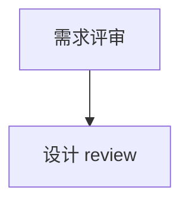

# md-canvas-demo · Diary PRD

把 `projects/desktop-pet/01-pm/branches/Diary/DIARY_MODULE_REQUIREMENTS.md` 渲染成一张
可阅读、可编辑、可批量下载 diff 的 HTML 画布。这是把"任意 Markdown → 交互式 HTML"
能力沉淀为 skill 之前的最小可用 demo。

视觉风格直接绑定 `workspaces/design-prototype/templates/CLAUDE_EDITORIAL_DESIGN_TOKENS.md`
（cream canvas / coral primary / dark navy product surfaces / Cormorant Garamond + Inter + JetBrains Mono）。

---

## 一、怎么用

### 1. 打开

双击 `index.html` 即可（用 Chrome / Edge / Safari 都可）。CDN 会自动拉 `marked` 与
`diff` 两个库，需要联网；首屏看不到字体衬线时刷新一次即可。

> 如果浏览器策略禁止本地文件运行外部脚本，请在该目录下临时启动一个静态服务器，例如
> `python3 -m http.server`，然后访问 `http://localhost:8000/`。

### 2. 阅读模式

- 顶部条 `md canvas · DIARY_MODULE_REQUIREMENTS.md` 提示当前文件。
- 左侧（≥ 1100px 宽度）会自动出现目录；点击目录项跳转，滚动时高亮当前章节。
- 每个 block 滚入视口时有渐入动效；表格 hover 高亮当前行。
- 浮动状态条显示当前模式、修改数与最后保存时间。

### 3. 编辑模式

| 触发 | 行为 |
|---|---|
| 点击右上 `编辑` 或键盘 `E` | 切到编辑模式，状态点变成橙色脉冲 |
| 标题 / 段落 / 列表项 | 直接点击修改，虚线框标出当前块；focus 后框变橙色实线 |
| 表格 | 每个单元格独立可编辑，focus 单元格高亮 + 橙色描边 |
| 代码块 | `<pre><code>` 整块可编辑，保留 monospace 和空白 |
| 引用块 | 引用段落直接可编辑 |
| 分隔线 `---` | 无内容，跳过编辑（视觉保留） |
| 任一块被改动 | 块右上出现 `已修改` 角标，底部 `修改` 计数 +1 |
| `Esc` 或再次按 `E` | 退出编辑模式 |
| `?` | 弹出快捷键面板 |

### 3.1 行内格式（在编辑模式下选中文字时生效）

| 触发 | 效果 | 序列化回 Markdown |
|---|---|---|
| 选中文字 → 浮动工具栏 | 出现 `B / I / { } / S / ↗` 工具条 | — |
| 工具栏 `B` 或 `⌘/Ctrl + B` | 加粗（marker pen 高亮） | `**…**` |
| 工具栏 `I` 或 `⌘/Ctrl + I` | 斜体 | `*…*` |
| 工具栏 `{ }` 或 `⌘/Ctrl + E` | 行内代码（coral 胶囊片） | `` `…` `` |
| 工具栏 `S` | 删除线 | `~~…~~` |
| 工具栏 `↗` 或 `⌘/Ctrl + K` | 链接（弹 URL 输入） | `[…](url)` |

- **再次按同一快捷键 / 工具栏按钮** 会取消该格式（删除对应包裹标签）。
- 工具栏按钮在当前光标已经在该格式中时显示 coral 高亮态。
- 粘贴时自动剥离富文本（防 Word / Notion 复制污染）；只保留纯文本。
- 想保持极简：直接键入 `**foo**` 也可以，下次加载会被 marked 解析为加粗。

### 3.2 结构编辑（P0 全套）

| 触发 | 行为 |
|---|---|
| 鼠标悬浮在任意块上 | 左侧出现 `⋮⋮`（拖动）与 `⋯`（菜单）控件 |
| 点 `⋯` | 块菜单：上方插入 / 下方插入 / 复制 / 删除 / 转为 H1/H2/H3/H4/段落/无序/有序/引用 |
| 拖动 `⋮⋮` | 整块上下重排 |
| 空段输入 `/` | 弹斜杠菜单：H1/H2/H3/H4/段落/无序/有序/表格/代码/引用/分隔线 |
| 斜杠菜单 | 上下箭头选 / 回车插入 / Esc 关闭 / 顶部输入框搜索 |
| 行首键入 `# ` / `## ` / `### ` | 当前段落转成 H1/H2/H3 |
| 行首键入 `- ` 或 `* ` | 当前段落转成无序列表 |
| 行首键入 `1. ` | 当前段落转成有序列表 |
| 行首键入 `> ` | 当前段落转成引用 |
| 行首键入 `---` | 当前位置后插入分隔线 |
| 列表项末回车 | 创建新列表项 |
| 空列表项回车 | 跳出列表，转为段落 |
| 标题末回车 | 在下方插入空段落，光标自动跳到新段 |

> 行内 markdown 即时转换：在编辑时键入 `**foo**` + 空格 / `*foo*` + 空格 / `` `foo` `` + 空格 /
> `~~foo~~` + 空格，光标前的标记会就地变成对应的 inline 格式。

### 3.3 查找替换

| 触发 | 行为 |
|---|---|
| `⌘/Ctrl + F` | 打开查找条 |
| `⌘/Ctrl + ⇧ + F` | 同时展开替换行 |
| 输入查找词 | 全文琥珀色高亮所有命中，当前命中 coral 实底 |
| Enter / ⇧Enter | 下一个 / 上一个 |
| 替换按钮 | 替换当前命中 |
| 全部替换 | 一键全替 |
| Esc | 关闭并清除高亮 |

### 3.4 批注 / 评论

| 触发 | 行为 |
|---|---|
| 编辑模式选中文字 → 浮动工具栏 `💬` | 弹出评论 composer，输入意见 + 添加 |
| 添加后 | 选区下方出现 coral 虚线下划线（锚点），右侧侧边栏 toggle 显示线程 |
| 点击 canvas 上的 coral 下划线 | 自动打开侧边栏并 focus 对应线程 |
| 顶栏 `💬` 按钮 / `⌘/Ctrl + ⇧ + C` | 切换评论面板（⌘⇧M 在 macOS 被系统拦了，所以换成 C） |
| 顶栏按钮的 coral 小数字 | 未解决评论数量 |
| 线程操作 | 回复 / 标记解决 / 删除 / 跳转到锚点 |
| 下载时 | 若有评论，会额外下载 `<filename>.comments.json` |

### 3.5 表格行列操作

| 触发 | 行为 |
|---|---|
| 在表格单元格中 focus | 上方浮出深色 action bar：`⬆＋行 / ⬇＋行 / ⬅＋列 / ＋列➡ / －行 / －列` |
| 点击对应按钮 | 在当前位置插入或删除行/列；表头行不可删除；保留至少 1 列 |
| 鼠标移到 cell 右边 ~6px | cursor 变 `↔`，按住拖动即改列宽 |
| 鼠标移到 cell 下边 ~6px | cursor 变 `↕`，按住拖动即改行高 |
| 下载 | 行列结构变更进 `.md`；**列宽/行高仅在 HTML 中保留**（markdown 没有这个语法） |

### 3.6 Enter / Backspace 行为

| 场景 | 按键 | 行为 |
|---|---|---|
| 标题 / 段落 / 引用任意位置 | `Enter` | 在当前位置拆分 → 当前块保留前半，下方新建段落块装后半 |
| 列表项中（非空） | `Enter` | 新列表项 |
| 列表项中（空） | `Enter` | 跳出列表，转为段落 |
| 任意可编辑块 | `Shift + Enter` 或 `Ctrl/Cmd + Enter` | 块内插入 `<br>` 软换行 |
| 代码块 / 表格单元格 | `Enter` | 浏览器默认（在 cell / code 内插入换行） |
| **任意空块 / 块开头光标位置** | **`Backspace`** | **删除当前块，光标跳到前一块末尾**（连同块内评论一起清理） |
| 块菜单 `删除此块` | 点击 | 同上，并弹出 toast "已删除" 反馈 |

### 3.7 章节折叠 / 展开

H1 / H2 / H3 标题左侧加了 `▾` chevron，点击即可折叠该章节直到下一个**同级或更高级**的标题。

| 行为 | 说明 |
|---|---|
| 点击 chevron | 折叠 / 展开当前章节；折叠后 chevron 旋转 90° |
| 状态持久化 | 写入 `localStorage`（key `md-canvas:<文件名>:folds`），下次打开自动恢复 |
| 在折叠的标题下插入新块（Enter） | 自动展开父标题，保证新块可见 |
| 折叠不影响 markdown 字节 | round-trip 完全干净（chevron 节点带 `data-skip-serialize`） |

> 已知小坑：如果改了某标题的文字，它的 slug id 变了，已保存的折叠状态会丢失（重新折一次即可）。

### 3.8 任务清单（GFM `- [ ]` / `- [x]`）

源文件里 `- [ ] 待办` / `- [x] 已完成` 渲染为可点击的 coral checkbox：

| 行为 | 说明 |
|---|---|
| 点击 checkbox | 切换 `[ ]` ↔ `[x]`；勾选项加删除线 + 灰色 |
| 切换后块自动 mark dirty | 下载时序列化回对应 markdown 标记 |
| round-trip | 未触碰列表沿用原 `token.raw`；触碰过的按 DOM 重新序列化 |

**两种创建方式**：

A. **在源 markdown 里写**（最直接）：

```markdown
## 评审意见
- [ ] 用户旅程的回信场景需要补流程图
- [x] 隐私等级默认值已确认是 private
- [ ] 失败兜底文案待运营校对
```

B. **在 canvas 里实时创建**（编辑模式）：
1. 在任意空段输入 `- ` + 空格 → 自动变成无序列表
2. 在列表项最前面输入 `[ ] ` 或 `[x] ` + 空格 → 自动转成 checkbox
3. 也可以在**已有列表项**最前面（光标移到行首）输入 `[ ] ` 实现同样效果

适合"评审意见 / approval checklist"沉淀进 PRD 源文件。

### 3.9 Mermaid 图渲染（含节点点击查看详情）

` ```mermaid ` 代码块会自动检测并渲染成 SVG 图。每个 mermaid 块右上角带一个三档 toolbar：

| 模式 | 说明 |
|---|---|
| `源码` | 只看 Mermaid DSL（编辑模式下方便改） |
| `两者`（默认） | 上方代码 + 下方渲染图，并排查看 |
| `图` | 仅图，最干净的阅读视图 |

- 编辑源码时 350ms 防抖自动重新渲染；语法错误显示在图区域里
- Mermaid 主题色对齐 design tokens（cream 背景 / coral 主色 / dark ink 文字）
- 序列化回 markdown 时**只输出代码源**（视图模式 / 渲染图不写入 `.md`）
- 支持 sequence diagram、flowchart、class、state、gantt、pie、er 等 Mermaid 全部图类型

#### 节点点击查看详情

两种方式，都不破坏 round-trip。

**方式 A · mermaid 原生 `click` + 锚点跳转**（最简单）



点击 A 节点 → canvas 自动滚动到 `## 评审标准` 章节，目标章节 coral 闪烁 1.7s 提示。
- `href` 以 `#` 开头 → 内部跳转（不开新窗口）
- 否则按外链处理（mermaid 默认开新窗口）

**方式 B · 副 `mermaid-detail` 块（推荐用于 PRD）**

最快的写法：在 mermaid 图右上 toolbar 点 **`+ 详情`** → 自动从图源里抽取节点 ID，**预填好详情副块**插在下面。已有详情副块时按钮自动隐藏。

或者手写（紧跟在 mermaid 块之后，必须**相邻无空块**），用 `节点ID:` 分组挂 markdown 内容：

````markdown
\`\`\`mermaid
flowchart TD
  startup[启动桌宠] --> diary[查看日记]
  diary --> hasNew{有新?}
  hasNew -->|是| bubble[展示气泡]
\`\`\`

\`\`\`mermaid-detail
startup:
  **痛点**：启动 > 2s 慢
  **指标**：P0 首屏 < 1s
  **owner**：客户端组
  [→ Figma 原型](https://figma.com/file/xxx)

diary:
  **入口**：用户从托盘 / 桌面图标点击桌宠
  **依赖**：记忆系统给出当日 unread_count
\`\`\`
````

效果：
- mermaid 块正常渲染；副 detail 块在 canvas 里**自动隐藏**（不当成普通代码块显示）
- 有 detail 的节点 cursor 变手指 + 微微 coral 描边
- 点击节点 → 左下浮出 380px 详情面板，渲染对应 markdown（支持 **粗体** / `code` / [链接](url) / 列表等）
- ESC 或 ✕ 关闭

#### 限制（v1）

| 项 | 说明 |
|---|---|
| journey 步骤的 hover 痛点/指标 | 未做（mermaid journey 步骤无稳定 ID，需要 overlay 重写） |
| gantt 行筛选（按 section / owner） | 未做 |
| 节点 ID 解析 | 适配 mermaid v11 的 `flowchart-X-N` / `state-X-N` / `classGroup-X-N` 等模式，**自定义图类型可能不识别** —— 用方式 A 兜底 |
| mermaid-detail 必须相邻 | 中间隔了别的块就识别不到（按 nextElementSibling 找）

### 3.10 阅读辅助：进度条 + 返回顶部

- 顶部 2px coral→amber 渐变条随滚动延伸，提示当前阅读进度
- 滚动超过 600px 时右下角出现圆形 `↑` 按钮，点击平滑滚回顶部；hover 变 coral
- 移动端按钮自动靠下右侧，不挡 status bar

### 3.11 GFM 风格 Callout（`> [!TYPE]` 块）

源 markdown 里用 GitHub 标准的 alert 语法写 callout：

| markdown 写法 | 渲染 | 用途 |
|---|---|---|
| `> [!NOTE]\n> 内容` | 📝 蓝绿色 | 一般注释 |
| `> [!TIP]\n> 内容` | 💡 绿色 | 小贴士 |
| `> [!IMPORTANT]\n> 内容` | ❗ coral | 重要 |
| `> [!WARNING]\n> 内容` | ⚠️ 琥珀 | 警告 |
| `> [!CAUTION]\n> 内容` | 🚨 红色 | 严重风险 |
| `> [!discussion](https://…)\n> 内容` | 💬 琥珀 + `↗ 打开讨论` 按钮 | **跳转外部讨论（飞书 / Notion / Slack 等）** |

例：

```markdown
> [!discussion](https://feishu.cn/docs/xxxx)
> 这段需求的隐私边界还在和合规对齐，详见飞书讨论。
```

打开 demo 该段会渲染成琥珀色 callout，右上角带"↗ 打开讨论"按钮，点击新窗口跳到飞书。

**round-trip 安全**：`[!TYPE]` marker 用 `dataset.calloutMarker` 在 DOM 上记住，序列化时回写到第一段开头；callout-header 节点带 `data-skip-serialize` 不污染输出。

**最快的写法 —— 斜杠菜单**（推荐）：

| 触发 | 结果 |
|---|---|
| `/` → 输入 `c` → 6 种 callout 同时出现，方向键选 + 回车 | 直接插入对应类型的 callout 块 |
| 选择 `💬 讨论 callout` 时 | 弹出 URL 输入框，输入飞书 / Notion / Slack 等链接 |
| 插入后光标自动落在 callout 内 placeholder 上 | 直接键入内容，无需再修 marker |

举例：想加一个"重要"提示，只要：进编辑模式 → `/` → `c` → ↓ ↓ ↓（或键入 `important`）→ 回车 → 输入内容。**总键数 ~5**，比手写 `> [!IMPORTANT] ` 少十几个字符。

**手写也支持（动态识别）**：在 canvas 编辑模式下，先用 `> ` + 空格把段落转成引用，然后在引用最前面输入 `[!NOTE]` / `[!discussion](url)` 等 → 输入到 `]`（或 url 的 `)`）那一刻引用立即变 callout、marker 字符消失、icon + 标签 + 颜色就位、光标保持在原位继续打字。

### 3.12 其他细节

- **块菜单 convert 是 toggle**：当前类型的"转为…"项会带"当前"角标；再点同一项 → 转回普通段落。
- **新块用 placeholder**：通过 `/` 或块菜单插入的新块，里面的文字是斜体灰色占位符（如"在此输入 H2 标题"），点击后自动消失；若没有键入任何内容，下载时该块会自动跳过，不会污染源文档。
- **拖动重排**：拖动时禁用了 `.md-block` 的渐入 transition，响应明显变快；动画时长降到 100ms。
- **分隔线 `---`**：min-height 拉到 36px，hover 时整条 hr 变 coral，方便点击 `⋯` 删除/插入。

### 4. 保存与下载

| 触发 | 行为 |
|---|---|
| `⌘/Ctrl + S` 或点击 `保存` | 写入浏览器 `localStorage`，仅在本浏览器有效 |
| `⌘/Ctrl + D` 或点击 `下载` | 同时下载两份文件（见下） |
| 关闭后再打开 | 若 localStorage 仍有改动，顶部出现"恢复 / 忽略"横幅 |

下载会生成：

1. **`DIARY_MODULE_REQUIREMENTS.md`** — 修改后的完整 Markdown（同名，方便覆盖原文）。
2. **`DIARY_MODULE_REQUIREMENTS.diff.md`** — README 风格的差异报告：
   - 头部元信息表
   - 每条变化的"原文 / 改后"代码块
   - 附录的完整行级 diff

把这两份文件丢回 agent，可以一次性 apply 回源 PRD。

---

## 二、当前可编辑块的范围

| 块类型 | 阅读 | 编辑 | 回写 Markdown |
|---|---|---|---|
| `#` / `##` / `###` / `####` 标题 | ✅ | ✅ | ✅ |
| 段落 paragraph | ✅ | ✅ | ✅ |
| 列表 ul / ol | ✅ | ✅ | ✅ |
| 表格 table | ✅ | ✅ 单元格逐个 | ✅（保留对齐方向） |
| 围栏代码块 ``` | ✅ | ✅ 整块 | ✅（保留语言标签） |
| 引用 blockquote | ✅ | ✅ 段内编辑 | ✅ |
| 分隔线 `---` | ✅ | — 无内容 | 原样保留 |

### inline 强调如何渲染

| 源语法 | 渲染效果 |
|---|---|
| `**bold**` | **粗体** + coral 半透明高亮底色（marker pen） |
| `*italic*` | 斜体，更深的正文色 |
| `` `code` `` | monospace 胶囊片，coral-tinted 背景（你看到的 `private` 风格） |
| `~~strike~~` | 删除线 |
| `[文本](url)` | coral 文本 + hover 下划线 |
| `==mark==` | 琥珀色高亮（marked 默认不支持，用 DOM `<mark>` 时生效） |

### inline 标记的 round-trip 保留

未触碰的块沿用 `token.raw`，所以源 markdown 一字不差。被编辑的块用 DOM 重建：
`<strong>` → `**...**`、`<em>` → `*...*`、`<code>` → `` `...` ``、`<a>` → `[文本](url)`、
`<del>` → `~~...~~`。在 `plaintext-only` 编辑模式下，你也可以直接键入 `**xxx**` 这样的
markdown 符号，下次加载时会被 marked 重新解析为加粗。

---

## 三、设计与实现要点

- **单文件、无构建**：`index.html` 自带样式与脚本；MD 源以 `<script type="text/markdown">`
  内联（约 38 KB），所以脚本只用 `marked`、`diff` 两个 CDN 依赖。
- **block 级双向映射**：用 `marked.lexer()` 把 MD 拆成 tokens；每个非 `space` token 渲染
  成一个 `<section data-md-index data-md-type>`，保留 `token.raw`。序列化时只对
  `data-edited="true"` 的块用 DOM 重写 Markdown，其他块用原始 raw，**最大限度避免格式漂移**。
- **diff 报告**：先按空行切块做"语义级 diff"，再附加 jsdiff 行级 diff，兼顾可读性与精确性。
- **视觉绑定 design tokens**：CSS 变量直接对应
  `templates/CLAUDE_EDITORIAL_DESIGN_TOKENS.md` 的 token 名，未来换风格只改一份 token 文件。
- **可访问性 / 体验细节**：sticky top nav、IntersectionObserver 触发的章节高亮和渐入、
  Esc 退出编辑、`plaintext-only` 优先（防止粘贴富文本破坏 Markdown 序列化）。

---

## 四、已知局限（沉淀 skill 时需要解决）

| 局限 | 影响 | 计划 |
|---|---|---|
| 表格只能改单元格文本，不能增删行/列 | 结构调整仍需直接改源 MD | skill 阶段加 row/col 增删按钮 |
| 代码块没有语言切换器 / 高亮 | 长代码段缺乏可读性 | skill 阶段加 Prism / Shiki |
| 嵌套列表的拖动 / 缩进尚未覆盖 | 多层 list 可能扁平化 | skill 阶段加 Tab / Shift+Tab 缩进 |
| 评论锚点在块"转类型"后会丢失（锚 span 被新块覆盖） | 文本本身仍在 `comments.json`，但 canvas 内的下划线消失 | skill 阶段引入稳定 anchor id + 内容重定位 |
| 粘贴富文本已剥成纯文本 | 想保留来源加粗等需手动重做 | 这是有意取舍 |
| 没有图片上传 / 块快照导出 | 评审稿无法夹图 | P1 阶段加图片拖入 |
| 只支持单文件；没有跨 MD 引用 | 看不到 `[[link]]` 关系 | P2 阶段加 manifest，多文件画布 |

---

## 五、下一步沉淀为 skill

待 demo 流程跑顺后，把以下结构沉淀到 `skills-plan/MD_TO_INTERACTIVE_HTML_SKILL_SPEC.md`：

- **触发场景**：用户在任一 workspace 产出了 Markdown，希望以可交互形式展开评审、批注、改写。
- **输入**：任一 `.md` 文件路径 + 可选 design tokens preset。
- **workflow**：读源 MD → 校验结构（章节、表格、code fence）→ 选 preset → 生成 `index.html`
  内联 MD → 产出目录与 README。
- **输出**：`<dir>/<filename>-canvas/index.html` + `README.md`。
- **质量门**：渲染后 round-trip 一次（不编辑直接 serialize）应与原文按 token raw 对齐；
  diff 报告应在零编辑下显示"没有任何修改"。
- **guardrails**：不上传源 MD 到 CDN；不改写源 MD；下载文件名严格沿用源文件名以方便覆盖。

---

## 六、文件清单

```
md-canvas-demo/
├── index.html        # 自包含画布，含内联 MD 与 design tokens 映射
└── README.md         # 本文件
```

---

## 七、与 APB 协议的契合

- **产物路径**：放在 `projects/desktop-pet/02-design/branches/Diary/`，与设计支路同处一线。
- **不污染 workspaces**：方法论和模板沉淀走 `skills-plan/`，本目录只放实体产物。
- **不修改源 PRD**：仅下载生成的副本，回写需 agent 二次 apply。
- **分支策略**：本 demo 由 `feat/md-to-canvas-demo` 分支引入，跑顺后再决定合回 main 的方式。
