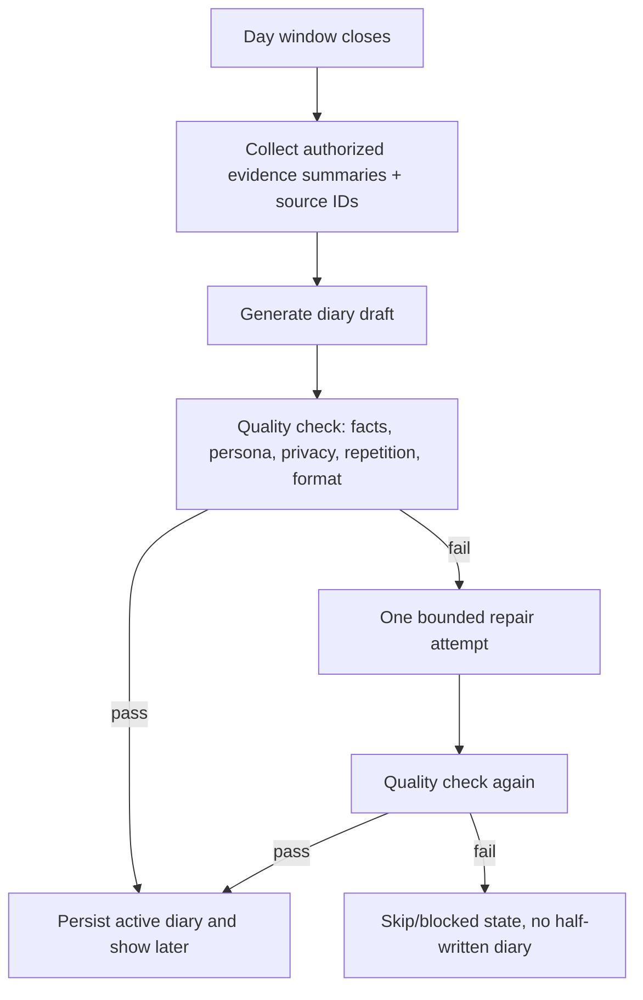

# AI Integration: Diary Module

## AI Feature Goal

Generate warm first-person diary entries and short pet reactions while preserving privacy, factuality, persona consistency, and user control.

## Workflow

## Provider Boundary

| Function | Responsibility |
|---|---|
| `generateDiaryDraft(input)` | Generate structured draft from summaries and source IDs only |
| `checkDiaryQuality(input)` | Return parseable pass/fail and risk flags |
| `generatePetReaction(input)` | Return short visible reaction, emotion, action, speech flag, optional voice URL, memory hint |

## Vendor-Agnostic Model Adapter

The implementation uses a server-side configurable provider, not a browser-side model call.

Default mode is fallback/mock. Real vendors should be wired through a Chat Completions-compatible shape:

- `DIARY_LLM_PROVIDER=chat-completions-compatible`
- `DIARY_LLM_AUTH_MODE=bearer`
- `DIARY_LLM_BASE_URL=${DIARY_LLM_BASE_URL}`
- `DIARY_LLM_API_KEY=${DIARY_LLM_API_KEY}`
- `DIARY_LLM_MODEL=${DIARY_LLM_MODEL}`
- `DIARY_REACTION_MODEL=${DIARY_REACTION_MODEL}`
- `DIARY_LLM_RESPONSE_FORMAT=json_object`

For keyless local models or an internal gateway, set `DIARY_LLM_AUTH_MODE=none` and leave `DIARY_LLM_API_KEY` unset. If a vendor does not support this request/response shape, add a small backend proxy that converts that vendor's native API into the same chat-completions request/response contract.

MiniMax has a one-env preset. For daily local use:

- `MINIMAX_API_KEY=${MINIMAX_API_KEY}`

When `MINIMAX_API_KEY` is present, these defaults are inferred:

- `DIARY_LLM_PROVIDER=chat-completions-compatible`
- `DIARY_LLM_AUTH_MODE=bearer`
- `DIARY_LLM_BASE_URL=https://api.minimaxi.com/v1` for `sk-cp-` keys, otherwise `https://api.minimax.io/v1`
- `DIARY_LLM_MODEL=MiniMax-M2.7`
- `DIARY_REACTION_MODEL=MiniMax-M2.7`
- `DIARY_LLM_RESPONSE_FORMAT=none`

Voice/TTS is also vendor-neutral. The app expects a backend bridge:

- `DIARY_TTS_PROVIDER=http-json`
- `DIARY_TTS_AUTH_MODE=bearer`
- `DIARY_TTS_ENDPOINT=${DIARY_TTS_ENDPOINT}`
- `DIARY_TTS_API_KEY=${DIARY_TTS_API_KEY}`
- `DIARY_TTS_VOICE=${DIARY_TTS_VOICE}`

The bridge can return either an `audio_url` or `audio_base64` plus `mime_type`.

## Safety Rules

- No raw day log, chat body, document title, window title, real name, account ID, or private third-party text in model input.
- No browser/client-side LLM call.
- No real API key committed.
- Use placeholders only, such as `${DIARY_LLM_API_KEY}`, `${DIARY_LLM_BASE_URL}`, `${DIARY_LLM_MODEL}`, `${DIARY_REACTION_MODEL}`, `${DIARY_TTS_ENDPOINT}`.
- LLM failure returns fallback; UI never shows partial diary or internal failure reason.
- This is a bounded workflow, not an autonomous Agent.

## Evaluation Gates

| Gate | Target |
|---|---|
| Privacy violation | 0 |
| Unsupported fact | <= 1% in eval set |
| Persona consistency | >= 95% |
| Format parse success | >= 99% |
| High-risk block recall | >= 98% |
| Deleted diary reuse | 0 |
