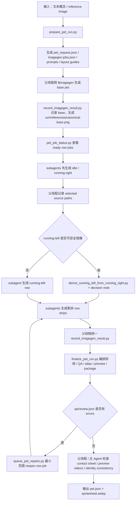
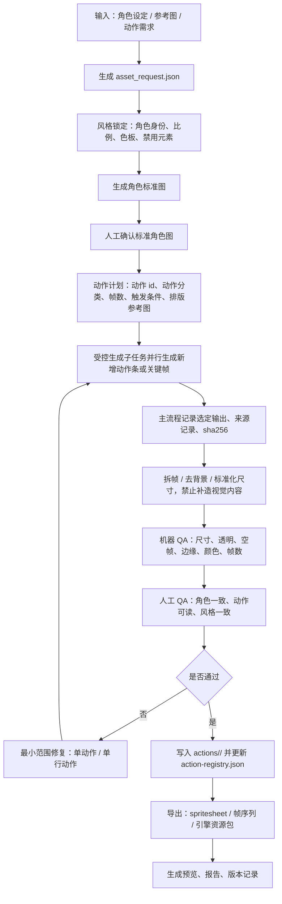

# Codex 自定义桌宠生成实现调研

> 目标：理解 Codex / `hatch-pet` 在“自定义桌宠 / 自定义动作资产生成”上的实现机制，并转化为 `desktop-pet` 通用业务场景的实现参考。重点不是复刻 Codex pet，而是抽象出能减少游戏美工生成角色形象 / 新动作周期的资产流水线。

## 1. 结论先行

| 维度 | Codex / hatch-pet 观察 | 对 desktop-pet 的启发 |
|---|---|---|
| 核心机制 | 1. 用 Skill 规划宠物生成流程 <br />2. 用 `$imagegen` 生成 base 与 9 行动画 <br />3. base 后的 row strips 默认由 subagents 生成 <br />4. 父线程用确定性脚本记录、拆帧、组 atlas、QA、打包 <br />| 资产生成不能只停留在“生成一张图”，必须是“生成 + 规格化 + QA + 修复 + 导出”的 pipeline，并明确生成层与工程后处理层的边界。 |
| 输出资产 | `pet.json` + `spritesheet.webp`，固定 8x9 atlas，1536x1872，192x208 cell。 | 我们不应直接绑定 Codex 格式，而应抽象成自己的“角色资产契约 + 动作资产契约 + 引擎导出适配器”。 |
| Skill 价值 | Skill 把 prompt、reference、subagent handoff、scripts、QA rubric 和 packaging 变成可复用流程。 | 可以做一个通用 `game-character-asset-factory`，让不同游戏复用同一套资产生产方法。 |
| 最大价值 | 把“提示词生成图片”升级为“可验收的动画资产包”。 | 对业务最有用的是缩短角色 / 动作资产从需求到可预览、可导入的周期。 |
| 最大限制 | 1. Codex 适合小型 pixel-art-adjacent digital pet <br />2. 不直接覆盖 Live2D / Spine / 3D / 游戏内高规格角色 <br />| P0 不做全能美术替代，先做“标准动作包 / sprite sheet / 表情动作模板”的半自动化。 |

## 2. Codex：hatch-pet 的详细实现拆解

### 2.1 Skill 定位

本地 `hatch-pet` skill 的 frontmatter 明确说明：它用于从角色图、截图、生成图或视觉参考创建 / 修复 / 验证 / 预览 / 打包 Codex 兼容的动画宠物和 spritesheet。它的关键不是“画图”，而是把画图、拆帧、校验和打包串成一个稳定工作流。

本地路径：

```text
/Users/yayauu/.codex/skills/hatch-pet/
```

Skill 的职责边界：

| 模块 | 具体职责 |
|---|---|
| 视觉规划 | 推断 pet name、description、视觉风格、参考图、chroma key。 |
| Prompt 规划 | 生成 base pet prompt 和 9 个 row-specific animation prompt。 |
| 图像生成 | 1. 委托 `$imagegen` 生成 base 与 row strips <br />2. base 可由父线程生成 <br />3. base 后 row strips 默认必须交给 subagents <br />|
| 资产工程 | 用 Python 脚本拆帧、去背景、组 atlas、生成 WebP。 |
| QA | 输出 contact sheet、review.json、validation.json、preview videos。 |
| 打包 | 写入 `${CODEX_HOME:-$HOME/.codex}/pets/<pet-name>/pet.json` 和 `spritesheet.webp`。 |
| 硬边界 | 本地脚本只做确定性处理，不允许用 Python / Pillow / SVG / canvas / HTML/CSS 伪造 base 或 row visuals。 |

补充说明：这里的 `$imagegen` 指 Codex 的 Image Generation Skill，也就是负责真正生成或编辑位图资产的图像生成能力。它和 `hatch-pet` 的分工如下：

| 能力 | 解释 | 在 hatch-pet 中的作用 |
|---|---|---|
| `$imagegen` / Image Generation Skill | Codex 内置的图像生成 Skill，适合生成角色图、动作图、sprite、透明背景素材等位图资产。默认使用内置 `image_gen` 工具，不需要 `OPENAI_API_KEY`。 | 负责真正“画出”base pet 和每一行动作图。 |
| `hatch-pet` Skill | 面向 Codex pet 的专用 Skill，负责把宠物生成流程组织起来，包括提示词规划、动作行规划、任务清单、拆帧、QA、预览和打包。 | 负责告诉 `$imagegen` 要画什么，并把生成结果变成可用的 `pet.json` + `spritesheet.webp`。 |
| 备用 CLI 路径 | 当内置 `$imagegen` 不可用，或用户明确要求 CLI / API 路径时，才会考虑备用脚本；该路径通常需要 `OPENAI_API_KEY`。 | 不是默认路径，不能静默切换，必须先说明原因和条件。 |

### 2.2 资产规格

Codex pet 是强约束格式，这一点很适合转化成我们自己的“通用资产契约”。

| 项目 | 解释 | Codex 规格 |
|---|---|---|
| Atlas size | 整张 spritesheet 的画布尺寸，所有动作帧都会被排进这张大图里 | `1536x1872` |
| Grid | spritesheet 的网格结构，用列表示帧序列、用行表示不同动作 / 状态 | 8 columns x 9 rows |
| Cell | 单个动画帧所在的小格尺寸，每一帧都要适配这个固定区域 | `192x208` |
| Background | 背景要求，未使用区域和非角色区域需要可透明化，避免运行时出现色块 | transparent |
| Package | 最终可被 Codex 加载的宠物资产包内容 | `pet.json` + `spritesheet.webp` |
| Install path | 本地 custom pet 的安装目录，Codex 会从该目录读取宠物包 | `${CODEX_HOME:-$HOME/.codex}/pets/<pet-name>/` |

9 个动作 / 状态行：

| Row | State | Frames | 用途 |
|---:|---|---:|---|
| 0 | idle | 6 | 安静呼吸 / 眨眼，第一帧也作为 reduced-motion 静态形象 |
| 1 | running-right | 8 | 向右移动 |
| 2 | running-left | 8 | 向左移动，可在安全时由右移动镜像得到 |
| 3 | waving | 4 | 打招呼 |
| 4 | jumping | 5 | 跳跃 |
| 5 | failed | 8 | 失败 / 难过 / 受挫反馈 |
| 6 | waiting | 6 | 等待 |
| 7 | running | 6 | 工作中 / 任务处理中，不是字面奔跑 |
| 8 | review | 6 | 思考 / 检查 / review 状态 |

### 2.3 默认工作流



关键规则：

| 规则 | 术语解释 | 说明 |
|---|---|---|
| base 是唯一可 prompt-only 的 visual job | 1. `base` 是桌宠的主形象 / 标准参考图 <br />2. `prompt-only` 是只用文字提示词、不附参考图 <br />3. `visual job` 是一次图像生成任务 <br />| 1. 如果没有 reference image，可以先用文本生成 base <br />2. base 被记录后会成为 `canonical identity reference`，也就是后续所有动作都要对齐的“标准角色形象” <br />|
| row job 必须有 grounding images | 1. `row job` 是生成某一行动作帧的任务，例如 idle 行、waving 行 <br />2. `grounding images` 是给模型看的约束参考图，用来固定角色长相、动作布局和帧位置 <br />| 1. 每个 row job 必须附带 `imagegen-jobs.json` 里的 input images，包括 canonical base、原始 reference、对应 layout guide <br />2. 缺少 grounding 的 row generation 视为无效 <br />|
| row strips 默认走 subagents | 1. `row strip` 是一整行动作图，把同一个状态的多帧横向排在一起 <br />2. `subagent` 是被分派去生成单个动作行的子线程 / 子代理 <br />3. `selected source` 是最终选中的原始生成图 <br />| 1. 父线程负责 manifest 和 package <br />2. subagents 只负责用 `$imagegen` 生成 row output <br />3. subagents 返回 selected `$CODEX_HOME/generated_images/.../ig_*.png` 路径和一句 QA note <br />|
| 父线程统一 record / mirror / repair / finalize | 1. `record` 是记录图片来源并复制到 `decoded/` <br />2. `mirror` 是在安全时把右移动作镜像成左移动作 <br />3. `repair` 是重开失败的动作行 <br />4. `finalize` 是统一拆帧、QA、组 atlas、预览和打包 <br />| 1. subagents 不编辑 `imagegen-jobs.json` <br />2. 不复制到 `decoded/` <br />3. 不跑 finalize，不打包 <br />4. 这样可以避免多人同时改 manifest 导致来源和状态混乱 <br />|
| running-left 只能条件镜像 | 1. `running-left` 是向左移动动作行 <br />2. `handedness` 指左右手 / 道具握持方向 <br />3. `direction semantics` 指动作表达的方向含义 <br />4. `decision note` 是镜像审批原因记录 <br />| 1. 只有父线程 / 主 Agent 视觉检查确认镜像不会破坏 identity、prop 方向、handedness、markings、lighting、方向语义时，才能由父线程镜像 <br />2. 镜像时必须写 decision note <br />|
| deterministic scripts 不能替代生成层 | 1. `deterministic scripts` 是输入相同、输出就应稳定一致的工程脚本 <br />2. `生成层` 是真正负责画出角色和动作图的图像生成模型 <br />| 1. 拆帧、去 chroma key、组 atlas、验证、打包可以脚本化 <br />2. 视觉内容本身不能用本地脚本补造 <br />|

### 2.4 Scripts 清单

| Script | 术语解释 | 作用 | 对通用业务的启发 |
|---|---|---|---|
| `prepare_pet_run.py` | 1. `run folder` 是本次生成任务的工作目录 <br />2. `reference` 是参考图 <br />3. `chroma key` 是后续要被抠掉的纯色背景 <br />4. `layout guide` 是动作帧排布参考图 <br />5. `pet_request.json` / `imagegen-jobs.json` 是任务配置和生成清单 <br />| 创建 run folder、拷贝 reference、选择 chroma key、生成 base / row prompts、生成 layout guides、写 `pet_request.json` 和 `imagegen-jobs.json`。 | 资产生成前必须先生成“任务清单 + 资产契约 + prompt contract”，不要直接让模型画图。 |
| `pet_job_status.py` | 1. `jobs` 是一组图像生成任务 <br />2. `ready` 表示依赖已满足、可以开始生成 <br />3. `pending` 表示还在等待前置任务，例如 base 图未生成 <br />| 根据依赖关系显示可生成和待生成 jobs。 | 对多动作并行生成很重要，可用于美术任务看板。 |
| `record_imagegen_result.py` | 1. `decoded/` 是记录后的原始生成结果目录 <br />2. `sha256` 是文件指纹 <br />3. `provenance` 是资产来源记录 <br />4. `canonical-base.png` 是后续动作必须对齐的标准形象 <br />| 1. 由父线程记录选中的 `$imagegen` 原始输出，校验来源路径，复制到 `decoded/`，写 sha256 和 provenance <br />2. base 记录后会写 `run/references/canonical-base.png` <br />| 资产生产必须留 provenance，防止后续无法追踪“这张图从哪里来”。 |
| `derive_running_left_from_running_right.py` | 1. `running-right` / `running-left` 分别是向右 / 向左移动动作 <br />2. `mirror` 是水平翻转 <br />3. `decision note` 是说明为什么允许镜像的记录 <br />| 在主 Agent 视觉检查确认安全后，把 `running-right` 镜像成 `running-left`。 | 1. 对称动作可以减少生成成本 <br />2. 必须有主 Agent 视觉检查和决策记录 <br />3. 业务场景可额外增加人工审批 <br />|
| `extract_strip_frames.py` | 1. `row strip` 是横向排列的一整行动作图 <br />2. `frame` 是单帧 <br />3. `connected components` 是按连续像素区域识别每个角色姿态 <br />4. `slot slicing` 是按固定格子切图 <br />| 从横向 row strip 中去 chroma key、拆成 `192x208` frame，优先按 connected components 抽取，失败再 slot slicing。 | AI 生成图不要直接进引擎，要有确定性后处理。 |
| `inspect_frames.py` | 1. `chroma-adjacent` 是接近背景抠图色的残留像素 <br />2. `size outlier` 是尺寸异常帧 <br />3. `edge pixels` 是贴边像素，可能意味着角色被裁切 <br />| 检查帧数、尺寸、空帧、边缘像素、chroma-adjacent 像素、大小异常。 | QA 不只靠人工看，要把可量化错误自动化。 |
| `compose_atlas.py` | 1. `atlas` 是把所有动画帧按固定网格合成的一张 spritesheet <br />2. PNG / WebP 是最终图像格式 <br />| 把前面拆好的单帧图片重新拼成一张大图，Codex 运行时会按行列坐标去播放对应动作。 | 1. 不能只交付散图 <br />2. 需要根据 Unity / Unreal / Web / 桌面端的读取方式，把同一批动作帧导出成对应平台能直接使用的资源包 <br />|
| `validate_atlas.py` | 1. `used cells` 是实际有动画帧的格子 <br />2. `unused cells` 是空白格，必须透明，避免运行时出现多余图块 <br />| 校验最终 atlas 尺寸、透明度、used / unused cells。 | 最终交付物必须机器可验收。 |
| `make_contact_sheet.py` | `contact sheet` 是把所有动作帧集中排版成一张检查图，方便快速看整体质量。 | 生成带标签的 contact sheet，方便人工快速 review。 | 美术验收需要一眼看完所有动作，而不是逐帧打开。 |
| `render_animation_videos.py` / `.sh` | 1. `ffmpeg` 是常用音视频处理工具 <br />2. `preview video` 是把静态帧按时序播放成视频，检查动作是否顺 <br />| 用 ffmpeg 渲染每个状态的视频预览。 | 动作好不好，需要动起来看，preview video 是必需品。 |
| `package_custom_pet.py` | 1. `pet.json` 是宠物包的 manifest，记录 id、display name、description、spritesheet 路径 <br />2. `pet folder` 是 Codex 读取 custom pet 的目录 <br />| 生成最终 `pet.json`，复制 `spritesheet.webp` 到目标 pet folder。 | 资产包应包含 manifest，不应只有散落图片。 |
| `queue_pet_repairs.py` | 1. `repair` 是修复失败资产 <br />2. `reopen row job` 是只重开失败动作行 <br />3. `prompt` 是给图像生成模型的文字指令 <br />| 根据 QA 失败项重新打开对应 row job，并把失败原因追加到 prompt。 | 修复应最小范围重跑，不要整包重生。 |
| `finalize_pet_run.py` | 1. `extraction` 是拆帧 <br />2. `inspection` 是检查帧质量 <br />3. `atlas composition` 是组 spritesheet <br />4. `validation` 是最终校验 <br />5. `run-summary.json` 是本次任务总结 <br />| 在全部 visual jobs 完成后，统一编排 extraction、inspection、atlas composition、validation、contact sheet、videos、package，并写 `qa/run-summary.json`。 | 复杂资产 pipeline 应有一个最终编排入口，避免人工漏跑步骤。 |
| `generate_pet_images.py` | 1. `fallback` 是主路径不可用时的备用方案 <br />2. `OPENAI_API_KEY` 是调用 API 所需密钥 <br />3. 该脚本不是默认路径 <br />| `$imagegen` 不可用时的二级 fallback，需要先解释原因，且需要 `OPENAI_API_KEY`。 | 生成层可替换，但默认路径、fallback 条件、密钥要求和用户确认要明确。 |

### 2.5 References / Assets

`hatch-pet` 没有传统意义上的静态 `assets/` 目录。它的稳定知识主要放在 skill 的 `references/`，而 identity lock 和 layout guides 是每次 run 动态生成的 reference 文件：

| Reference / Asset | 类型 | 具体解释 | 例子 | 对业务复用的意义 |
|---|---|---|---|---|
| `skill/references/animation-rows.md` | 静态 reference | 这是 Codex pet 的“动作表”。它规定一张 spritesheet 里每一行代表什么动作、用几帧、播放节奏是什么。 | 1. Row 0 = `idle`，6 帧，表现呼吸 / 眨眼 <br />2. Row 3 = `waving`，4 帧，表现打招呼 <br />3. Row 7 = `running`，不是奔跑，而是“任务处理中” <br />| 应转化为我们自己的 action taxonomy，例如 idle、happy、sad、attack_hint、quest_reminder、summon、sleep。 |
| `skill/references/codex-pet-contract.md` | 静态 reference | 这是 Codex pet 的“资产交付格式说明”。它规定最终宠物包必须长什么样，包含哪些文件，spritesheet 尺寸和透明区域怎么处理。 | 1. 最终目录必须包含 `pet.json` 和 `spritesheet.webp` <br />2. spritesheet 必须是 `1536x1872` <br />3. 未使用 cell 必须透明 <br />| 应转化为游戏接入层的 runtime asset contract，让游戏客户端知道如何加载、播放、切换动作。 |
| `skill/references/qa-rubric.md` | 静态 reference | 这是验收标准。它不仅检查图片尺寸，还检查角色是否一致、动作是否能循环、是否像 Codex digital pet、是否有裁切 / 色块 / 背景残留。 | 如果 contact sheet 里某一行动作变成了另一个角色，或 frame 里有白底矩形、阴影残留、贴边裁切，就应该判定失败。 | 应变成美术验收 rubric，并拆成机器检查 + 主 Agent 视觉检查 + 业务场景下的人工复核。 |
| `run/references/layout-guides/<state>.png` | 动态 reference | 这是每次生成任务临时生成的“动作排版参考图”。它告诉模型：这一行动作要放几个姿势、每个姿势大概在什么位置、安全边界在哪里。 | 1. `layout-guides/waving.png` 会提示一行里放 4 个 waving 姿势 <br />2. `layout-guides/running-right.png` 会提示一行里放 8 个向右移动姿势 <br />| 对任何动作生成都很有用：模型需要 layout guide 才更容易稳定输出可拆帧图，但产物不能复制 guide 像素、边框或标签。 |
| `run/references/canonical-base.png` | 动态 reference | 这是当前宠物的“标准定妆图”。base job 完成并被记录后生成，后续所有动作行都要参考它，避免同一只宠物在不同动作里长相漂移。 | 如果 base 是一只蓝色小龙，所有 idle / waving / failed / review 动作都必须保持同样的头形、颜色、眼睛、角、尾巴和轮廓。 | 通用业务必须有 canonical identity，否则每个动作会漂成不同角色。 |

### 2.6 Codex 方案真正解决的问题

它解决的不是“AI 能不能画角色”，而是更难的一组资产工程问题：

| 问题 | hatch-pet 的处理方式 | 具体例子 |
|---|---|---|
| 角色一致性 | 先生成 base，再把 canonical base 作为所有 row 的 grounding image。 | 1. 先生成一张蓝色小龙 base，并记录为 `run/references/canonical-base.png` <br />2. 之后生成 waving、failed、review 时，都必须参考这张 base，保持同样的头形、眼睛、角、尾巴和配色 <br />|
| Row grounding | 每个 row job 都必须附带 manifest 中列出的 input images：canonical base、原始 reference、layout guide 等。 | 生成 `waving` 行时，subagent 不只是看文字 prompt，还要同时看到 canonical base、用户原始参考图、`layout-guides/waving.png`，这样模型才知道“这只角色长什么样”和“4 帧应该怎么排”。 |
| 动作拆解 | 每个状态独立 prompt，固定 frame count 和 row purpose。 | 1. `idle` 是 6 帧，只做呼吸 / 眨眼 <br />2. `waving` 是 4 帧，做抬手打招呼 <br />3. `failed` 是 8 帧，做失败 / 难过反馈 <br />4. `running` 是任务处理中，不允许画成真的跑步 <br />|
| 透明背景 | 使用 chroma key，再确定性移除背景，避免依赖模型真透明能力。 | 1. 生成 row strip 时使用一块纯色背景，例如不在角色身上出现的绿色或洋红色 <br />2. 后处理脚本把这块背景抠掉，输出透明帧，避免桌宠运行时出现绿色底板 <br />|
| 资产规格 | 固定 atlas contract，机器校验尺寸、透明度、used / unused cells。 | 1. 最终 spritesheet 必须是 `1536x1872`，每格 `192x208` <br />2. `idle` 只用前 6 格，后 2 格必须全透明 <br />3. 如果多出不透明像素，`validate_atlas.py` 会报错 <br />|
| 失败修复 | `queue_pet_repairs.py` 按失败 row 最小范围重跑，并把失败原因写回 prompt。 | 如果只有 `jumping` 行出现裁切或背景残留，就只 reopen `jumping` 这个 row job，并把“不要贴边、不要出现背景残留”追加到修复 prompt，不需要把整个宠物重新生成。 |
| 并行与写边界 | 1. row visual generation 交给 subagents <br />2. 父线程保留 manifest、record、mirror、repair、finalize、package 的写权限 <br />| 1. subagent A 生成 `idle`，subagent B 生成 `running-right` <br />2. 它们只返回选中的 `$CODEX_HOME/generated_images/.../ig_*.png` 路径 <br />3. 父线程统一写 `imagegen-jobs.json`、记录 sha256、决定是否镜像 `running-left`，最后打包 <br />|

### 2.7 Codex 方案的限制

| 限制 | 说明 |
|---|---|
| 风格偏小型 Codex digital pet | 1. 默认是 small pixel-art-adjacent mascot，强调 chibi proportion、chunky silhouette、dark outline、limited palette、flat cel shading <br />2. 不适合直接生成 polished illustration、3D rendering、glossy app icon、realistic fur、soft gradients <br />|
| 固定 8x9 atlas | 对游戏业务来说太固定，必须抽象为可配置动作契约。 |
| 不处理骨骼 / rigging | 没有 Spine、Live2D、3D skeleton、blendshape、IK 等生产链路。 |
| 生成次数较多 | 1. 常规 run 最多 10 个 visual jobs：1 个 base + 9 个 row strips <br />2. 如果 `running-left` 被批准镜像，可减少一次生成 <br />|
| Row strips 依赖 subagents | 1. skill 明确要求 base 后的 row-strip visual generation 使用 subagents <br />2. 如果当前环境不能 spawn subagents，必须停止并征求用户方向，不能静默顺序 fallback <br />|
| Identity drift 仍需视觉检查 | 1. 脚本能查几何问题 <br />2. 角色一致性、动作质感仍需要主 Agent 检查 <br />3. 业务上线前可再叠加人工验收 <br />|
| IP / 审核缺口 | Skill 没有内建公司 IP 白名单、角色调性审核、授权链路。 |

## 3. 对通用业务场景的建议方案

### 3.1 目标定义

我们要解决的问题不是“让 AI 画一张好看的图”，而是：

> 让游戏美工 / PM / 运营可以用低门槛输入，快速生成一个可预览、可验收、可修复、可导入引擎的角色形象或动作资产包，把原来长周期、强手工、跨工具协作的流程压缩成标准化流水线。

### 3.2 建议产品形态：通用角色资产工厂 Skill

建议不要直接叫“桌宠生成器”，而是抽象成更通用的能力：

```text
game-character-asset-factory
```

它可以包含两个核心子能力：

| 子能力 | 输入 | 输出 |
|---|---|---|
| 角色生成工厂 | 文本设定、参考图、IP 风格约束、游戏类型、目标规格 | 角色标准图、风格锁定规则、角色卡、静态预览图、可编辑提示词包 |
| 动作生成工厂 | 角色标准图、动作名称、触发场景、帧数、目标引擎 | 动作行 / 动作序列、透明帧、总览验收图、动作预览视频、引擎资源包 |

### 3.3 P0 Skill 规划

原来的 Codex 思路是“一只宠物 = 一张固定 9 行 spritesheet”。如果我们希望用户后续能持续给同一只桌宠增加新动作，P0 Skill 规划需要改成“一只宠物 = 角色身份 + 可扩展动作库 + 导出适配器”。

建议 P0 不碰复杂骨骼绑定，先做精灵图 / 帧序列，因为这条路径最接近 Codex 已验证过的成功方式；但在资产组织上不要再绑定固定 9 行，而是用动作注册表管理每一个可新增动作。

```text
game-character-asset-factory/
├── SKILL.md                           # Skill 入口说明：定义使用场景、输入输出、生成边界、默认工作流和验收标准
├── references/                        # 稳定规则文档目录：给 Agent 和脚本提供可复用的规范
│   ├── pet-profile-contract.md        # 宠物身份规格：定义角色标准图、角色描述、风格锁定、记忆标签等身份信息
│   ├── action-package-contract.md     # 单动作包规格：定义单个动作的帧数、循环方式、资源路径、预览和 QA 结果
│   ├── action-registry-contract.md    # 动作注册表规格：定义一只宠物已经学会哪些动作，以及每个动作如何被 runtime 查找
│   ├── action-taxonomy.md             # 动作分类：定义 idle、happy、sad、summon、reward、angry_stomp、sleep 等动作及适用场景
│   ├── style-lock-rules.md            # 风格锁定：定义角色轮廓、比例、色板、服装、道具等不可漂移项
│   ├── qa-rubric.md                   # 验收标准：定义机器 QA、主 Agent 视觉检查、人工复核的通过条件
│   ├── ip-safety-rules.md             # IP 安全规则：约束授权边界、敏感元素、真实数据和内部信息
│   └── engine-export-contracts.md     # 引擎导出规则：定义 Unity / Unreal / Web / 桌面端分别需要的资源格式
├── scripts/                           # 确定性处理脚本目录：只做记录、拆帧、校验、打包，不负责“画图”
│   ├── prepare_asset_run.py           # 创建任务目录：保存输入、参考图、资产规格、风格锁定和初始任务配置
│   ├── build_generation_jobs.py       # 生成任务清单：拆出角色、表情、动作、道具等生成任务及其依赖关系
│   ├── record_generation_result.py    # 记录生成结果：保存来源、提示词、文件指纹、版本和选中产物路径
│   ├── update_action_registry.py      # 更新动作注册表：把新增动作写入 action-registry.json，供 runtime 后续播放
│   ├── normalize_transparency.py      # 透明化处理：移除纯色背景，输出带透明通道的 PNG / WebP
│   ├── extract_frames.py              # 拆帧：从动作条或网格图中切出单帧图片
│   ├── inspect_frames.py              # 单帧检查：检查尺寸、透明度、空帧、边缘裁切、颜色异常
│   ├── compose_spritesheet.py         # 组装 spritesheet：把单帧按目标格式拼成运行时可播放的大图
│   ├── validate_asset_bundle.py       # 资产包校验：检查清单文件、资源路径、尺寸、动作列表和导出包完整性
│   ├── make_contact_sheet.py          # 生成验收总览图：把全部动作帧集中展示，方便快速检查
│   ├── render_preview_video.py        # 生成动作预览：把帧序列渲染成视频或 GIF，检查动作是否顺畅
│   ├── queue_repairs.py               # 排队修复任务：按 QA 失败项只重跑失败动作或失败帧
│   ├── finalize_asset_run.py          # 最终编排：串起拆帧、检查、打包、预览、报告，避免漏步骤
│   └── export_engine_bundle.py        # 导出引擎资源包：生成 Unity / Unreal / Web / 桌面端可直接接入的文件
└── assets/                            # 模板资产目录：放可复用的布局、工程模板、清单模板和提示词模板
    ├── layout-guides/                 # 布局参考图：约束帧数、格子尺寸、安全边界和动作排布
    ├── engine-templates/              # 引擎模板：存放示例工程、运行时清单和接入模板
    ├── sample-manifests/              # 清单模板：存放角色包、动作包、表情包的 JSON 示例
    └── prompt-templates/              # 提示词模板：存放角色标准图、动作生成、修复、风格迁移模板
```

面向“持续新增动作”的单只宠物产物结构建议如下：

```text
my-pet/
├── pet.json                           # 宠物基础信息：id、名称、描述、默认动作、资源版本
├── canonical-base.png                 # 标准角色图：后续所有新增动作都要参考它，避免角色长相漂移
├── style-lock.json                    # 风格锁定规则：记录角色比例、颜色、服装、道具、禁止漂移项
├── action-registry.json               # 动作注册表：记录这只宠物已经学会的全部动作
├── actions/                           # 可扩展动作库：每个动作都是独立目录，可持续新增
│   ├── idle/
│   │   ├── action.json                # 单动作清单：动作 id、帧数、循环方式、触发条件、资源路径
│   │   ├── spritesheet.webp           # 该动作的帧序列拼图或动作条
│   │   └── preview.gif                # 该动作的预览图，方便用户确认
│   ├── angry_stomp/
│   │   ├── action.json                # 新增动作：生气跺脚
│   │   ├── spritesheet.webp
│   │   └── preview.gif
│   └── sleep/
│       ├── action.json                # 新增动作：睡觉
│       ├── spritesheet.webp
│       └── preview.gif
└── qa/
    ├── contact-sheet.png              # 全动作验收总览图
    └── qa-report.json                 # QA 结果：机器检查、主 Agent 检查、人工复核记录
```

这样用户说“让它学会生气跺脚”时，不需要重做整只宠物，只需要新增 `actions/angry_stomp/`，然后更新 `action-registry.json`。

### 3.4 推荐工作流



### 3.5 P0 / P1 / P2 能力分层

| 阶段 | 能力 | 为什么 |
|---|---|---|
| P0 | 角色标准图 + 可扩展动作库 | 既能快速证明能减少角色动作产出周期，也为用户后续持续新增动作留接口。 |
| P0 | 排版参考图 + 动作分类 + 总览验收图 + 动作预览视频 | 让 AI 输出变成可验收资产，而不是随机图片。 |
| P0 | 机器 QA + 人工验收标准 | 解决美术最关心的一致性和可用性。 |
| P0 | 生成层 / 后处理层边界 + 来源记录 | 防止“本地脚本伪造图像资产”或资产来源不可追踪。 |
| P0 | 动作注册表 `action-registry.json` | 让 runtime 能按 `action_id` 找到并播放用户持续新增的动作。 |
| P1 | 多游戏风格预设、动作模板库、批量换皮 | 贴合“通用业务场景”，让不同项目复用。 |
| P1 | 内部素材库 / 审核系统 / 协作通知接入 | 让资产生成融入现有生产流程。 |
| P1 | Spine / Live2D / Unity Animator 导出适配器 | 从预览资产走向可上线资产。 |
| P2 | 自动骨骼绑定、动作补间、动作迁移、批量角色包生成 | 难度高，适合在 P0 数据和 QA 闭环稳定后推进。 |

### 3.6 P0 脚本规划

| 脚本 | 作用 | 参考来源 |
|---|---|---|
| `prepare_asset_run.py` | 创建任务目录，保存输入、参考图、风格锁定规则、资产规格。 | Codex `prepare_pet_run.py` |
| `build_generation_jobs.py` | 为角色标准图、表情、动作、道具生成任务清单，并列清每个动作生成必须附带的约束参考图。 | Codex `imagegen-jobs.json` |
| `record_generation_result.py` | 1. 由主流程记录生成来源、生成服务、提示词、sha256、版本 <br />2. 生成子任务不直接写清单文件 <br />| Codex `record_imagegen_result.py` |
| `normalize_transparency.py` | 处理纯色背景和透明通道，输出透明 PNG / WebP。 | Codex `extract_strip_frames.py` + `$imagegen` 透明背景流程 |
| `extract_frames.py` | 从动作条或网格图中拆出单帧。 | Codex `extract_strip_frames.py` |
| `inspect_frames.py` | 检查帧数、透明度、空帧、边缘、尺寸、颜色异常。 | Codex `inspect_frames.py` |
| `compose_spritesheet.py` | 组装目标引擎需要的 spritesheet。 | Codex `compose_atlas.py` |
| `validate_asset_bundle.py` | 校验清单文件、资源路径、尺寸、动作列表、导出包完整性。 | Codex `validate_atlas.py` + `package_custom_pet.py` |
| `make_contact_sheet.py` | 生成人工验收图。 | Codex `make_contact_sheet.py` |
| `render_preview_video.py` | 渲染每个动作的视频 / GIF。 | Codex `render_animation_videos.py` |
| `queue_repairs.py` | 按 QA 失败项做最小范围重跑。 | Codex `queue_pet_repairs.py` |
| `finalize_asset_run.py` | 编排拆帧、QA、打包、预览、总结，确保流程不会漏步骤。 | Codex `finalize_pet_run.py` |
| `export_engine_bundle.py` | 导出 Unity / Unreal / Web / 桌面端可用的资源包。 | 业务新增 |

### 3.7 参考文档规划

| 参考文档 | 内容 |
|---|---|
| `asset-contract.md` | 资产尺寸、帧率、命名、透明度、清单文件、目录结构。 |
| `action-taxonomy.md` | 标准动作：idle、happy、sad、wave、jump、think、sleep、summon、guide、reward、error 等。 |
| `style-lock-rules.md` | 角色身份锁定：头身比、轮廓、色板、脸型、服装、道具、不可漂移项。 |
| `qa-rubric.md` | 机器 QA + 人工 QA 标准。 |
| `ip-safety-rules.md` | 禁止生成未授权 IP、合作方敏感元素、真实玩家数据、内部代号。 |
| `engine-export-contracts.md` | 不同运行环境的导出格式：spritesheet、帧序列、Spine、Live2D、Unity Animator 等。 |
| `prompt-examples.md` | 不同游戏类型和角色类型的提示词示例。 |

### 3.8 资产目录规划

| 资产目录 | 用途 |
|---|---|
| `layout-guides/` | 不同帧数、格子尺寸、安全边界的布局参考。 |
| `engine-templates/` | Unity / Web / 桌面端运行环境的清单文件 / 示例工程。 |
| `sample-manifests/` | 角色包、动作包、表情包的 JSON 模板。 |
| `prompt-templates/` | 角色标准图、动作行、修复、风格迁移的提示词模板。 |
| `qa-overlays/` | 验收总览图标注、安全边界、帧序号叠层。 |

## 4. 对游戏美术流程的实际价值

| 传统痛点 | 资产工厂方案 |
|---|---|
| 新角色需要反复画设定、拆动作、对齐帧。 | 先生成标准角色图，再用动作模板生成多动作包。 |
| 新动作从需求到可预览周期长。 | 输入动作描述，生成动作计划、动作行提示词、预览视频。 |
| AI 图能看但不可用。 | 通过大图拼版规格、透明背景、单帧 QA、清单文件打包变成可验收文件。 |
| 修改成本高。 | 按失败动作最小范围修复，不整包推倒重来。 |
| 不同游戏重复造轮子。 | 同一套 Skill、脚本和参考文档，换风格预设和导出适配器。 |
| 美术和工程交接成本高。 | 输出验收总览图、预览、清单文件、引擎资源包和 QA 报告。 |

## 5. 建议的 desktop-pet 落地路线

| 阶段 | 目标 | 输出 |
|---|---|---|
| 阶段 0：格式定义 | 定义我们自己的桌宠 / 动作资产规格。 | `asset_contract.json`、动作分类、QA 标准。 |
| 阶段 1：类 Codex 的精灵图流水线 | 复用 Codex 思路做 2D 精灵图 / 动作条生成。 | 角色标准图、5-10 个动作、验收总览图、预览视频。 |
| 阶段 2：开发者配置平台 | 让游戏团队选择角色、动作、触发事件、导出格式。 | 配置界面、反应模板、事件到动作映射。 |
| 阶段 3：引擎适配 | 输出 Unity / Unreal / Web / 桌面浮层可用包。 | 引擎资源包、示例接入工程。 |
| 阶段 4：高级美术生产 | 进入 Spine / Live2D / VRM / 3D 动作生成和迁移。 | 绑定后的资产、动作重定向、动作扩展库。 |

## 6. 风险与边界

| 风险 | 建议 |
|---|---|
| 角色形象漂移 | 必须有标准角色图、风格锁定、参考图约束和人工验收。 |
| AI 动作不可用 | 1. 不要直接交付生成图 <br />2. 必须拆帧、QA、预览、修复 <br />|
| 本地脚本伪造视觉内容 | 1. 生成层必须明确由图像生成模型负责 <br />2. 工程脚本只能做后处理、校验和打包 <br />|
| 动作生成缺少参考约束 | 每个动作任务必须附带标准角色图、风格锁定、排版参考图和必要参考图，缺少约束的动作不进入验收。 |
| IP / 授权风险 | 1. P0 不接真实合作方 IP <br />2. 先用脱敏 / 示例角色验证流水线 <br />|
| 生成资产质量不稳定 | P0 只做低规格 2D / 精灵图验证，不承诺直接替代高规格游戏美术。 |
| 过度追求全自动 | 应定位为“美术加速器”，不是“美术替代器”。 |
| 内部数据泄露 | 1. 不上传公司机密、真实玩家数据、未脱敏素材 <br />2. 生成服务路径必须透明 <br />|

## 7. 来源

| 来源 | 用途 |
|---|---|
| 本地 `/Users/yayauu/.codex/skills/hatch-pet/SKILL.md` | Codex hatch-pet 工作流、生成边界、子任务、QA、验收标准。 |
| 本地 `/Users/yayauu/.codex/skills/hatch-pet/scripts/` | Codex 具体脚本实现。 |
| 本地 `/Users/yayauu/.codex/skills/hatch-pet/references/` | Codex 动作行、资产规格、QA 验收标准。 |
| 本地 `/Users/yayauu/.codex/skills/.system/imagegen/SKILL.md` | `$imagegen` 生成 / 透明背景处理 / 备用路径规则。 |
| [Petdex about](https://petdex.crafter.run/about) | 公开 Codex pet 资源包形态与社区登记机制参考。 |
| [Codex Pets install guide](https://codexpets.org/install) | Codex pet 本地安装结构、atlas 尺寸、pet.json 格式。 |
| [PetForge](https://www.getyourownpet.com/) | 第三方 Codex pet 生成器参考：从图片生成兼容 Codex 的 spritesheet。 |

说明：本次“与 skill 对齐”的事实依据以本地 `hatch-pet` skill 为准；外部链接仅作为 Codex pet 生态背景参考，不用于覆盖本地 skill 规则。
