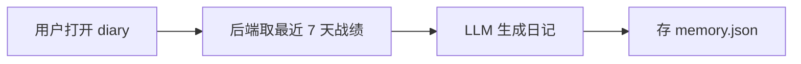

# BLOCK_INVENTORY

md-canvas 能渲染的 17 类块的检测规则 + 重写模板。Agent 工作时必读。

每类块按这个结构描述：

- **触发信号**：标准 MD 语法（如果有）+ 启发式信号（PRD 实际写法）
- **必含字段**：写进 .md 时不可省的东西
- **重写模板**：从模糊 PRD 内容升级到 canonical 形式的 MD 输出
- **检测优先级**：与其他块的歧义解决规则

## 索引

**MD-native（写进 .md，agent 在 Phase 4 直接改写）13 类**

| ID | 名称 | 章节 |
| --- | --- | --- |
| H | 标题 H1-H4 | [#h](#h--标题-h1-h4) |
| P | 段落 | [#p](#p--段落) |
| UL | 无序列表 | [#ul](#ul--无序列表) |
| OL | 有序列表 | [#ol](#ol--有序列表) |
| TBL | 表格 | [#tbl](#tbl--表格) |
| QT | 引用 | [#qt](#qt--引用) |
| HR | 分隔线 | [#hr](#hr--分隔线) |
| CODE | 普通代码块 | [#code](#code--普通代码块) |
| MERMAID | mermaid 图 | [#mermaid](#mermaid--mermaid-图) |
| CALL-N | callout-note/tip/important/warning/caution | [#call-n](#call-n--5-种通用-callout) |
| CALL-D | callout-discussion | [#call-d](#call-d--讨论-callout) |
| API-A | 接口契约块 A 模式（```api fence） | [#api-a](#api-a--接口契约块-a-模式) |
| API-B | 接口契约块 B 模式（heading+表格+JSON 配对） | [#api-b](#api-b--接口契约块-b-模式) |

**Canvas-only（不写 .md，仅在 Phase 2 报告里建议"可加"）4 类**

| ID | 名称 | 章节 |
| --- | --- | --- |
| MOCK | 接口 Mock 块 | [#mock](#mock--接口-mock-块canvas-only) |
| PROMPT | Prompt 实验块 | [#prompt](#prompt--prompt-实验块canvas-only) |
| AGENT | Agent 实验块 | [#agent](#agent--agent-实验块canvas-only) |
| PROTO | 原型预览块 | [#proto](#proto--原型预览块canvas-only) |

---

# MD-native 块（13 类）

## H — 标题 H1-H4

### 触发信号

- 标准: 行首 `#` / `##` / `###` / `####` + 空格 + 文本
- 启发式: 行首 `**xxx**` 单独成行且下方有空行 + 后续内容明显是其下属 → **候选 H3**
- 启发式: 行首数字编号如 `1. xxx` 单独成行且下方有非列表内容 → **候选 H3**（PM 常用编号代标题）

### 必含字段

无（标题内容本身）

### 重写模板

```markdown
## 2. 接口契约
```

歧义解决：候选要在 Phase 3 问用户"这行像不像标题"，因为升级后影响整篇大纲。

---

## P — 段落

### 触发信号

- 任何非空、非以特殊字符开头的文本块
- 与上下文用空行分隔

### 必含字段

无

### 重写模板

不动。段落是兜底类型——agent 在 Phase 4 重写时除非升级成别的块（callout / quote / 等），否则原样保留。

---

## UL — 无序列表

### 触发信号

- 标准: 行首 `- ` 或 `* ` 或 `+ `
- 启发式: 行首 `· ` / `• ` / `※ ` / `▪ ` 等 Unicode bullet → 候选升级为标准 `- `

### 必含字段

无

### 重写模板

```markdown
- 第一项
- 第二项
  - 嵌套项（缩进 2 空格）
- 第三项
```

---

## OL — 有序列表

### 触发信号

- 标准: 行首 `1. ` `2. ` ... 
- 启发式: 行首 `①` `②` 或 `一、` `二、` → 候选升级为标准 `1. 2.`
- 启发式: 行首 `(1)` `(2)` → 候选升级

### 必含字段

无

### 重写模板

```markdown
1. 第一步
2. 第二步
3. 第三步
```

注意: 如果 PRD 里有 `1.` `1.` `1.`（marked 会自动重编号），保留原样即可。

---

## TBL — 表格

### 触发信号

- 标准: GFM pipe table（`|---|` 分隔行）
- 启发式: 连续多行带 `|` 但无 `|---|` 分隔行 → 候选升级
- 启发式: ASCII 表格（`+---+---+`）→ 候选升级

### 必含字段

至少 1 列、1 个 header row、1 个分隔行

### 重写模板

```markdown
| 字段 | 类型 | 必填 | 说明 |
| --- | --- | --- | --- |
| user_id | string | 是 | 用户唯一 ID |
| ip | string | 否 | 人设名（妲己/王昭君） |
```

特殊: 如果表格是某接口的"输入数据 / 输出数据 / 字段说明"且后面紧跟 ```json，可能整体属于 API-B（B 模式接口契约），见下面 API-B 章节。

---

## QT — 引用

### 触发信号

- 标准: 行首 `> `
- 启发式: 单独成段、整段加引号 `"xxx"` 且语气是引用某人/某文 → 候选升级

### 必含字段

无

### 重写模板

```markdown
> 这是一段引用文字。
> 可以多行。
```

**重要歧义**: `> [!note]` / `> [!warning]` 等不是普通引用，是 CALL-N（callout）。检测时先扫 `> [!...]` 才落 QT。

---

## HR — 分隔线

### 触发信号

- 标准: 单独一行 `---` 或 `***` 或 `___`

### 必含字段

无

### 重写模板

```markdown
---
```

不太需要主动添加 candidate。如果 PRD 已有就保留即可。

---

## CODE — 普通代码块

### 触发信号

- 标准: ` ```lang ` 围栏

### 必含字段

- 围栏起止（` ``` ` 三反引号）
- 可选: lang 标识符（json / js / python / yaml / bash / sql / 等）

### 重写模板

````markdown
```json
{
  "user_id": "u_001",
  "ip": "妲己"
}
```
````

**重要**: 不要把 lang 为 `api` 的代码块当成普通 CODE——那是 API-A（接口契约 A 模式）。检测时优先匹配 `api`。

---

## MERMAID — mermaid 图

### 触发信号

- 标准: ` ```mermaid ` 围栏
- 启发式: 段落里出现"流程图 / 状态机 / 时序图 / 调用链"等关键词 + 接下来用文字描述步骤（如"用户先打开 X，然后 Y，最后 Z"）→ **候选**：建议升级为 mermaid 流程图
- 启发式: ASCII 流程图（`A → B → C` / `+----+`）→ 候选升级

### 必含字段

- 围栏起止
- 第一行图类型（`flowchart TD` / `sequenceDiagram` / `stateDiagram-v2` / `gantt` / 等）

### 重写模板

文字描述：

```
用户在 app 内打开 diary → 后端取最近 7 天战绩 → LLM 生成日记 → 存 memory.json
```

→ 升级为：

````markdown

````

**Phase 3 必问**: 因为图化是有损翻译（agent 选的图类型 / 节点拆法可能不对），必须让用户确认。

---

## CALL-N — 5 种通用 callout

### 触发信号

- 标准: `> [!note] / [!tip] / [!important] / [!warning] / [!caution]` 开头的 blockquote
- 启发式:
  - 段落里有 emoji `⚠️` `❗` `🚨` `💡` `📝` 开头 → 候选对应 callout
  - 段落开头有"**注意：**" / "**警告：**" / "**重要：**" / "**贴士：**" → 候选
  - 段落整段语气强调"不可逆 / 严重风险 / 必须" → 候选 caution
  - 段落语气强调"建议 / 最佳实践" → 候选 tip

### 必含字段

- callout 类型（note / tip / important / warning / caution）
- 标题（可选，第一行 `> [!warning] 标题文字`）
- 内容（后续 `>` 行）

### 重写模板

```markdown
> [!warning] memory.json 没并发锁
> demo 期单进程读写，不要在生产环境运行多副本，会数据竞争。
```

**Phase 3 必问**: emoji / 加粗字段 升级为 callout 是有判断的，要让用户拍。

5 种语义对应表：

| callout 类型 | 何时用 |
| --- | --- |
| note | 中性信息补充 |
| tip | 最佳实践 / 建议 |
| important | 必读 / 关键决策点 |
| warning | 需注意的事项 / 已知限制 |
| caution | 严重风险 / 不可逆 / 数据安全 |

---

## CALL-D — 讨论 callout

### 触发信号

- 标准: `> [!discussion](url)` 开头的 blockquote，url 是飞书 / Notion / Slack 等讨论链接
- 启发式:
  - PRD 里出现 `（待 X 同学确认）` / `（讨论中：飞书 xxx）` / 飞书/Notion/Slack URL 单独成段 → 候选

### 必含字段

- URL（讨论链接）
- 标题/内容（链接后的文字 + 后续 `>` 行）

### 重写模板

```markdown
> [!discussion](https://docs.feishu.cn/xxx) 待法务确认 memory.json 隐私级别
> @yayauu @法务 这块的数据保留期需要法务给个明确意见。
```

**Phase 3 必问**: URL 哪来？如果 PRD 没明确链接，需要询问用户提供。

---

## API-A — 接口契约块 A 模式

### 触发信号

- 标准: ` ```api ` 围栏 + YAML 内容
- 启发式: PRD 已有 API-B（heading + 表格 + 输入/输出 JSON 配对，见下）→ **必候选**：建议升级为 A 模式（canonical，多 status 支持完整）

### 必含字段（YAML）

```yaml
name: <接口名>            # 必填
method: GET|POST|PUT|...  # 必填
url: /api/path            # 必填
status: 200               # 必填（主响应状态码）
description: <一句话>     # 可选
request_headers: |        # 可选
  Content-Type: application/json
variables: |              # 可选（KV，用于 {{name}} 替换）
  base=http://localhost:7788
request: |                # 可选（请求 body 样本）
  { ... }
response: |               # 可选（主响应 body 样本）
  { ... }
response_label: <短描述>   # 可选（如"成功"）
# 多 status:
response_<NNN>: | ...     # 例 response_401: |
response_<NNN>_label: ... # 例 response_401_label: token 失效
body_mode: json|form-data|form-urlencoded|raw  # 可选，默认 json
notes: |                  # 可选
```

### 重写模板

````markdown
```api
name: 日记生成接口
method: POST
url: /agent/diary/generate
status: 200
description: 根据玩家最近战绩生成日记
request: |
  {
    "user_id": "u_001",
    "ip": "妲己",
    "date": "2026-05-14"
  }
response: |
  {
    "diary_text": "今天 6 场 3 胜...",
    "duration_ms": 1234
  }

response_401_label: token 失效
response_401: |
  { "error": "unauthorized" }

response_500_label: LLM 不可用
response_500: |
  { "error": "llm_timeout", "retry": true }
```
````

### 检测优先级

API-A > CODE。代码块 lang 为 `api` 时永远走 API-A 解析，不要按 CODE 处理。

### Phase 3 必问

- 接口缺哪些 status code（PRD 通常只写 200）
- 错误响应 body 长什么样
- 是否需要 variables（base URL / token）

---

## API-B — 接口契约块 B 模式

### 触发信号

PRD 中**自动检测**这种模式：

```
##/### 标题包含"接口"字样           ← heading
[空行]
| 字段 | 值 |                       ← 表格（含 method / url / 接口用途 等行）
| --- | --- |
| METHOD | POST |
| URL | /api/path |
| 接口用途 | xxx |
[可选段落 "输入数据：" / "请求样例"]
```json
{ ... }                             ← 请求 JSON
```
[可选段落 "输出数据：" / "响应样例"]
```json
{ ... }                             ← 响应 JSON
```

md-canvas 检测到这个模式后**自动**渲染为接口契约 overlay（无需用户写 ```api fence）。

### 必含字段

- heading 含"接口"字样
- 紧跟的表格至少包含 method + url 行
- 配对的 输入 JSON + 输出 JSON 代码块

### 重写模板

不需要写 .md（PRD 现有写法已是 B 模式）。Phase 1 检测到 → Phase 3 问用户"要不要升级为 A 模式"。

### Phase 3 必问

- 升级为 A 模式 ```api fence？（推荐：A 模式 round-trip 完整，多 status 友好）
- 还是保留 B 模式？（B 模式 PRD 阅读体验更自然，但额外 status 不写回 PRD MD）

---

# Canvas-only 块（4 类）

这些块**不能写进 .md**——它们是 md-canvas 启动后在浏览器里建的，状态存 localStorage。Agent 在 Phase 2 报告里告诉用户"这些可以在 canvas 里手动加"，但绝对不要尝试在 canonical.md 里生成它们的 MD 表示。

## MOCK — 接口 Mock 块（canvas-only）

### 检测信号（建议加，不写 .md）

- PRD 里有完整的接口契约（API-A 或 API-B）
- PRD 提到"demo 期 / 无后端 / 假数据 / 前端先跑 / 不依赖真实后端"
- PRD 给出了响应样本但没说后端何时就绪

### Phase 2 输出建议

```
[Mock 块 候选 ×3]
你可以为这 3 个接口在 canvas 里建 Mock 块（前端拦截 fetch），
demo 期无需后端就能跑通。canvas 里点接口契约块的 "⋯ 菜单 →
用响应注册为 Mock 拦截" 一键建。
```

---

## PROMPT — Prompt 实验块（canvas-only）

### 检测信号（建议加，不写 .md）

- PRD 正文中出现独立的 prompt 字符串（system / user prompt 模板）
- 通常表现为引用块、代码块（lang 不是 json/yaml/api 等）、或加粗段落里有"你是 xxx / 请按以下规则回答"等
- 启发式: 段落首句包含"你是" / "你扮演" / "请按" / "你的任务是" → prompt 候选
- 启发式: 长段落（>200 字）+ 第二人称指令语气 → 候选

### Phase 2 输出建议

```
[Prompt 块 候选 ×N]
PRD 中有 N 处 prompt 字符串可以放进 Prompt 块（调真模型 / 多版本管理 / 评估）：
  · 第 L82-L95 行：妲己人设 system prompt
  · 第 L120-L130 行：日记生成 user prompt
```

可选: 把这些 prompt 提取到 PRD 的"Prompt 设计"章节用引用块 / code block 显式标出，便于用户在 canvas 里 copy-paste 建块。

---

## AGENT — Agent 实验块（canvas-only）

### 检测信号（建议加，不写 .md）

- PRD 描述了"agent / agent 后端 / tool-calling / LLM 调度"等
- PRD 给出 agent 后端的 endpoint（与接口契约对应）

### Phase 2 输出建议

```
[Agent 块 候选 ×1]
PRD 描述了 agent 后端 + N 个工具。你可以在 canvas 建 Agent 实验块
对 endpoint 真发 HTTP，看 tool_calls 链路 / 实测响应。
```

---

## PROTO — 原型预览块（canvas-only）

### 检测信号（建议加，不写 .md）

- PRD 出现 Figma 链接 / CodeSandbox 链接 / 部署 URL
- PRD 出现 "高保真原型 / UI 截图 / 设计稿" 字样 + 后跟图片或链接

### Phase 2 输出建议

```
[原型块 候选 ×2]
PRD 出现 2 个原型链接，可在 canvas 加原型预览块（iframe 嵌入或粘贴 HTML/React/Vue 代码）：
  · L45: Figma 链接 https://www.figma.com/...
  · L210: 部署 demo https://...
```

---

# 检测优先级 / 歧义解决

按优先级从高到低（高优先级先匹配）：

1. **API-A**: ` ```api ` 围栏（绝对优先）
2. **API-B**: heading + 表格 + 配对 JSON 模式（auto-detect）
3. **MERMAID**: ` ```mermaid ` 围栏
4. **CODE**: 其他围栏 ` ```lang ` 
5. **CALL-N / CALL-D**: `> [!type]` 开头
6. **QT**: 普通 `> `
7. **TBL**: pipe table
8. **OL / UL**: 列表
9. **HR**: `---`
10. **H**: 标题
11. **P**: 兜底

启发式候选（如 emoji-callout、ASCII 表格升级、文字流程图化）一律低于上述标准 MD 语法的明确匹配——只有 MD 没明确语法时才进入候选评估。

# 通用重写原则

- **保留用户原文措辞**。仅做格式包装、补字段、修正不规范语法（如 ASCII bullet → `- `）
- **不删内容**。除非用户在 Phase 3 明确批准
- **添加字段标 TODO**。补的字段（如接口的 4xx/5xx 响应）如果用户没给具体值，写占位 `<TODO: 4xx 响应样本>`
- **不动接口设计**。method / url / 字段名严格按原文
- **空白行规则**。块之间永远 1 空行；块内不空行
