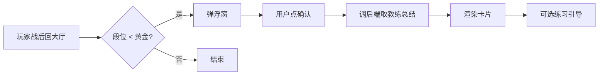
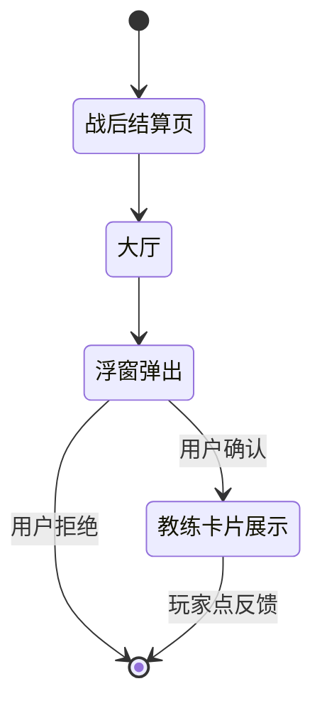

# 新手陪练 AI 教练 · PRD

> 一份故意写得"半结构化"的 demo PRD，用于验证 prd-to-canvas skill 的检测/重写能力。
> PM 草稿状态——有 emoji、有 ASCII 流程图、有散落 prompt、有未补 4xx/5xx 的接口。

| 项 | 值 |
| --- | --- |
| owner | 张三（IEG 游戏 AI 中台） |
| status | draft |
| last_updated | 2026-05-17 |
| 相关链接 | Figma: https://www.figma.com/file/abc123/coach-ui · 飞书需求池: https://docs.feishu.cn/x/coach-needs |

---

## 1. 背景

王者荣耀新手玩家流失率高（首周流失 47%）。访谈发现，大量新手"听不懂老玩家的术语"、"对战后不知道自己输在哪"。我们想在战后插一个 AI 教练，用玩家熟悉的语气，给一句"你这把哪里可以改进"的精准反馈。

教练有 3 种人设（鼓励型 / 严厉型 / 战术型），玩家在战后可以选风格。

> [!warning]
> 本期 demo 期没有真后端，前端直接 mock 教练响应，演示用。

## 2. 目标 + 非目标

目标：

- 新手首周留存提升 5pp（北极星）
- 战后教练触发率（玩家主动看完）≥ 30%
- 教练响应 p95 ≤ 1.5s

非目标：

- 不做 PvP 对手分析
- 不做付费英雄推荐
- 本期不做语音教练（v2 再说）

## 3. 用户场景

| 角色 | 场景 | 痛点 |
| --- | --- | --- |
| 新手玩家 | 战后回到大厅 | 不知道刚才输/赢的关键节点 |
| 转移玩家 | 从 LOL 转过来 | 操作熟但 KPL 术语听不懂 |
| 老玩家带新人 | 给朋友做指导 | 自己也讲不清楚 |

> [!caution]
> 我们不要让教练打击新手玩家自信。任何带"菜"、"垃圾"、"演员"等贬义词的回复一律拦截。

## 4. 方案概览

用户战后回到大厅，自动弹一个浮窗"想听小助手讲讲这把吗？"。点确认 → 调 `/coach/match-debrief` 拿教练总结 → 渲染卡片。可选挂"练一下"按钮跳到训练模式。

整体流程：

```
玩家战后回大厅 → 检查段位 < 黄金 → 弹浮窗 → 用户点确认 → 调后端取教练总结 → 渲染卡片 → 可选练习引导
```



## 5. 教练人设

### 5.1 鼓励型（妹妹系）

```
你是用户的桌宠"小妹"。你扮演一个温柔耐心的新手陪练。
说话风格：
- 多用"哥哥/姐姐"称呼
- 总能找到玩家的闪光点先夸再建议
- 一次只讲 1 个改进点，绝不超过 3 句话
- 用 emoji 但不滥用
绝对不能说：菜、垃圾、演员、坑、送
```

### 5.2 严厉型（教官系）

你扮演一个老兵教官。说话风格：
- 直接、不绕弯
- 用术语：补刀 / 视野 / gank 节奏 / 经济线
- 一次最多讲 2 个核心问题
- 不带情绪，只给事实和建议

绝对不能：人身攻击、贴段位标签。

### 5.3 战术型（学者系）

你是一名游戏赛事分析师。说话风格学术：
- 引用具体数据（你的 KDA / 经济差 / 团战参与率）
- 分析"为什么"而不是"是什么"
- 给出对比基准（"同段位平均补刀是 X，你是 Y"）

## 6. 接口设计

### 6.1 /coach/match-debrief 战后总结接口

```api
name: 战后总结接口
method: POST
url: /coach/match-debrief
status: 200
description: 战后调一次，拿当局复盘
request: |
  {
    "user_id": "u_001",
    "match_id": "m_20260517_001",
    "persona": "encouraging",
    "language": "zh-CN"
  }
response: |
  {
    "summary_text": "哥哥这把节奏不错呀~ 不过中期 8 分钟那次小龙团有点亏...",
    "highlights": [
      {"timestamp": 480, "tag": "团战决策", "comment": "可以再等队友绕后"}
    ],
    "improvement_tip": "下一把试试看到敌方打野消失就让位置",
    "duration_ms": 870
  }

response_401_label: token 失效
response_401: |
  { "error": "unauthorized", "code": "AUTH_001" }

response_404_label: 战绩不存在
response_404: |
  { "error": "match_not_found" }

response_500_label: LLM 不可用
response_500: |
  { "error": "llm_timeout", "retry": true }
```

### 6.2 /coach/skill-tip 单技能解释接口

```api
name: 单技能解释接口
method: GET
url: /coach/skill-tip
status: 200
description: 玩家查看英雄时调，解释一个技能的最佳用法
request: |
  {
    "hero_id": "yao",
    "skill_idx": 1,
    "user_id": "u_001"
  }
response: |
  {
    "tip_text": "瑶妹的 1 技能（顺）跳到队友身上后会获得免伤，最适合在 C 位被切时跳上去保人。",
    "related_videos": ["v_001"]
  }

response_404_label: 英雄或技能不存在
response_404: |
  { "error": "hero_or_skill_not_found" }
```

### 6.3 /coach/config 教练配置接口

```api
name: 教练配置接口
method: PUT
url: /coach/config
status: 200
description: 玩家在设置页改人设/开关/语言
request: |
  {
    "user_id": "u_001",
    "persona": "strict",
    "enabled": true,
    "language": "zh-CN"
  }
response: |
  {
    "ok": true,
    "config_version": "v2"
  }

# TODO: 补 4xx/5xx 响应样本
```

## 7. 工具清单（Agent 后端）

教练 agent 在 chat_loop 里能调下面这些工具：

| 工具 | 触发 | 输入 | 输出 |
| --- | --- | --- | --- |
| get_match_stat | 想知道玩家 KDA / 经济等数据 | match_id | { kda, gold_diff, ... } |
| get_player_history | 想看玩家最近表现 | user_id, days | [match summaries] |
| get_hero_meta | 想知道某英雄当前版本强度 | hero_id | { tier, win_rate } |
| record_coach_feedback | 玩家点了"有帮助 / 没帮助"按钮 | user_id, helpful | { ok } |

## 8. 状态机

玩家从战后回到大厅到教练消失：



## 9. 评估方案

| 维度 | 指标 | eval set | baseline | 目标 |
| --- | --- | --- | --- | --- |
| 有用性 | 玩家点"有帮助"占比 | 内部 100 场 | - | ≥ 60% |
| 语气拟合 | 人设一致性人评 | 50 条样本 | - | 4.0 / 5.0 |
| 内容安全 | 含贬义词拦截率 | 200 条对抗样本 | - | 100% |
| 延迟 | p95 响应 | 真实流量 | - | ≤ 1500ms |

## 10. 安全 & 内容审核

> [!caution]
> 任何包含下列内容的教练回复必须拦截并兜底为"再试一次"：
> - 人身攻击（菜 / 垃圾 / 演员 / 坑 / 送）
> - 段位贬低（"这段位别玩 XX 英雄"）
> - 政治 / 涉黄 / 涉赌 / 涉毒
> - 真实玩家昵称（防止间接攻击）

> [!tip]
> 建议在 prompt 里 hardcode 一份禁词清单 + 输出后再做一次正则二次拦截。

## 11. 隐私 & 合规

玩家数据：
- 我们只读 user_id / match_id / KDA / 经济等公开战绩
- 不读 IP、付费、社交关系
- memory 只保留 7 天（除非用户主动收藏教练回复）

> [!discussion](https://docs.feishu.cn/x/coach-privacy)
> 待法务确认是否需要弹隐私授权弹窗。@王律师

## 12. Rollout 计划

第一阶段：内部员工 100 人，2 天
第二阶段：白名单玩家 1000 人，1 周
第三阶段：黄金以下新手 5%，2 周
第四阶段：黄金以下全量

每阶段过关条件：教练响应 p95 ≤ 1.5s 且玩家"有帮助"占比 ≥ 50%。

## 13. A/B 实验

| 假设 | 分组 | 指标 | 样本 | 时长 |
| --- | --- | --- | --- | --- |
| 有教练比无教练首周留存 +5pp | 50/50 | 7d 留存 | 5w 用户 | 14 天 |
| 鼓励型比严厉型受新手欢迎 | 33/33/33 | 点"有帮助"占比 | 1w 用户 | 7 天 |

## 14. Telemetry / 埋点

| 事件 | 触发 | 字段 |
| --- | --- | --- |
| coach_popup_shown | 战后浮窗弹出 | user_id, match_id, persona |
| coach_card_viewed | 玩家点确认看到卡片 | user_id, match_id, latency_ms |
| coach_feedback_clicked | 玩家点反馈 | user_id, match_id, helpful (bool) |

## 15. 风险 & 开放问题

- ⚠️ 教练响应延迟敏感（玩家等不到 2s 就会关掉）—— 需要后端流式输出
- ❗ 反外挂会不会把教练 API 调用误判为脚本？需找反作弊组确认
- 待讨论：黄金以上的玩家也想要教练吗？还是仅新手专属？

> [!discussion](https://docs.feishu.cn/x/coach-discussion)
> 详细讨论见飞书

## 16. UI 设计

高保真原型见 Figma: https://www.figma.com/file/xyz789/coach-card-ui

主要 3 个屏：
- 战后浮窗（小，右下角弹出）
- 教练卡片（中等，覆盖一半屏幕）
- 设置页（独立页面）

## 17. 决策日志

- 2026-05-10：决定 v1 只做"战后总结"和"技能解释"，不做"实时教练"（实时教练涉及游戏内 SDK 集成，本期来不及）
- 2026-05-12：决定 v1 不做语音，文字优先
- 2026-05-15：决定 3 种人设并行 A/B，根据数据决定 v2 是否合并

## 附录：术语表

| 术语 | 含义 |
| --- | --- |
| C 位 | core 位置，团队的主要输出 |
| Gank | 抓人，伏击 |
| 补刀 | last hit，最后一击 |
| 视野 | 地图侦察 |

---

<!--
Canvas-only 块建议（不写在 PRD 中，需在 md-canvas 浏览器界面手动加）:

- 接口 Mock × 3
  · /coach/match-debrief (POST) — c032
  · /coach/skill-tip (GET) — c035
  · /coach/config (PUT) — c038

- Prompt 实验块 × 3
  · 鼓励型 (encouraging) — c022（PRD 中 L61-L69 的 code fence）
  · 严厉型 (strict) — c024（PRD 中 L73-L79 的段落）
  · 战术型 (analyst) — c027（PRD 中 L83-L86 的段落）

- Agent 实验块 × 1
  · 教练 agent 后端 + 4 个工具 — c042
  · endpoints: /coach/match-debrief, /coach/skill-tip, /coach/config

- 原型预览块 × 1
  · Figma: https://www.figma.com/file/xyz789/coach-card-ui — c068
  · 元信息表里还有: https://www.figma.com/file/abc123/coach-ui — r001（审核 agent 补的）
-->
