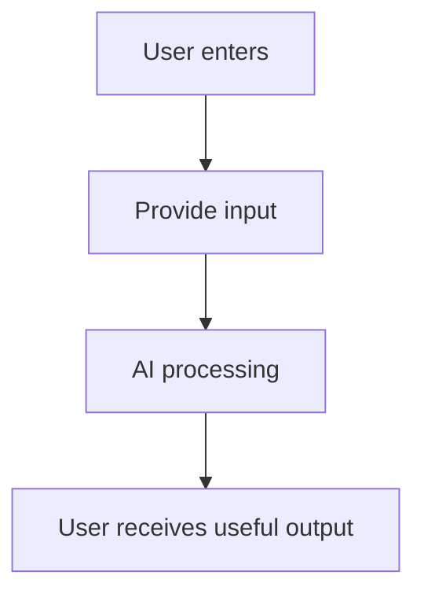

# Demo Idea Template

## 1. Demo Name

Name the demo in one line.

## 2. Inspiration Source

Describe the trend, paper, product release, GitHub project, or user signal that inspired this demo.

## 3. Problem

Describe the user problem the demo tests.

## 4. Target User

| User | Scenario | Need |
| --- | --- | --- |
|  |  |  |

## 5. Core Experience

Describe the core interaction in one concise flow.

## 6. AI Capability

Describe model, RAG, tool calling, recommendation, multimodal, voice, video, coding, or agent capability.

## 7. Data / API Needed

| Data / API | Purpose | Risk |
| --- | --- | --- |
|  |  |  |

## 8. Key Screens

| Screen | Goal | Primary Action |
| --- | --- | --- |
|  |  |  |

## 9. MVP Flow

## 10. Tech Stack Suggestion

| Layer | Suggestion | Reason |
| --- | --- | --- |
| Frontend |  |  |
| Backend |  |  |
| AI |  |  |
| Data |  |  |

## 11. Success Criteria

| Criterion | Target | Measurement |
| --- | --- | --- |
|  |  |  |

## 12. Risks

| Risk | Impact | Mitigation |
| --- | --- | --- |
|  |  |  |

## 13. Build Plan

| Step | Task | Output | Owner Role | Dependency |
| --- | --- | --- | --- | --- |
|  |  |  |  |  |
