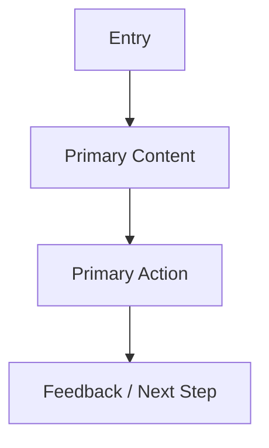

# Design Brief Template

## 1. Document Info

| Item | Description | Notes |
| --- | --- | --- |
| Project / Feature |  |  |
| Owner |  |  |
| Version |  |  |
| Date |  |  |
| Status | Draft |  |

## 2. Project Background

Describe the product context, current problem, and why design work is needed now.

## 3. Product Goal

| Goal | Success Signal | Notes |
| --- | --- | --- |
|  |  |  |

## 4. Target Users

| User Segment | Needs | Design Implication |
| --- | --- | --- |
|  |  |  |

## 5. User Scenario

| Scenario | User Intent | Key Friction | Desired Experience |
| --- | --- | --- | --- |
|  |  |  |  |

## 6. Platform

| Platform | Screen Size / Context | Constraint |
| --- | --- | --- |
| 小程序 |  |  |
| Web |  |  |
| App |  |  |

## 7. Brand Keywords

| Keyword | Meaning | Visual Implication |
| --- | --- | --- |
|  |  |  |

## 8. Visual Direction

Describe color mood, typography direction, density, layout rhythm, component feel, and motion tone.

## 9. Reference Products

| Product / Source | What to Learn | What Not to Copy | Notes |
| --- | --- | --- | --- |
|  |  |  |  |

## 10. Information Architecture

## 11. Page List

| Page | Goal | Key Content | Primary Action |
| --- | --- | --- | --- |
|  |  |  |  |

## 12. Interaction Requirements

| Interaction | Trigger | Feedback | State |
| --- | --- | --- | --- |
|  |  |  |  |

## 13. Design Constraints

| Constraint | Impact | Mitigation |
| --- | --- | --- |
|  |  |  |

## 14. Deliverables

| Deliverable | Format | Owner |
| --- | --- | --- |
|  |  |  |

## 15. Acceptance Criteria

- 

## 16. Open Questions

| Question | Owner | Status |
| --- | --- | --- |
|  |  |  |
