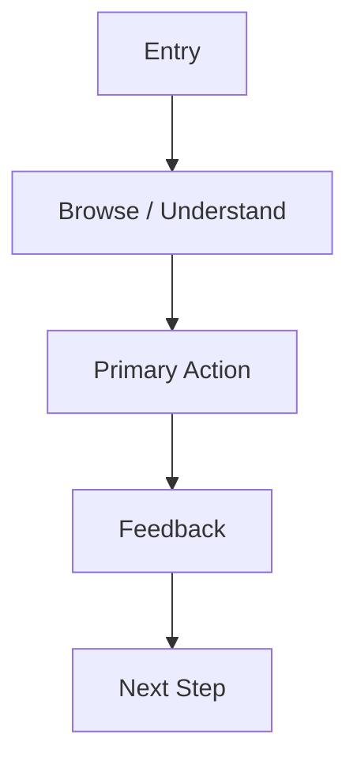

# High-fidelity Prototype Template

## 1. Prototype Goal

Describe the user outcome and product goal the prototype must communicate.

## 2. User Flow

## 3. Page Map

| Page | Goal | Entry | Exit / Next Step |
| --- | --- | --- | --- |
|  |  |  |  |

## 4. Information Architecture

| Level | Content | Priority | Notes |
| --- | --- | --- | --- |
| Primary |  |  |  |
| Secondary |  |  |  |
| Tertiary |  |  |  |

## 5. Visual Style

Describe color system, typography, layout density, radius, shadows, icon style, illustration style, and motion tone.

## 6. Design System

| Token / Component | Rule | Usage |
| --- | --- | --- |
|  |  |  |

## 7. Page-by-page Layout

| Page | Section | Content | Component | Interaction |
| --- | --- | --- | --- | --- |
|  |  |  |  |  |

## 8. Component Specs

| Component | Purpose | Variants | States | Notes |
| --- | --- | --- | --- | --- |
|  |  |  |  |  |

## 9. Interaction Specs

| Interaction | Trigger | Feedback | Edge Case |
| --- | --- | --- | --- |
|  |  |  |  |

## 10. Animation Specs

| Motion | Purpose | Duration | Easing | Notes |
| --- | --- | --- | --- | --- |
|  |  |  |  |  |

## 11. Empty / Loading / Error States

| State | Scenario | Message | Action | Visual Treatment |
| --- | --- | --- | --- | --- |
| Empty |  |  |  |  |
| Loading |  |  |  |  |
| Error |  |  |  |  |

## 12. Copywriting

| Location | Copy | Tone | Notes |
| --- | --- | --- | --- |
|  |  |  |  |

## 13. Figma Prompt

Provide a tool-ready English prompt based on this prototype plan.

## 14. Frontend Implementation Notes

| Area | Note | Risk |
| --- | --- | --- |
| Layout |  |  |
| Components |  |  |
| States |  |  |
| Responsiveness |  |  |

## 15. Acceptance Criteria

- 

## 16. Risks

| Risk | Impact | Mitigation |
| --- | --- | --- |
|  |  |  |

## 17. Open Questions

| Question | Owner | Status |
| --- | --- | --- |
|  |  |  |
