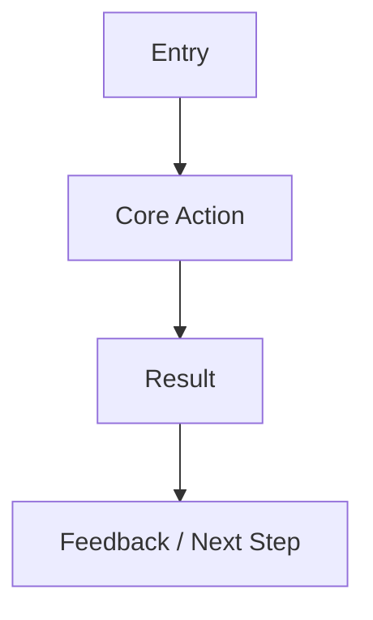

# MVP Build Plan Template

## 1. Idea / Requirement Summary

Summarize the PRD, prototype, or requirement in engineering-ready language.

## 2. User Problem

Describe the user problem and why the MVP should solve it now.

## 3. MVP Scope

| In Scope | User Value | Priority |
| --- | --- | --- |
|  |  |  |

## 4. Non-goals

| Non-goal | Reason | Future Phase |
| --- | --- | --- |
|  |  |  |

## 5. User Flow

## 6. Feature List

| Feature | Requirement Source | Priority | Acceptance Criteria |
| --- | --- | --- | --- |
|  |  |  |  |

## 7. Tech Stack

| Layer | Choice | Reason | Risk |
| --- | --- | --- | --- |
|  |  |  |  |

## 8. Frontend Plan

Describe pages, components, state management, API usage, routing, and design handoff dependencies.

## 9. Backend Plan

Describe services, business logic, permissions, integrations, and operational concerns.

## 10. Data Model

Describe entities, fields, relationships, migration needs, and compatibility risks.

## 11. API Plan

| API | Purpose | Request | Response | Error Handling |
| --- | --- | --- | --- | --- |
|  |  |  |  |  |

## 12. AI Workflow

Describe AI inputs, outputs, model / algorithm, RAG, tools, prompt strategy, fallback, evaluation, cost, and latency.

## 13. Testing Plan

Describe functional, API, UI, permission, edge, AI-specific, and regression tests.

## 14. Launch Plan

Describe release steps, monitoring, analytics, rollout, rollback, and acceptance.

## 15. Risks

| Risk | Impact | Mitigation | Owner |
| --- | --- | --- | --- |
|  |  |  |  |

## 16. Timeline

| Milestone | Deliverable | Owner | Date / Sequence |
| --- | --- | --- | --- |
|  |  |  |  |

## 17. Acceptance Criteria

| Module | Task | Owner Role | Priority | Dependency | Acceptance Criteria |
| --- | --- | --- | --- | --- | --- |
|  |  |  |  |  |  |
