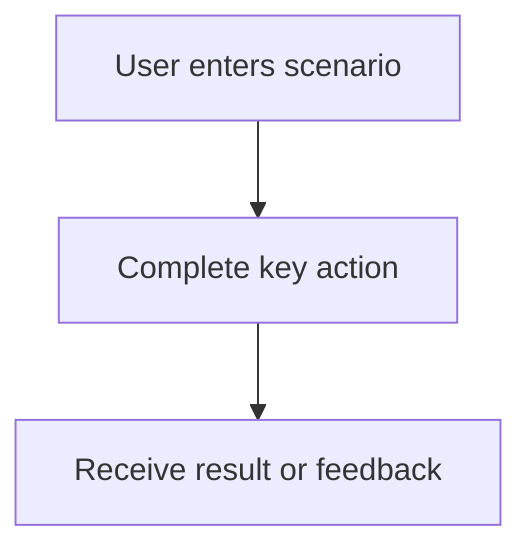

# PRD Template

## 1. Document Info

| Field | Value |
| --- | --- |
| Product / Feature |  |
| Owner |  |
| Version |  |
| Date |  |
| Status | Draft |
| Related Docs |  |

## 2. Background

Describe the business context, user context, current problem, and why this work matters now.

## 3. Goals

| Goal | Description | Success Signal |
| --- | --- | --- |
|  |  |  |

## 4. Target Users

| User Segment | Characteristics | Core Need | Priority |
| --- | --- | --- | --- |
|  |  |  |  |

## 5. User Scenarios

| Scenario | User Intent | Current Pain | Desired Outcome |
| --- | --- | --- | --- |
|  |  |  |  |

## 6. Scope

### In Scope

- 

### Priority Scope

| Item | Priority | Reason |
| --- | --- | --- |
|  |  |  |

## 7. Non-goals

| Non-goal | Reason | Possible Future Phase |
| --- | --- | --- |
|  |  |  |

## 8. User Flow

## 9. Functional Requirements

| Module | Requirement | User Value | Priority | Acceptance Criteria |
| --- | --- | --- | --- | --- |
|  |  |  |  |  |

## 10. Page and Interaction Requirements

| Page / Entry | User Action | System Response | State / Error | Notes |
| --- | --- | --- | --- | --- |
|  |  |  |  |  |

## 11. Data Requirements

| Data Object | Fields | Source | Storage | Retention / Privacy Notes |
| --- | --- | --- | --- | --- |
|  |  |  |  |  |

## 12. API Requirements

| API | Method | Input | Output | Error Handling | Notes |
| --- | --- | --- | --- | --- | --- |
|  |  |  |  |  |  |

## 13. AI Capability Requirements

| AI Capability | User Value | Input | Output | Evaluation Metric | Fallback |
| --- | --- | --- | --- | --- | --- |
|  |  |  |  |  |  |

## 14. Permission Rules

| Role | Allowed Actions | Restricted Actions | Notes |
| --- | --- | --- | --- |
|  |  |  |  |

## 15. Edge Cases

| Case | Expected Behavior | User Message | Priority |
| --- | --- | --- | --- |
|  |  |  |  |

## 16. Metrics

| Metric | Definition | Target | Instrumentation Notes |
| --- | --- | --- | --- |
|  |  |  |  |

## 17. Acceptance Criteria

- 

## 18. Risks

| Risk | Impact | Likelihood | Mitigation |
| --- | --- | --- | --- |
|  |  |  |  |

## 19. Open Questions

| Question | Owner | Needed By | Status |
| --- | --- | --- | --- |
|  |  |  |  |
